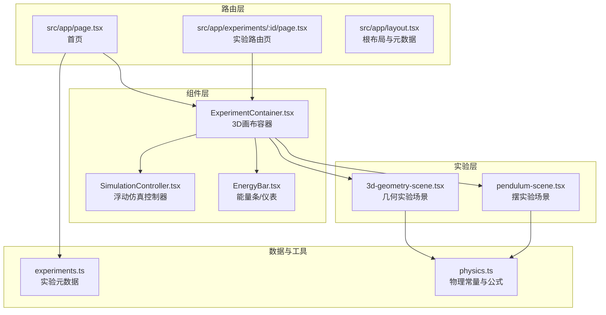
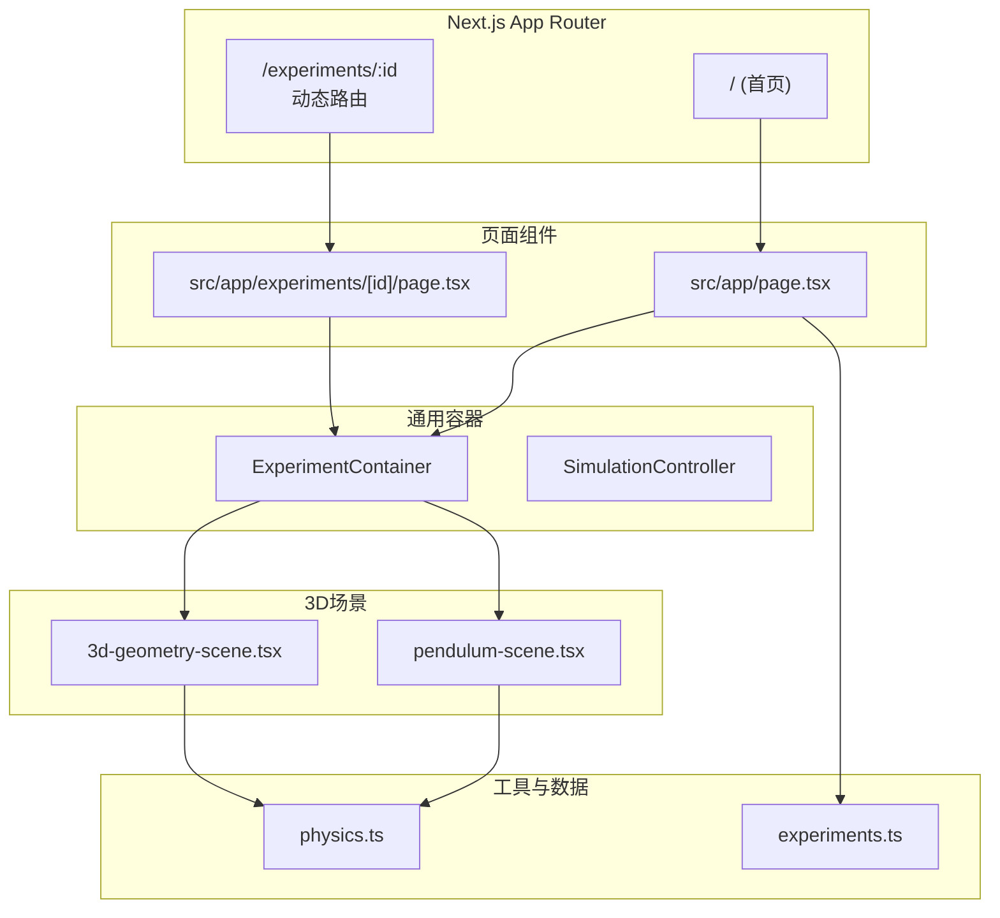
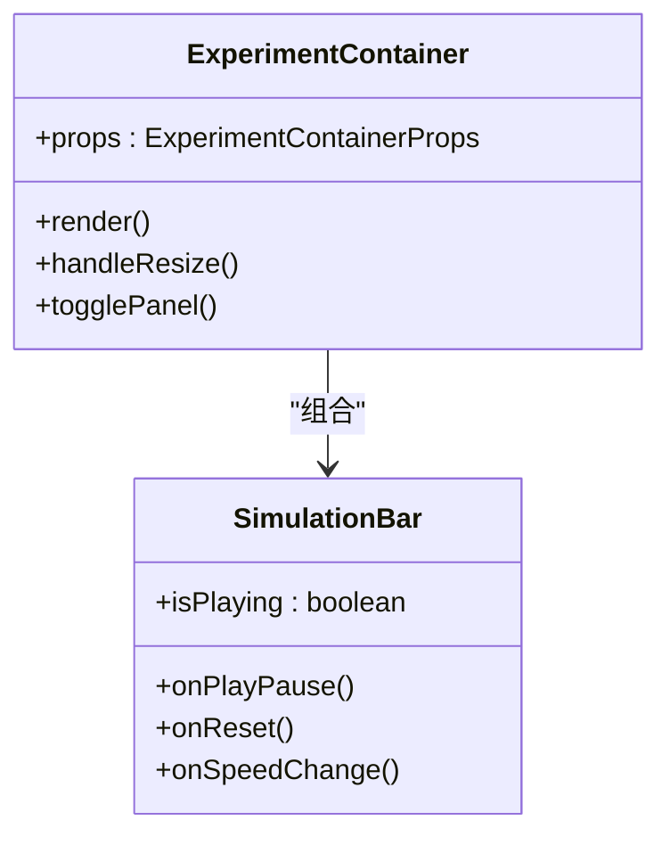
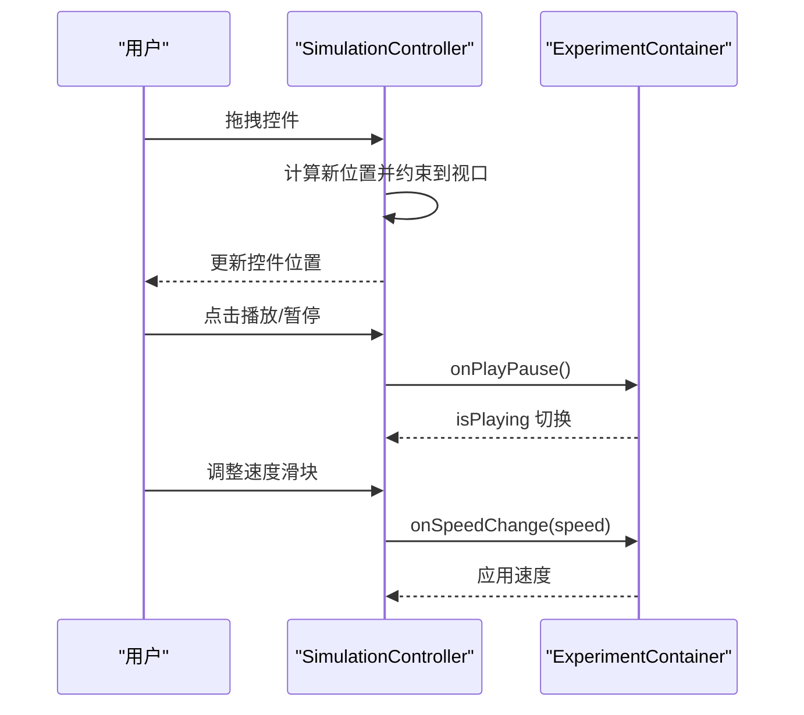
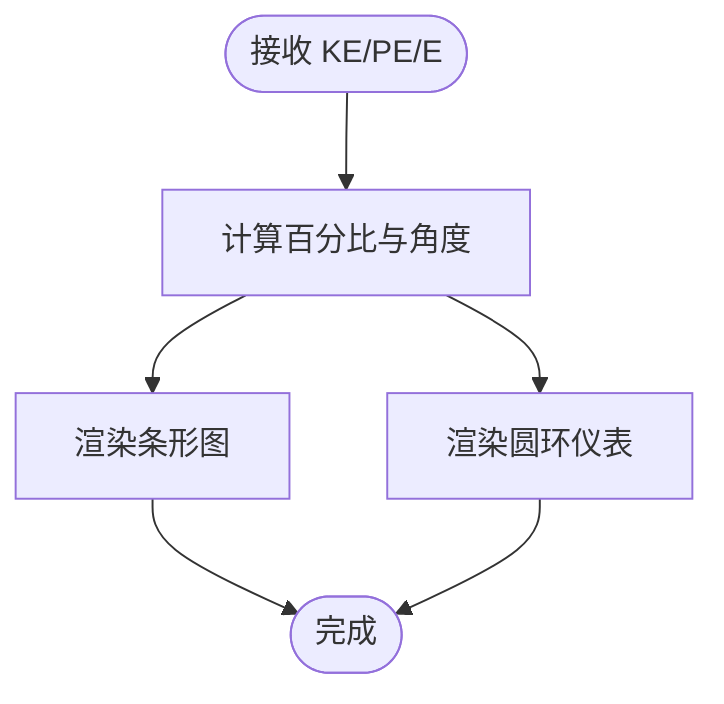
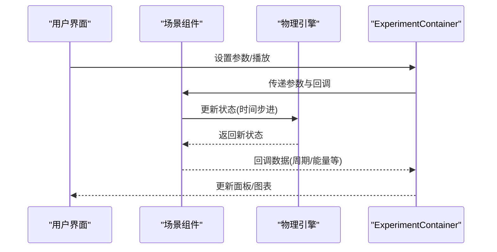
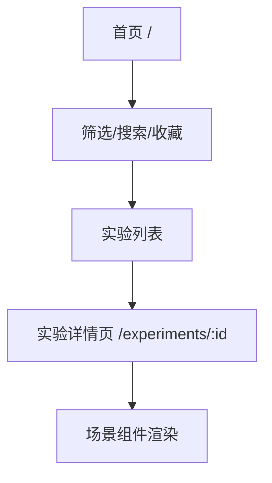
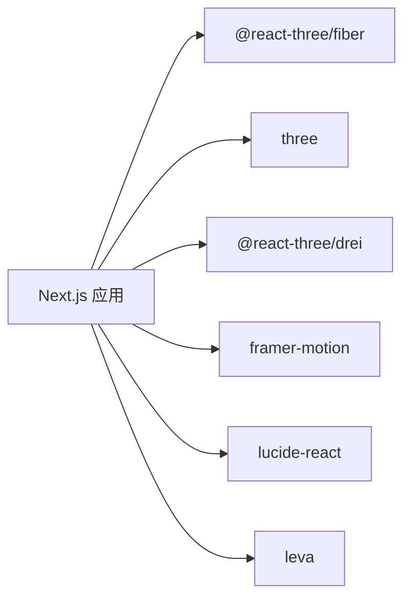

# 架构设计

<cite>
**本文档引用的文件**
- [src/app/layout.tsx](file://src/app/layout.tsx)
- [src/app/page.tsx](file://src/app/page.tsx)
- [src/data/experiments.ts](file://src/data/experiments.ts)
- [package.json](file://package.json)
- [next.config.ts](file://next.config.ts)
- [src/components/experiment-ui/index.ts](file://src/components/experiment-ui/index.ts)
- [src/components/experiment-ui/ExperimentContainer.tsx](file://src/components/experiment-ui/ExperimentContainer.tsx)
- [src/components/experiment-ui/SimulationController.tsx](file://src/components/experiment-ui/SimulationController.tsx)
- [src/components/experiment-helpers/EnergyBar.tsx](file://src/components/experiment-helpers/EnergyBar.tsx)
- [src/utils/physics.ts](file://src/utils/physics.ts)
- [src/experiments/3d-geometry-scene.tsx](file://src/experiments/3d-geometry-scene.tsx)
- [src/experiments/pendulum-scene.tsx](file://src/experiments/pendulum-scene.tsx)
- [src/app/experiments/3d-geometry/page.tsx](file://src/app/experiments/3d-geometry/page.tsx)
</cite>

## 目录
1. [引言](#引言)
2. [项目结构](#项目结构)
3. [核心组件](#核心组件)
4. [架构总览](#架构总览)
5. [详细组件分析](#详细组件分析)
6. [依赖分析](#依赖分析)
7. [性能考虑](#性能考虑)
8. [故障排除指南](#故障排除指南)
9. [结论](#结论)

## 引言
本项目是一个基于 Next.js 的交互式科学实验室平台，提供超过 40 个物理、化学、生物与数学领域的 3D 可视化实验。系统采用模块化设计，前端以 Next.js App Router 组织页面路由，后端通过 Three.js + React Three Fiber 实现高性能 3D 场景渲染，并结合自定义实验容器与控制面板实现统一的交互体验。

## 项目结构
项目采用“按功能域分层 + 按路由分层”相结合的组织方式：
- 路由层：src/app 下按实验 ID 和实验类别组织页面路由，支持动态路由与静态元数据配置。
- 组件层：src/components 提供可复用的实验 UI 组件（如 ExperimentContainer、SimulationController）与辅助组件（如 EnergyBar）。
- 实验层：src/experiments 定义各实验的场景组件与页面包装器，实现“场景 + 控制 + 数据”的完整闭环。
- 数据层：src/data 存放实验元数据与分类信息；src/utils 提供跨实验的物理计算工具。
- 配置层：next.config.ts、package.json 等定义构建与运行时配置。

**图表来源**
- [src/app/page.tsx:1-676](file://src/app/page.tsx#L1-L676)
- [src/app/experiments/[id]/page.tsx:1-9](file://src/app/experiments/3d-geometry/page.tsx#L1-L9)
- [src/app/layout.tsx:1-204](file://src/app/layout.tsx#L1-L204)
- [src/components/experiment-ui/ExperimentContainer.tsx:1-374](file://src/components/experiment-ui/ExperimentContainer.tsx#L1-L374)
- [src/components/experiment-ui/SimulationController.tsx:1-228](file://src/components/experiment-ui/SimulationController.tsx#L1-L228)
- [src/components/experiment-helpers/EnergyBar.tsx:1-142](file://src/components/experiment-helpers/EnergyBar.tsx#L1-L142)
- [src/experiments/3d-geometry-scene.tsx:1-243](file://src/experiments/3d-geometry-scene.tsx#L1-L243)
- [src/experiments/pendulum-scene.tsx:1-859](file://src/experiments/pendulum-scene.tsx#L1-L859)
- [src/data/experiments.ts:1-492](file://src/data/experiments.ts#L1-L492)
- [src/utils/physics.ts:1-687](file://src/utils/physics.ts#L1-L687)

**章节来源**
- [src/app/layout.tsx:1-204](file://src/app/layout.tsx#L1-L204)
- [src/app/page.tsx:1-676](file://src/app/page.tsx#L1-L676)
- [src/data/experiments.ts:1-492](file://src/data/experiments.ts#L1-L492)

## 核心组件
- 实验容器 ExperimentContainer：封装 Three.js 画布、相机、光照、环境与轨道控制器，提供统一的标题栏、控制面板、数据面板与仿真控制条，适配桌面与移动端交互。
- 浮动仿真控制器 SimulationController：可拖拽的播放/暂停、重置、速度调节与时间显示控件，适合移动端紧凑布局。
- 能量可视化 EnergyBar/EnergyGauge：在 3D 场景中叠加 HTML 层展示能量分布与守恒度，支持数值与图形两种形式。
- 物理工具 physics.ts：集中管理物理常量与公式，为各实验提供一致的物理计算基础。

**章节来源**
- [src/components/experiment-ui/ExperimentContainer.tsx:1-374](file://src/components/experiment-ui/ExperimentContainer.tsx#L1-L374)
- [src/components/experiment-ui/SimulationController.tsx:1-228](file://src/components/experiment-ui/SimulationController.tsx#L1-L228)
- [src/components/experiment-helpers/EnergyBar.tsx:1-142](file://src/components/experiment-helpers/EnergyBar.tsx#L1-L142)
- [src/utils/physics.ts:1-687](file://src/utils/physics.ts#L1-L687)

## 架构总览
系统采用“页面路由 + 场景组件 + 通用容器 + 工具库”的分层架构：
- 页面路由负责实验入口与 SEO 元数据，通过动态导入实验页面组件。
- 场景组件专注于 3D 渲染与物理模拟，使用 React Three Fiber 的 useFrame 循环更新状态。
- 通用容器提供一致的用户界面与交互模式，屏蔽不同实验的差异。
- 工具库提供跨实验的物理常量与公式，确保数值一致性与可维护性。

**图表来源**
- [src/app/experiments/[id]/page.tsx:1-9](file://src/app/experiments/3d-geometry/page.tsx#L1-L9)
- [src/app/page.tsx:1-676](file://src/app/page.tsx#L1-L676)
- [src/components/experiment-ui/ExperimentContainer.tsx:1-374](file://src/components/experiment-ui/ExperimentContainer.tsx#L1-L374)
- [src/experiments/3d-geometry-scene.tsx:1-243](file://src/experiments/3d-geometry-scene.tsx#L1-L243)
- [src/experiments/pendulum-scene.tsx:1-859](file://src/experiments/pendulum-scene.tsx#L1-L859)
- [src/utils/physics.ts:1-687](file://src/utils/physics.ts#L1-L687)
- [src/data/experiments.ts:1-492](file://src/data/experiments.ts#L1-L492)

## 详细组件分析

### 实验容器 ExperimentContainer
- 功能职责
  - 创建 Three.js 画布、透视相机与轨道控制器，设置阴影、环境光与背景雾效果。
  - 提供标题栏、返回按钮、控制面板、数据面板与仿真控制条的统一布局。
  - 响应窗口尺寸变化，自动调整画布大小与相机纵横比。
- 关键特性
  - 自适应设备：根据屏幕宽度切换相机视角与抗锯齿策略，移动端降低 dpr。
  - 可选面板：控制面板与数据面板可按需显示，避免遮挡 3D 视图。
  - 仿真控制：内置播放/暂停、重置与速度调节，支持实时数据回调。
- 性能优化
  - 使用 ResizeObserver 监听容器尺寸变化，减少全局事件监听。
  - 限制像素比上限，平衡清晰度与性能。

**图表来源**
- [src/components/experiment-ui/ExperimentContainer.tsx:1-374](file://src/components/experiment-ui/ExperimentContainer.tsx#L1-L374)

**章节来源**
- [src/components/experiment-ui/ExperimentContainer.tsx:1-374](file://src/components/experiment-ui/ExperimentContainer.tsx#L1-L374)

### 浮动仿真控制器 SimulationController
- 功能职责
  - 提供始终可见的播放/暂停、重置与速度调节控件，支持拖拽移动。
  - 在移动端与桌面端采用不同的初始位置与宽度策略。
  - 显示累计时间，便于用户感知仿真进度。
- 交互细节
  - 支持鼠标与触摸拖拽，拖拽过程中限制在视口范围内。
  - 内联样式随设备宽度动态调整，保证可用性。

**图表来源**
- [src/components/experiment-ui/SimulationController.tsx:1-228](file://src/components/experiment-ui/SimulationController.tsx#L1-L228)
- [src/components/experiment-ui/ExperimentContainer.tsx:1-374](file://src/components/experiment-ui/ExperimentContainer.tsx#L1-L374)

**章节来源**
- [src/components/experiment-ui/SimulationController.tsx:1-228](file://src/components/experiment-ui/SimulationController.tsx#L1-L228)

### 能量可视化 EnergyBar/EnergyGauge
- 功能职责
  - 在 3D 场景中叠加 HTML 层，以条形图或圆环仪表展示动能、势能与总能量。
  - 提供能量守恒度指示，帮助用户理解物理过程。
- 设计要点
  - 使用 Html 组件定位，避免影响 3D 几何体渲染。
  - 颜色编码区分 KE/PE/E，支持标签与数值显示。

**图表来源**
- [src/components/experiment-helpers/EnergyBar.tsx:1-142](file://src/components/experiment-helpers/EnergyBar.tsx#L1-L142)

**章节来源**
- [src/components/experiment-helpers/EnergyBar.tsx:1-142](file://src/components/experiment-helpers/EnergyBar.tsx#L1-L142)

### 3D 场景组件：几何实验与摆实验
- 几何实验场景
  - 支持五种柏拉图立体，动态旋转、可切换线框与顶点高亮。
  - 实时计算并上报顶点数、边数、面数与欧拉示性数。
- 摆实验场景
  - 基于 RK4 数值积分的阻尼摆模型，支持轨迹绘制、力矢量可视化与能量条。
  - 实时测量周期并对比理论修正周期，展示能量守恒。

**图表来源**
- [src/experiments/3d-geometry-scene.tsx:1-243](file://src/experiments/3d-geometry-scene.tsx#L1-L243)
- [src/experiments/pendulum-scene.tsx:1-859](file://src/experiments/pendulum-scene.tsx#L1-L859)
- [src/components/experiment-ui/ExperimentContainer.tsx:1-374](file://src/components/experiment-ui/ExperimentContainer.tsx#L1-L374)

**章节来源**
- [src/experiments/3d-geometry-scene.tsx:1-243](file://src/experiments/3d-geometry-scene.tsx#L1-L243)
- [src/experiments/pendulum-scene.tsx:1-859](file://src/experiments/pendulum-scene.tsx#L1-L859)

### 页面路由与实验组织
- 动态路由
  - /experiments/[id] 对应具体实验页面，通过动态导入实验页面组件，实现按需加载。
- 首页与分类
  - 首页聚合所有实验，支持按类别、难度与关键词筛选，收藏功能持久化至本地存储。
- SEO 与元数据
  - 根布局统一注入站点元数据、Open Graph 与结构化数据，提升搜索引擎可见性。

**图表来源**
- [src/app/page.tsx:1-676](file://src/app/page.tsx#L1-L676)
- [src/app/experiments/[id]/page.tsx:1-9](file://src/app/experiments/3d-geometry/page.tsx#L1-L9)
- [src/app/layout.tsx:1-204](file://src/app/layout.tsx#L1-L204)

**章节来源**
- [src/app/page.tsx:1-676](file://src/app/page.tsx#L1-L676)
- [src/app/experiments/[id]/page.tsx:1-9](file://src/app/experiments/3d-geometry/page.tsx#L1-L9)
- [src/app/layout.tsx:1-204](file://src/app/layout.tsx#L1-L204)

## 依赖分析
- 运行时依赖
  - Three.js、@react-three/fiber、@react-three/drei：3D 渲染与交互。
  - framer-motion：页面与卡片动画。
  - lucide-react：图标。
  - leva：调试面板（开发环境）。
- 构建配置
  - next.config.ts 启用严格模式并转译 three 包，确保兼容性。
  - package.json 中声明版本与脚本，支持开发、构建与启动。

**图表来源**
- [package.json:1-37](file://package.json#L1-L37)
- [next.config.ts:1-9](file://next.config.ts#L1-L9)

**章节来源**
- [package.json:1-37](file://package.json#L1-L37)
- [next.config.ts:1-9](file://next.config.ts#L1-L9)

## 性能考虑
- 3D 渲染优化
  - 限制像素比上限，移动端降低 dpr；根据设备宽度选择相机 FOV。
  - 合理设置阴影贴图分辨率与相机远近裁剪，减少无效渲染。
- 帧循环与状态更新
  - 使用 useFrame 与帧计数节流，避免每帧都触发 React 状态更新。
  - 大量点阵与轨迹采用 BufferGeometry 与属性更新，减少对象创建。
- UI 与交互
  - ResizeObserver 监听容器尺寸变化，避免频繁触发全局 resize。
  - 移动端禁用抗锯齿以换取性能，同时提供触摸手势优化。

[本节为通用指导，无需特定文件引用]

## 故障排除指南
- 3D 场景不渲染
  - 检查 ExperimentContainer 是否已检测到有效宽高并允许渲染。
  - 确认相机位置与目标点合理，避免被裁剪。
- 性能抖动或掉帧
  - 降低 dpr 或关闭抗锯齿；减少复杂几何体数量与阴影范围。
  - 检查帧循环中的状态更新频率，必要时增加节流。
- 移动端交互异常
  - 确认 OrbitControls 的触摸配置与 pan/rotate 缩放比例。
  - 检查触摸事件是否被面板遮挡，适当调整面板层级。

**章节来源**
- [src/components/experiment-ui/ExperimentContainer.tsx:1-374](file://src/components/experiment-ui/ExperimentContainer.tsx#L1-L374)
- [src/experiments/pendulum-scene.tsx:1-859](file://src/experiments/pendulum-scene.tsx#L1-L859)

## 结论
ScienceLab3D 通过 Next.js 的路由体系与 React Three Fiber 的 3D 渲染能力，构建了模块化、可扩展且高性能的交互式科学实验平台。通用容器与控制组件实现了跨实验的一致体验，而物理工具库与实验场景则确保了内容的准确性与可维护性。未来可在以下方向持续演进：引入更丰富的后处理效果、增强多语言与无障碍访问、扩展实验类型与数据导出能力。