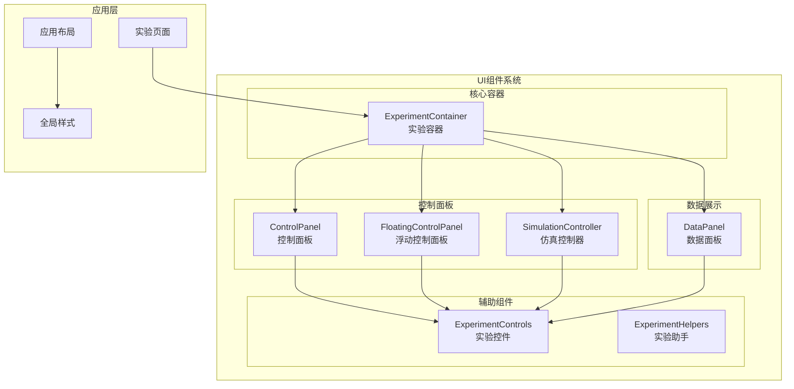
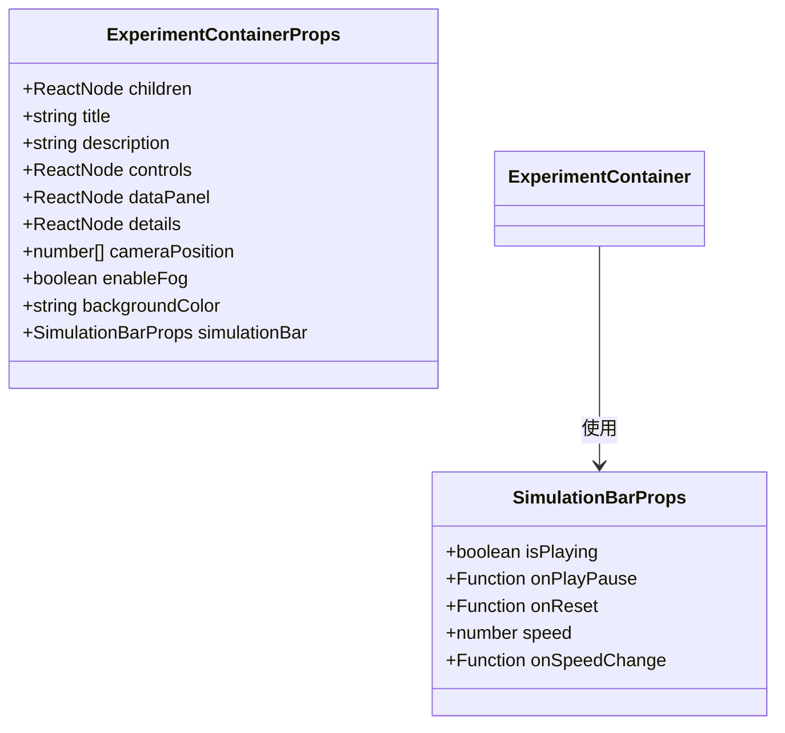
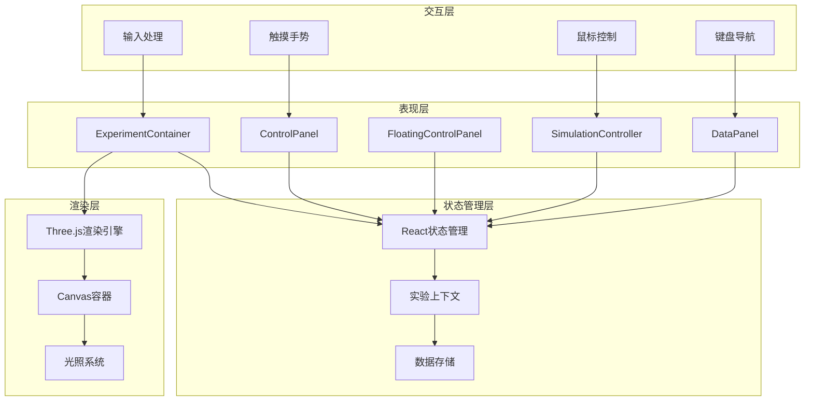
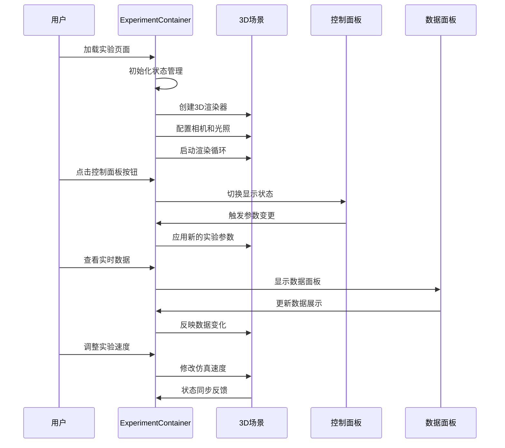
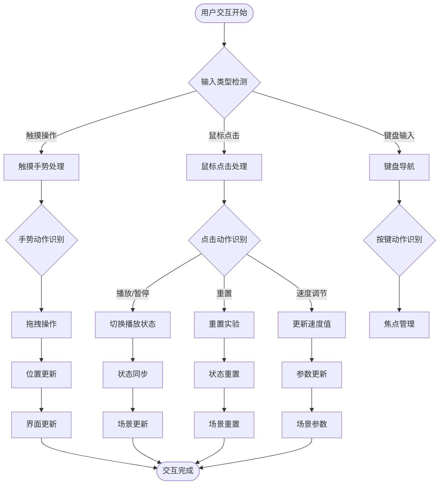
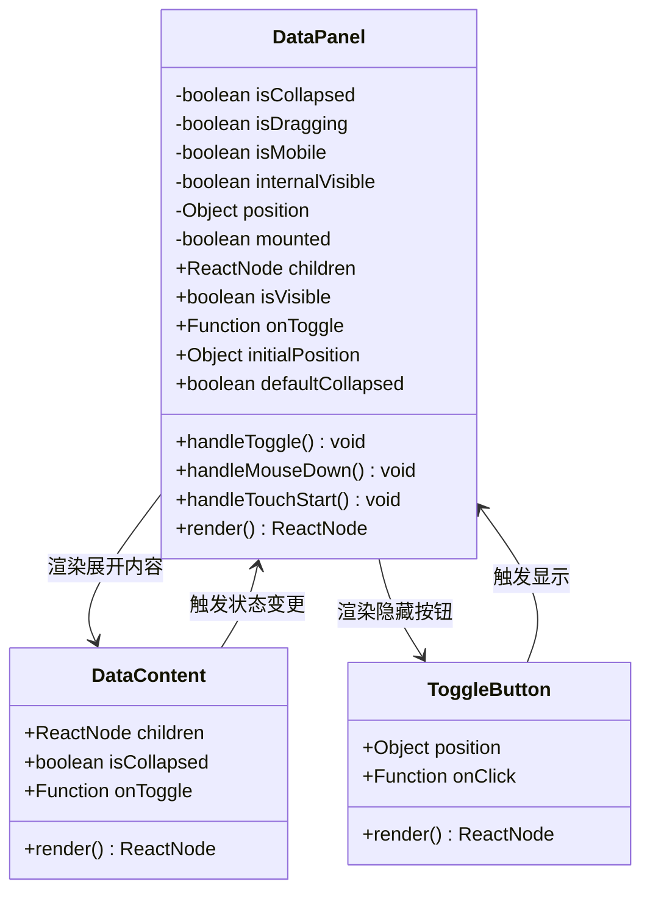

# UI组件系统

<cite>
**本文档引用的文件**
- [ExperimentContainer.tsx](file://src/components/experiment-ui/ExperimentContainer.tsx)
- [ControlPanel.tsx](file://src/components/experiment-ui/ControlPanel.tsx)
- [FloatingControlPanel.tsx](file://src/components/experiment-ui/FloatingControlPanel.tsx)
- [SimulationController.tsx](file://src/components/experiment-ui/SimulationController.tsx)
- [DataPanel.tsx](file://src/components/experiment-ui/DataPanel.tsx)
- [index.ts](file://src/components/experiment-ui/index.ts)
- [layout.tsx](file://src/app/layout.tsx)
- [globals.css](file://src/app/globals.css)
- [3d-geometry-page.tsx](file://src/experiments/3d-geometry-page.tsx)
- [projectile-motion-page.tsx](file://src/experiments/projectile-motion-page.tsx)
</cite>

## 目录
1. [简介](#简介)
2. [项目结构](#项目结构)
3. [核心组件](#核心组件)
4. [架构概览](#架构概览)
5. [详细组件分析](#详细组件分析)
6. [依赖关系分析](#依赖关系分析)
7. [性能考虑](#性能考虑)
8. [故障排除指南](#故障排除指南)
9. [结论](#结论)
10. [附录](#附录)

## 简介

ScienceLab3D的UI组件系统是一个专为科学实验可视化设计的现代化React组件库。该系统采用模块化架构，提供了完整的3D实验环境构建解决方案，包括实验容器、控制面板、数据面板和仿真控制器等核心组件。

系统的核心设计理念是为用户提供沉浸式的科学实验体验，通过高质量的3D渲染、直观的交互控制和实时数据可视化来增强学习效果。所有组件都经过精心设计，确保在桌面和移动设备上都能提供一致且优化的用户体验。

## 项目结构

UI组件系统位于`src/components/experiment-ui/`目录下，采用清晰的功能模块化组织：



**图表来源**
- [ExperimentContainer.tsx:1-374](file://src/components/experiment-ui/ExperimentContainer.tsx#L1-L374)
- [ControlPanel.tsx:1-300](file://src/components/experiment-ui/ControlPanel.tsx#L1-L300)
- [FloatingControlPanel.tsx:1-195](file://src/components/experiment-ui/FloatingControlPanel.tsx#L1-L195)
- [SimulationController.tsx:1-228](file://src/components/experiment-ui/SimulationController.tsx#L1-L228)
- [DataPanel.tsx:1-219](file://src/components/experiment-ui/DataPanel.tsx#L1-L219)

**章节来源**
- [index.ts:1-43](file://src/components/experiment-ui/index.ts#L1-L43)
- [layout.tsx:1-204](file://src/app/layout.tsx#L1-L204)
- [globals.css:1-165](file://src/app/globals.css#L1-L165)

## 核心组件

### 实验容器 (ExperimentContainer)

ExperimentContainer是整个UI系统的核心容器组件，负责管理3D场景渲染区域和所有子组件的协调工作。它提供了完整的实验环境框架，包括相机控制、光照设置、背景配置和响应式布局。

#### 主要特性

- **3D场景管理**: 集成@react-three/fiber进行高性能3D渲染
- **相机控制系统**: 支持轨道控制、缩放、平移和视角调整
- **响应式设计**: 自动适应不同屏幕尺寸和设备类型
- **多面板支持**: 集成控制面板、数据面板和详情面板
- **性能优化**: 智能的渲染优化和资源管理

#### 关键接口

组件定义了丰富的Props接口，支持灵活的配置选项：



**图表来源**
- [ExperimentContainer.tsx:34-53](file://src/components/experiment-ui/ExperimentContainer.tsx#L34-L53)
- [ExperimentContainer.tsx:34-40](file://src/components/experiment-ui/ExperimentContainer.tsx#L34-L40)

**章节来源**
- [ExperimentContainer.tsx:42-66](file://src/components/experiment-ui/ExperimentContainer.tsx#L42-L66)
- [ExperimentContainer.tsx:137-371](file://src/components/experiment-ui/ExperimentContainer.tsx#L137-L371)

### 控制面板 (ControlPanel)

ControlPanel提供实验参数的集中控制界面，支持播放/暂停、重置和速度调节等功能。该组件具有高度的可定制性和响应式设计。

#### 设计特点

- **拖拽定位**: 支持鼠标和触摸操作的拖拽功能
- **自动折叠**: 移动端自动折叠以节省空间
- **实时反馈**: 即时更新实验状态和参数
- **无障碍支持**: 完整的键盘导航和屏幕阅读器支持

**章节来源**
- [ControlPanel.tsx:29-41](file://src/components/experiment-ui/ControlPanel.tsx#L29-L41)
- [ControlPanel.tsx:184-296](file://src/components/experiment-ui/ControlPanel.tsx#L184-L296)

### 浮动控制面板 (FloatingControlPanel)

FloatingControlPanel是ControlPanel的轻量版本，专注于参数控制的快速访问。它提供了更简洁的界面和更好的移动端体验。

#### 核心功能

- **紧凑设计**: 减少界面元素，突出核心功能
- **智能定位**: 自动适应屏幕边界和内容区域
- **快速访问**: 提供实验参数的即时调整能力
- **状态保持**: 维护用户偏好和设置

**章节来源**
- [FloatingControlPanel.tsx:21-26](file://src/components/experiment-ui/FloatingControlPanel.tsx#L21-L26)
- [FloatingControlPanel.tsx:154-191](file://src/components/experiment-ui/FloatingControlPanel.tsx#L154-L191)

### 仿真控制器 (SimulationController)

SimulationController提供实验运行时的完整控制界面，包括播放/暂停、重置、速度调节和时间显示功能。

#### 技术实现

- **实时时间显示**: 精确的时间跟踪和格式化
- **拖拽操作**: 流畅的用户交互体验
- **状态同步**: 与实验状态的实时同步
- **性能监控**: 内置性能指标和优化建议

**章节来源**
- [SimulationController.tsx:27-35](file://src/components/experiment-ui/SimulationController.tsx#L27-L35)
- [SimulationController.tsx:148-224](file://src/components/experiment-ui/SimulationController.tsx#L148-L224)

### 数据面板 (DataPanel)

DataPanel专门用于展示实验的实时数据和统计信息，提供直观的数据可视化和分析功能。

#### 数据展示特性

- **实时更新**: 动态数据流和图表更新
- **可折叠设计**: 节省屏幕空间的紧凑布局
- **自定义内容**: 支持各种数据展示组件
- **位置记忆**: 记住用户的面板位置偏好

**章节来源**
- [DataPanel.tsx:23-29](file://src/components/experiment-ui/DataPanel.tsx#L23-L29)
- [DataPanel.tsx:169-215](file://src/components/experiment-ui/DataPanel.tsx#L169-L215)

## 架构概览

UI组件系统采用分层架构设计，确保了良好的可维护性和扩展性：



**图表来源**
- [ExperimentContainer.tsx:55-66](file://src/components/experiment-ui/ExperimentContainer.tsx#L55-L66)
- [ControlPanel.tsx:29-41](file://src/components/experiment-ui/ControlPanel.tsx#L29-L41)
- [SimulationController.tsx:27-35](file://src/components/experiment-ui/SimulationController.tsx#L27-L35)
- [DataPanel.tsx:23-29](file://src/components/experiment-ui/DataPanel.tsx#L23-L29)

## 详细组件分析

### 实验容器架构

ExperimentContainer作为核心容器，实现了复杂的3D场景管理和组件协调机制：



**图表来源**
- [ExperimentContainer.tsx:137-371](file://src/components/experiment-ui/ExperimentContainer.tsx#L137-L371)
- [ControlPanel.tsx:96-111](file://src/components/experiment-ui/ControlPanel.tsx#L96-L111)
- [DataPanel.tsx:67-73](file://src/components/experiment-ui/DataPanel.tsx#L67-L73)

#### 渲染管道

组件实现了高效的3D渲染管道，包括：

1. **相机管理**: 动态调整视野和焦距
2. **光照系统**: 多光源配置和阴影计算
3. **材质处理**: 实时材质更新和优化
4. **性能监控**: 帧率监控和性能调优

**章节来源**
- [ExperimentContainer.tsx:155-208](file://src/components/experiment-ui/ExperimentContainer.tsx#L155-L208)
- [ExperimentContainer.tsx:182-204](file://src/components/experiment-ui/ExperimentContainer.tsx#L182-L204)

### 控制面板交互设计

ControlPanel实现了复杂的用户交互模式，支持多种输入方式：



**图表来源**
- [ControlPanel.tsx:114-182](file://src/components/experiment-ui/ControlPanel.tsx#L114-L182)
- [FloatingControlPanel.tsx:82-150](file://src/components/experiment-ui/FloatingControlPanel.tsx#L82-L150)
- [SimulationController.tsx:76-144](file://src/components/experiment-ui/SimulationController.tsx#L76-L144)

**章节来源**
- [ControlPanel.tsx:135-182](file://src/components/experiment-ui/ControlPanel.tsx#L135-L182)
- [FloatingControlPanel.tsx:103-150](file://src/components/experiment-ui/FloatingControlPanel.tsx#L103-L150)
- [SimulationController.tsx:97-144](file://src/components/experiment-ui/SimulationController.tsx#L97-L144)

### 数据面板实现

DataPanel采用了创新的数据展示架构，支持实时数据更新和用户交互：



**图表来源**
- [DataPanel.tsx:23-73](file://src/components/experiment-ui/DataPanel.tsx#L23-L73)
- [DataPanel.tsx:148-215](file://src/components/experiment-ui/DataPanel.tsx#L148-L215)

**章节来源**
- [DataPanel.tsx:40-73](file://src/components/experiment-ui/DataPanel.tsx#L40-L73)
- [DataPanel.tsx:169-215](file://src/components/experiment-ui/DataPanel.tsx#L169-L215)

## 依赖关系分析

UI组件系统展现了清晰的依赖层次结构：

```mermaid
graph TB
subgraph "外部依赖"
REACT[React 18+]
THREE[Three.js]
FIBER[@react-three/fiber]
DREI[@react-three/drei]
LUCIDE[Lucide React]
end
subgraph "内部组件"
EC[ExperimentContainer]
CP[ControlPanel]
FCP[FloatingControlPanel]
SC[SimulationController]
DP[DataPanel]
EXC[ExperimentControls]
end
subgraph "工具库"
TAILWIND[Tailwind CSS]
FRAMER[Framer Motion]
ZUSTAND[Zustand状态管理]
end
REACT --> EC
THREE --> EC
FIBER --> EC
DREI --> EC
LUCIDE --> EC
REACT --> CP
REACT --> FCP
REACT --> SC
REACT --> DP
TAILWIND --> EC
TAILWIND --> CP
TAILWIND --> FCP
TAILWIND --> SC
TAILWIND --> DP
FRAMER --> EC
ZUSTAND --> EC
```

**图表来源**
- [ExperimentContainer.tsx:3-8](file://src/components/experiment-ui/ExperimentContainer.tsx#L3-L8)
- [ControlPanel.tsx:3](file://src/components/experiment-ui/ControlPanel.tsx#L3)
- [globals.css:1-165](file://src/app/globals.css#L1-L165)

**章节来源**
- [index.ts:16-42](file://src/components/experiment-ui/index.ts#L16-L42)
- [layout.tsx:1-204](file://src/app/layout.tsx#L1-L204)

## 性能考虑

UI组件系统在多个层面实现了性能优化：

### 渲染优化

- **虚拟DOM最小化**: 通过精确的状态管理减少不必要的重渲染
- **Canvas优化**: 智能的渲染器配置和资源管理
- **内存管理**: 及时清理事件监听器和定时器

### 交互性能

- **防抖处理**: 输入事件的防抖和节流机制
- **动画优化**: 使用CSS硬件加速和流畅的动画过渡
- **懒加载**: 按需加载大型组件和资源

### 移动端优化

- **触摸优化**: 专门为触摸设备优化的交互模式
- **性能自适应**: 根据设备性能动态调整渲染质量
- **电池优化**: 减少后台活动以延长电池寿命

## 故障排除指南

### 常见问题及解决方案

#### 3D渲染问题

**症状**: 场景无法正确渲染或显示异常

**可能原因**:
- WebGL不支持或禁用
- 浏览器兼容性问题
- GPU性能不足

**解决步骤**:
1. 检查浏览器对WebGL的支持
2. 更新图形驱动程序
3. 降低渲染质量设置
4. 尝试不同的浏览器

#### 交互响应问题

**症状**: 控制面板无响应或响应延迟

**可能原因**:
- 事件处理器冲突
- 内存泄漏
- 性能瓶颈

**解决步骤**:
1. 检查控制台错误日志
2. 清理未使用的事件监听器
3. 优化组件重新渲染
4. 实施性能监控

#### 移动端适配问题

**症状**: 在移动设备上显示异常或触摸无响应

**可能原因**:
- 触摸事件处理不当
- 响应式断点配置错误
- 屏幕尺寸检测问题

**解决步骤**:
1. 验证触摸事件处理器
2. 检查媒体查询配置
3. 测试不同屏幕尺寸
4. 实施渐进式增强

**章节来源**
- [ExperimentContainer.tsx:78-97](file://src/components/experiment-ui/ExperimentContainer.tsx#L78-L97)
- [ControlPanel.tsx:60-72](file://src/components/experiment-ui/ControlPanel.tsx#L60-L72)
- [FloatingControlPanel.tsx:39-57](file://src/components/experiment-ui/FloatingControlPanel.tsx#L39-L57)

## 结论

ScienceLab3D的UI组件系统代表了现代Web科学教育应用的最佳实践。通过精心设计的架构和实现，该系统成功地将复杂的3D可视化技术与直观的用户界面相结合，为用户提供了沉浸式的学习体验。

系统的成功关键在于：

1. **模块化设计**: 清晰的组件分离和职责划分
2. **性能优化**: 多层次的性能考虑和优化策略
3. **用户体验**: 以用户为中心的设计理念
4. **可扩展性**: 灵活的架构支持未来的功能扩展

该组件系统不仅满足了当前的实验教学需求，还为未来的功能扩展和技术演进奠定了坚实的基础。

## 附录

### 组件使用示例

#### 基本实验容器使用

```typescript
// 导入必要的组件
import { ExperimentContainer } from '@/components/experiment-ui';

// 在实验页面中使用
export default function MyExperiment() {
  return (
    <ExperimentContainer
      title="我的实验"
      description="这是一个示例实验"
      cameraPosition={[10, 7, 10]}
      enableFog={true}
    >
      {/* 3D场景内容 */}
      <mesh>
        <sphereGeometry args={[1, 32, 32]} />
        <meshBasicMaterial color="#00ff00" />
      </mesh>
    </ExperimentContainer>
  );
}
```

#### 集成控制面板

```typescript
// 导入控制面板组件
import { ControlPanel } from '@/components/experiment-ui';

// 创建实验参数控制
const experimentControls = (
  <ControlPanel
    defaultPlaying={true}
    defaultSpeed={1.0}
    onPlayPause={(playing) => console.log('播放状态:', playing)}
    onSpeedChange={(speed) => console.log('速度:', speed)}
  >
    <div className="space-y-4">
      <label className="flex items-center gap-2">
        <input type="checkbox" defaultChecked />
        <span>显示轨迹</span>
      </label>
      <input 
        type="range" 
        min="0" 
        max="100" 
        defaultValue="50" 
      />
    </div>
  </ControlPanel>
);

// 在实验容器中使用
<ExperimentContainer
  title="物理实验"
  controls={experimentControls}
>
  {/* 3D内容 */}
</ExperimentContainer>
```

#### 实时数据展示

```typescript
// 导入数据面板组件
import { DataPanel } from '@/components/experiment-ui';

// 创建数据展示内容
const dataContent = (
  <div className="space-y-3">
    <div className="flex justify-between">
      <span>温度:</span>
      <span className="font-mono">25.6°C</span>
    </div>
    <div className="flex justify-between">
      <span>压力:</span>
      <span className="font-mono">1.2 atm</span>
    </div>
  </div>
);

// 在实验容器中集成数据面板
<ExperimentContainer
  title="化学反应"
  dataPanel={<DataPanel>{dataContent}</DataPanel>}
>
  {/* 3D化学反应场景 */}
</ExperimentContainer>
```

### 最佳实践建议

1. **性能优先**: 始终考虑渲染性能和内存使用
2. **响应式设计**: 确保在所有设备上的良好体验
3. **无障碍支持**: 提供完整的键盘导航和屏幕阅读器支持
4. **错误处理**: 实现健壮的错误处理和恢复机制
5. **测试覆盖**: 建立全面的测试策略确保代码质量