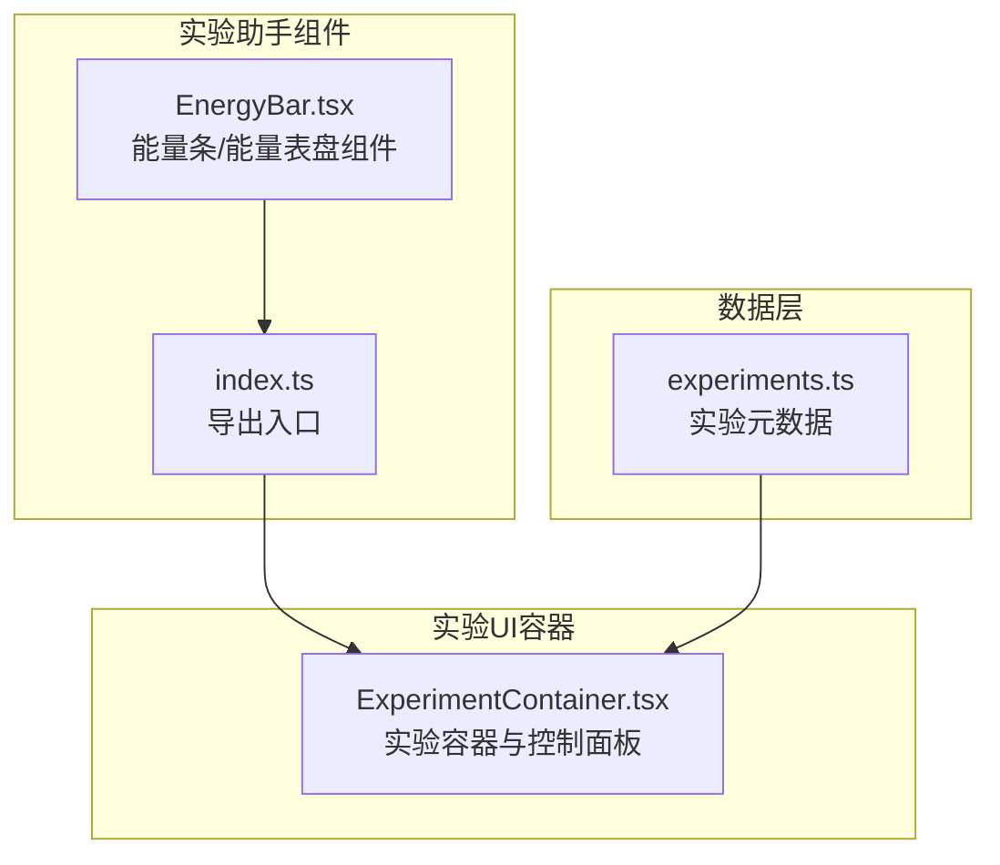
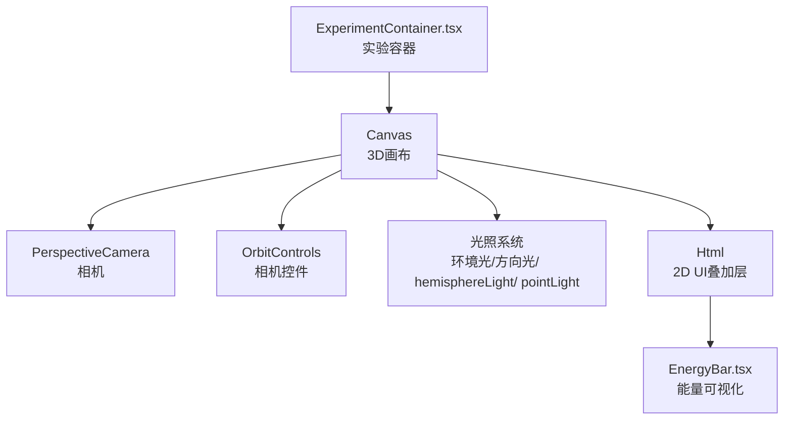
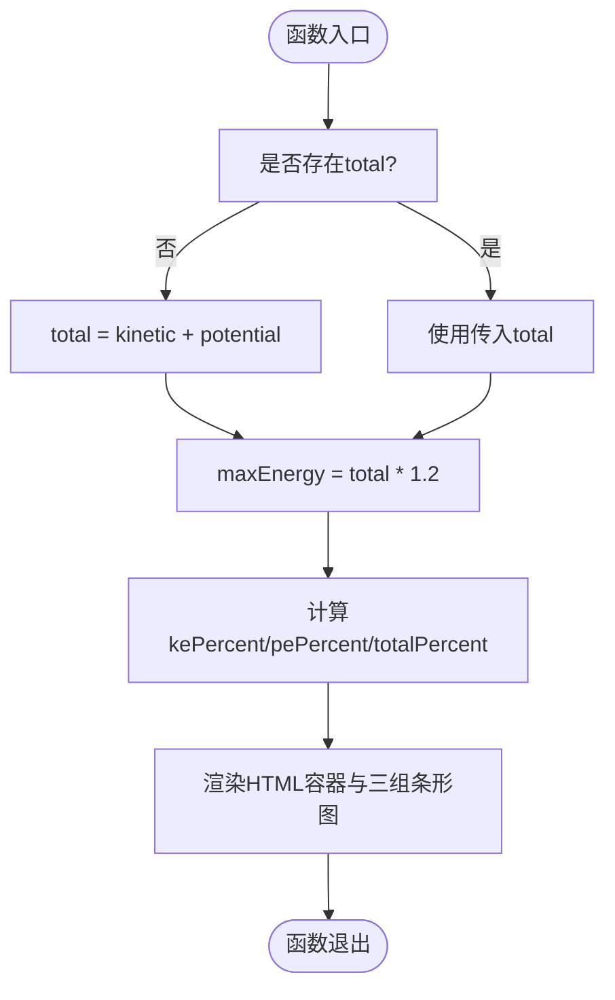
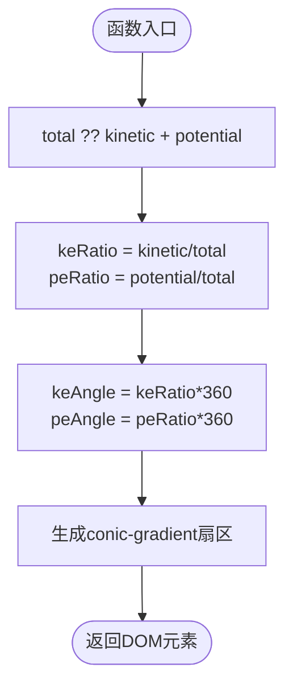
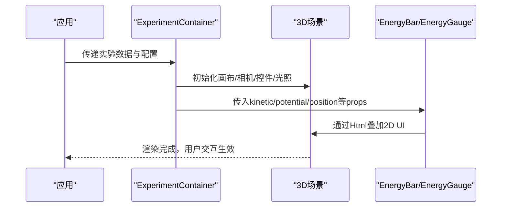
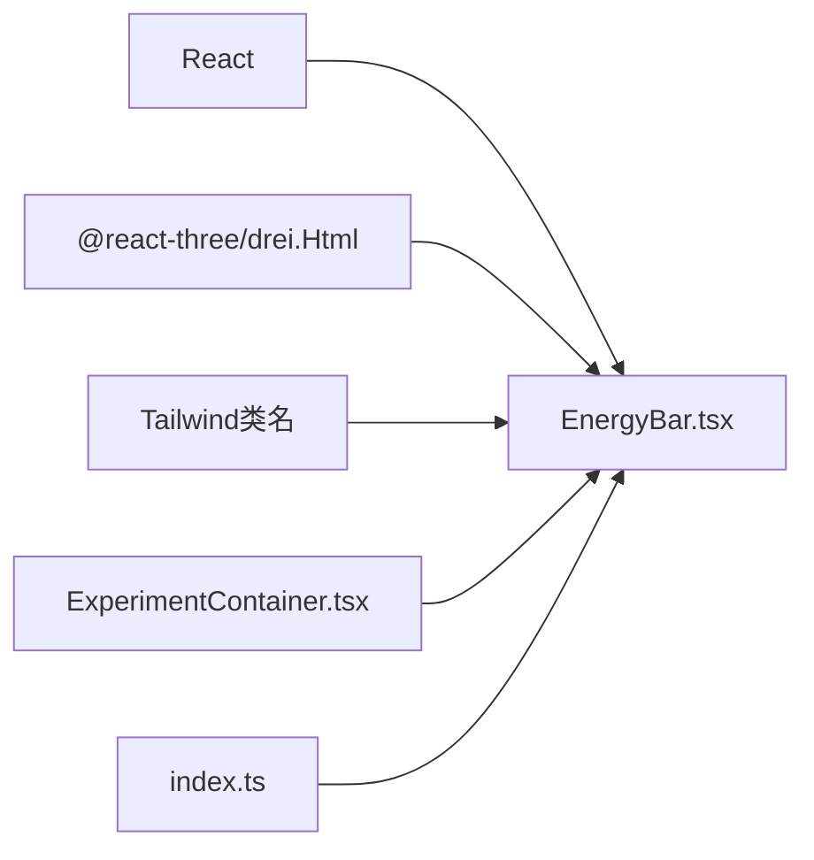

# 实验助手组件

<cite>
**本文档引用的文件**
- [src/components/experiment-helpers/EnergyBar.tsx](file://src/components/experiment-helpers/EnergyBar.tsx)
- [src/components/experiment-helpers/index.ts](file://src/components/experiment-helpers/index.ts)
- [src/components/experiment-ui/ExperimentContainer.tsx](file://src/components/experiment-ui/ExperimentContainer.tsx)
- [src/data/experiments.ts](file://src/data/experiments.ts)
</cite>

## 目录
1. [简介](#简介)
2. [项目结构](#项目结构)
3. [核心组件](#核心组件)
4. [架构总览](#架构总览)
5. [详细组件分析](#详细组件分析)
6. [依赖关系分析](#依赖关系分析)
7. [性能考量](#性能考量)
8. [故障排除指南](#故障排除指南)
9. [结论](#结论)
10. [附录](#附录)

## 简介
本文件面向ScienceLab3D的“实验助手组件”，系统性阐述其设计目标、架构模式与实现细节，重点聚焦于能量可视化组件（如EnergyBar）与实验容器（ExperimentContainer）的协作机制。文档同时覆盖组件的独立性与可复用性设计、跨实验适配策略、渲染优化与性能考虑、内存管理、与实验容器的集成方式与通信协议，以及配置选项、样式定制与动画效果，并提供具体使用示例与集成模式。

## 项目结构
实验助手组件位于`src/components/experiment-helpers`目录下，当前包含能量可视化组件；实验容器位于`src/components/experiment-ui`目录下，负责承载3D实验场景与UI控制面板。实验元数据定义在`src/data/experiments.ts`中，为各实验页面提供统一的数据模型。

图表来源
- [src/components/experiment-helpers/EnergyBar.tsx:1-142](file://src/components/experiment-helpers/EnergyBar.tsx#L1-L142)
- [src/components/experiment-helpers/index.ts:1-8](file://src/components/experiment-helpers/index.ts#L1-L8)
- [src/components/experiment-ui/ExperimentContainer.tsx:1-374](file://src/components/experiment-ui/ExperimentContainer.tsx#L1-L374)
- [src/data/experiments.ts:1-492](file://src/data/experiments.ts#L1-L492)

章节来源
- [src/components/experiment-helpers/EnergyBar.tsx:1-142](file://src/components/experiment-helpers/EnergyBar.tsx#L1-L142)
- [src/components/experiment-helpers/index.ts:1-8](file://src/components/experiment-helpers/index.ts#L1-L8)
- [src/components/experiment-ui/ExperimentContainer.tsx:1-374](file://src/components/experiment-ui/ExperimentContainer.tsx#L1-L374)
- [src/data/experiments.ts:1-492](file://src/data/experiments.ts#L1-L492)

## 核心组件
- 能量条组件（EnergyBar）
  - 功能：以可视化条形图展示动能（KE）、势能（PE）与总能量（E），并计算能量守恒度指标。
  - 特点：支持位置定位、标签显示开关、百分比宽度动态计算、过渡动画。
- 能量表盘组件（EnergyGauge）
  - 功能：以环形渐变表盘形式展示KE与PE占比，直观呈现能量构成。
  - 特点：基于CSS conic-gradient实现，支持尺寸自定义与中心数值显示。

章节来源
- [src/components/experiment-helpers/EnergyBar.tsx:6-96](file://src/components/experiment-helpers/EnergyBar.tsx#L6-L96)
- [src/components/experiment-helpers/EnergyBar.tsx:101-141](file://src/components/experiment-helpers/EnergyBar.tsx#L101-L141)

## 架构总览
实验助手组件通过React Three Fiber与Drei的Html组件在3D场景中叠加2DUI，实现非侵入式的数据可视化。实验容器负责管理3D画布、相机、光照、控件与UI面板，实验助手组件作为子节点或面板内容被注入到容器中，形成“容器+可视化”的分层架构。

图表来源
- [src/components/experiment-ui/ExperimentContainer.tsx:137-208](file://src/components/experiment-ui/ExperimentContainer.tsx#L137-L208)
- [src/components/experiment-helpers/EnergyBar.tsx:35-95](file://src/components/experiment-helpers/EnergyBar.tsx#L35-L95)

## 详细组件分析

### 能量条组件（EnergyBar）分析
- 设计目标
  - 可视化能量守恒原理，帮助用户理解KE、PE与E之间的动态平衡。
  - 提供实时数值与百分比进度，便于对比与教学演示。
- 数据流与处理逻辑
  - 输入：kinetic（动能）、potential（势能）、total（总能量，可选）、position（位置）、showLabels（是否显示标签）。
  - 计算：若未提供total，则按kinetic+potential计算；maxEnergy在total基础上增加20%作为安全上限；分别计算KE、PE、E占maxEnergy的百分比。
  - 渲染：使用Html组件在3D场景中定位UI，条形图采用过渡动画更新宽度，标签与数值随帧刷新。
- 错误处理与边界条件
  - total为空时回退为kinetic+potential，避免NaN或除零错误。
  - 百分比计算对分母为0进行保护（使用||1）。
- 性能与内存
  - 条形图宽度使用内联style更新，避免频繁重排；过渡动画时长100ms，兼顾流畅与性能。
  - 使用backdrop-blur与半透明背景，注意在低端设备上的GPU开销。

图表来源
- [src/components/experiment-helpers/EnergyBar.tsx:20-96](file://src/components/experiment-helpers/EnergyBar.tsx#L20-L96)

章节来源
- [src/components/experiment-helpers/EnergyBar.tsx:6-96](file://src/components/experiment-helpers/EnergyBar.tsx#L6-L96)

### 能量表盘组件（EnergyGauge）分析
- 设计目标
  - 以环形表盘直观表达能量占比，适合快速概览与移动端展示。
- 数据流与处理逻辑
  - 输入：kinetic、potential、total（可选）、size（尺寸）。
  - 计算：totalEnergy默认kinetic+potential；keRatio与peRatio为各自占比；对应角度=占比×360°。
  - 渲染：使用CSS conic-gradient绘制从90°起始的渐变扇区，内部圆心显示total值与单位。
- 性能与内存
  - 基于CSS渐变，无需额外JS计算，渲染成本低；尺寸通过style传入，便于响应式调整。

图表来源
- [src/components/experiment-helpers/EnergyBar.tsx:101-141](file://src/components/experiment-helpers/EnergyBar.tsx#L101-L141)

章节来源
- [src/components/experiment-helpers/EnergyBar.tsx:101-141](file://src/components/experiment-helpers/EnergyBar.tsx#L101-L141)

### 实验容器（ExperimentContainer）与助手组件的集成
- 集成方式
  - 容器通过Canvas承载3D场景，助手组件以子节点形式挂载到场景中，或作为控制面板/数据面板内容注入。
  - 容器提供相机、控件、光照、雾效等基础环境，确保助手组件在一致的视觉与交互上下文中运行。
- 通信协议
  - 助手组件通过props接收数据（如kinetic、potential、position等），不直接访问容器内部状态。
  - 容器通过simulationBar等属性与上层应用通信，助手组件保持无状态或最小状态，便于复用。
- 适配策略
  - 通过position参数在3D空间中定位助手组件，支持多实验场景的差异化布局。
  - 通过showLabels与size等参数实现不同实验的风格适配。

图表来源
- [src/components/experiment-ui/ExperimentContainer.tsx:55-371](file://src/components/experiment-ui/ExperimentContainer.tsx#L55-L371)
- [src/components/experiment-helpers/EnergyBar.tsx:20-96](file://src/components/experiment-helpers/EnergyBar.tsx#L20-L96)

章节来源
- [src/components/experiment-ui/ExperimentContainer.tsx:42-66](file://src/components/experiment-ui/ExperimentContainer.tsx#L42-L66)
- [src/components/experiment-ui/ExperimentContainer.tsx:137-208](file://src/components/experiment-ui/ExperimentContainer.tsx#L137-L208)

## 依赖关系分析
- 组件耦合
  - EnergyBar/EnergyGauge与ExperimentContainer之间为弱耦合：前者仅依赖React与@react-three/drei的Html组件，后者提供3D渲染环境。
- 外部依赖
  - @react-three/fiber与@react-three/drei用于3D场景与Html叠加。
  - Tailwind CSS类名用于样式与动画（如transition-all duration-100）。
- 导出与复用
  - 通过index.ts集中导出，便于在不同实验页面按需引入。

图表来源
- [src/components/experiment-helpers/EnergyBar.tsx:3-4](file://src/components/experiment-helpers/EnergyBar.tsx#L3-L4)
- [src/components/experiment-helpers/index.ts:6-7](file://src/components/experiment-helpers/index.ts#L6-L7)
- [src/components/experiment-ui/ExperimentContainer.tsx:3-8](file://src/components/experiment-ui/ExperimentContainer.tsx#L3-L8)

章节来源
- [src/components/experiment-helpers/EnergyBar.tsx:1-10](file://src/components/experiment-helpers/EnergyBar.tsx#L1-L10)
- [src/components/experiment-helpers/index.ts:1-8](file://src/components/experiment-helpers/index.ts#L1-L8)
- [src/components/experiment-ui/ExperimentContainer.tsx:1-10](file://src/components/experiment-ui/ExperimentContainer.tsx#L1-L10)

## 性能考量
- 渲染优化
  - 条形图宽度使用内联style更新，减少DOM重排；过渡时间短（100ms）提升交互响应速度。
  - 容器侧启用抗锯齿与dpr策略，移动端适度降低像素比，平衡清晰度与性能。
- 内存管理
  - 组件为纯函数式，无持久订阅或定时器，卸载时自动释放。
  - Html叠加层与3D场景分离，避免不必要的层级嵌套。
- 交互与动画
  - 过渡动画与按钮点击反馈使用CSS类名切换，避免复杂JS动画带来的性能损耗。
- 适配策略
  - 移动端禁用抗锯齿、降低dpr，减少GPU压力；根据设备宽度动态调整FOV与控件灵敏度。

章节来源
- [src/components/experiment-helpers/EnergyBar.tsx:50-83](file://src/components/experiment-helpers/EnergyBar.tsx#L50-L83)
- [src/components/experiment-ui/ExperimentContainer.tsx:142-150](file://src/components/experiment-ui/ExperimentContainer.tsx#L142-L150)
- [src/components/experiment-ui/ExperimentContainer.tsx:78-97](file://src/components/experiment-ui/ExperimentContainer.tsx#L78-L97)

## 故障排除指南
- 能量条不显示或显示异常
  - 检查position参数是否合理，确保在相机视野范围内。
  - 确认kinetic与potential数值有效，total为空时会自动计算。
- 百分比溢出或显示异常
  - maxEnergy为total的120%，若输入值异常导致比例超过100%，请检查上游数据源。
- 移动端性能问题
  - 关注dpr设置与抗锯齿选项，必要时在容器中进一步降低渲染质量。
- UI遮挡或错位
  - 调整Html的position或z-index，或在容器中重新布局控制面板与数据面板。

章节来源
- [src/components/experiment-helpers/EnergyBar.tsx:28-33](file://src/components/experiment-helpers/EnergyBar.tsx#L28-L33)
- [src/components/experiment-ui/ExperimentContainer.tsx:142-150](file://src/components/experiment-ui/ExperimentContainer.tsx#L142-L150)

## 结论
实验助手组件以轻量、可复用为核心设计理念，通过EnergyBar与EnergyGauge两类可视化组件满足不同场景下的能量展示需求。配合ExperimentContainer提供的稳定3D渲染环境与灵活的UI布局，组件可在多种实验中快速适配与复用。通过合理的性能优化与内存管理策略，确保在多平台与多实验场景下的流畅体验。

## 附录

### 使用示例与集成模式
- 在3D场景中叠加能量条
  - 将EnergyBar作为场景子节点，传入kinetic、potential、position等参数，即可在指定3D坐标处显示能量条。
- 作为数据面板内容
  - 将EnergyBar或EnergyGauge放入ExperimentContainer的dataPanel区域，实现悬浮式数据展示。
- 表盘式能量概览
  - 使用EnergyGauge在移动端或紧凑界面中展示能量占比，size参数可按屏幕密度调整。

章节来源
- [src/components/experiment-helpers/EnergyBar.tsx:20-96](file://src/components/experiment-helpers/EnergyBar.tsx#L20-L96)
- [src/components/experiment-ui/ExperimentContainer.tsx:284-299](file://src/components/experiment-ui/ExperimentContainer.tsx#L284-L299)

### 配置选项与样式定制
- EnergyBarProps
  - kinetic、potential：必填，单位为焦耳（J）。
  - total：可选，未提供时按kinetic+potential计算。
  - position：可选，默认原点，用于Html定位。
  - showLabels：可选，是否显示标题与标签。
- EnergyGauge
  - size：可选，表盘直径（像素）。
- 样式与动画
  - 使用Tailwind类名控制背景、边框、圆角、阴影与过渡动画。
  - 过渡时长100ms，颜色方案基于橙色（KE）、蓝色（PE）、绿色（E）。

章节来源
- [src/components/experiment-helpers/EnergyBar.tsx:6-12](file://src/components/experiment-helpers/EnergyBar.tsx#L6-L12)
- [src/components/experiment-helpers/EnergyBar.tsx:101-141](file://src/components/experiment-helpers/EnergyBar.tsx#L101-L141)

### 与实验容器的通信协议
- 单向数据流
  - 上层应用将实验状态（如kinetic、potential）通过props传入助手组件。
  - 容器负责3D渲染与用户交互（播放/暂停、重置、速度调节、相机控件等）。
- 扩展建议
  - 若需要双向通信，可在上层应用维护全局状态并通过回调函数更新助手组件props。

章节来源
- [src/components/experiment-ui/ExperimentContainer.tsx:34-40](file://src/components/experiment-ui/ExperimentContainer.tsx#L34-L40)
- [src/components/experiment-helpers/EnergyBar.tsx:20-26](file://src/components/experiment-helpers/EnergyBar.tsx#L20-L26)