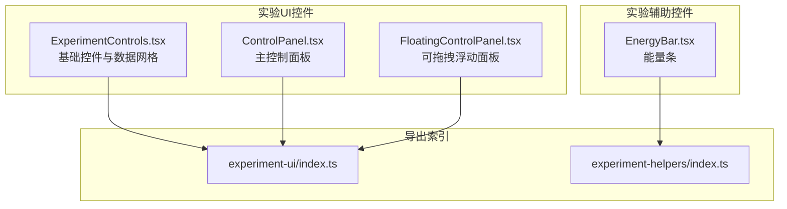
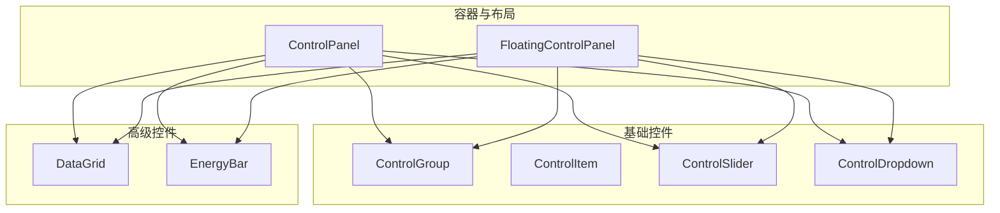
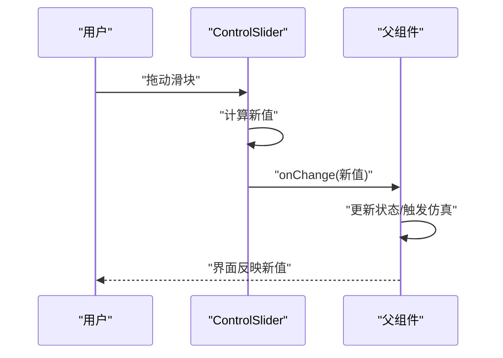
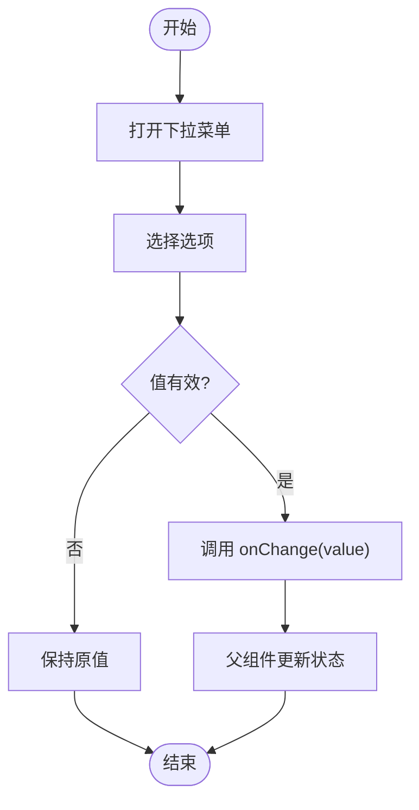
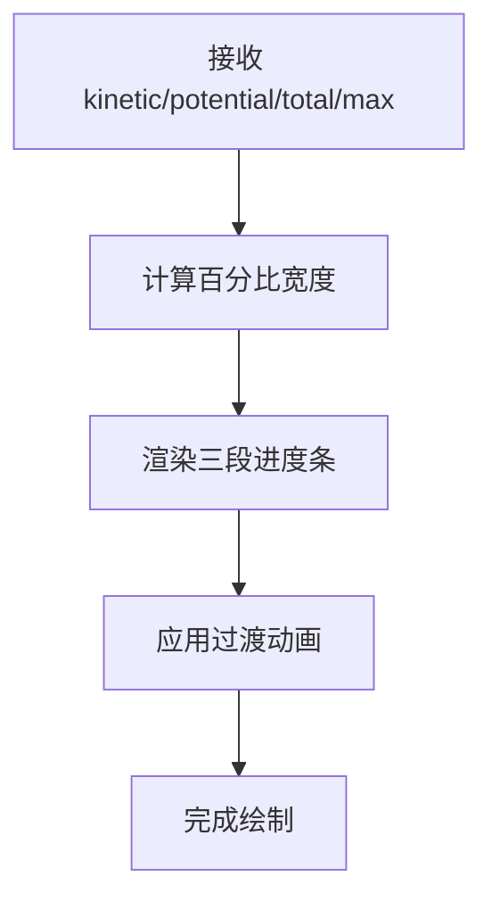
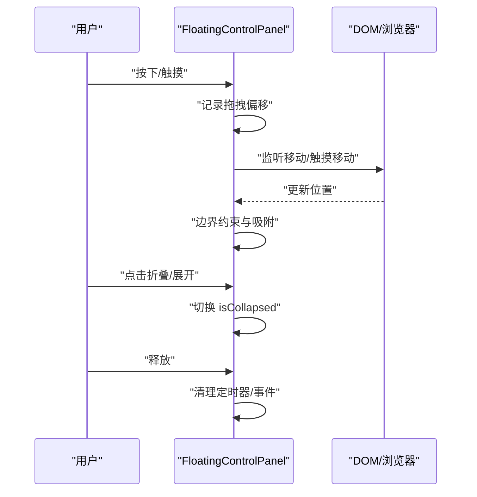
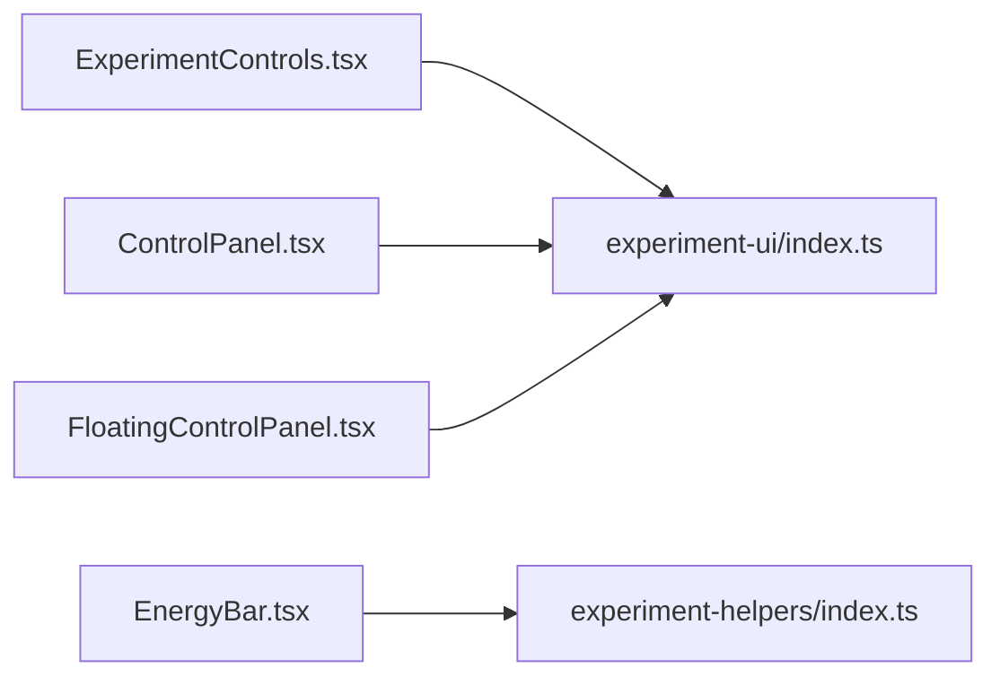

# 控件组件库

<cite>
**本文档引用的文件**
- [ExperimentControls.tsx](file://src/components/experiment-ui/ExperimentControls.tsx)
- [FloatingControlPanel.tsx](file://src/components/experiment-ui/FloatingControlPanel.tsx)
- [ControlPanel.tsx](file://src/components/experiment-ui/ControlPanel.tsx)
- [EnergyBar.tsx](file://src/components/experiment-helpers/EnergyBar.tsx)
- [index.ts](file://src/components/experiment-ui/index.ts)
- [index.ts](file://src/components/experiment-helpers/index.ts)
</cite>

## 目录
1. [简介](#简介)
2. [项目结构](#项目结构)
3. [核心组件](#核心组件)
4. [架构总览](#架构总览)
5. [详细组件分析](#详细组件分析)
6. [依赖关系分析](#依赖关系分析)
7. [性能考虑](#性能考虑)
8. [故障排除指南](#故障排除指南)
9. [结论](#结论)
10. [附录](#附录)

## 简介
本文件系统化梳理 ScienceLab3D 的实验控件组件库，覆盖基础控件（ControlGroup、ControlItem、ControlSlider、ControlDropdown）与高级控件（EnergyBar、DataGrid、ControlProgressBar），并阐述统一设计规范、样式系统、交互行为、状态管理、事件处理与数据绑定机制。同时给出可配置性、可复用性与扩展性的设计建议，并总结控件组合的最佳实践。

## 项目结构
控件组件主要位于以下两个模块中：
- 实验 UI 控件：实验控制面板、浮动控制面板、通用控件集合
- 实验辅助控件：能量条等专用展示控件

图表来源
- [ExperimentControls.tsx:1-211](file://src/components/experiment-ui/ExperimentControls.tsx#L1-L211)
- [ControlPanel.tsx:274-299](file://src/components/experiment-ui/ControlPanel.tsx#L274-L299)
- [FloatingControlPanel.tsx:1-40](file://src/components/experiment-ui/FloatingControlPanel.tsx#L1-L40)
- [EnergyBar.tsx:1-182](file://src/components/experiment-helpers/EnergyBar.tsx#L1-L182)
- [index.ts:1-200](file://src/components/experiment-ui/index.ts#L1-L200)
- [index.ts:1-200](file://src/components/experiment-helpers/index.ts#L1-L200)

章节来源
- [ExperimentControls.tsx:1-211](file://src/components/experiment-ui/ExperimentControls.tsx#L1-L211)
- [ControlPanel.tsx:274-299](file://src/components/experiment-ui/ControlPanel.tsx#L274-L299)
- [FloatingControlPanel.tsx:1-40](file://src/components/experiment-ui/FloatingControlPanel.tsx#L1-L40)
- [EnergyBar.tsx:1-182](file://src/components/experiment-helpers/EnergyBar.tsx#L1-L182)

## 核心组件
本节概述所有公开控件及其职责边界：
- ControlGroup：用于分组展示一组控件，提供标题与容器布局
- ControlItem：用于显示数值型或字符串型参数，支持单位与颜色标记
- ControlSlider：范围滑块控件，支持步进、小数位数、禁用态与颜色定制
- ControlDropdown：下拉选择控件，支持选项标签、值、表情符号与颜色
- DataGrid：数据网格展示，支持列数配置与单元格格式化
- EnergyBar：能量条，分别展示动能、势能与总量，支持最大值与动画过渡
- FloatingControlPanel：可拖拽、可折叠的浮动控制面板，适配移动端触控

章节来源
- [ExperimentControls.tsx:5-89](file://src/components/experiment-ui/ExperimentControls.tsx#L5-L89)
- [ExperimentControls.tsx:91-127](file://src/components/experiment-ui/ExperimentControls.tsx#L91-L127)
- [ExperimentControls.tsx:129-182](file://src/components/experiment-ui/ExperimentControls.tsx#L129-L182)
- [FloatingControlPanel.tsx:5-40](file://src/components/experiment-ui/FloatingControlPanel.tsx#L5-L40)

## 架构总览
控件体系采用“功能域分层 + 组合复用”的架构：
- 基础控件层：提供通用输入/展示能力（滑块、下拉、文本项）
- 高级控件层：面向实验场景的数据可视化与复合展示（能量条、数据网格）
- 容器与布局层：控制面板与浮动面板负责布局、交互与状态管理
- 导出索引：通过统一入口暴露组件，便于按需引入与Tree-shaking

图表来源
- [ExperimentControls.tsx:5-182](file://src/components/experiment-ui/ExperimentControls.tsx#L5-L182)
- [ControlPanel.tsx:274-299](file://src/components/experiment-ui/ControlPanel.tsx#L274-L299)
- [FloatingControlPanel.tsx:21-40](file://src/components/experiment-ui/FloatingControlPanel.tsx#L21-L40)

## 详细组件分析

### ControlGroup 分组容器
- 职责：为一组控件提供标题与分隔线，统一视觉层级
- 关键点：标题使用小号字重与上大写，容器内垂直间距统一；最后一项移除底部边距避免重复留白
- 使用场景：将相关参数归类到同一分组，提升界面可读性

章节来源
- [ExperimentControls.tsx:13-24](file://src/components/experiment-ui/ExperimentControls.tsx#L13-L24)

### ControlItem 参数显示
- 职责：以标签-数值对的形式展示实验参数
- 关键点：数值自动保留两位小数；支持单位与颜色高亮；使用等宽字体增强可读性
- 使用场景：显示当前物理量（温度、压力、速度等）的实时值

章节来源
- [ExperimentControls.tsx:36-48](file://src/components/experiment-ui/ExperimentControls.tsx#L36-L48)

### ControlSlider 滑块控件
- 职责：提供连续范围输入，支持步进、最小值、最大值、颜色与小数位数
- 关键点：onChange 回调接收数值；禁用态降低透明度并禁用指针；滑块强调色与标签颜色一致
- 使用场景：调节实验参数（如重力、摩擦系数、初始速度）

图表来源
- [ExperimentControls.tsx:66-89](file://src/components/experiment-ui/ExperimentControls.tsx#L66-L89)

章节来源
- [ExperimentControls.tsx:50-89](file://src/components/experiment-ui/ExperimentControls.tsx#L50-L89)

### ControlDropdown 下拉控件
- 职责：从预设选项中选择单一值
- 关键点：泛型约束确保值类型安全；支持禁用态；选项可带表情符号与颜色
- 使用场景：切换实验模式（如不同材料、坐标系）、选择预设条件

图表来源
- [ExperimentControls.tsx:208-253](file://src/components/experiment-ui/ExperimentControls.tsx#L208-L253)

章节来源
- [ExperimentControls.tsx:188-253](file://src/components/experiment-ui/ExperimentControls.tsx#L188-L253)

### DataGrid 数据网格
- 职责：以网格形式展示多组数据项，支持列数配置
- 关键点：键名转人类可读标签；每个单元格包含值与单位；颜色与小数位可配置
- 使用场景：展示多个物理量的当前值（如速度、加速度、位移等）

章节来源
- [ExperimentControls.tsx:91-127](file://src/components/experiment-ui/ExperimentControls.tsx#L91-L127)

### EnergyBar 能量条
- 职责：可视化展示系统能量构成（动能、势能、总量）
- 关键点：三段式进度条，颜色区分；支持最大值与动画过渡；总量条使用渐变色
- 使用场景：力学实验中直观呈现能量守恒

图表来源
- [ExperimentControls.tsx:129-182](file://src/components/experiment-ui/ExperimentControls.tsx#L129-L182)
- [EnergyBar.tsx:1-182](file://src/components/experiment-helpers/EnergyBar.tsx#L1-L182)

章节来源
- [ExperimentControls.tsx:129-182](file://src/components/experiment-ui/ExperimentControls.tsx#L129-L182)
- [EnergyBar.tsx:1-182](file://src/components/experiment-helpers/EnergyBar.tsx#L1-L182)

### FloatingControlPanel 浮动控制面板
- 职责：可拖拽、可折叠的控制面板，适合参数密集场景
- 关键点：SSR 友好初始化位置；移动端检测；拖拽偏移计算；视口边界约束；自动折叠定时器
- 使用场景：复杂实验的参数面板，需要在屏幕任意位置放置与隐藏

图表来源
- [FloatingControlPanel.tsx:21-40](file://src/components/experiment-ui/FloatingControlPanel.tsx#L21-L40)

章节来源
- [FloatingControlPanel.tsx:5-40](file://src/components/experiment-ui/FloatingControlPanel.tsx#L5-L40)

## 依赖关系分析
- 组件间耦合：基础控件被容器组件广泛复用；高级控件作为展示型组件独立存在，不依赖容器实现
- 外部依赖：Tailwind CSS 提供样式系统；React Hooks 管理状态与副作用
- 导出策略：通过各模块 index.ts 暴露组件，便于按需导入与 Tree-shaking

图表来源
- [index.ts:1-200](file://src/components/experiment-ui/index.ts#L1-L200)
- [index.ts:1-200](file://src/components/experiment-helpers/index.ts#L1-L200)

章节来源
- [index.ts:1-200](file://src/components/experiment-ui/index.ts#L1-L200)
- [index.ts:1-200](file://src/components/experiment-helpers/index.ts#L1-L200)

## 性能考虑
- 渲染优化
  - 使用常量映射替代动态类名拼接（例如 DataGrid 的列数映射），减少 Tailwind 解析开销
  - 滑块与下拉控件的禁用态仅改变透明度与指针，避免重建复杂节点
- 交互优化
  - 浮动面板使用 useRef 缓存偏移与定时器，减少每次渲染的闭包创建
  - 视口边界计算在移动事件中进行，避免频繁重排
- 动画与过渡
  - 能量条使用过渡动画，避免每帧强制布局；合理设置持续时间与缓动函数
- 状态管理
  - 将高频变更的参数通过父组件集中管理，子控件仅负责展示与回调，降低重渲染范围

## 故障排除指南
- SSR 水合不匹配
  - 现象：初始位置或尺寸异常
  - 处理：浮动面板在挂载后设置真实初始位置，避免服务端默认值导致的差异
- 拖拽越界
  - 现象：面板移出可视区域
  - 处理：在移动事件中进行边界约束，确保面板始终可见
- 触摸设备交互异常
  - 现象：滑块无法拖动或响应迟滞
  - 处理：为触摸事件提供独立的起始事件处理，阻止默认行为与冒泡
- 颜色与主题不一致
  - 现象：控件强调色与主题不符
  - 处理：通过 color 属性显式传入主题色；必要时在父组件统一注入主题变量

章节来源
- [FloatingControlPanel.tsx:31-40](file://src/components/experiment-ui/FloatingControlPanel.tsx#L31-L40)
- [ExperimentControls.tsx:66-89](file://src/components/experiment-ui/ExperimentControls.tsx#L66-L89)
- [ExperimentControls.tsx:208-253](file://src/components/experiment-ui/ExperimentControls.tsx#L208-L253)

## 结论
该控件组件库以清晰的分层与组合方式实现了实验参数的输入与展示，兼顾了可配置性、可复用性与扩展性。基础控件提供一致的交互体验，高级控件满足实验场景的可视化需求，容器组件则提供了灵活的布局与交互能力。建议在实际项目中遵循统一的颜色与间距规范，结合父组件状态管理，构建稳定高效的实验界面。

## 附录

### 统一设计规范与样式系统
- 字体与字号：标题使用小号字重与上大写；正文与数值使用等宽字体增强可读性
- 颜色体系：强调色统一使用主题色；数值颜色可自定义；禁用态降低透明度
- 间距与分隔：控件组之间使用统一的垂直间距；分组标题下方添加细线分隔
- 响应式：在移动端适配触摸手势与更紧凑的布局

### 交互行为与事件处理
- 输入控件：通过 onChange 回调传递最新值；父组件负责状态更新与副作用触发
- 展示控件：不参与状态管理，仅消费 props；必要时提供受控/非受控两种模式
- 浮动面板：支持拖拽、折叠、自动折叠定时器；提供移动端触控优化

### 数据绑定机制
- 单向数据流：父组件持有状态，子控件只读展示与回调
- 受控组件：滑块与下拉控件通过 value 与 onChange 实现受控绑定
- 非受控组件：在需要快速原型时可提供非受控版本，但不推荐在生产环境使用

### 可配置性、可复用性与扩展性
- 可配置性：颜色、单位、小数位数、禁用态、列数等均通过 props 暴露
- 可复用性：基础控件与容器组件解耦，可在不同实验页面复用
- 扩展性：新增控件遵循现有接口命名与样式约定；通过组合形成复合控件

### 类型定义与属性接口概览
- ControlGroupProps：title、children
- ControlItemProps：label、value、unit、color
- ControlSliderProps：label、value、unit、min、max、step、color、onChange、decimals、disabled
- ControlDropdownProps：label、value、options、onChange、color、disabled
- DataGridProps：data、columns
- EnergyBarProps：kinetic、potential、total、maxEnergy
- FloatingControlPanelProps：children、title、initialPosition、defaultCollapsed

章节来源
- [ExperimentControls.tsx:5-253](file://src/components/experiment-ui/ExperimentControls.tsx#L5-L253)
- [FloatingControlPanel.tsx:5-40](file://src/components/experiment-ui/FloatingControlPanel.tsx#L5-L40)

### 使用示例与最佳实践
- 示例路径
  - 滑块控件：[ExperimentControls.tsx:66-89](file://src/components/experiment-ui/ExperimentControls.tsx#L66-L89)
  - 下拉控件：[ExperimentControls.tsx:208-253](file://src/components/experiment-ui/ExperimentControls.tsx#L208-L253)
  - 数据网格：[ExperimentControls.tsx:91-127](file://src/components/experiment-ui/ExperimentControls.tsx#L91-L127)
  - 能量条：[ExperimentControls.tsx:129-182](file://src/components/experiment-ui/ExperimentControls.tsx#L129-L182)
  - 浮动面板：[FloatingControlPanel.tsx:21-40](file://src/components/experiment-ui/FloatingControlPanel.tsx#L21-L40)
- 最佳实践
  - 将相关参数放入 ControlGroup 中，提升可读性
  - 对于连续参数优先使用 ControlSlider，离散选项使用 ControlDropdown
  - 使用 DataGrid 展示多组数据，避免信息堆叠
  - 在复杂实验中使用 FloatingControlPanel 放置参数面板，便于操作
  - 为关键数值设置颜色与单位，提高辨识度