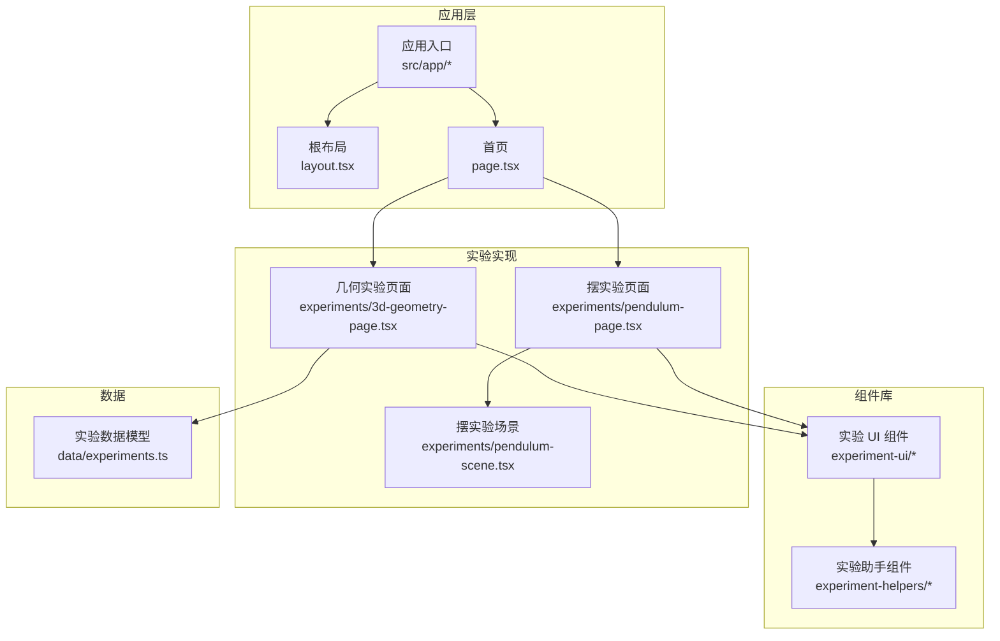
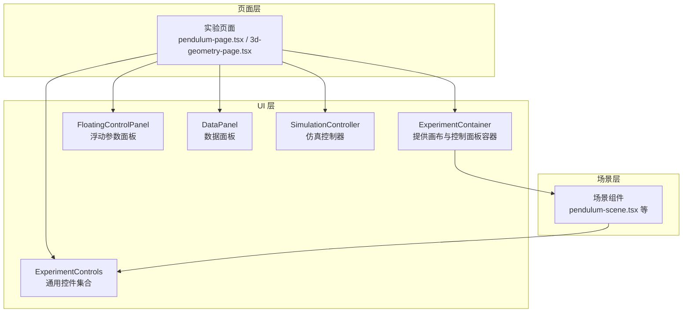
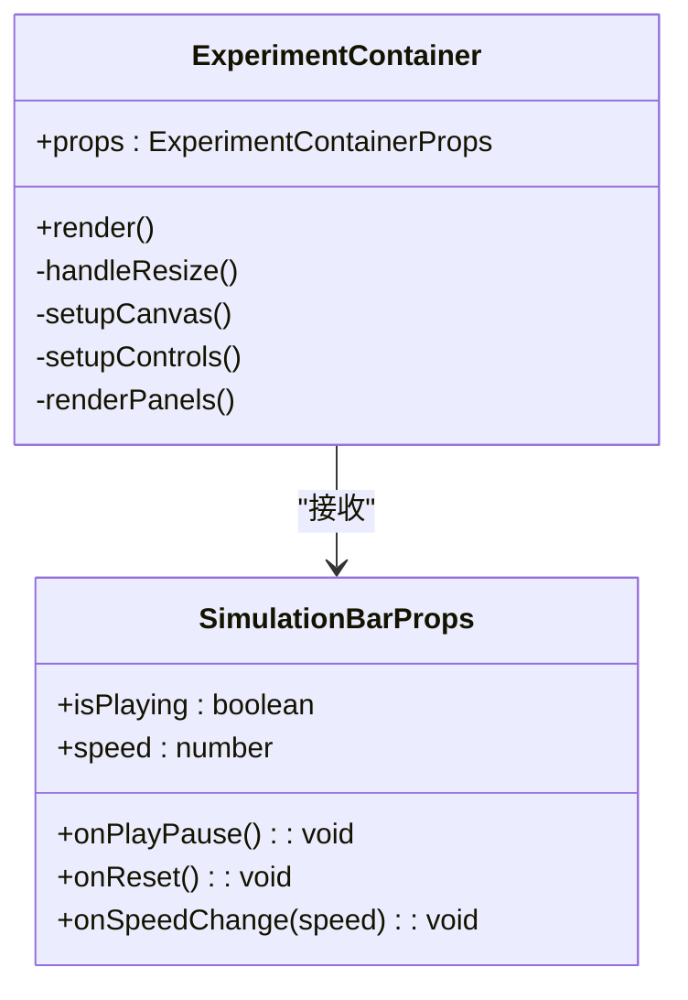
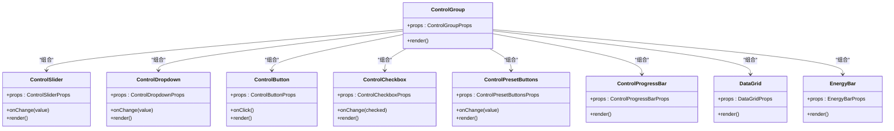
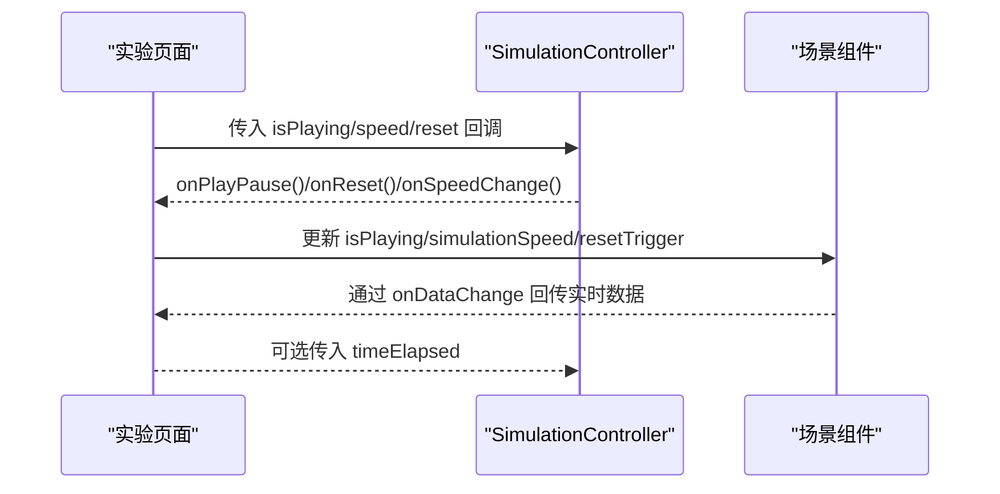
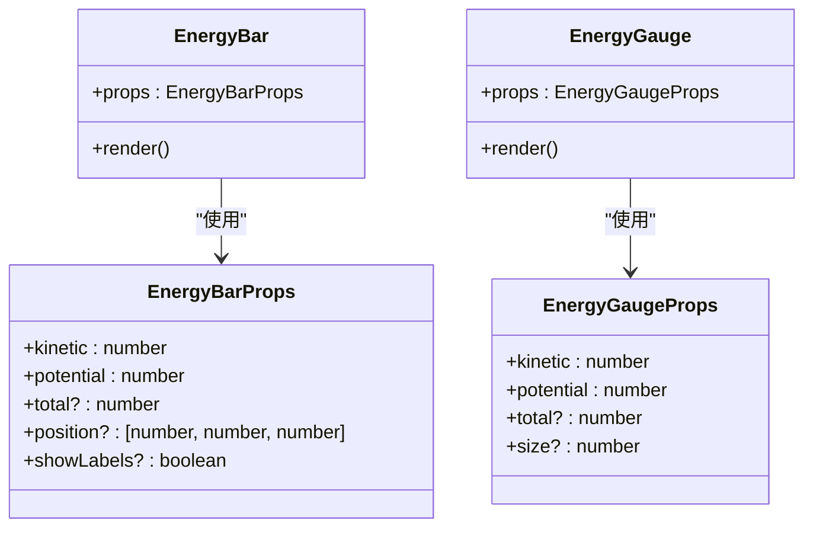
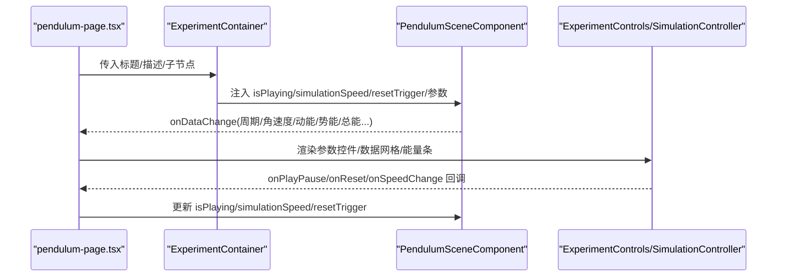
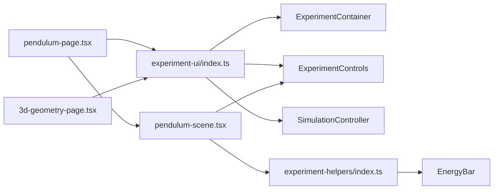

# 组件架构

<cite>
**本文档引用的文件**
- [ExperimentContainer.tsx](file://src/components/experiment-ui/ExperimentContainer.tsx)
- [ExperimentControls.tsx](file://src/components/experiment-ui/ExperimentControls.tsx)
- [SimulationController.tsx](file://src/components/experiment-ui/SimulationController.tsx)
- [EnergyBar.tsx](file://src/components/experiment-helpers/EnergyBar.tsx)
- [index.ts（实验UI）](file://src/components/experiment-ui/index.ts)
- [index.ts（实验助手）](file://src/components/experiment-helpers/index.ts)
- [pendulum-page.tsx](file://src/experiments/pendulum-page.tsx)
- [pendulum-scene.tsx](file://src/experiments/pendulum-scene.tsx)
- [3d-geometry-page.tsx](file://src/experiments/3d-geometry-page.tsx)
- [page.tsx（首页）](file://src/app/page.tsx)
- [layout.tsx](file://src/app/layout.tsx)
- [experiments.ts](file://src/data/experiments.ts)
- [package.json](file://package.json)
</cite>

## 目录
1. [引言](#引言)
2. [项目结构](#项目结构)
3. [核心组件](#核心组件)
4. [架构总览](#架构总览)
5. [详细组件分析](#详细组件分析)
6. [依赖关系分析](#依赖关系分析)
7. [性能考量](#性能考量)
8. [故障排除指南](#故障排除指南)
9. [结论](#结论)
10. [附录](#附录)

## 引言
本文件系统性梳理 ScienceLab3D 的组件架构，聚焦于基于 React 的实验组件化设计。文档覆盖两大组件体系：实验 UI 组件与实验助手组件；阐述从高层实验容器到低层具体控件的分层结构、组件间通信机制、Props 传递模式与事件处理策略；总结组件的复用性、可配置性与扩展性；说明状态管理、生命周期与性能优化；并给出设计原则、命名约定与代码组织最佳实践及具体使用示例。

## 项目结构
项目采用按功能域划分的目录组织方式：
- src/app：Next.js 应用入口与页面路由，负责全局布局与主页展示
- src/components：组件库，分为实验 UI 组件与实验助手组件
- src/experiments：各实验页面与其对应的场景组件
- src/data：实验元数据与分类信息
- src/utils：通用工具模块
- 根目录：构建配置与依赖声明

**图表来源**
- [layout.tsx:180-203](file://src/app/layout.tsx#L180-L203)
- [page.tsx（首页）:305-675](file://src/app/page.tsx#L305-L675)
- [pendulum-page.tsx:29-213](file://src/experiments/pendulum-page.tsx#L29-L213)
- [3d-geometry-page.tsx:18-189](file://src/experiments/3d-geometry-page.tsx#L18-L189)
- [experiments.ts:12-460](file://src/data/experiments.ts#L12-L460)

**章节来源**
- [layout.tsx:1-204](file://src/app/layout.tsx#L1-L204)
- [page.tsx（首页）:1-676](file://src/app/page.tsx#L1-L676)
- [experiments.ts:1-492](file://src/data/experiments.ts#L1-L492)

## 核心组件
本节概述两大组件体系及其职责边界：

- 实验 UI 组件（experiment-ui）
  - 职责：提供实验容器、控制面板、数据面板、仿真控制器等通用 UI 基础设施
  - 关键组件：ExperimentContainer、ControlPanel/FloatingControlPanel、DataPanel、SimulationController、ExperimentControls（滑块、按钮、下拉、开关、预设、进度条、数据网格等）

- 实验助手组件（experiment-helpers）
  - 职责：提供跨实验可复用的可视化与辅助组件
  - 关键组件：EnergyBar（能量条）、EnergyGauge（能量表盘）

这些组件通过统一的导出入口集中暴露，便于实验页面按需引入与组合。

**章节来源**
- [index.ts（实验UI）:1-43](file://src/components/experiment-ui/index.ts#L1-L43)
- [index.ts（实验助手）:1-8](file://src/components/experiment-helpers/index.ts#L1-L8)

## 架构总览
整体架构遵循“页面驱动 + 场景渲染 + 通用 UI 控制”的分层模式：
- 页面层：实验页面负责状态管理与参数绑定，组装 UI 控件与场景组件
- 场景层：基于 @react-three/fiber 的 3D 场景组件，负责物理计算与渲染
- UI 层：实验容器与控制面板提供交互入口与数据展示

**图表来源**
- [pendulum-page.tsx:29-213](file://src/experiments/pendulum-page.tsx#L29-L213)
- [3d-geometry-page.tsx:18-189](file://src/experiments/3d-geometry-page.tsx#L18-L189)
- [ExperimentContainer.tsx:55-371](file://src/components/experiment-ui/ExperimentContainer.tsx#L55-L371)
- [ExperimentControls.tsx:13-498](file://src/components/experiment-ui/ExperimentControls.tsx#L13-L498)
- [SimulationController.tsx:27-225](file://src/components/experiment-ui/SimulationController.tsx#L27-L225)

## 详细组件分析

### 实验容器组件 ExperimentContainer
- 角色定位：实验画布容器，封装 Three.js 场景、相机、光照、环境与交互控制，提供标题栏、切换面板与浮动仿真条
- 关键能力
  - 自适应画布尺寸与像素比，响应窗口变化
  - OrbitControls 拖拽旋转、缩放、平移，移动端触控优化
  - 可选雾化效果、环境贴图与多光源增强视觉
  - 动态面板：控制面板、数据面板、详情面板的显隐与样式
  - 浮动仿真条：播放/暂停、重置、速度调节、时间显示
- 设计要点
  - Props 分层清晰：场景内容、标题描述、面板内容、相机位置、背景色、仿真条配置
  - 移动端适配：根据设备宽度调整相机 FOV、阻尼系数、缩放速度与触摸手势
  - 性能：禁用抗锯齿以提升移动端帧率；限制像素比；仅在可用尺寸时渲染

**图表来源**
- [ExperimentContainer.tsx:42-53](file://src/components/experiment-ui/ExperimentContainer.tsx#L42-L53)
- [ExperimentContainer.tsx:55-371](file://src/components/experiment-ui/ExperimentContainer.tsx#L55-L371)

**章节来源**
- [ExperimentContainer.tsx:1-374](file://src/components/experiment-ui/ExperimentContainer.tsx#L1-L374)

### 通用实验控件 ExperimentControls
- 角色定位：提供高度可配置的通用控件集合，统一风格与交互体验
- 主要控件
  - ControlGroup/ControlItem：参数组与数值显示
  - ControlSlider：带单位与精度的滑块控件
  - ControlDropdown：自定义选项、图标与颜色
  - ControlButton：多变体按钮（主次危险成功警告）
  - ControlCheckbox：布尔开关
  - ControlPresetButtons：快速预设选择
  - ControlProgressBar：进度指示
  - DataGrid：数据网格布局
  - EnergyBar：能量可视化（与场景内 3D 能量条互补）
- 设计要点
  - Props 驱动：所有控件均通过 props 配置标签、值、范围、单位与回调
  - 可访问性：禁用态、键盘与触控友好
  - 复用性：控件独立、无实验耦合，便于在不同实验中复用

**图表来源**
- [ExperimentControls.tsx:5-498](file://src/components/experiment-ui/ExperimentControls.tsx#L5-L498)

**章节来源**
- [ExperimentControls.tsx:1-498](file://src/components/experiment-ui/ExperimentControls.tsx#L1-L498)

### 仿真控制器 SimulationController
- 角色定位：始终可见的浮动控制器，支持拖拽、移动设备适配、速度控制与时间显示
- 关键特性
  - 拖拽：鼠标与触摸事件统一处理，约束在视口范围内
  - 移动端优化：初始位置与宽度自适应，提升触控体验
  - 状态同步：与实验页面共享 isPlaying、speed、resetTrigger 等状态
- 设计要点
  - 事件解绑：拖拽结束自动清理监听，避免内存泄漏
  - 时间格式化：分钟:秒.百分之一秒格式

**图表来源**
- [SimulationController.tsx:27-225](file://src/components/experiment-ui/SimulationController.tsx#L27-L225)
- [pendulum-page.tsx:34-59](file://src/experiments/pendulum-page.tsx#L34-L59)
- [pendulum-scene.tsx:484-501](file://src/experiments/pendulum-scene.tsx#L484-L501)

**章节来源**
- [SimulationController.tsx:1-228](file://src/components/experiment-ui/SimulationController.tsx#L1-L228)

### 实验助手组件 EnergyBar 与 EnergyGauge
- 角色定位：跨实验的能量可视化组件，支持 2D 图表与 3D 表盘两种形态
- 能力对比
  - 2D 能量条：显示 KE/PE/TE 百分比与数值，支持标签与最大值设定
  - 3D 能量表盘：基于圆锥渐变的圆形仪表，直观展示比例
- 设计要点
  - 3D 能量条基于 @react-three/drei 的 Html 定位，适合叠加在场景中
  - 表盘组件提供紧凑的视觉反馈，适合移动端或空间受限场景

**图表来源**
- [EnergyBar.tsx:6-141](file://src/components/experiment-helpers/EnergyBar.tsx#L6-L141)

**章节来源**
- [EnergyBar.tsx:1-142](file://src/components/experiment-helpers/EnergyBar.tsx#L1-L142)

### 典型实验页面与场景集成
以“单摆”实验为例，展示页面如何组合 UI 组件与场景组件：
- 页面层：维护参数状态（长度、质量、初始角度、阻尼、重力等），控制播放/重置/速度，聚合数据面板内容
- 场景层：基于 RK4 数值积分的物理模拟，实时计算能量与轨迹，通过回调向页面回传数据
- UI 层：ExperimentContainer 提供画布与面板容器；SimulationController 提供浮动控制；FloatingControlPanel/DataPanel 提供参数与数据面板

**图表来源**
- [pendulum-page.tsx:29-213](file://src/experiments/pendulum-page.tsx#L29-L213)
- [ExperimentContainer.tsx:55-184](file://src/components/experiment-ui/ExperimentContainer.tsx#L55-L184)
- [pendulum-scene.tsx:223-502](file://src/experiments/pendulum-scene.tsx#L223-L502)

**章节来源**
- [pendulum-page.tsx:1-214](file://src/experiments/pendulum-page.tsx#L1-L214)
- [pendulum-scene.tsx:1-859](file://src/experiments/pendulum-scene.tsx#L1-L859)

## 依赖关系分析
- 技术栈
  - React 19、Next.js App Router、TypeScript
  - @react-three/fiber + drei：3D 场景与交互
  - framer-motion：动画与过渡
  - lucide-react：图标
- 组件依赖
  - 页面 → UI 组件（统一导出）→ 助手组件
  - 场景组件 → UI 控件（如 EnergyBar）用于数据可视化

**图表来源**
- [index.ts（实验UI）:1-43](file://src/components/experiment-ui/index.ts#L1-L43)
- [index.ts（实验助手）:1-8](file://src/components/experiment-helpers/index.ts#L1-L8)
- [pendulum-page.tsx:8-18](file://src/experiments/pendulum-page.tsx#L8-L18)
- [3d-geometry-page.tsx:5-14](file://src/experiments/3d-geometry-page.tsx#L5-L14)
- [pendulum-scene.tsx:1-6](file://src/experiments/pendulum-scene.tsx#L1-L6)

**章节来源**
- [package.json:10-21](file://package.json#L10-L21)

## 性能考量
- 画布与渲染
  - 移动端禁用抗锯齿、限制像素比、降低 dpr，提升帧率
  - 使用 ResizeObserver 与自定义 CanvasResizeHandler 同步画布尺寸
- 交互与输入
  - OrbitControls 启用阻尼与合理距离限制，移动端触控手势优化
- 数据更新与回调
  - 场景内使用帧计数节流（每 N 帧更新一次 React 状态），减少昂贵的属性更新
  - 通过回调将关键数据传回页面，避免在渲染树中存储大量中间状态
- 面板与布局
  - 控制面板与数据面板采用条件渲染与显隐切换，避免不必要的 DOM 结构
  - 仿真控制器固定定位，减少布局抖动

**章节来源**
- [ExperimentContainer.tsx:137-154](file://src/components/experiment-ui/ExperimentContainer.tsx#L137-L154)
- [ExperimentContainer.tsx:163-180](file://src/components/experiment-ui/ExperimentContainer.tsx#L163-L180)
- [pendulum-scene.tsx:314-341](file://src/experiments/pendulum-scene.tsx#L314-L341)
- [pendulum-scene.tsx:479-501](file://src/experiments/pendulum-scene.tsx#L479-L501)

## 故障排除指南
- 画布不渲染或尺寸异常
  - 检查 ExperimentContainer 中的 canRender 判定与窗口尺寸监听
  - 确认 ResizeObserver 正常工作，避免首次渲染时尺寸为 0
- 交互无响应或卡顿
  - 检查 OrbitControls 参数（阻尼、距离限制、旋转/缩放速度）
  - 在移动端确认触摸手势映射正确
- 控件不触发回调
  - 确保 ExperimentControls 的 onChange 回调正确传递给父组件
  - 对于禁用态控件，检查 disabled 属性是否被误设置
- 数据面板未更新
  - 确认场景组件通过 onDataChange 回调传入数据
  - 检查页面层 setData 是否被正确调用

**章节来源**
- [ExperimentContainer.tsx:123-135](file://src/components/experiment-ui/ExperimentContainer.tsx#L123-L135)
- [ExperimentControls.tsx:66-88](file://src/components/experiment-ui/ExperimentControls.tsx#L66-L88)
- [pendulum-scene.tsx:484-501](file://src/experiments/pendulum-scene.tsx#L484-L501)

## 结论
ScienceLab3D 的组件架构以“页面 + 场景 + UI 控件”三层协同为核心，通过统一的实验容器与通用控件库，实现了高复用、强扩展的实验平台。页面层专注状态与参数，场景层专注物理与渲染，UI 层提供一致的交互体验。该架构在性能、可维护性与可扩展性之间取得良好平衡，适合持续迭代与大规模实验接入。

## 附录

### 组件设计原则与最佳实践
- 单一职责：每个组件专注于单一功能，避免过度耦合
- Props 驱动：通过明确的 Props 接口传递数据与回调，便于测试与复用
- 可配置性：提供丰富的默认值与主题色，满足不同实验风格
- 可扩展性：新增控件遵循现有接口规范，保持 UI 一致性
- 命名约定：组件名语义化，Props 接口以“组件名Props”命名，导出类型与组件同名

### 组件使用示例与集成模式
- 在实验页面中引入 ExperimentContainer 作为根容器，传入标题、描述与子节点
- 通过 SimulationController 提供播放/暂停/重置/速度控制
- 使用 FloatingControlPanel/DataPanel 包裹参数与数据面板，支持显隐切换
- 在场景组件中通过回调将实时数据回传至页面，结合 ExperimentControls 进行展示

**章节来源**
- [pendulum-page.tsx:159-213](file://src/experiments/pendulum-page.tsx#L159-L213)
- [3d-geometry-page.tsx:145-189](file://src/experiments/3d-geometry-page.tsx#L145-L189)