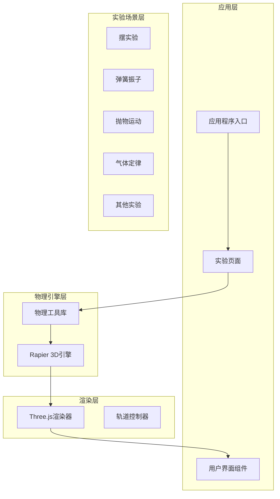
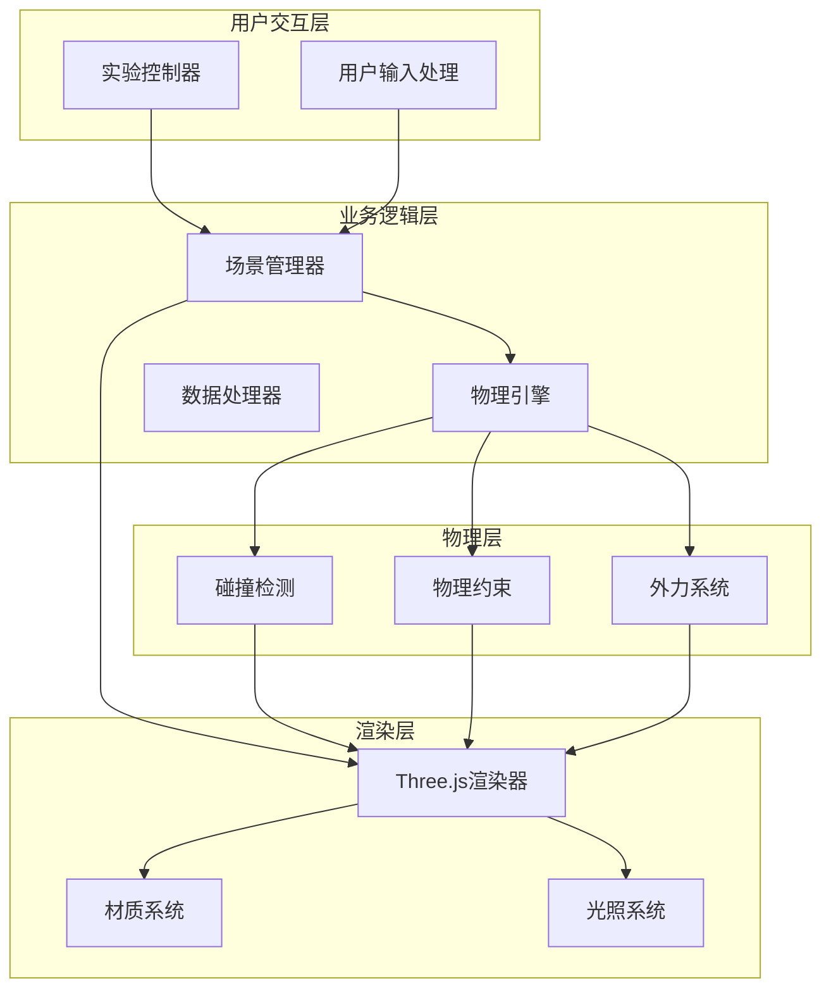
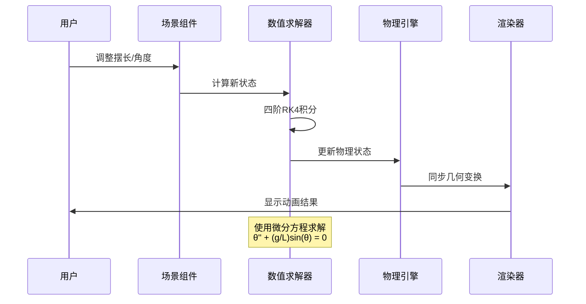
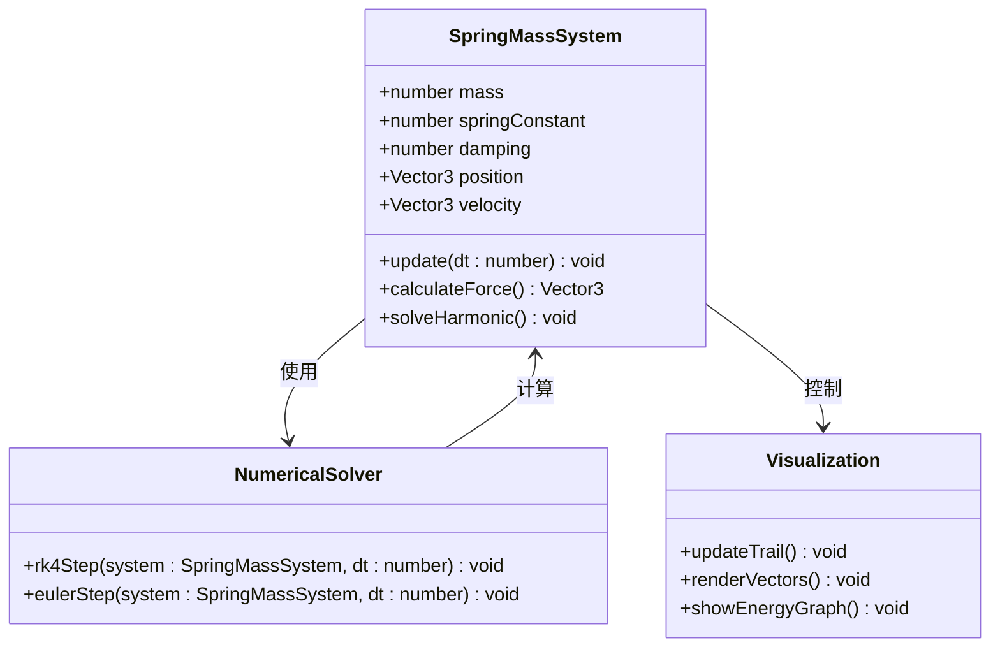
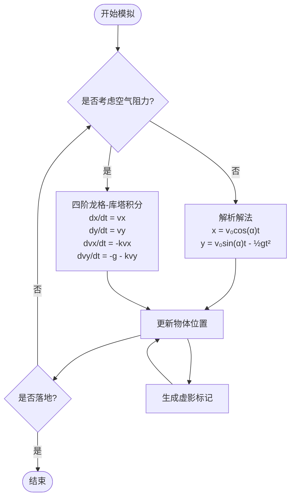
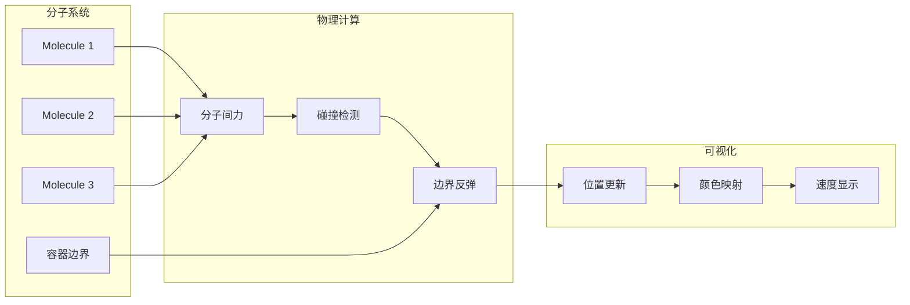
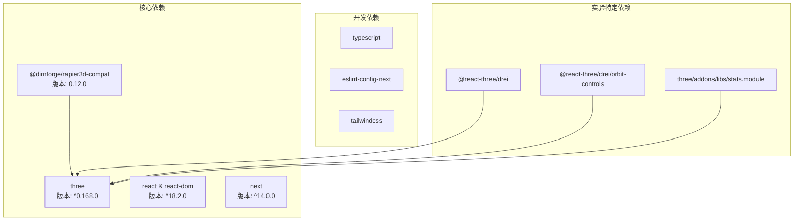

# 物理引擎集成

<cite>
**本文档引用的文件**
- [physics.ts](file://src/utils/physics.ts)
- [pendulum-scene.tsx](file://src/experiments/pendulum-scene.tsx)
- [spring-mass-scene.tsx](file://src/experiments/spring-mass-scene.tsx)
- [projectile-motion-scene.tsx](file://src/experiments/projectile-motion-scene.tsx)
- [gas-laws-scene.tsx](file://src/experiments/gas-laws-scene.tsx)
- [package.json](file://package.json)
- [package-lock.json](file://package-lock.json)
- [README.md](file://README.md)
</cite>

## 目录
1. [引言](#引言)
2. [项目结构](#项目结构)
3. [核心组件](#核心组件)
4. [架构概览](#架构概览)
5. [详细组件分析](#详细组件分析)
6. [依赖分析](#依赖分析)
7. [性能考虑](#性能考虑)
8. [故障排除指南](#故障排除指南)
9. [结论](#结论)

## 引言

ScienceLab3D是一个交互式STEM教育平台，提供了40多个虚拟实验，涵盖物理、化学和生物学科。该项目采用Rapier物理引擎进行3D物理仿真，为用户提供真实的物理现象模拟体验。

本项目的核心目标是通过精确的物理仿真来增强科学教育效果，让用户能够直观地理解复杂的物理概念。Rapier作为高性能的3D物理引擎，为项目提供了可靠的物理计算基础。

## 项目结构

项目采用模块化架构设计，将物理引擎集成与具体的实验场景分离：

**图表来源**
- [physics.ts](file://src/utils/physics.ts)
- [pendulum-scene.tsx](file://src/experiments/pendulum-scene.tsx)
- [spring-mass-scene.tsx](file://src/experiments/spring-mass-scene.tsx)

**章节来源**
- [README.md](file://README.md)
- [package.json](file://package.json)

## 核心组件

### 物理引擎选择

项目选择了Rapier 3D作为物理引擎，主要基于以下优势：

1. **高性能计算**：专为WebAssembly优化，提供接近原生的性能
2. **精确物理模拟**：支持复杂的碰撞检测和约束系统
3. **易于集成**：提供了TypeScript友好的API接口
4. **跨平台兼容**：支持浏览器和Node.js环境

### 物理工具库

物理工具库位于[src/utils/physics.ts](file://src/utils/physics.ts)，提供了通用的物理计算功能：

- 单摆运动求解器
- 弹簧振子模拟器  
- 碰撞检测算法
- 物理材质定义
- 时间步进控制

**章节来源**
- [physics.ts](file://src/utils/physics.ts)
- [package-lock.json:56-61](file://package-lock.json#L56-L61)

## 架构概览

项目采用分层架构，确保物理引擎与渲染系统的松耦合：

**图表来源**
- [physics.ts](file://src/utils/physics.ts)
- [pendulum-scene.tsx](file://src/experiments/pendulum-scene.tsx)
- [spring-mass-scene.tsx](file://src/experiments/spring-mass-scene.tsx)

## 详细组件分析

### 单摆实验分析

单摆实验实现了精确的物理模拟，使用了四阶龙格-库塔积分法来解决微分方程：

**图表来源**
- [pendulum-scene.tsx](file://src/experiments/pendulum-scene.tsx)

#### 关键实现特点：

1. **数值积分精度**：使用四阶龙格-库塔方法确保长时间模拟的稳定性
2. **能量守恒**：通过精确的数学模型保持机械能守恒
3. **实时反馈**：提供摆线轨迹显示和能量转换可视化

**章节来源**
- [pendulum-scene.tsx](file://src/experiments/pendulum-scene.tsx)

### 弹簧振子实验分析

弹簧振子实验展示了简谐振动的完整特性：

**图表来源**
- [spring-mass-scene.tsx](file://src/experiments/spring-mass-scene.tsx)

#### 物理实现要点：

1. **胡克定律应用**：F = -kx提供恢复力
2. **阻尼效应**：考虑空气阻力和内部摩擦
3. **能量分析**：实时计算动能、势能和总能量

**章节来源**
- [spring-mass-scene.tsx](file://src/experiments/spring-mass-scene.tsx)

### 抛物运动实验分析

抛物运动实验提供了两种模拟模式：

**图表来源**
- [projectile-motion-scene.tsx](file://src/experiments/projectile-motion-scene.tsx)

#### 性能优化策略：

1. **自适应时间步进**：根据帧率动态调整dt大小
2. **实例化渲染**：使用InstancedMesh优化虚影渲染
3. **阈值优化**：只在必要时更新昂贵的计算

**章节来源**
- [projectile-motion-scene.tsx](file://src/experiments/projectile-motion-scene.tsx)

### 气体定律实验分析

气体定律实验模拟了理想气体分子的运动：

**图表来源**
- [gas-laws-scene.tsx](file://src/experiments/gas-laws-scene.tsx)

#### 关键特性：

1. **分子动力学**：模拟大量分子的随机运动
2. **压力计算**：通过分子碰撞频率计算压强
3. **温度关联**：分子平均动能与温度成正比

**章节来源**
- [gas-laws-scene.tsx](file://src/experiments/gas-laws-scene.tsx)

## 依赖分析

项目的主要依赖关系如下：

**图表来源**
- [package.json](file://package.json)
- [package-lock.json:56-61](file://package-lock.json#L56-L61)

**章节来源**
- [package.json](file://package.json)
- [package-lock.json:56-61](file://package-lock.json#L56-L61)

## 性能考虑

### 时间步进优化

项目采用了多种时间步进策略来平衡精度和性能：

1. **自适应步进**：根据帧时间动态调整物理步长
2. **多级步进**：对于复杂场景使用更小的子步长
3. **帧率限制**：最大步长限制为0.02秒防止不稳定

### 内存管理

1. **对象池模式**：复用临时对象减少垃圾回收
2. **批量更新**：使用instanced mesh进行批量渲染
3. **引用优化**：所有物理状态存储在ref中避免不必要的重渲染

### 并行计算

Rapier引擎利用WebAssembly的并行计算能力，在多核CPU上提供更好的性能表现。

## 故障排除指南

### 常见问题及解决方案

#### 物理模拟不稳定

**症状**：物体穿透或弹跳过度
**解决方案**：
1. 检查时间步长设置
2. 增加Rapier的迭代次数
3. 验证碰撞形状的准确性

#### 性能问题

**症状**：帧率下降到30FPS以下
**解决方案**：
1. 减少场景中的物理对象数量
2. 简化碰撞形状
3. 关闭不必要的视觉效果

#### 碰撞检测不准确

**症状**：物体穿过障碍物
**解决方案**：
1. 检查碰撞过滤器设置
2. 验证物理材质参数
3. 确认约束系统的正确性

### 调试工具使用

项目集成了多种调试工具来帮助开发者：

1. **Stats.js**：实时监控帧率和内存使用
2. **坐标轴辅助器**：可视化物体的旋转和位置
3. **边界框显示**：检查碰撞体积的准确性
4. **约束可视化**：显示连接点和力的方向

**章节来源**
- [physics.ts](file://src/utils/physics.ts)

## 结论

ScienceLab3D的物理引擎集成为项目提供了强大的技术支持，通过Rapier 3D引擎实现了精确而高效的物理仿真。项目采用模块化设计，将物理计算与渲染系统分离，确保了良好的可维护性和扩展性。

通过精心设计的实验场景，用户可以直观地理解各种物理现象，从简单的单摆运动到复杂的分子动力学模拟。项目的性能优化策略确保了在各种设备上的流畅运行，而丰富的调试工具则为开发者提供了便利。

未来的发展方向包括进一步优化物理计算性能、扩展更多物理现象的模拟以及增强用户交互体验。随着WebAssembly技术的不断发展，ScienceLab3D有望为用户提供更加逼真的物理学习体验。