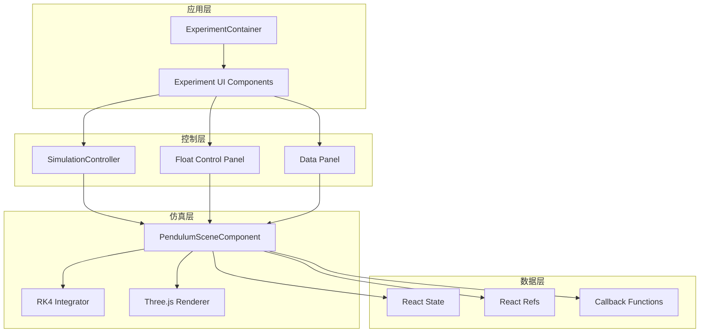
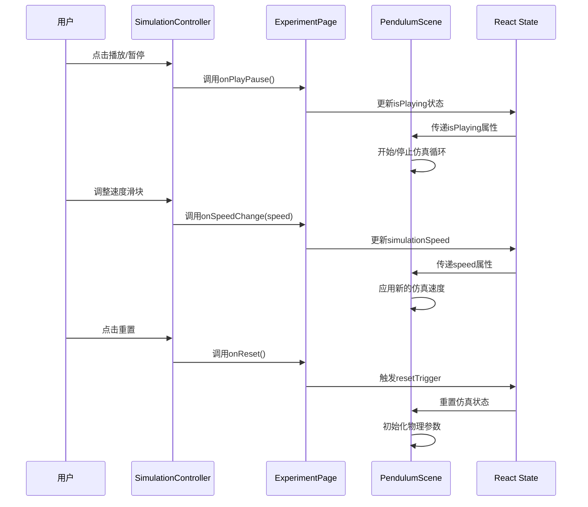
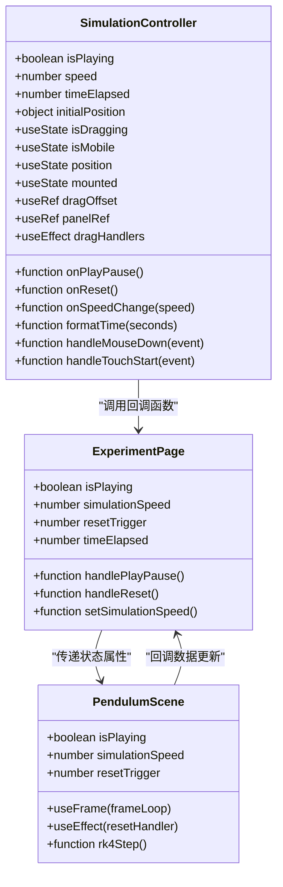
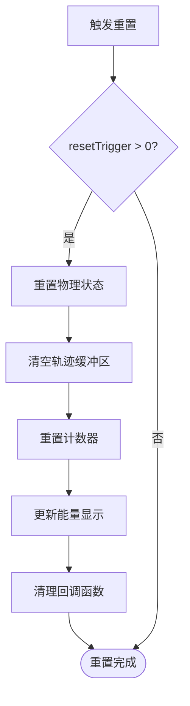
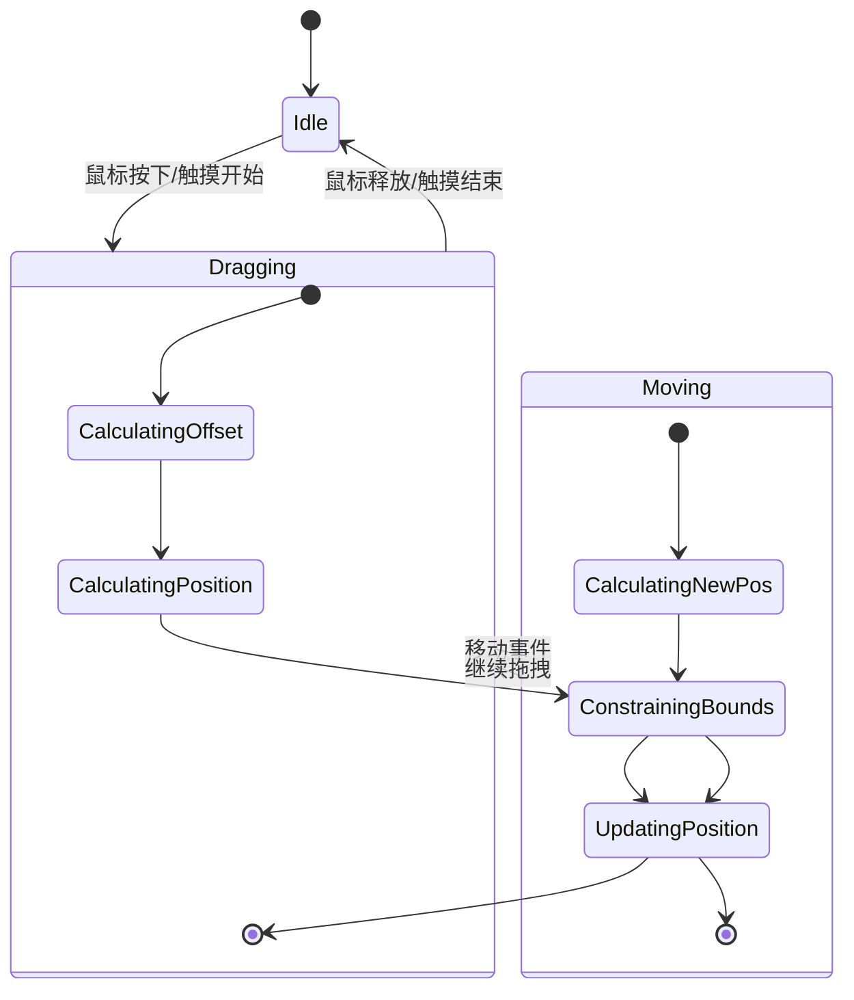
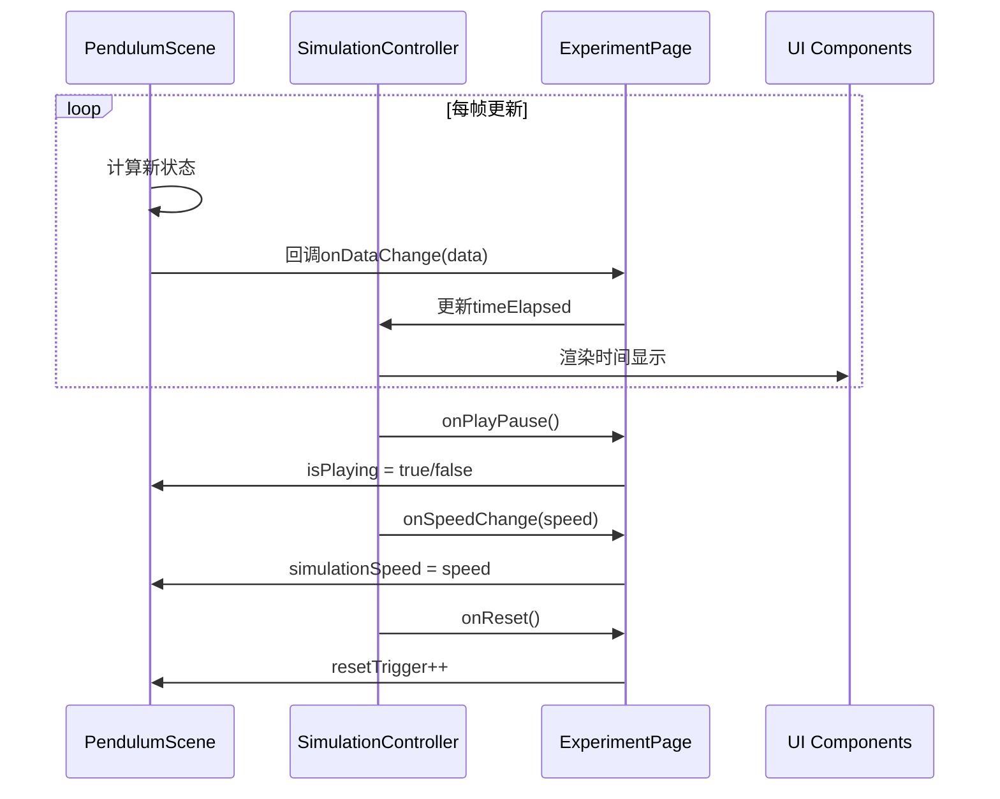
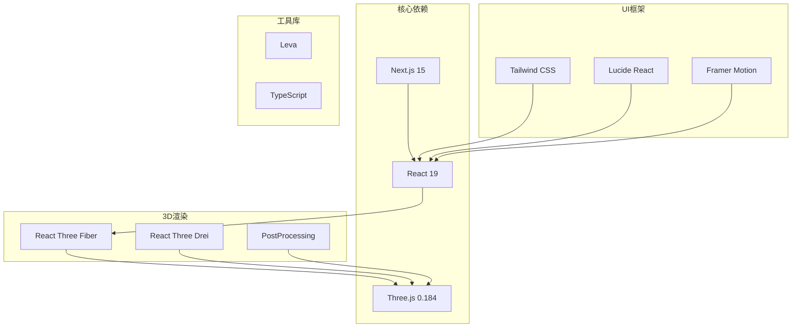
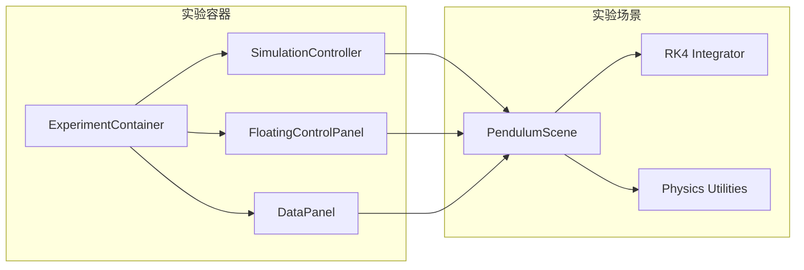

# 仿真控制器

<cite>
**本文档引用的文件**
- [SimulationController.tsx](file://src/components/experiment-ui/SimulationController.tsx)
- [ExperimentContainer.tsx](file://src/components/experiment-ui/ExperimentContainer.tsx)
- [FloatingControlPanel.tsx](file://src/components/experiment-ui/FloatingControlPanel.tsx)
- [DataPanel.tsx](file://src/components/experiment-ui/DataPanel.tsx)
- [pendulum-page.tsx](file://src/experiments/pendulum-page.tsx)
- [pendulum-scene.tsx](file://src/experiments/pendulum-scene.tsx)
</cite>

## 目录
1. [简介](#简介)
2. [项目结构](#项目结构)
3. [核心组件](#核心组件)
4. [架构概览](#架构概览)
5. [详细组件分析](#详细组件分析)
6. [依赖关系分析](#依赖关系分析)
7. [性能考虑](#性能考虑)
8. [故障排除指南](#故障排除指南)
9. [结论](#结论)

## 简介

仿真控制器是ScienceLab 3D项目中的核心交互组件，负责管理科学实验的实时仿真过程。该控制器提供了完整的实验控制功能，包括播放/暂停控制、时间步进管理、重置机制和速度调节。通过直观的用户界面，用户可以实时监控和调整仿真实验的各项参数，获得沉浸式的科学学习体验。

ScienceLab 3D是一个基于Web的3D科学学习平台，包含40多个互动实验，涵盖物理、化学、生物和数学四个学科领域。该项目采用现代前端技术栈，使用Next.js 15、React 19、Three.js和React Three Fiber构建高性能的3D可视化仿真系统。

## 项目结构

项目采用模块化的组件化架构，主要分为以下几个层次：



**图表来源**
- [ExperimentContainer.tsx:55-374](file://src/components/experiment-ui/ExperimentContainer.tsx#L55-L374)
- [SimulationController.tsx:27-228](file://src/components/experiment-ui/SimulationController.tsx#L27-L228)

**章节来源**
- [ExperimentContainer.tsx:1-374](file://src/components/experiment-ui/ExperimentContainer.tsx#L1-L374)
- [SimulationController.tsx:1-228](file://src/components/experiment-ui/SimulationController.tsx#L1-L228)

## 核心组件

### SimulationController 组件

SimulationController是浮动式仿真控制器的核心组件，具有以下关键特性：

#### 主要功能
- **播放/暂停控制**：提供直观的播放和暂停按钮
- **重置机制**：一键重置仿真到初始状态
- **速度调节**：支持0.1x到3x的速度范围调节
- **时间显示**：实时显示仿真运行时间
- **拖拽操作**：支持在屏幕上的自由拖拽定位
- **响应式设计**：自动适配桌面和移动设备

#### 技术实现特点
- 使用React Hooks进行状态管理（useState, useRef, useEffect）
- 实现了完整的拖拽交互系统
- 支持鼠标和触摸事件
- 具备视口边界约束机制
- 采用CSS动画和过渡效果提升用户体验

**章节来源**
- [SimulationController.tsx:27-228](file://src/components/experiment-ui/SimulationController.tsx#L27-L228)

## 架构概览

仿真控制器在整个系统架构中扮演着关键的协调角色：



**图表来源**
- [pendulum-page.tsx:34-60](file://src/experiments/pendulum-page.tsx#L34-L60)
- [pendulum-scene.tsx:314-502](file://src/experiments/pendulum-scene.tsx#L314-L502)

## 详细组件分析

### SimulationController 类结构



**图表来源**
- [SimulationController.tsx:27-228](file://src/components/experiment-ui/SimulationController.tsx#L27-L228)
- [pendulum-page.tsx:29-214](file://src/experiments/pendulum-page.tsx#L29-L214)
- [pendulum-scene.tsx:223-677](file://src/experiments/pendulum-scene.tsx#L223-L677)

### 仿真循环实现

#### 时间步进管理
仿真控制器通过以下机制实现精确的时间步进管理：

```mermaid
flowchart TD
Start([帧开始]) --> GetDelta[获取渲染间隔delta]
GetDelta --> ClampDelta[限制最大步长0.02秒]
ClampDelta --> CalcDT[计算实际步长dt = min(delta, 0.02) * speed]
CalcDT --> CheckPlaying{是否播放?}
CheckPlaying --> |否| SkipFrame[跳过帧更新]
CheckPlaying --> |是| CalcSteps[计算子步数steps = ceil(dt/0.004)]
CalcSteps --> LoopSubSteps[循环执行子步]
LoopSubSteps --> RK4Step[RK4数值积分]
RK4Step --> UpdateState[更新物理状态]
UpdateState --> UpdateTrail[更新轨迹点]
UpdateTrail --> UpdateUI[更新UI状态]
UpdateUI --> End([帧结束])
SkipFrame --> End
```

**图表来源**
- [pendulum-scene.tsx:314-341](file://src/experiments/pendulum-scene.tsx#L314-L341)

#### 重置机制
重置功能确保仿真能够回到初始状态：



**图表来源**
- [pendulum-scene.tsx:288-307](file://src/experiments/pendulum-scene.tsx#L288-L307)

**章节来源**
- [pendulum-scene.tsx:314-502](file://src/experiments/pendulum-scene.tsx#L314-L502)

### 用户交互处理

#### 拖拽系统
控制器实现了完整的拖拽交互系统：



**图表来源**
- [SimulationController.tsx:75-144](file://src/components/experiment-ui/SimulationController.tsx#L75-L144)

#### 响应式设计
控制器具备完善的响应式设计能力：

| 设备类型 | 屏幕宽度阈值 | 默认位置 | 宽度限制 |
|----------|-------------|----------|----------|
| 移动设备 | < 768px | 左下角固定位置 | 100vw - 20px |
| 平板设备 | 768px - 1023px | 屏幕中心偏下 | 最大宽度300px |
| 桌面设备 | ≥ 1024px | 屏幕中心偏下 | 最大宽度400px |

**章节来源**
- [SimulationController.tsx:44-65](file://src/components/experiment-ui/SimulationController.tsx#L44-L65)

### 性能优化策略

#### 数值积分优化
仿真控制器采用了高效的RK4数值积分方法：

```mermaid
flowchart LR
subgraph "RK4算法步骤"
A[f(theta, omega)] --> B[k1 = f(theta, omega)]
C[f(theta + k1*dt/2, omega + k1*dt/2)] --> D[k2 = f(...)]
E[f(theta + k2*dt/2, omega + k2*dt/2)] --> F[k3 = f(...)]
G[f(theta + k3*dt, omega + k3*dt)] --> H[k4 = f(...)]
B --> I[theta_new = theta + dt/6*(k1 + 2k2 + 2k3 + k4)]
D --> I
F --> I
H --> I
B --> J[omega_new = omega + dt/6*(k1 + 2k2 + 2k3 + k4)]
D --> J
F --> J
H --> J
end
```

**图表来源**
- [pendulum-scene.tsx:69-87](file://src/experiments/pendulum-scene.tsx#L69-L87)

#### 内存管理优化
- 使用WebGL缓冲区管理轨迹点数据
- 实现环形缓冲区避免内存泄漏
- 采用对象复用减少垃圾回收压力
- 控制状态更新频率降低渲染开销

**章节来源**
- [pendulum-scene.tsx:266-280](file://src/experiments/pendulum-scene.tsx#L266-L280)

### 数据同步机制

#### 实时数据流
仿真控制器与实验场景之间建立了高效的数据同步机制：



**图表来源**
- [pendulum-page.tsx:169-183](file://src/experiments/pendulum-page.tsx#L169-L183)
- [pendulum-scene.tsx:484-501](file://src/experiments/pendulum-scene.tsx#L484-L501)

**章节来源**
- [pendulum-page.tsx:169-194](file://src/experiments/pendulum-page.tsx#L169-L194)

## 依赖关系分析

### 外部依赖



**图表来源**
- [package.json:10-21](file://package.json#L10-L21)

### 内部组件依赖



**图表来源**
- [ExperimentContainer.tsx:34-53](file://src/components/experiment-ui/ExperimentContainer.tsx#L34-L53)

**章节来源**
- [package.json:10-37](file://package.json#L10-L37)

## 性能考虑

### 渲染性能优化

#### 帧率控制
- 限制每帧最大步长为0.02秒，防止数值不稳定
- 使用子步机制确保高倍速下的稳定性
- 实现帧率自适应调整

#### 内存管理
- WebGL缓冲区预分配，避免频繁内存分配
- 环形缓冲区管理轨迹点，支持无限长度轨迹
- 对象池模式复用几何体和材质

### 用户体验优化

#### 响应性
- 拖拽操作使用requestAnimationFrame优化
- 触摸事件采用passive监听器提升流畅度
- 状态更新节流处理避免过度重绘

#### 可访问性
- 支持键盘导航和辅助技术
- 提供视觉反馈和状态指示
- 自适应字体大小和颜色对比度

## 故障排除指南

### 常见问题及解决方案

#### 仿真不响应
1. **检查isPlaying状态**：确认控制器状态与场景状态同步
2. **验证回调函数**：确保onPlayPause和onSpeedChange正确绑定
3. **检查resetTrigger**：重置后需要重新初始化状态

#### 性能问题
1. **降低渲染复杂度**：减少粒子数量或简化几何体
2. **调整帧率限制**：根据设备性能调整最大步长
3. **优化纹理质量**：在移动设备上使用较低分辨率纹理

#### 移动端兼容性
1. **触摸事件处理**：确保触摸拖拽正常工作
2. **视口约束**：检查边界检测逻辑
3. **响应式布局**：验证不同屏幕尺寸下的表现

**章节来源**
- [SimulationController.tsx:75-144](file://src/components/experiment-ui/SimulationController.tsx#L75-L144)
- [pendulum-scene.tsx:314-341](file://src/experiments/pendulum-scene.tsx#L314-L341)

## 结论

仿真控制器作为ScienceLab 3D项目的核心组件，成功实现了复杂的3D科学仿真控制功能。通过精心设计的架构和优化的性能策略，该组件为用户提供了流畅、直观且功能丰富的仿真体验。

### 主要成就
- **完整的控制功能**：集成了播放/暂停、重置、速度调节等核心功能
- **优秀的用户体验**：响应式设计和流畅的交互效果
- **高性能实现**：采用先进的数值积分方法和内存管理策略
- **可扩展架构**：模块化设计便于添加新的实验和功能

### 技术亮点
- 基于React Hooks的状态管理和生命周期优化
- Three.js与React Three Fiber的深度集成
- 高效的WebGL缓冲区管理和内存优化
- 完善的拖拽交互和响应式设计

该仿真控制器不仅满足了当前实验需求，还为未来的功能扩展和技术演进奠定了坚实的基础。通过持续的优化和改进，ScienceLab 3D将继续为全球的学习者提供卓越的3D科学学习体验。