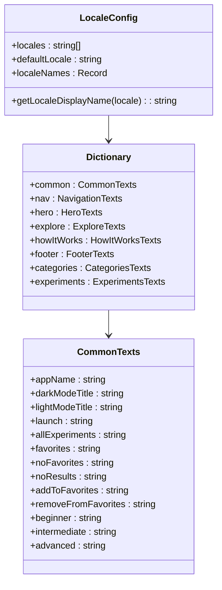
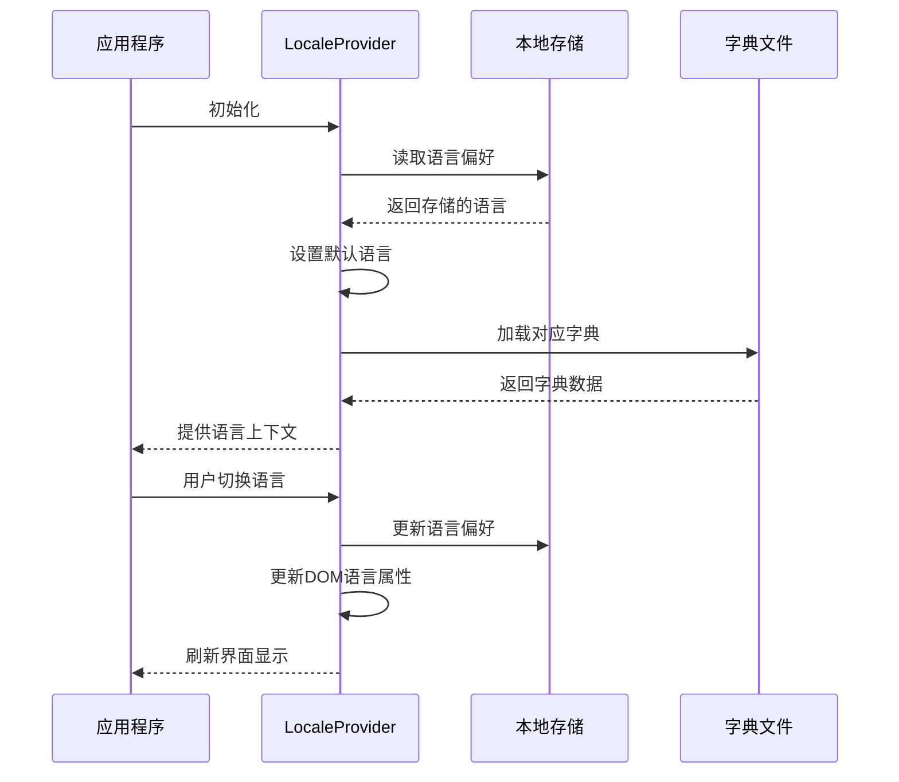
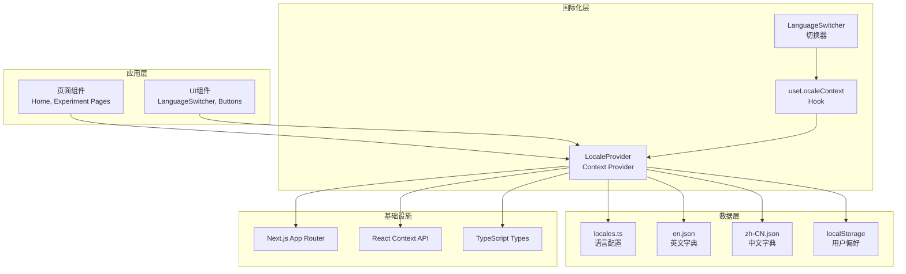
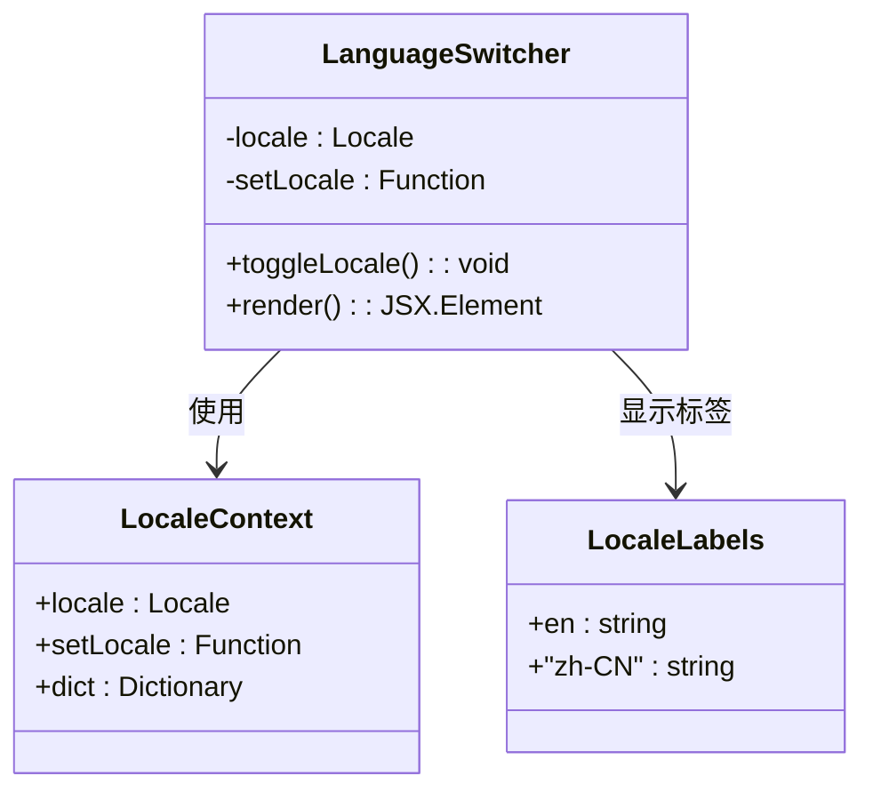
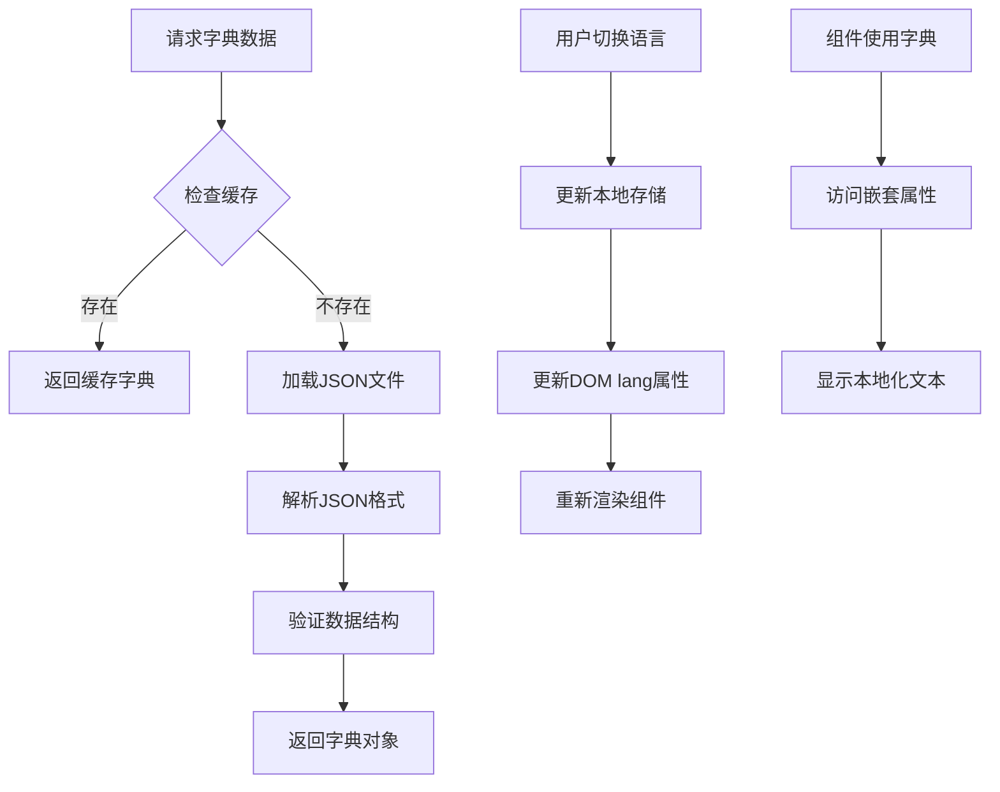
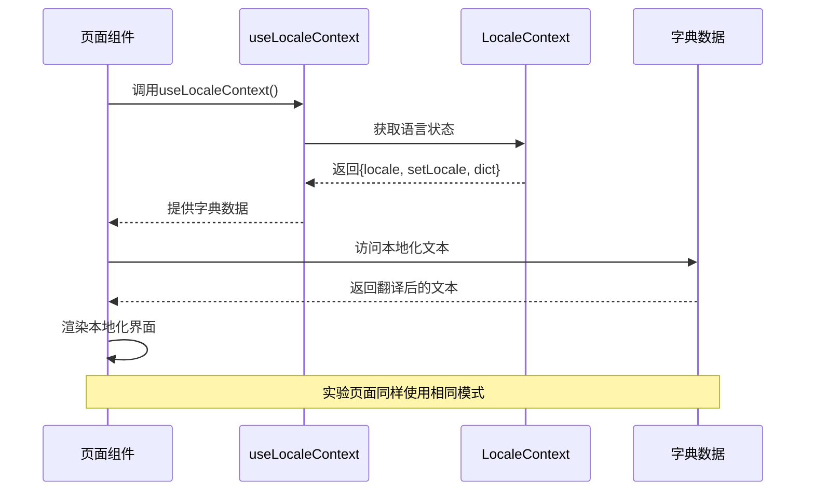
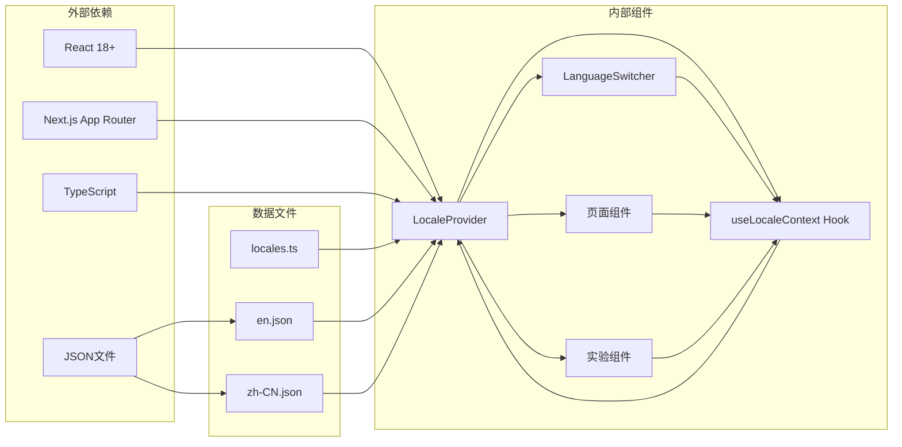

# 国际化系统

<cite>
**本文档引用的文件**
- [locales.ts](file://src/lib/i18n/locales.ts)
- [locale-context.tsx](file://src/lib/i18n/locale-context.tsx)
- [en.json](file://src/lib/i18n/dictionaries/en.json)
- [zh-CN.json](file://src/lib/i18n/dictionaries/zh-CN.json)
- [language-switcher.tsx](file://src/components/ui/language-switcher.tsx)
- [layout.tsx](file://src/app/layout.tsx)
- [page.tsx](file://src/app/page.tsx)
- [experiment/[id]/page.tsx](file://src/app/experiment/[id]/page.tsx)
- [pendulum/details/page.tsx](file://src/app/experiments/pendulum/details/page.tsx)
</cite>

## 目录
1. [简介](#简介)
2. [项目结构](#项目结构)
3. [核心组件](#核心组件)
4. [架构概览](#架构概览)
5. [详细组件分析](#详细组件分析)
6. [依赖关系分析](#依赖关系分析)
7. [性能考虑](#性能考虑)
8. [故障排除指南](#故障排除指南)
9. [结论](#结论)

## 简介

ScienceLab 3D 是一个交互式3D科学教育平台，提供40多个跨学科的科学实验。该平台实现了完整的国际化（i18n）系统，支持英语（en）和中文（zh-CN）两种语言。国际化系统采用React Context模式，结合JSON字典文件，为用户提供无缝的语言切换体验。

该系统的核心目标是：
- 提供多语言支持，覆盖所有用户界面文本
- 支持用户偏好设置的持久化存储
- 实现响应式的语言切换机制
- 确保SEO友好的多语言内容管理

## 项目结构

国际化系统主要位于 `src/lib/i18n/` 目录下，包含以下关键组件：

```mermaid
graph TB
subgraph "国际化系统结构"
A[src/lib/i18n/] --> B[locales.ts<br/>语言配置]
A --> C[locale-context.tsx<br/>上下文提供者]
A --> D[dictionaries/]
D --> E[en.json<br/>英文字典]
D --> F[zh-CN.json<br/>中文字典]
G[src/components/ui/] --> H[language-switcher.tsx<br/>语言切换器]
I[src/app/] --> J[layout.tsx<br/>根布局]
I --> K[page.tsx<br/>主页]
I --> L[experiment/[id]/page.tsx<br/>实验重定向]
end
subgraph "实验页面"
M[experiments/pendulum/details/page.tsx<br/>实验详情页]
end
C --> H
J --> C
K --> C
L --> C
M --> C
```

**图表来源**
- [locales.ts:1-9](file://src/lib/i18n/locales.ts#L1-L9)
- [locale-context.tsx:1-59](file://src/lib/i18n/locale-context.tsx#L1-L59)
- [language-switcher.tsx:1-29](file://src/components/ui/language-switcher.tsx#L1-L29)

**章节来源**
- [locales.ts:1-9](file://src/lib/i18n/locales.ts#L1-L9)
- [locale-context.tsx:1-59](file://src/lib/i18n/locale-context.tsx#L1-L59)
- [language-switcher.tsx:1-29](file://src/components/ui/language-switcher.tsx#L1-L29)

## 核心组件

### 语言配置管理

国际化系统的核心是语言配置模块，定义了支持的语言列表和默认语言设置：



**图表来源**
- [locales.ts:1-9](file://src/lib/i18n/locales.ts#L1-L9)
- [en.json:1-264](file://src/lib/i18n/dictionaries/en.json#L1-L264)

### 本地化上下文提供者

LocaleProvider是国际化系统的核心组件，负责管理语言状态和字典数据：



**图表来源**
- [locale-context.tsx:27-54](file://src/lib/i18n/locale-context.tsx#L27-L54)

**章节来源**
- [locale-context.tsx:1-59](file://src/lib/i18n/locale-context.tsx#L1-L59)

## 架构概览

国际化系统采用分层架构设计，确保了良好的可维护性和扩展性：



**图表来源**
- [layout.tsx:181-206](file://src/app/layout.tsx#L181-L206)
- [language-switcher.tsx:11-28](file://src/components/ui/language-switcher.tsx#L11-L28)

## 详细组件分析

### 语言切换器组件

LanguageSwitcher是一个轻量级的UI组件，提供直观的语言切换功能：



**图表来源**
- [language-switcher.tsx:1-29](file://src/components/ui/language-switcher.tsx#L1-L29)

LanguageSwitcher组件的特点：
- 基于当前语言状态显示相应的标签（EN/中）
- 点击时在支持的语言间切换
- 使用CSS类名实现现代化的玻璃效果
- 支持工具提示文本的国际化

**章节来源**
- [language-switcher.tsx:1-29](file://src/components/ui/language-switcher.tsx#L1-L29)

### 字典管理系统

国际化系统使用JSON文件作为字典存储，提供了结构化的文本组织：



**图表来源**
- [locale-context.tsx:10-13](file://src/lib/i18n/locale-context.tsx#L10-L13)
- [en.json:1-264](file://src/lib/i18n/dictionaries/en.json#L1-L264)

字典文件的结构特点：
- 采用层级组织：common、nav、hero、explore等
- 每个实验都有独立的条目
- 支持嵌套的对象结构
- 包含完整的实验描述和主题标签

**章节来源**
- [en.json:1-264](file://src/lib/i18n/dictionaries/en.json#L1-L264)
- [zh-CN.json:1-264](file://src/lib/i18n/dictionaries/zh-CN.json#L1-L264)

### 页面集成模式

各个页面组件通过useLocaleContext Hook集成国际化功能：



**图表来源**
- [page.tsx:30-335](file://src/app/page.tsx#L30-L335)
- [experiment/[id]/page.tsx](file://src/app/experiment/[id]/page.tsx#L10-L18)

页面集成的关键点：
- 在导航栏、英雄区域、实验卡片等所有文本都使用字典
- 实验详情页面也遵循相同的国际化模式
- 支持动态语言切换而无需刷新页面

**章节来源**
- [page.tsx:30-335](file://src/app/page.tsx#L30-L335)
- [pendulum/details/page.tsx:1-225](file://src/app/experiments/pendulum/details/page.tsx#L1-L225)

## 依赖关系分析

国际化系统与其他组件的依赖关系如下：



**图表来源**
- [layout.tsx:1-207](file://src/app/layout.tsx#L1-L207)
- [locale-context.tsx:1-59](file://src/lib/i18n/locale-context.tsx#L1-L59)

**章节来源**
- [layout.tsx:1-207](file://src/app/layout.tsx#L1-L207)
- [locale-context.tsx:1-59](file://src/lib/i18n/locale-context.tsx#L1-L59)

## 性能考虑

国际化系统在设计时充分考虑了性能优化：

### 内存优化策略
- 字典文件按需加载，避免不必要的内存占用
- 使用React Context避免深层组件树的props传递
- 缓存已加载的字典数据，减少重复解析

### 运行时性能
- 语言切换操作仅影响相关组件，不触发全局重渲染
- 使用useCallback优化回调函数，防止不必要的重渲染
- DOM语言属性更新采用最小化策略

### SEO友好性
- 根布局中设置正确的lang属性
- 支持搜索引擎识别多语言内容
- 保持语义化HTML结构

## 故障排除指南

### 常见问题及解决方案

**问题1：语言切换后文本未更新**
- 检查LocaleProvider是否正确包裹应用
- 验证useLocaleContext Hook的使用位置
- 确认字典文件路径正确

**问题2：新添加的翻译文本未生效**
- 确认在相应语言的JSON文件中添加了新条目
- 检查字典访问路径是否正确
- 验证TypeScript类型定义

**问题3：本地存储的语言偏好丢失**
- 检查浏览器的localStorage权限
- 确认没有清除浏览器数据
- 验证setLocale函数的调用

**问题4：SEO优化问题**
- 确认根布局中的lang属性设置
- 检查Open Graph meta标签
- 验证结构化数据的正确性

**章节来源**
- [locale-context.tsx:30-44](file://src/lib/i18n/locale-context.tsx#L30-L44)
- [layout.tsx:187-188](file://src/app/layout.tsx#L187-L188)

## 结论

ScienceLab 3D的国际化系统展现了现代前端应用的最佳实践。通过精心设计的架构，系统实现了：

1. **模块化设计**：清晰分离语言配置、上下文管理和UI组件
2. **高性能实现**：优化的内存使用和运行时性能
3. **用户体验**：无缝的语言切换和一致的界面表现
4. **可扩展性**：易于添加新语言和新文本内容
5. **SEO友好**：符合搜索引擎优化的最佳实践

该系统为类似教育平台的国际化需求提供了优秀的参考模板，展示了如何在复杂的3D应用中实现高质量的多语言支持。