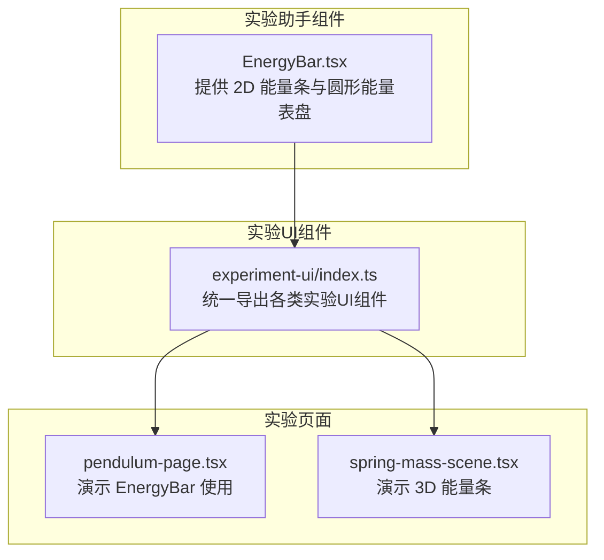
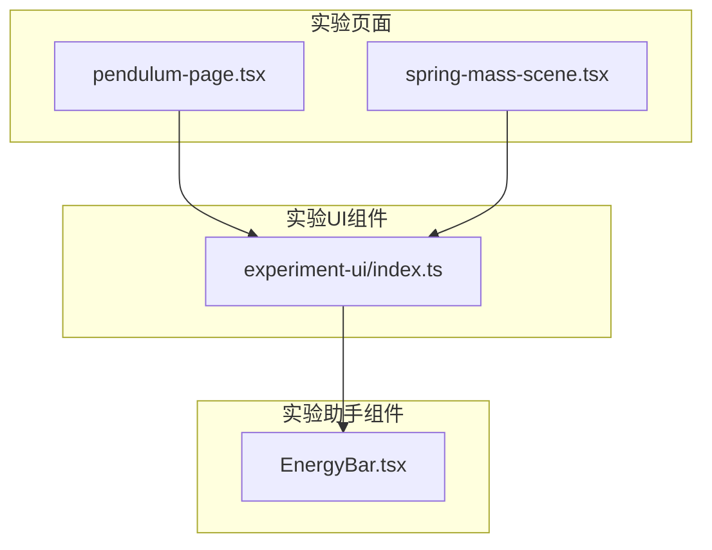
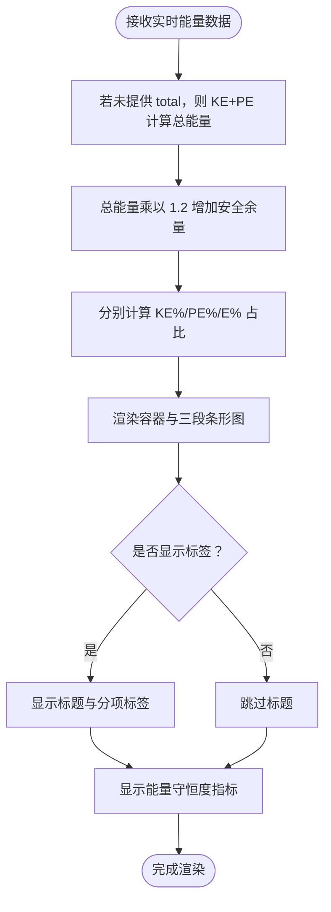
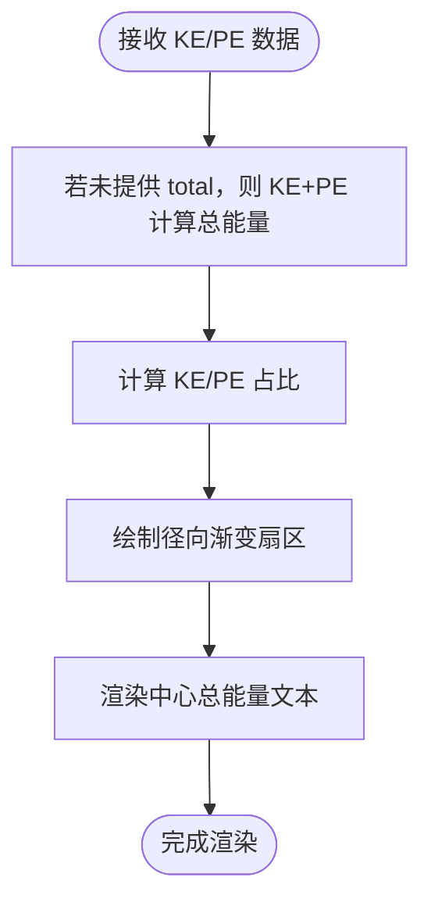
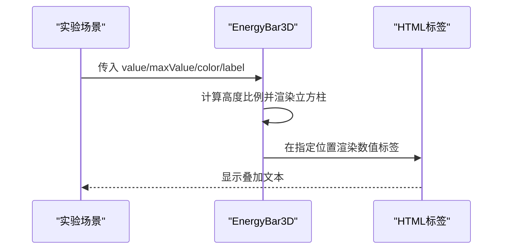
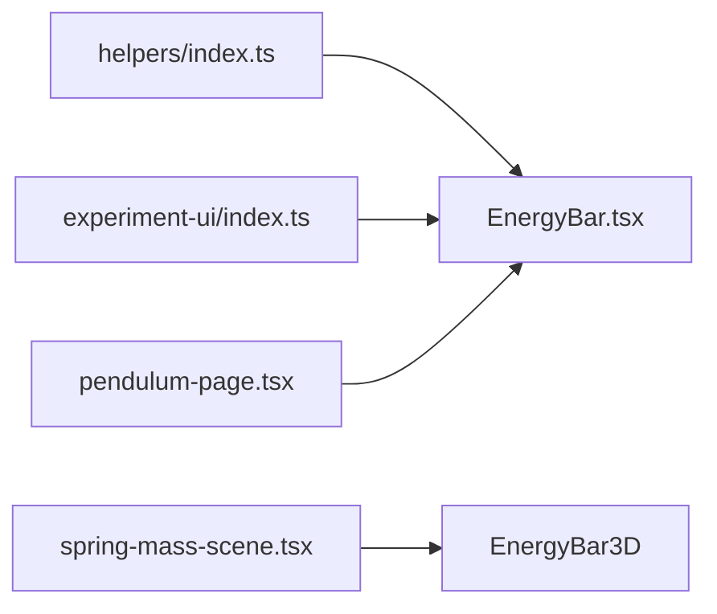

# 实验助手组件

<cite>
**本文引用的文件**
- [src/components/experiment-helpers/EnergyBar.tsx](file://src/components/experiment-helpers/EnergyBar.tsx)
- [src/components/experiment-helpers/index.ts](file://src/components/experiment-helpers/index.ts)
- [src/components/experiment-ui/index.ts](file://src/components/experiment-ui/index.ts)
- [src/experiments/pendulum-page.tsx](file://src/experiments/pendulum-page.tsx)
- [src/experiments/spring-mass-scene.tsx](file://src/experiments/spring-mass-scene.tsx)
- [README.md](file://README.md)
</cite>

## 目录
1. [简介](#简介)
2. [项目结构](#项目结构)
3. [核心组件](#核心组件)
4. [架构总览](#架构总览)
5. [详细组件分析](#详细组件分析)
6. [依赖分析](#依赖分析)
7. [性能考虑](#性能考虑)
8. [故障排查指南](#故障排查指南)
9. [结论](#结论)
10. [附录](#附录)

## 简介
本文件系统性梳理“实验助手组件”，重点围绕能量可视化类组件（如 EnergyBar、EnergyGauge）展开，阐述其设计理念、功能定位、接口与使用方式、配置与样式定制、与实验UI组件的协作关系，以及扩展与自定义开发指南。该组件库服务于 ScienceLab 3D 的交互式科学实验平台，通过直观的可视化帮助学习者理解物理能量守恒等概念。

## 项目结构
实验助手组件位于 components/experiment-helpers 目录，提供可复用的能量可视化能力；实验页面通过 components/experiment-ui 汇总导出统一入口，并在具体实验中按需引入。

**图表来源**
- [src/components/experiment-helpers/EnergyBar.tsx:1-142](file://src/components/experiment-helpers/EnergyBar.tsx#L1-L142)
- [src/components/experiment-helpers/index.ts:1-8](file://src/components/experiment-helpers/index.ts#L1-L8)
- [src/components/experiment-ui/index.ts:1-43](file://src/components/experiment-ui/index.ts#L1-L43)
- [src/experiments/pendulum-page.tsx:1-191](file://src/experiments/pendulum-page.tsx#L1-L191)
- [src/experiments/spring-mass-scene.tsx:595-630](file://src/experiments/spring-mass-scene.tsx#L595-L630)

**章节来源**
- [src/components/experiment-helpers/index.ts:1-8](file://src/components/experiment-helpers/index.ts#L1-L8)
- [src/components/experiment-ui/index.ts:1-43](file://src/components/experiment-ui/index.ts#L1-L43)
- [README.md:1-227](file://README.md#L1-L227)

## 核心组件
- EnergyBar：基于 3D 场景坐标系的 2D 能量条可视化，显示动能、势能与总能量，同时给出能量守恒度指标。
- EnergyGauge：基于 CSS 径向渐变的圆形能量表盘，直观展示动能与势能占比。
- EnergyBar3D（实验场景内部组件）：3D 能量柱体，用于三维场景中的能量数值可视化。

这些组件均以“可复用、低耦合”为目标，既可在 2D UI 中使用，也可嵌入 3D 场景中作为 HUD 或实体部件。

**章节来源**
- [src/components/experiment-helpers/EnergyBar.tsx:6-142](file://src/components/experiment-helpers/EnergyBar.tsx#L6-L142)
- [src/experiments/spring-mass-scene.tsx:131-174](file://src/experiments/spring-mass-scene.tsx#L131-L174)

## 架构总览
实验助手组件与实验页面、实验UI组件的关系如下：

**图表来源**
- [src/experiments/pendulum-page.tsx:1-191](file://src/experiments/pendulum-page.tsx#L1-L191)
- [src/experiments/spring-mass-scene.tsx:595-630](file://src/experiments/spring-mass-scene.tsx#L595-L630)
- [src/components/experiment-ui/index.ts:1-43](file://src/components/experiment-ui/index.ts#L1-L43)
- [src/components/experiment-helpers/EnergyBar.tsx:1-142](file://src/components/experiment-helpers/EnergyBar.tsx#L1-L142)

## 详细组件分析

### EnergyBar 组件
- 设计理念
  - 将抽象的能量值映射为直观的条形图，颜色区分 KE/PE/E，辅以守恒度指标，强化能量守恒概念。
  - 支持标签开关与位置偏移，便于在不同实验布局中灵活放置。
- 接口定义
  - kinetic: number（动能）
  - potential: number（势能）
  - total?: number（总能量，未提供时自动计算为 KE+PE）
  - position?: [number, number, number]（在 3D 场景中的屏幕空间偏移，默认原点）
  - showLabels?: boolean（是否显示标题与分项标签）
- 使用方法
  - 在实验页面中引入 ExperimentContainer 与 EnergyBar，将实时数据传入组件渲染。
  - 可通过 position 调整在 3D 画面中的相对位置，适配不同视角。
- 配置与样式定制
  - 容器背景、边框、圆角、阴影等由 Tailwind 类控制，可按主题色调整。
  - 条形图颜色分别对应 KE（橙）、PE（蓝）、E（绿），支持过渡动画。
  - 守恒度百分比动态计算，反映系统能量误差。
- 与其他UI组件的协作
  - 与 ExperimentContainer、SimulationController、ControlPanel 等组合使用，形成完整的实验界面。
  - 在弹簧振子等多源势能场景中，配合多个 EnergyBar3D 展示不同势能分量。

**图表来源**
- [src/components/experiment-helpers/EnergyBar.tsx:20-96](file://src/components/experiment-helpers/EnergyBar.tsx#L20-L96)

**章节来源**
- [src/components/experiment-helpers/EnergyBar.tsx:6-142](file://src/components/experiment-helpers/EnergyBar.tsx#L6-L142)
- [src/experiments/pendulum-page.tsx:130-150](file://src/experiments/pendulum-page.tsx#L130-L150)

### EnergyGauge 组件
- 设计理念
  - 采用 CSS 径向渐变绘制圆形仪表，直观表达 KE/PE 占比，适合紧凑布局或移动端。
- 接口定义
  - kinetic: number（动能）
  - potential: number（势能）
  - total?: number（总能量，未提供时自动计算为 KE+PE）
  - size?: number（表盘尺寸，默认 80）
- 使用方法
  - 在需要快速概览能量占比的场景中使用，例如小尺寸面板或响应式布局。
- 配置与样式定制
  - 外圈边框与内核背景色可按主题调整，中心文本显示总能量与单位。

**图表来源**
- [src/components/experiment-helpers/EnergyBar.tsx:101-141](file://src/components/experiment-helpers/EnergyBar.tsx#L101-L141)

**章节来源**
- [src/components/experiment-helpers/EnergyBar.tsx:98-142](file://src/components/experiment-helpers/EnergyBar.tsx#L98-L142)

### EnergyBar3D 组件（实验场景内部）
- 设计理念
  - 在 3D 场景中以实体立方柱展示能量值，结合 Html 标签叠加数值，提升沉浸感。
- 接口定义
  - position: [number, number, number]（3D 世界坐标偏移）
  - value: number（当前能量值）
  - maxValue: number（最大能量参考值）
  - color: string（颜色）
  - label: string（标签文本）
- 使用方法
  - 在复杂多源能量场景（如弹簧势能与重力势能并存）中，使用多个 EnergyBar3D 并排展示各分量。

**图表来源**
- [src/experiments/spring-mass-scene.tsx:131-174](file://src/experiments/spring-mass-scene.tsx#L131-L174)

**章节来源**
- [src/experiments/spring-mass-scene.tsx:131-174](file://src/experiments/spring-mass-scene.tsx#L131-L174)
- [src/experiments/spring-mass-scene.tsx:595-630](file://src/experiments/spring-mass-scene.tsx#L595-L630)

## 依赖分析
- 导出与聚合
  - experiment-helpers/index.ts 聚合导出 EnergyBar 与 EnergyGauge，并导出类型定义，便于上层按需引入。
  - experiment-ui/index.ts 同样提供统一导出，其中包含 EnergyBarProps 类型，确保 UI 层与助手层接口一致。
- 使用关系
  - pendulum-page.tsx 在实验容器中直接引入 EnergyBar，并将实时数据传入渲染。
  - spring-mass-scene.tsx 在 3D 场景中使用 EnergyBar3D 展示多源能量分量。

**图表来源**
- [src/components/experiment-helpers/index.ts:1-8](file://src/components/experiment-helpers/index.ts#L1-L8)
- [src/components/experiment-ui/index.ts:1-43](file://src/components/experiment-ui/index.ts#L1-L43)
- [src/experiments/pendulum-page.tsx:1-191](file://src/experiments/pendulum-page.tsx#L1-L191)
- [src/experiments/spring-mass-scene.tsx:595-630](file://src/experiments/spring-mass-scene.tsx#L595-L630)

**章节来源**
- [src/components/experiment-helpers/index.ts:1-8](file://src/components/experiment-helpers/index.ts#L1-L8)
- [src/components/experiment-ui/index.ts:1-43](file://src/components/experiment-ui/index.ts#L1-L43)

## 性能考虑
- 渲染频率与动画
  - EnergyBar 的条形图宽度使用过渡动画，建议在高频更新场景中适当降低动画时长或在数据稳定时禁用过渡，避免过度重绘。
- 最大值策略
  - EnergyBar 默认以 total*1.2 作为最大值，避免条形图在总能量波动时频繁顶格导致视觉抖动；在实验初期可设置一个保守的最大值以稳定显示。
- 3D 条形图
  - EnergyBar3D 仅在必要时更新高度与颜色，避免每帧重建几何体；可通过外部状态节流减少重渲染。
- 样式与层级
  - 使用 backdrop-blur 与半透明背景会增加合成开销，建议在低端设备上关闭模糊或降低透明度。

## 故障排查指南
- 能量守恒度异常
  - 若守恒度长期低于阈值，检查 KE 与 PE 的计算公式与单位一致性，确认 total 是否正确传入。
- 条形图不显示或溢出
  - 检查 maxEnergy 设置是否合理，确保 total 不为 0；必要时显式传入 total 或提高安全余量。
- 3D 能量条不显示
  - 确认 position 参数与相机距离、场景缩放匹配；检查 Html 距离因子与标签可见性。
- 样式错位
  - 检查父容器的定位与 z-index；在实验容器中使用 ExperimentContainer 的布局属性进行微调。

**章节来源**
- [src/components/experiment-helpers/EnergyBar.tsx:86-91](file://src/components/experiment-helpers/EnergyBar.tsx#L86-L91)
- [src/experiments/spring-mass-scene.tsx:171-174](file://src/experiments/spring-mass-scene.tsx#L171-L174)

## 结论
实验助手组件以简洁直观的方式将抽象能量概念具象化，既能满足 2D 界面的快速概览，也能融入 3D 场景增强沉浸体验。通过合理的接口设计与样式定制，开发者可以快速集成到各类实验中，并根据需要扩展为更复杂的能量可视化方案。

## 附录

### 组件接口速查
- EnergyBarProps
  - kinetic: number
  - potential: number
  - total?: number
  - position?: [number, number, number]
  - showLabels?: boolean
- EnergyGaugeProps
  - kinetic: number
  - potential: number
  - total?: number
  - size?: number

**章节来源**
- [src/components/experiment-helpers/EnergyBar.tsx:6-142](file://src/components/experiment-helpers/EnergyBar.tsx#L6-L142)

### 使用示例路径
- 在实验页面中引入并使用 EnergyBar
  - [src/experiments/pendulum-page.tsx:130-150](file://src/experiments/pendulum-page.tsx#L130-L150)
- 在 3D 场景中使用 EnergyBar3D
  - [src/experiments/spring-mass-scene.tsx:595-630](file://src/experiments/spring-mass-scene.tsx#L595-L630)