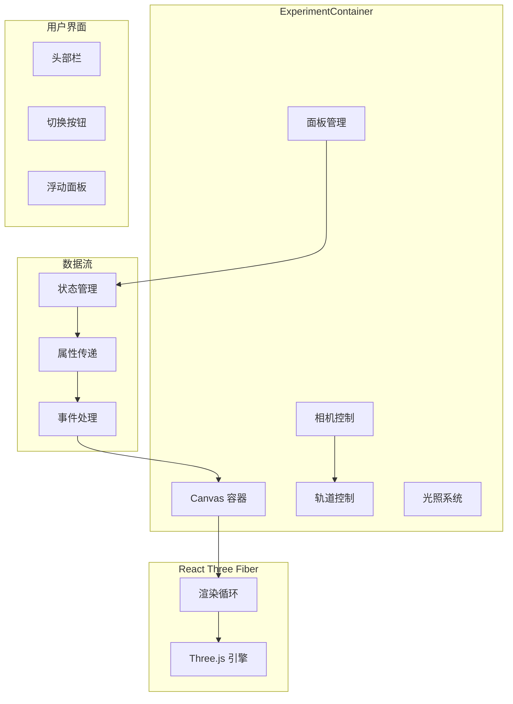
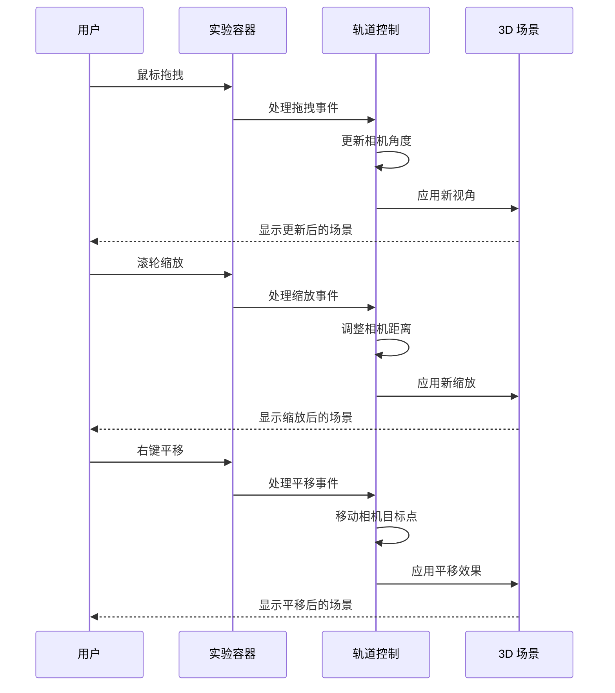
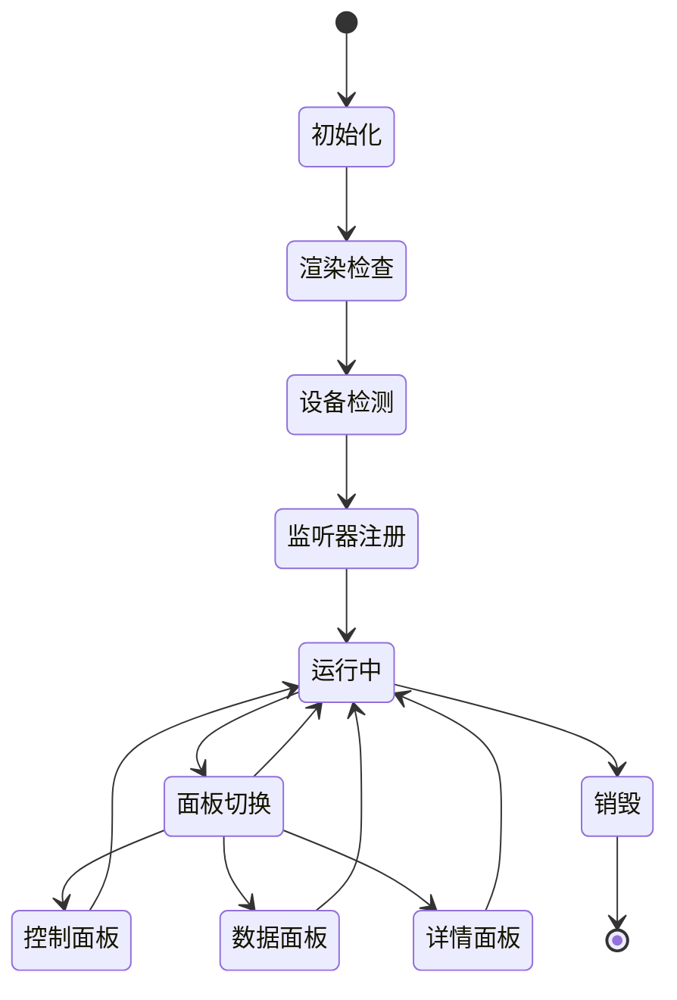

# 实验容器组件

<cite>
**本文档引用的文件**
- [ExperimentContainer.tsx](file://src/components/experiment-ui/ExperimentContainer.tsx)
- [3d-geometry-page.tsx](file://src/experiments/3d-geometry-page.tsx)
- [3d-geometry-scene.tsx](file://src/experiments/3d-geometry-scene.tsx)
- [index.ts](file://src/components/experiment-ui/index.ts)
- [experiments.ts](file://src/data/experiments.ts)
- [package.json](file://package.json)
</cite>

## 目录
1. [简介](#简介)
2. [项目结构](#项目结构)
3. [核心组件](#核心组件)
4. [架构概览](#架构概览)
5. [详细组件分析](#详细组件分析)
6. [依赖关系分析](#依赖关系分析)
7. [性能考虑](#性能考虑)
8. [故障排除指南](#故障排除指南)
9. [结论](#结论)

## 简介

实验容器组件是 Science Lab 3D 项目中的核心渲染容器，专门用于承载和管理各种科学实验的 3D 可视化场景。该组件基于 React Three Fiber 和 Three.js 构建，提供了完整的 3D 场景渲染、相机控制、视图管理和用户交互处理功能。

该组件的主要目标是为不同学科领域的科学实验（物理、化学、生物、数学）提供统一的 3D 可视化平台，支持实时数据展示、参数调节、模拟控制等功能。通过模块化的设计，开发者可以轻松地将新的实验场景集成到现有的容器系统中。

## 项目结构

Science Lab 3D 项目采用清晰的分层架构组织，主要分为以下几个层次：

```mermaid
graph TB
subgraph "应用层"
App[Next.js 应用]
Pages[实验页面]
end
subgraph "组件层"
UI[实验UI组件]
Container[实验容器]
Controls[控制面板]
Panels[数据面板]
end
subgraph "场景层"
Scenes[实验场景]
Geometries[几何体]
Physics[物理引擎]
end
subgraph "数据层"
Experiments[实验数据]
Config[配置信息]
end
subgraph "3D引擎层"
Fiber[@react-three/fiber]
Drei[@react-three/drei]
Three[Three.js]
end
App --> Pages
Pages --> UI
UI --> Container
Container --> Scenes
Scenes --> Three
Three --> Fiber
Fiber --> Drei
Experiments --> Scenes
```

**图表来源**
- [ExperimentContainer.tsx:1-374](file://src/components/experiment-ui/ExperimentContainer.tsx#L1-L374)
- [3d-geometry-page.tsx:1-190](file://src/experiments/3d-geometry-page.tsx#L1-L190)

**章节来源**
- [ExperimentContainer.tsx:1-374](file://src/components/experiment-ui/ExperimentContainer.tsx#L1-L374)
- [package.json:1-37](file://package.json#L1-L37)

## 核心组件

### ExperimentContainer 组件

ExperimentContainer 是整个实验系统的中央控制器，负责管理 3D 渲染环境、用户界面布局和交互逻辑。该组件实现了以下核心功能：

#### 主要特性
- **3D 场景渲染**：基于 React Three Fiber 提供高性能的 WebGL 渲染
- **相机控制系统**：支持轨道旋转、缩放和平移操作
- **响应式布局**：自动适应不同设备和屏幕尺寸
- **多面板管理**：支持控制面板、数据面板和详情面板的动态切换
- **模拟控制**：提供播放/暂停、重置和速度调节功能

#### 关键接口

组件的 props 接口定义了灵活的配置选项：

| 属性名 | 类型 | 默认值 | 描述 |
|--------|------|--------|------|
| children | ReactNode | 必需 | 3D 场景内容 |
| title | string | 必需 | 实验标题 |
| description | string | undefined | 实验描述 |
| controls | ReactNode | undefined | 控制面板内容 |
| dataPanel | ReactNode | undefined | 数据面板内容 |
| details | ReactNode | undefined | 详情面板内容 |
| cameraPosition | [number, number, number] | [10, 7, 10] | 相机初始位置 |
| enableFog | boolean | true | 是否启用迷雾效果 |
| backgroundColor | string | "#0a0a1e" | 背景色渐变 |
| simulationBar | SimulationBarProps | undefined | 模拟控制条 |

**章节来源**
- [ExperimentContainer.tsx:42-53](file://src/components/experiment-ui/ExperimentContainer.tsx#L42-L53)

## 架构概览

实验容器组件采用了模块化的架构设计，将不同的功能职责分离到独立的组件中：



**图表来源**
- [ExperimentContainer.tsx:137-371](file://src/components/experiment-ui/ExperimentContainer.tsx#L137-L371)

## 详细组件分析

### 3D 渲染系统

实验容器使用 React Three Fiber 作为 3D 渲染引擎，提供了高性能的 WebGL 渲染能力：

#### 相机系统
- **透视相机**：支持可调的视野角度和远近裁剪面
- **默认相机**：设置为场景的默认相机
- **相机位置**：可通过 props 配置初始位置

#### 光照系统
- **环境光**：提供基础的全局照明
- **方向光**：模拟太阳光的主光源
- **半球光**：提供天空和地面的自然光照
- **点光源**：添加局部高光效果

#### 后处理效果
- **阴影映射**：高质量的实时光影
- **抗锯齿**：提升渲染质量
- **色彩空间**：使用 SRGB 颜色空间

**章节来源**
- [ExperimentContainer.tsx:139-207](file://src/components/experiment-ui/ExperimentContainer.tsx#L139-L207)

### 相机控制与交互

组件集成了 OrbitControls 提供直观的 3D 场景操控：



**图表来源**
- [ExperimentContainer.tsx:163-180](file://src/components/experiment-ui/ExperimentContainer.tsx#L163-L180)

### 视图管理系统

实验容器实现了灵活的视图管理机制，支持多种面板的动态显示：

#### 面板类型
- **控制面板**：参数调节和场景设置
- **数据面板**：实时数据显示和统计信息
- **详情面板**：实验说明和背景知识

#### 响应式设计
- **移动优先**：针对小屏幕设备优化
- **自适应布局**：根据屏幕尺寸调整面板位置
- **触摸支持**：完整的移动端手势支持

**章节来源**
- [ExperimentContainer.tsx:268-319](file://src/components/experiment-ui/ExperimentContainer.tsx#L268-L319)

### 状态管理与生命周期

组件使用 React 的现代状态管理 API 来处理复杂的交互逻辑：



**图表来源**
- [ExperimentContainer.tsx:78-133](file://src/components/experiment-ui/ExperimentContainer.tsx#L78-L133)

**章节来源**
- [ExperimentContainer.tsx:78-133](file://src/components/experiment-ui/ExperimentContainer.tsx#L78-L133)

## 依赖关系分析

实验容器组件依赖于多个第三方库来实现其功能：

```mermaid
graph LR
subgraph "核心依赖"
Fiber[@react-three/fiber]
Drei[@react-three/drei]
Three[three.js]
end
subgraph "UI框架"
React[react]
Next[next]
Tailwind[tailwindcss]
end
subgraph "工具库"
Lucide[lucide-react]
Framer[framer-motion]
Leva[leva]
end
subgraph "实验容器"
Container[ExperimentContainer]
end
Container --> Fiber
Container --> Drei
Container --> Three
Container --> React
Container --> Next
Container --> Lucide
Container --> Framer
Container --> Leva
```

**图表来源**
- [package.json:10-21](file://package.json#L10-L21)

### 关键依赖说明

| 依赖包 | 版本 | 用途 |
|--------|------|------|
| @react-three/fiber | ^9.1.0 | 3D 渲染引擎 |
| @react-three/drei | ^10.0.0 | 3D 工具和辅助组件 |
| three | ^0.184.0 | 3D 图形库 |
| lucide-react | ^1.18.0 | 图标组件 |
| framer-motion | ^12.40.0 | 动画系统 |
| next | ^15.4.4 | React 框架 |

**章节来源**
- [package.json:10-21](file://package.json#L10-L21)

## 性能考虑

为了确保在各种设备上都能提供流畅的用户体验，实验容器组件采用了多项性能优化策略：

### 渲染优化
- **设备像素比限制**：移动端限制为 0.75，桌面端最高 1.5
- **抗锯齿控制**：移动端禁用抗锯齿以提升性能
- **着色器优化**：使用高效的着色器和材质
- **阴影优化**：合理配置阴影贴图大小和质量

### 内存管理
- **资源清理**：组件卸载时自动清理 WebGL 资源
- **事件监听器**：正确的事件监听器注册和清理
- **定时器管理**：避免内存泄漏的定时器清理

### 响应式优化
- **自适应分辨率**：根据设备性能调整渲染质量
- **帧率控制**：使用 dampingFactor 优化相机响应
- **懒加载**：按需加载大型场景资源

## 故障排除指南

### 常见问题及解决方案

#### 1. 3D 场景不显示
**症状**：页面空白或只显示背景色
**原因**：
- 浏览器不支持 WebGL
- 3D 场景组件未正确渲染
- 渲染尺寸为 0

**解决方案**：
- 检查浏览器 WebGL 支持
- 验证 children 属性是否正确传递
- 确保容器有有效的宽高

#### 2. 相机控制无响应
**症状**：鼠标拖拽无效
**原因**：
- 事件冒泡冲突
- 容器样式影响交互
- Touch 行为被禁用

**解决方案**：
- 检查容器的 pointer-events 样式
- 确认 touchAction 设置为 none
- 验证事件监听器注册

#### 3. 移动端性能问题
**症状**：动画卡顿或帧率低
**原因**：
- 设备像素比过高
- 抗锯齿开启
- 光影效果复杂

**解决方案**：
- 在移动端禁用抗锯齿
- 降低阴影质量
- 简化场景复杂度

**章节来源**
- [ExperimentContainer.tsx:117-133](file://src/components/experiment-ui/ExperimentContainer.tsx#L117-L133)

## 结论

实验容器组件为 Science Lab 3D 项目提供了一个强大而灵活的 3D 可视化平台。通过精心设计的架构和多项性能优化策略，该组件能够支持各种科学实验的复杂可视化需求。

### 主要优势
- **模块化设计**：清晰的功能分离便于维护和扩展
- **性能优化**：针对不同设备进行专门优化
- **用户体验**：直观的交互设计和响应式布局
- **可扩展性**：易于集成新的实验场景和功能

### 发展建议
- **虚拟化支持**：考虑添加 WebXR 支持
- **离线缓存**：实现场景资源的智能缓存
- **多语言支持**：扩展国际化功能
- **无障碍访问**：增强辅助技术支持

该组件为科学教育提供了优秀的数字化工具，能够帮助学生更好地理解复杂的科学概念。