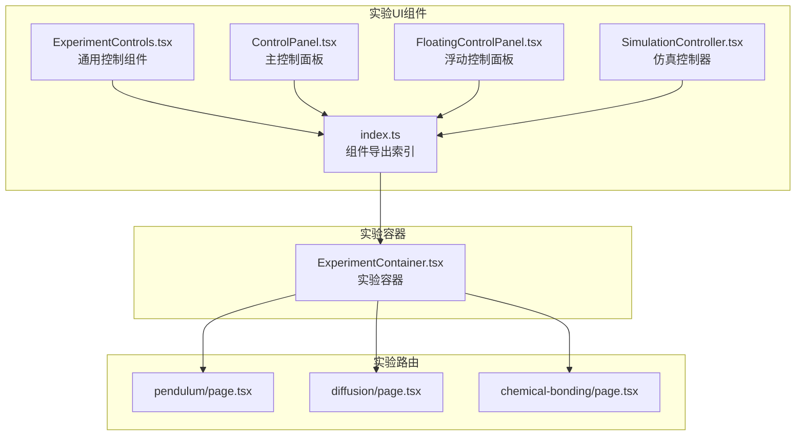
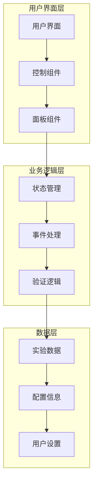
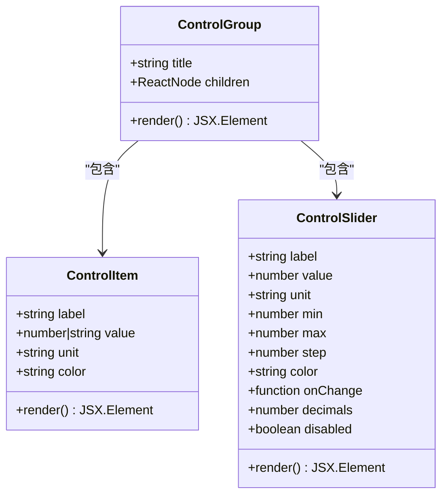
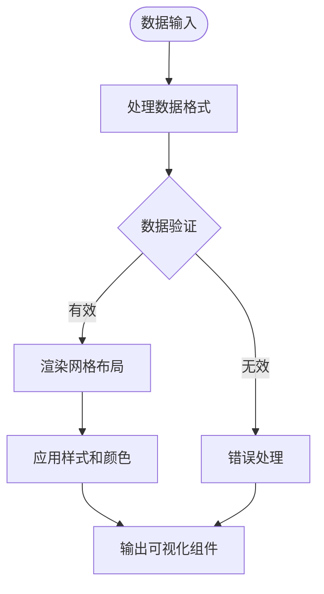
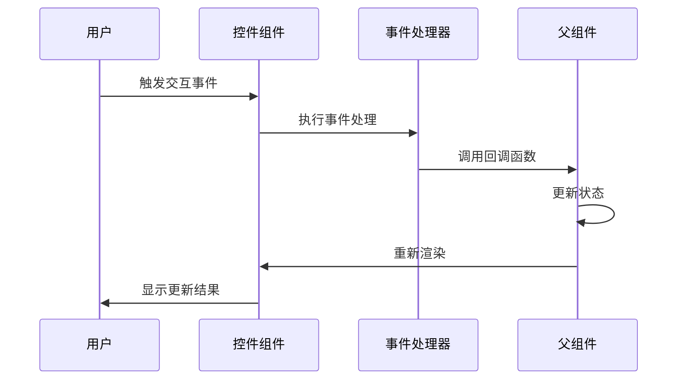
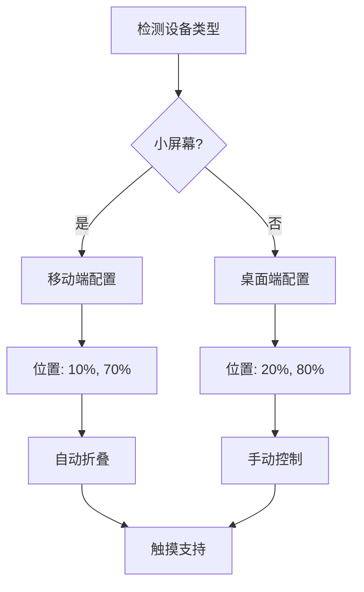
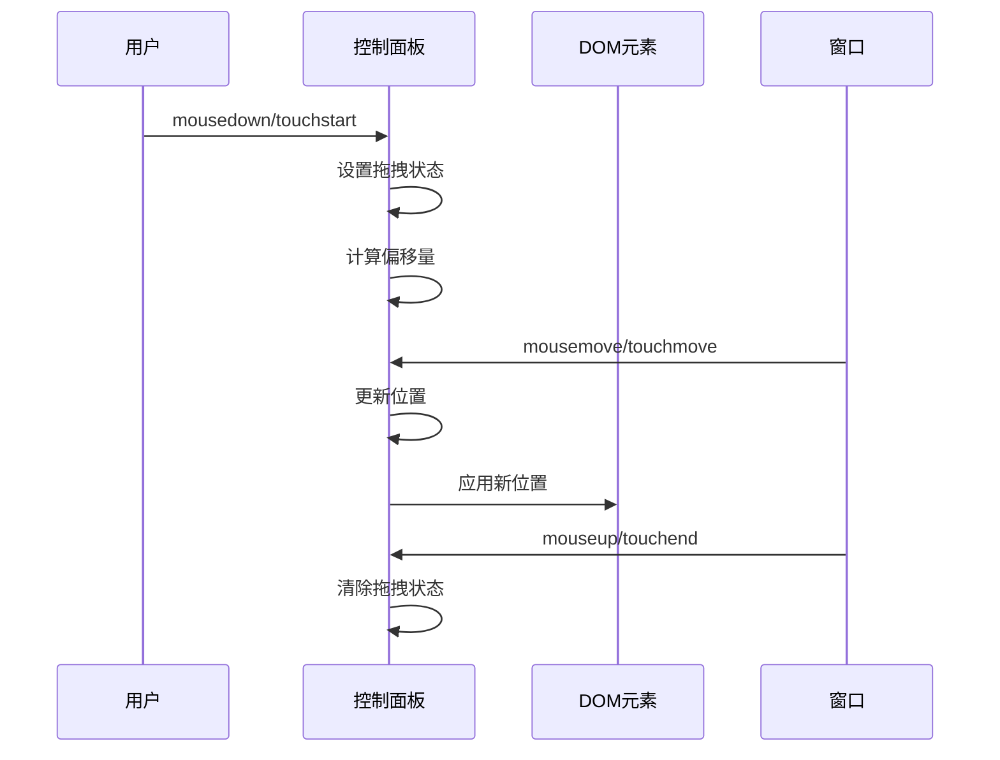
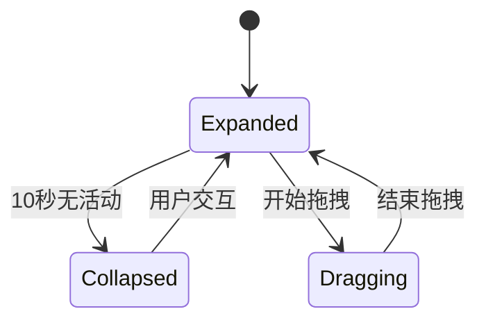
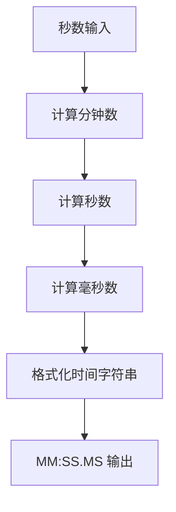
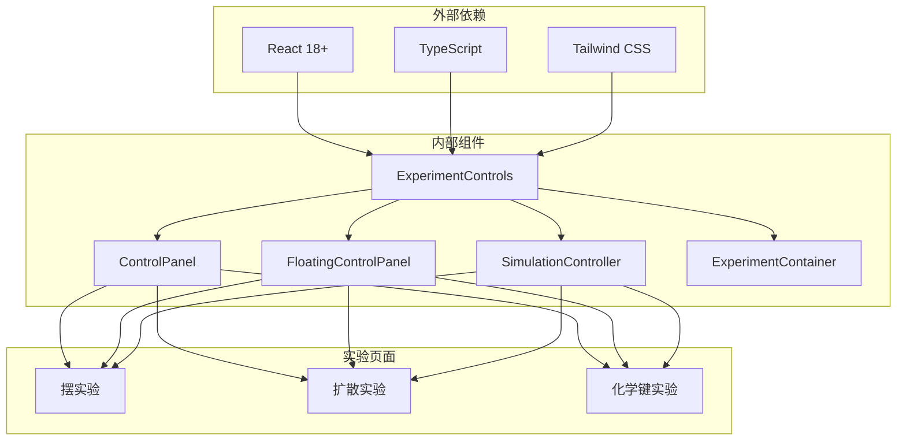

# 实验控制组件

<cite>
**本文档引用的文件**
- [ExperimentControls.tsx](file://src/components/experiment-ui/ExperimentControls.tsx)
- [ControlPanel.tsx](file://src/components/experiment-ui/ControlPanel.tsx)
- [FloatingControlPanel.tsx](file://src/components/experiment-ui/FloatingControlPanel.tsx)
- [SimulationController.tsx](file://src/components/experiment-ui/SimulationController.tsx)
- [index.ts](file://src/components/experiment-ui/index.ts)
- [ExperimentContainer.tsx](file://src/components/experiment-ui/ExperimentContainer.tsx)
- [pendulum/page.tsx](file://src/app/experiments/pendulum/page.tsx)
- [diffusion/page.tsx](file://src/app/experiments/diffusion/page.tsx)
- [chemical-bonding/page.tsx](file://src/app/experiments/chemical-bonding/page.tsx)
</cite>

## 目录
1. [简介](#简介)
2. [项目结构](#项目结构)
3. [核心组件](#核心组件)
4. [架构概览](#架构概览)
5. [详细组件分析](#详细组件分析)
6. [依赖关系分析](#依赖关系分析)
7. [性能考虑](#性能考虑)
8. [故障排除指南](#故障排除指南)
9. [结论](#结论)

## 简介

实验控制组件是 ScienceLab3D 项目中用于管理科学实验交互的核心 UI 组件集合。该组件系统提供了完整的实验控制界面，包括参数调节、实时预览和状态同步功能。组件设计遵循现代化的 React 架构模式，采用 TypeScript 类型安全和 Tailwind CSS 样式系统。

本组件系统主要服务于 3D 科学实验室应用，为用户提供直观的实验控制界面，支持多种实验场景如物理、化学、生物等学科的交互式学习体验。

## 项目结构

实验控制组件位于 `src/components/experiment-ui/` 目录下，包含以下核心文件：

**图表来源**
- [ExperimentControls.tsx:1-498](file://src/components/experiment-ui/ExperimentControls.tsx#L1-L498)
- [ControlPanel.tsx:1-300](file://src/components/experiment-ui/ControlPanel.tsx#L1-L300)
- [FloatingControlPanel.tsx:1-195](file://src/components/experiment-ui/FloatingControlPanel.tsx#L1-L195)
- [SimulationController.tsx:1-228](file://src/components/experiment-ui/SimulationController.tsx#L1-L228)
- [index.ts:1-43](file://src/components/experiment-ui/index.ts#L1-L43)

**章节来源**
- [ExperimentControls.tsx:1-498](file://src/components/experiment-ui/ExperimentControls.tsx#L1-L498)
- [index.ts:1-43](file://src/components/experiment-ui/index.ts#L1-L43)

## 核心组件

实验控制组件系统包含多个专门设计的组件，每个组件都有特定的功能和使用场景：

### 通用控制组件
- **ControlGroup**: 控制组容器，用于组织相关的控制项
- **ControlItem**: 单独的数据显示项
- **ControlSlider**: 滑块控件，用于数值调节
- **DataGrid**: 数据网格显示
- **EnergyBar**: 能量条可视化
- **ControlDropdown**: 下拉选择框
- **ControlButton**: 按钮控件
- **ControlCheckbox**: 复选框
- **ControlPresetButtons**: 预设按钮组
- **ControlProgressBar**: 进度条

### 面板组件
- **ControlPanel**: 主控制面板，支持拖拽和折叠
- **FloatingControlPanel**: 浮动控制面板
- **SimulationController**: 仿真控制器

这些组件共同构成了一个完整的实验控制系统，提供了从基础数据展示到复杂交互控制的全方位功能。

**章节来源**
- [ExperimentControls.tsx:13-497](file://src/components/experiment-ui/ExperimentControls.tsx#L13-L497)
- [ControlPanel.tsx:29-296](file://src/components/experiment-ui/ControlPanel.tsx#L29-L296)

## 架构概览

实验控制组件系统采用分层架构设计，确保了良好的可维护性和扩展性：

**图表来源**
- [ExperimentControls.tsx:1-498](file://src/components/experiment-ui/ExperimentControls.tsx#L1-L498)
- [ControlPanel.tsx:1-300](file://src/components/experiment-ui/ControlPanel.tsx#L1-L300)

该架构确保了组件间的松耦合，使得每个组件可以独立开发、测试和维护。

## 详细组件分析

### ExperimentControls 组件系统

ExperimentControls.tsx 文件包含了所有通用控制组件的实现，采用模块化设计：

#### 控制组组件
ControlGroup 组件提供了一个标准化的容器，用于组织相关的控制项：

**图表来源**
- [ExperimentControls.tsx:13-89](file://src/components/experiment-ui/ExperimentControls.tsx#L13-L89)

#### 数据可视化组件
DataGrid 和 EnergyBar 组件提供了丰富的数据展示功能：

**图表来源**
- [ExperimentControls.tsx:99-127](file://src/components/experiment-ui/ExperimentControls.tsx#L99-L127)
- [ExperimentControls.tsx:139-182](file://src/components/experiment-ui/ExperimentControls.tsx#L139-L182)

#### 交互式控件组件
ControlDropdown、ControlButton、ControlCheckbox 等组件提供了丰富的用户交互功能：

**图表来源**
- [ExperimentControls.tsx:208-265](file://src/components/experiment-ui/ExperimentControls.tsx#L208-L265)
- [ExperimentControls.tsx:311-345](file://src/components/experiment-ui/ExperimentControls.tsx#L311-L345)

**章节来源**
- [ExperimentControls.tsx:1-498](file://src/components/experiment-ui/ExperimentControls.tsx#L1-L498)

### ControlPanel 主控制面板

ControlPanel 是实验控制系统的中央枢纽，提供了播放/暂停、重置和速度控制功能：

#### 响应式设计特性
ControlPanel 采用了先进的响应式设计，支持桌面和移动设备：

**图表来源**
- [ControlPanel.tsx:48-72](file://src/components/experiment-ui/ControlPanel.tsx#L48-L72)

#### 拖拽功能实现
ControlPanel 支持鼠标和触摸拖拽操作：

**图表来源**
- [ControlPanel.tsx:114-182](file://src/components/experiment-ui/ControlPanel.tsx#L114-L182)

**章节来源**
- [ControlPanel.tsx:1-300](file://src/components/experiment-ui/ControlPanel.tsx#L1-L300)

### FloatingControlPanel 浮动控制面板

FloatingControlPanel 提供了更加灵活的控制方式，适合参数调节场景：

#### 自动折叠机制
FloatingControlPanel 具备智能的自动折叠功能：

**图表来源**
- [FloatingControlPanel.tsx:75-94](file://src/components/experiment-ui/FloatingControlPanel.tsx#L75-L94)

**章节来源**
- [FloatingControlPanel.tsx:1-195](file://src/components/experiment-ui/FloatingControlPanel.tsx#L1-L195)

### SimulationController 仿真控制器

SimulationController 是一个紧凑型的控制组件，始终可见且功能完整：

#### 时间显示格式化
SimulationController 提供了精确的时间显示功能：

**图表来源**
- [SimulationController.tsx:68-73](file://src/components/experiment-ui/SimulationController.tsx#L68-L73)

**章节来源**
- [SimulationController.tsx:1-228](file://src/components/experiment-ui/SimulationController.tsx#L1-L228)

## 依赖关系分析

实验控制组件系统具有清晰的依赖关系结构：

**图表来源**
- [index.ts:16-42](file://src/components/experiment-ui/index.ts#L16-L42)
- [ExperimentContainer.tsx:55-90](file://src/components/experiment-ui/ExperimentContainer.tsx#L55-L90)

**章节来源**
- [index.ts:1-43](file://src/components/experiment-ui/index.ts#L1-L43)

## 性能考虑

实验控制组件系统在设计时充分考虑了性能优化：

### 内存管理
- 使用 React.memo 优化组件重渲染
- 合理的 useState 和 useEffect 使用避免内存泄漏
- 及时清理事件监听器和定时器

### 渲染优化
- 使用 useCallback 缓存回调函数
- 条件渲染减少不必要的 DOM 更新
- 虚拟滚动用于大量数据展示

### 移动端优化
- 触摸友好的交互设计
- 减少重绘和回流的操作
- 适当的防抖和节流机制

## 故障排除指南

### 常见问题及解决方案

#### 组件不显示或显示异常
1. **检查依赖安装**: 确保所有必需的依赖包已正确安装
2. **验证导入路径**: 确认组件导入路径正确
3. **检查样式冲突**: 验证 Tailwind CSS 配置是否正确

#### 交互功能失效
1. **事件绑定检查**: 确认事件处理器正确绑定
2. **状态更新验证**: 检查状态更新逻辑
3. **浏览器兼容性**: 验证目标浏览器支持情况

#### 性能问题
1. **组件重渲染分析**: 使用 React DevTools 分析重渲染
2. **内存泄漏排查**: 检查定时器和事件监听器清理
3. **优化渲染策略**: 实施必要的性能优化措施

**章节来源**
- [ExperimentControls.tsx:1-498](file://src/components/experiment-ui/ExperimentControls.tsx#L1-L498)
- [ControlPanel.tsx:1-300](file://src/components/experiment-ui/ControlPanel.tsx#L1-L300)

## 结论

实验控制组件系统为 ScienceLab3D 项目提供了强大而灵活的实验控制能力。通过模块化的组件设计、响应式的用户界面和完善的交互功能，该系统能够满足各种科学实验的教学和研究需求。

组件系统的主要优势包括：

1. **高度模块化**: 每个组件都有明确的职责和接口
2. **响应式设计**: 适配各种设备和屏幕尺寸
3. **类型安全**: 完整的 TypeScript 支持
4. **易于扩展**: 良好的架构设计便于功能扩展
5. **性能优化**: 采用现代前端技术确保流畅体验

该组件系统为未来的功能扩展和技术升级奠定了坚实的基础，能够持续支持 ScienceLab3D 项目的长期发展需求。