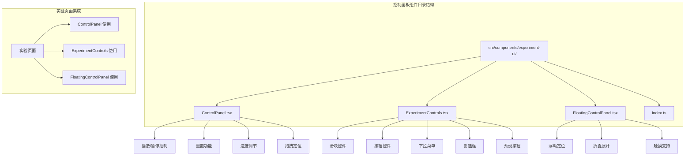
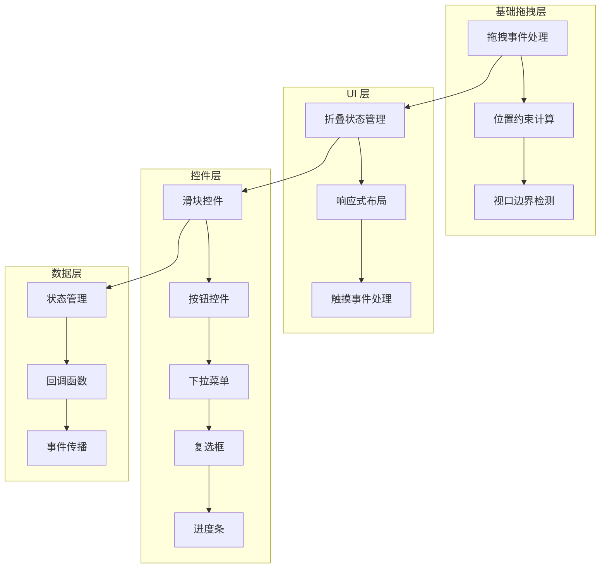
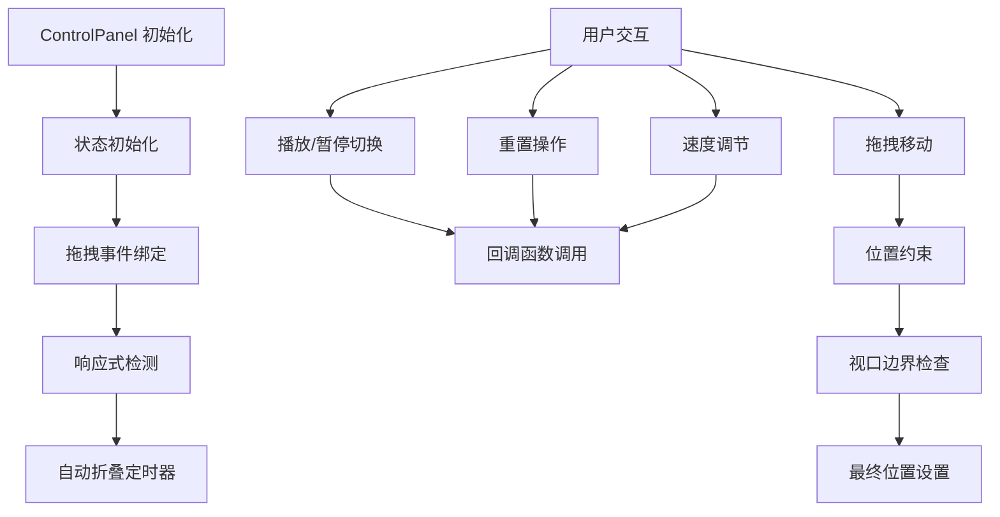
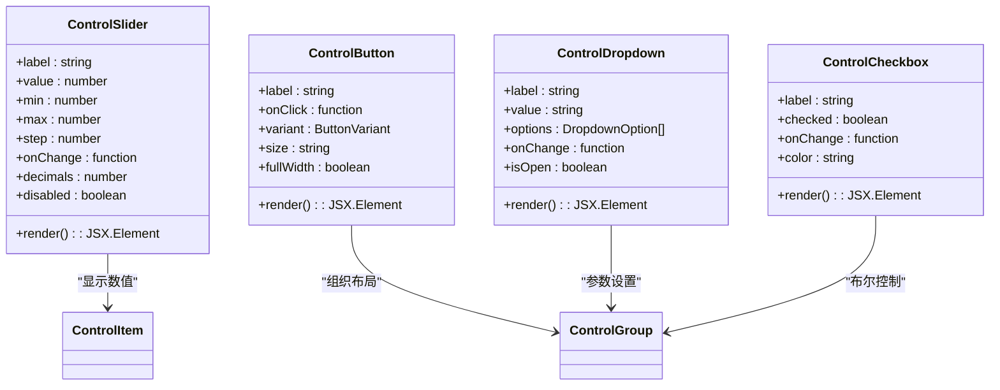
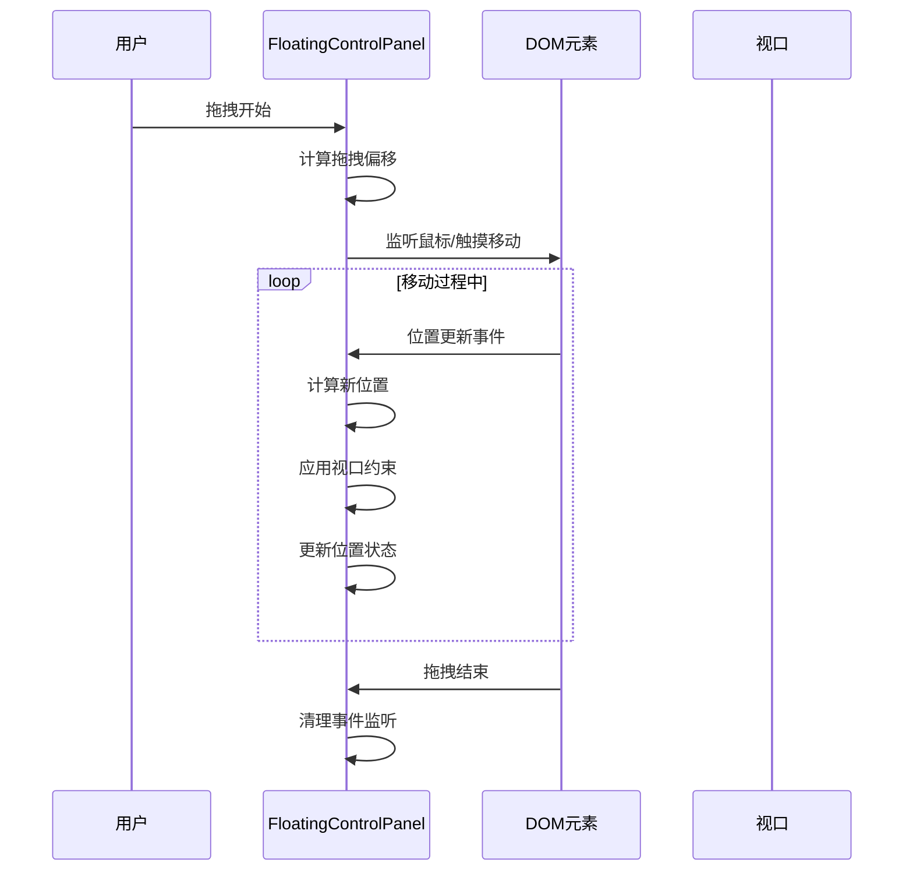
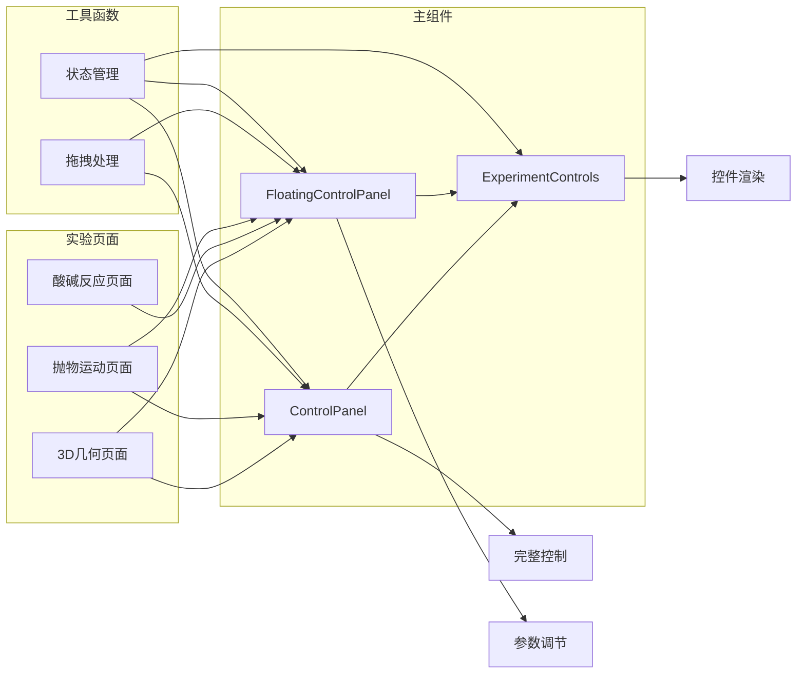

# 控制面板组件

<cite>
**本文档引用的文件**
- [ControlPanel.tsx](file://src/components/experiment-ui/ControlPanel.tsx)
- [ExperimentControls.tsx](file://src/components/experiment-ui/ExperimentControls.tsx)
- [FloatingControlPanel.tsx](file://src/components/experiment-ui/FloatingControlPanel.tsx)
- [index.ts](file://src/components/experiment-ui/index.ts)
- [3d-geometry-page.tsx](file://src/experiments/3d-geometry-page.tsx)
- [acid-base-reactions-page.tsx](file://src/experiments/acid-base-reactions-page.tsx)
- [projectile-motion-page.tsx](file://src/experiments/projectile-motion-page.tsx)
</cite>

## 目录
1. [简介](#简介)
2. [项目结构](#项目结构)
3. [核心组件](#核心组件)
4. [架构概览](#架构概览)
5. [详细组件分析](#详细组件分析)
6. [依赖关系分析](#依赖关系分析)
7. [性能考虑](#性能考虑)
8. [故障排除指南](#故障排除指南)
9. [结论](#结论)

## 简介

控制面板组件系列是 ScienceLab3D 项目中的核心交互组件，为科学实验模拟提供直观的参数调节界面。该系列包含三个主要组件：ControlPanel、ExperimentControls 和 FloatingControlPanel，每个组件都有其特定的设计目标和使用场景。

这些组件采用现代化的 React 设计模式，支持响应式布局、触摸友好的交互体验，并提供了丰富的可定制选项。所有组件都经过性能优化，确保在复杂的科学模拟环境中保持流畅的用户体验。

## 项目结构

控制面板组件位于 `src/components/experiment-ui/` 目录下，采用模块化设计，便于单独使用和组合应用。

**图表来源**
- [ControlPanel.tsx:1-300](file://src/components/experiment-ui/ControlPanel.tsx#L1-L300)
- [ExperimentControls.tsx:1-498](file://src/components/experiment-ui/ExperimentControls.tsx#L1-L498)
- [FloatingControlPanel.tsx:1-195](file://src/components/experiment-ui/FloatingControlPanel.tsx#L1-L195)

**章节来源**
- [index.ts:1-43](file://src/components/experiment-ui/index.ts#L1-L43)

## 核心组件

控制面板组件系列包含三个主要组件，每个都有独特的功能特性和适用场景：

### ControlPanel 组件
- **功能特性**：完整的实验控制面板，包含播放/暂停、重置、速度调节等核心功能
- **设计特点**：支持拖拽定位、自动折叠、响应式布局
- **适用场景**：需要完整控制功能的实验界面

### ExperimentControls 组件集
- **功能特性**：提供多种控件类型（滑块、按钮、下拉菜单、复选框等）
- **设计特点**：高度可定制的控件库，支持颜色主题和尺寸调整
- **适用场景**：参数调节和数据展示的实验界面

### FloatingControlPanel 组件
- **功能特性**：轻量级浮动控制面板，专注于参数调节
- **设计特点**：简洁的界面设计，支持拖拽和折叠
- **适用场景**：需要灵活定位的参数控制界面

**章节来源**
- [ControlPanel.tsx:5-41](file://src/components/experiment-ui/ControlPanel.tsx#L5-L41)
- [ExperimentControls.tsx:5-498](file://src/components/experiment-ui/ExperimentControls.tsx#L5-L498)
- [FloatingControlPanel.tsx:5-26](file://src/components/experiment-ui/FloatingControlPanel.tsx#L5-L26)

## 架构概览

控制面板组件采用分层架构设计，从基础的拖拽功能到高级的控件系统，形成了完整的组件生态系统。

**图表来源**
- [ControlPanel.tsx:113-182](file://src/components/experiment-ui/ControlPanel.tsx#L113-L182)
- [ExperimentControls.tsx:66-88](file://src/components/experiment-ui/ExperimentControls.tsx#L66-L88)
- [FloatingControlPanel.tsx:81-150](file://src/components/experiment-ui/FloatingControlPanel.tsx#L81-L150)

## 详细组件分析

### ControlPanel 组件分析

ControlPanel 是最完整的控制面板组件，提供了实验模拟的核心控制功能。

#### 核心功能特性

**图表来源**
- [ControlPanel.tsx:42-111](file://src/components/experiment-ui/ControlPanel.tsx#L42-L111)
- [ControlPanel.tsx:113-182](file://src/components/experiment-ui/ControlPanel.tsx#L113-L182)

#### 布局设计

ControlPanel 采用现代化的玻璃拟态设计，具有以下特点：

- **背景效果**：使用 `backdrop-blur-xl` 实现模糊背景
- **边框设计**：半透明紫色边框增强层次感
- **阴影效果**：深色阴影营造立体感
- **响应式宽度**：移动端自动适应屏幕宽度

#### 参数调节机制

组件支持三种主要的参数调节方式：

1. **播放/暂停控制**：通过状态切换控制实验运行
2. **重置功能**：恢复默认参数和状态
3. **速度控制**：范围从 0.1x 到 3x 的精确控制

**章节来源**
- [ControlPanel.tsx:29-111](file://src/components/experiment-ui/ControlPanel.tsx#L29-L111)

### ExperimentControls 组件集分析

ExperimentControls 提供了丰富的控件类型，满足各种实验参数调节需求。

#### 控件类型详解

**图表来源**
- [ExperimentControls.tsx:66-88](file://src/components/experiment-ui/ExperimentControls.tsx#L66-L88)
- [ExperimentControls.tsx:311-345](file://src/components/experiment-ui/ExperimentControls.tsx#L311-L345)
- [ExperimentControls.tsx:208-265](file://src/components/experiment-ui/ExperimentControls.tsx#L208-L265)
- [ExperimentControls.tsx:359-394](file://src/components/experiment-ui/ExperimentControls.tsx#L359-L394)

#### 控件样式定制

每个控件都支持丰富的样式定制选项：

- **颜色系统**：支持自定义颜色主题
- **尺寸变体**：提供多种尺寸选择
- **状态样式**：根据启用/禁用状态自动调整外观
- **过渡动画**：平滑的状态变化效果

**章节来源**
- [ExperimentControls.tsx:66-498](file://src/components/experiment-ui/ExperimentControls.tsx#L66-L498)

### FloatingControlPanel 组件分析

FloatingControlPanel 是专为参数调节设计的轻量级控制面板。

#### 定位算法

**图表来源**
- [FloatingControlPanel.tsx:81-150](file://src/components/experiment-ui/FloatingControlPanel.tsx#L81-L150)

#### 响应式行为

FloatingControlPanel 具备智能的响应式行为：

- **自动检测设备类型**：根据屏幕宽度判断是否为移动设备
- **动态位置调整**：移动端和桌面端使用不同的初始位置
- **自动折叠机制**：移动端在无活动时自动折叠以节省空间
- **触摸优化**：针对触摸设备进行专门的交互优化

**章节来源**
- [FloatingControlPanel.tsx:21-79](file://src/components/experiment-ui/FloatingControlPanel.tsx#L21-L79)

## 依赖关系分析

控制面板组件之间存在清晰的依赖关系和协作模式。

**图表来源**
- [3d-geometry-page.tsx:6-10](file://src/experiments/3d-geometry-page.tsx#L6-L10)
- [acid-base-reactions-page.tsx:7-11](file://src/experiments/acid-base-reactions-page.tsx#L7-L11)
- [projectile-motion-page.tsx:5-6](file://src/experiments/projectile-motion-page.tsx#L5-L6)

### 组件耦合度分析

- **低耦合设计**：各组件保持独立的功能边界
- **接口标准化**：统一的 props 接口便于组件间通信
- **事件驱动**：通过回调函数实现松散耦合的交互
- **可扩展性**：支持新的控件类型和布局模式

**章节来源**
- [index.ts:16-42](file://src/components/experiment-ui/index.ts#L16-L42)

## 性能考虑

控制面板组件在设计时充分考虑了性能优化：

### 事件处理优化
- 使用 `useCallback` 缓存事件处理器
- 条件绑定事件监听器，避免不必要的监听
- 及时清理事件监听器防止内存泄漏

### 渲染优化
- 使用 `useMemo` 优化复杂计算结果
- 条件渲染减少不必要的 DOM 更新
- 防抖和节流处理高频事件

### 内存管理
- 合理的清理函数确保资源释放
- 避免创建不必要的闭包和函数实例
- 优化状态更新频率

## 故障排除指南

### 常见问题及解决方案

#### 拖拽功能异常
- **症状**：拖拽不灵敏或无法拖拽
- **原因**：事件冒泡阻止或触摸事件冲突
- **解决**：检查父元素的事件处理，确保正确阻止默认行为

#### 响应式布局问题
- **症状**：移动端布局错乱
- **原因**：窗口大小检测时机不当
- **解决**：使用 `useEffect` 正确处理窗口尺寸变化

#### 样式不生效
- **症状**：自定义样式未按预期显示
- **原因**：CSS 类名冲突或优先级问题
- **解决**：检查 Tailwind CSS 类的组合和顺序

**章节来源**
- [ControlPanel.tsx:113-182](file://src/components/experiment-ui/ControlPanel.tsx#L113-L182)
- [FloatingControlPanel.tsx:81-150](file://src/components/experiment-ui/FloatingControlPanel.tsx#L81-L150)

## 结论

控制面板组件系列为 ScienceLab3D 项目提供了完整而灵活的实验控制解决方案。通过精心设计的架构和丰富的功能特性，这些组件能够满足各种科学实验模拟的需求。

### 主要优势

1. **模块化设计**：组件独立且功能明确，便于维护和扩展
2. **响应式支持**：全面支持桌面和移动设备的交互体验
3. **高度可定制**：丰富的样式和行为定制选项
4. **性能优化**：经过优化的设计确保流畅的用户体验
5. **无障碍支持**：内置的键盘导航和屏幕阅读器支持

### 未来发展方向

- 扩展更多控件类型以支持复杂的实验参数
- 增强主题系统的灵活性
- 优化大规模数据展示的性能
- 加强与其他 UI 组件的集成能力

这些组件为科学教育和实验模拟提供了一个强大而直观的交互平台，有助于提升学习体验和实验效果。