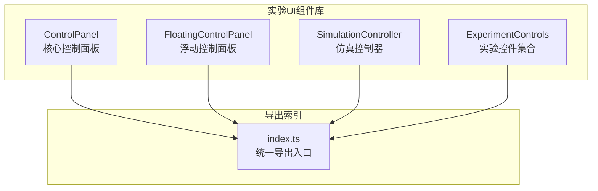
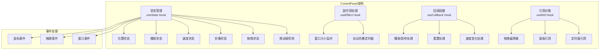
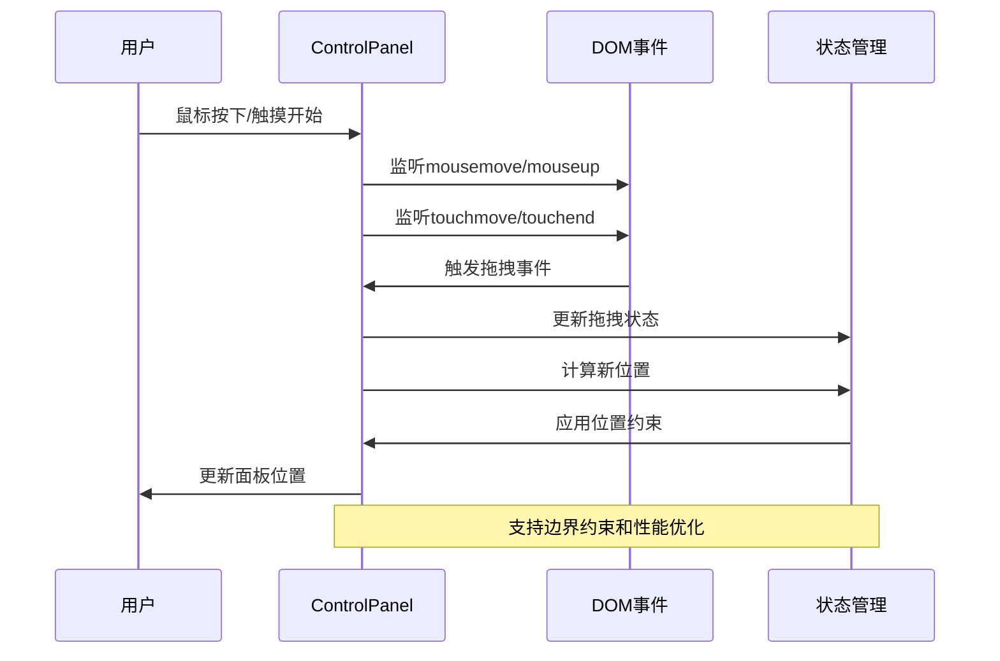
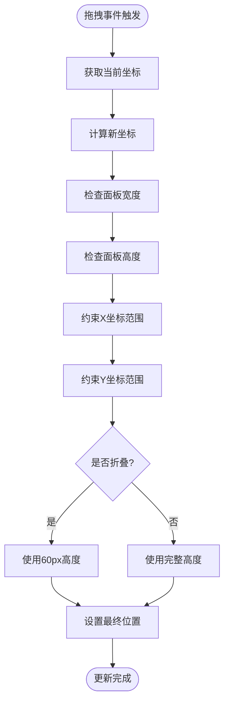
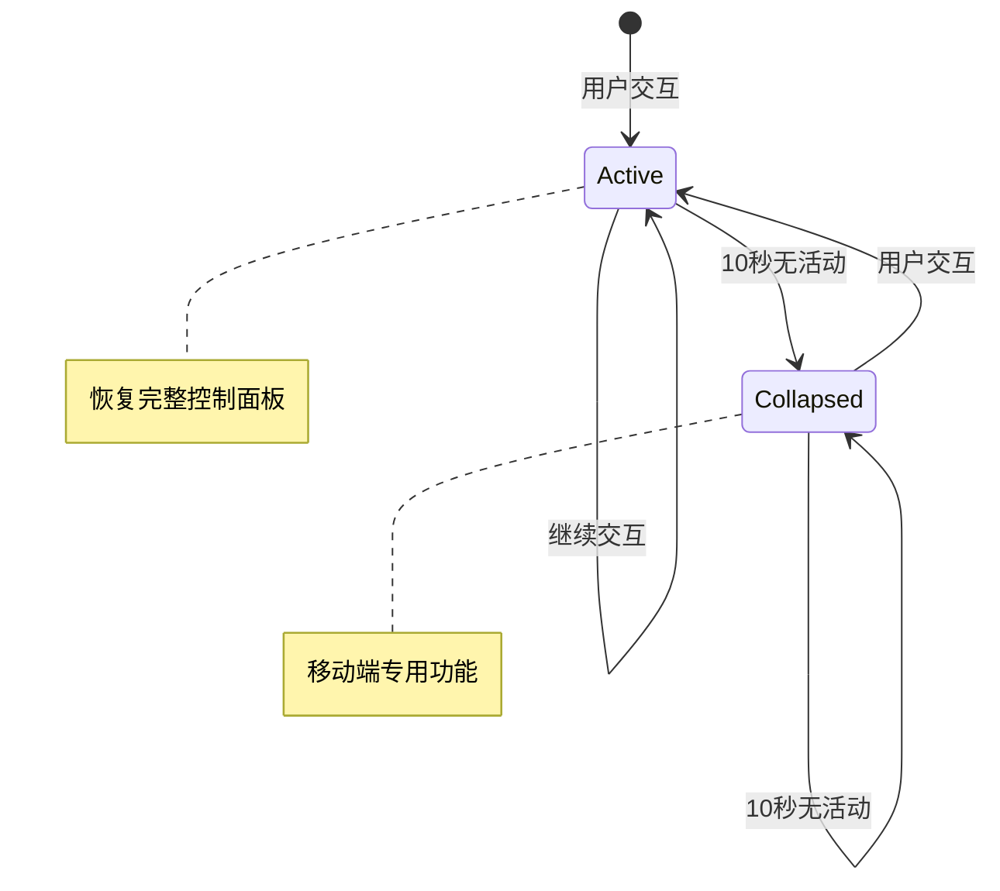
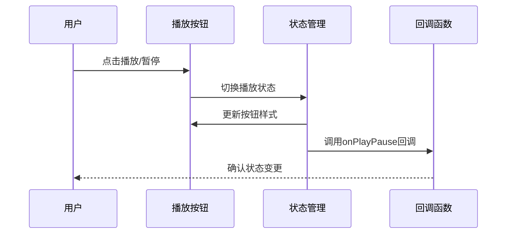
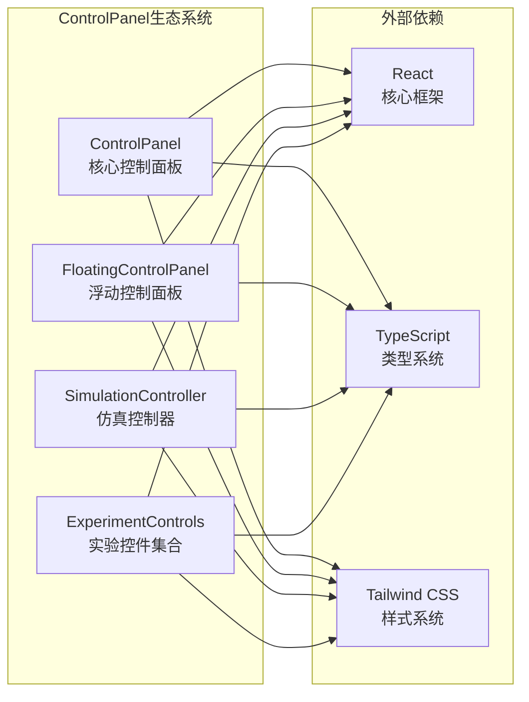

# 核心控制面板

<cite>
**本文档引用的文件**
- [ControlPanel.tsx](file://src/components/experiment-ui/ControlPanel.tsx)
- [FloatingControlPanel.tsx](file://src/components/experiment-ui/FloatingControlPanel.tsx)
- [SimulationController.tsx](file://src/components/experiment-ui/SimulationController.tsx)
- [index.ts](file://src/components/experiment-ui/index.ts)
</cite>

## 目录
1. [简介](#简介)
2. [项目结构](#项目结构)
3. [核心组件](#核心组件)
4. [架构概览](#架构概览)
5. [详细组件分析](#详细组件分析)
6. [依赖关系分析](#依赖关系分析)
7. [性能考虑](#性能考虑)
8. [故障排除指南](#故障排除指南)
9. [结论](#结论)
10. [附录](#附录)

## 简介

核心控制面板（ControlPanel）是ScienceLab3D项目中的关键UI组件，为科学实验模拟提供交互式控制界面。该组件实现了完整的实验控制功能，包括播放/暂停控制、重置功能、速度调节、拖拽移动、自动折叠和响应式布局等特性。

ControlPanel作为实验界面的核心组成部分，为用户提供直观的实验控制体验，支持桌面端和移动端的无缝操作。组件采用现代化的React Hooks架构，结合TypeScript类型系统，确保了代码的可维护性和类型安全。

## 项目结构

ControlPanel组件位于实验UI组件库中，与相关的控制面板组件共同构成了完整的实验控制界面体系：



**图表来源**
- [index.ts:1-43](file://src/components/experiment-ui/index.ts#L1-L43)

**章节来源**
- [index.ts:1-43](file://src/components/experiment-ui/index.ts#L1-L43)

## 核心组件

### ControlPanel组件概述

ControlPanel是一个功能完整的实验控制面板，具有以下核心特性：

- **响应式设计**：自动适配桌面端和移动端屏幕尺寸
- **拖拽交互**：支持鼠标和触摸设备的拖拽操作
- **智能折叠**：移动端自动折叠以节省空间
- **播放控制**：内置播放/暂停状态管理
- **速度调节**：支持0.1x到3x的速度范围调节
- **重置功能**：一键重置实验状态
- **自定义扩展**：支持自定义控制按钮和参数设置

### 主要属性接口

ControlPanelProps接口定义了组件的所有配置选项：

| 属性名 | 类型 | 默认值 | 描述 |
|--------|------|--------|------|
| children | ReactNode | undefined | 自定义控制内容 |
| onPlayPause | (isPlaying: boolean) => void | undefined | 播放/暂停回调函数 |
| onReset | () => void | undefined | 重置回调函数 |
| onSpeedChange | (speed: number) => void | undefined | 速度变化回调函数 |
| defaultSpeed | number | 1 | 默认播放速度 |
| defaultPlaying | boolean | true | 默认播放状态 |
| showPlayPause | boolean | true | 是否显示播放控制 |
| showReset | boolean | true | 是否显示重置按钮 |
| showSpeed | boolean | true | 是否显示速度控制 |
| title | string | "Controls" | 面板标题 |
| initialPosition | {x: number, y: number} | undefined | 初始位置 |

**章节来源**
- [ControlPanel.tsx:5-17](file://src/components/experiment-ui/ControlPanel.tsx#L5-L17)

## 架构概览

ControlPanel组件采用了模块化的架构设计，通过React Hooks实现状态管理和事件处理：



**图表来源**
- [ControlPanel.tsx:29-41](file://src/components/experiment-ui/ControlPanel.tsx#L29-L41)
- [ControlPanel.tsx:56-57](file://src/components/experiment-ui/ControlPanel.tsx#L56-L57)

## 详细组件分析

### 拖拽实现机制

ControlPanel的拖拽功能通过组合鼠标和触摸事件实现，提供了流畅的跨平台交互体验：

#### 事件处理流程



**图表来源**
- [ControlPanel.tsx:114-133](file://src/components/experiment-ui/ControlPanel.tsx#L114-L133)
- [ControlPanel.tsx:135-182](file://src/components/experiment-ui/ControlPanel.tsx#L135-L182)

#### 边界约束算法

拖拽过程中的位置计算采用了严格的边界约束机制：



**图表来源**
- [ControlPanel.tsx:141-148](file://src/components/experiment-ui/ControlPanel.tsx#L141-L148)
- [ControlPanel.tsx:157-163](file://src/components/experiment-ui/ControlPanel.tsx#L157-L163)

### 移动端自动折叠逻辑

移动端的自动折叠功能通过10秒的无活动超时实现，旨在优化小屏幕设备的用户体验：



**图表来源**
- [ControlPanel.tsx:75-94](file://src/components/experiment-ui/ControlPanel.tsx#L75-L94)

### 响应式布局设计

ControlPanel实现了智能的响应式布局，针对不同设备提供优化的用户体验：

| 设备类型 | 默认位置 | 宽度限制 | 折叠行为 |
|----------|----------|----------|----------|
| 桌面端 | (20, 80) | 最大320px | 不自动折叠 |
| 移动端 | (10, 70) | 全宽 | 10秒后自动折叠 |
| 小屏移动端 | (10, 70) | 全宽 | 10秒后自动折叠 |

**章节来源**
- [ControlPanel.tsx:48-53](file://src/components/experiment-ui/ControlPanel.tsx#L48-L53)
- [ControlPanel.tsx:60-72](file://src/components/experiment-ui/ControlPanel.tsx#L60-L72)

### 控制功能实现

#### 播放/暂停控制

播放/暂停功能通过状态切换和回调函数实现：



**图表来源**
- [ControlPanel.tsx:96-100](file://src/components/experiment-ui/ControlPanel.tsx#L96-L100)

#### 速度调节功能

速度调节支持0.1x到3x的连续调节，提供精确的实验控制：

| 速度范围 | 步长 | 显示精度 |
|----------|------|----------|
| 0.1 - 3.0 | 0.1 | 1位小数 |
| 最小值 | 0.1 | 0.1x |
| 最大值 | 3.0 | 3.0x |

**章节来源**
- [ControlPanel.tsx:108-111](file://src/components/experiment-ui/ControlPanel.tsx#L108-L111)

### 性能优化策略

ControlPanel采用了多项性能优化技术：

1. **事件委托优化**：使用useCallback缓存事件处理器
2. **条件渲染**：根据isCollapsed状态动态渲染内容
3. **边界检测优化**：仅在需要时计算面板尺寸
4. **内存泄漏防护**：正确的事件监听器清理

**章节来源**
- [ControlPanel.tsx:96-111](file://src/components/experiment-ui/ControlPanel.tsx#L96-L111)
- [ControlPanel.tsx:135-182](file://src/components/experiment-ui/ControlPanel.tsx#L135-L182)

## 依赖关系分析

ControlPanel组件与其他UI组件形成了清晰的依赖关系：



**图表来源**
- [index.ts:1-43](file://src/components/experiment-ui/index.ts#L1-L43)

### 组件间协作模式

ControlPanel与相关组件采用互补的设计理念：

| 组件 | 设计目标 | 使用场景 |
|------|----------|----------|
| ControlPanel | 实验主控制面板 | 完整实验控制界面 |
| FloatingControlPanel | 参数设置面板 | 实验参数调整 |
| SimulationController | 仿真控制器 | 实时仿真控制 |

**章节来源**
- [index.ts:4-11](file://src/components/experiment-ui/index.ts#L4-L11)

## 性能考虑

### 内存管理

ControlPanel实现了完善的内存管理机制：

1. **事件监听器清理**：在组件卸载时自动清理所有事件监听器
2. **定时器管理**：正确清理自动折叠定时器
3. **引用对象管理**：使用useRef避免不必要的重渲染

### 渲染优化

组件采用了多种渲染优化策略：

1. **状态分离**：将不同类型的用户状态分离管理
2. **条件渲染**：根据折叠状态动态渲染内容
3. **回调缓存**：使用useCallback缓存事件处理器

### 移动端优化

针对移动端设备进行了专门优化：

1. **触摸友好**：按钮尺寸和间距适合触摸操作
2. **自动折叠**：减少屏幕占用
3. **性能监控**：避免过度的重渲染

## 故障排除指南

### 常见问题及解决方案

#### 拖拽功能异常

**症状**：面板无法拖拽或拖拽不流畅

**可能原因**：
1. 事件监听器未正确绑定
2. 拖拽偏移量计算错误
3. 边界约束逻辑异常

**解决方法**：
1. 检查事件处理器的useCallback缓存
2. 验证dragOffset引用对象的初始化
3. 确认边界约束计算的正确性

#### 自动折叠功能失效

**症状**：移动端面板不会自动折叠

**可能原因**：
1. 窗口大小检测逻辑错误
2. 定时器未正确设置
3. 事件监听器未绑定

**解决方法**：
1. 验证window.innerWidth检测逻辑
2. 检查setTimeout的正确设置
3. 确认touchstart和click事件监听

#### 响应式布局问题

**症状**：面板在不同设备上显示异常

**可能原因**：
1. 媒体查询断点设置不当
2. 初始位置计算错误
3. 样式类名冲突

**解决方法**：
1. 调整768px断点设置
2. 验证initialPosition参数传递
3. 检查Tailwind CSS类名冲突

**章节来源**
- [ControlPanel.tsx:75-94](file://src/components/experiment-ui/ControlPanel.tsx#L75-L94)
- [ControlPanel.tsx:135-182](file://src/components/experiment-ui/ControlPanel.tsx#L135-L182)

## 结论

ControlPanel组件作为ScienceLab3D项目的核心UI组件，展现了现代前端开发的最佳实践。通过精心设计的架构和全面的功能实现，该组件为用户提供了优秀的实验控制体验。

组件的主要优势包括：

1. **功能完整性**：涵盖了实验控制的所有核心需求
2. **跨平台兼容**：完美支持桌面端和移动端操作
3. **性能优化**：采用了多项性能优化技术
4. **可维护性**：清晰的代码结构和类型定义
5. **扩展性**：灵活的接口设计支持功能扩展

未来可以考虑的改进方向包括：

1. 添加更多的键盘快捷键支持
2. 实现更丰富的动画效果
3. 增强无障碍访问功能
4. 优化大规模数据处理性能

## 附录

### 使用示例

由于本节不直接分析具体文件，此处提供概念性的使用指导：

#### 基础使用
```typescript
// 最简单的使用方式
<ControlPanel>
  <CustomControl />
</ControlPanel>
```

#### 高级配置
```typescript
// 完整配置示例
<ControlPanel
  title="实验控制"
  defaultPlaying={true}
  defaultSpeed={1.0}
  initialPosition={{ x: 50, y: 50 }}
  showPlayPause={true}
  showReset={true}
  showSpeed={true}
  onPlayPause={(isPlaying) => console.log('状态:', isPlaying)}
  onReset={() => console.log('重置')}
  onSpeedChange={(speed) => console.log('速度:', speed)}
>
  <CustomControls />
</ControlPanel>
```

### 最佳实践

1. **合理使用默认值**：利用default属性提供合理的初始状态
2. **事件处理优化**：始终使用useCallback包装事件处理器
3. **内存管理**：确保正确清理所有事件监听器
4. **响应式设计**：充分利用组件的自动响应式特性
5. **性能监控**：定期检查组件的渲染性能

### 相关组件对比

| 特性 | ControlPanel | FloatingControlPanel | SimulationController |
|------|-------------|---------------------|---------------------|
| 控制类型 | 实验主控制 | 参数设置 | 仿真控制 |
| 默认折叠 | 否 | 是 | 否 |
| 自动折叠 | 移动端 | 移动端 | 否 |
| 时间显示 | 否 | 否 | 是 |
| 播放控制 | 内置 | 外部 | 内置 |
| 适用场景 | 完整实验 | 参数调整 | 实时仿真 |