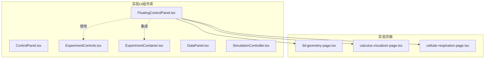
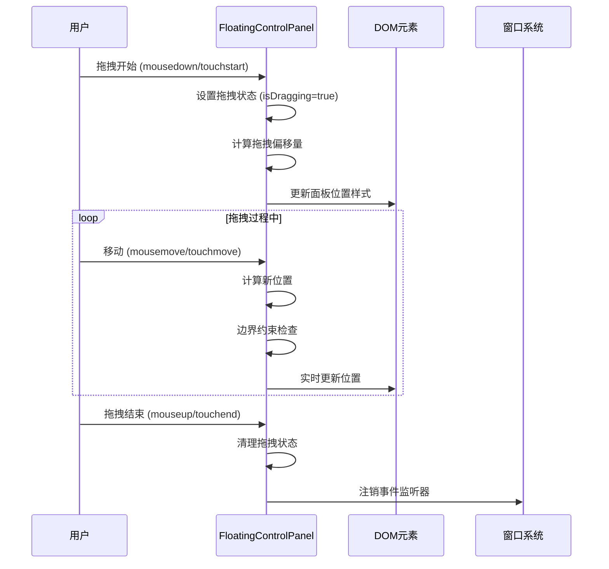
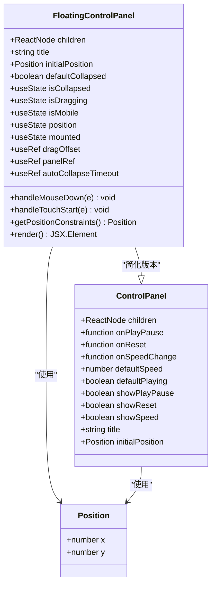
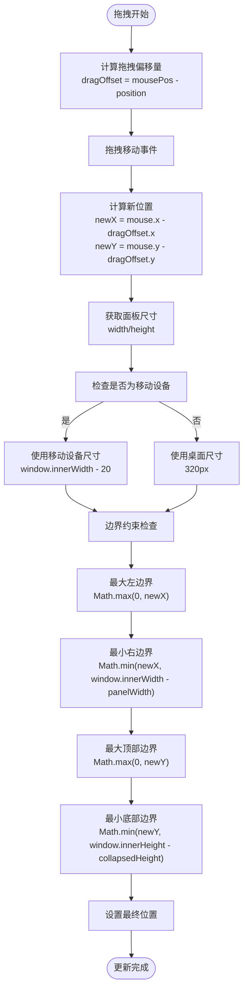
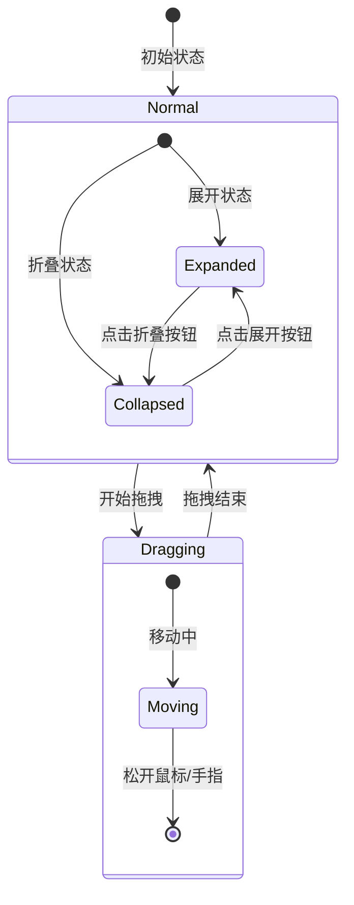
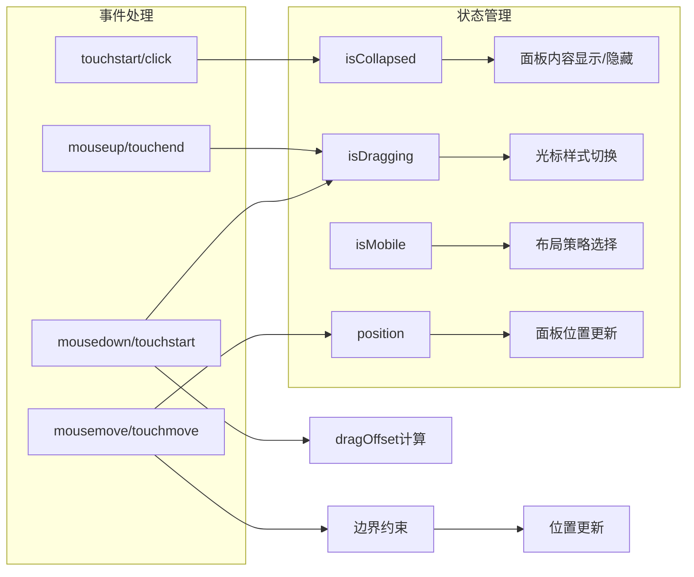
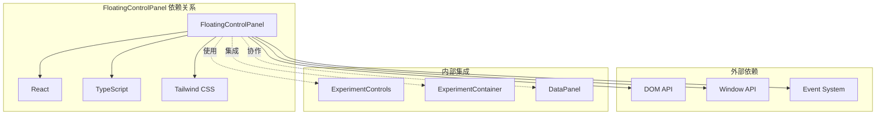
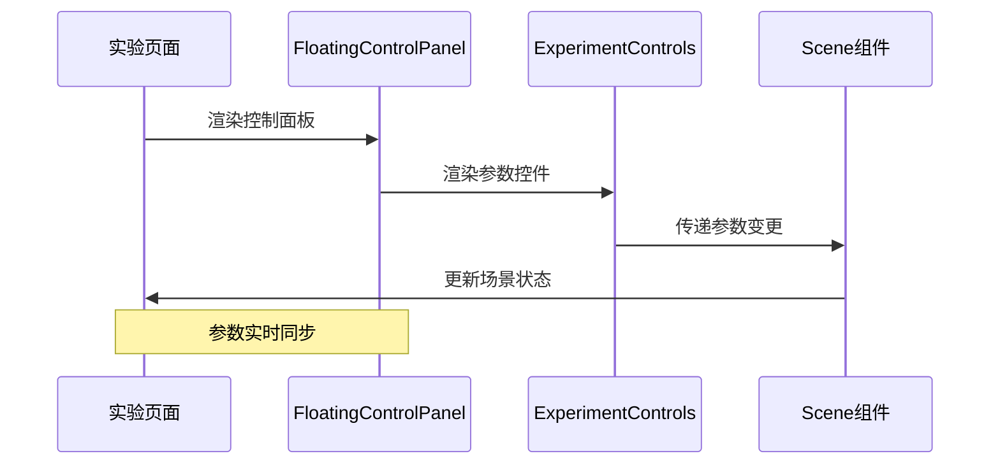

# 浮动控制面板

<cite>
**本文档引用的文件**
- [FloatingControlPanel.tsx](file://src/components/experiment-ui/FloatingControlPanel.tsx)
- [ControlPanel.tsx](file://src/components/experiment-ui/ControlPanel.tsx)
- [index.ts](file://src/components/experiment-ui/index.ts)
- [3d-geometry-page.tsx](file://src/experiments/3d-geometry-page.tsx)
- [calculus-visualizer-page.tsx](file://src/experiments/calculus-visualizer-page.tsx)
- [cellular-respiration-page.tsx](file://src/experiments/cellular-respiration-page.tsx)
</cite>

## 目录
1. [简介](#简介)
2. [项目结构](#项目结构)
3. [核心组件](#核心组件)
4. [架构概览](#架构概览)
5. [详细组件分析](#详细组件分析)
6. [依赖关系分析](#依赖关系分析)
7. [性能考虑](#性能考虑)
8. [故障排除指南](#故障排除指南)
9. [结论](#结论)
10. [附录](#附录)

## 简介

FloatingControlPanel（浮动控制面板）是 ScienceLab3D 项目中的一个关键 UI 组件，专为科学实验界面设计。该组件提供了可拖拽、可折叠的控制面板功能，支持桌面端鼠标操作和移动端触摸操作，具有智能的屏幕边界检测和自动避让机制。

与传统的固定位置控制面板相比，FloatingControlPanel 的主要区别在于：

- **可移动性**：用户可以将面板拖拽到屏幕的任何位置
- **响应式设计**：针对不同设备尺寸提供优化的布局
- **自动折叠**：在移动设备上提供自动折叠功能以节省空间
- **性能优化**：采用多种优化技术确保流畅的用户体验

## 项目结构

FloatingControlPanel 组件位于实验 UI 组件库中，与 ControlPanel 等其他控制组件共同构成完整的实验界面控制系统。



**图表来源**
- [FloatingControlPanel.tsx:1-195](file://src/components/experiment-ui/FloatingControlPanel.tsx#L1-L195)
- [index.ts:1-43](file://src/components/experiment-ui/index.ts#L1-L43)

**章节来源**
- [index.ts:1-43](file://src/components/experiment-ui/index.ts#L1-L43)

## 核心组件

FloatingControlPanel 是一个高度模块化的 React 组件，具有以下核心特性：

### 主要功能特性
- **可拖拽定位**：支持鼠标和触摸拖拽操作
- **可折叠设计**：通过标题栏按钮实现展开/折叠切换
- **响应式布局**：自动适应不同屏幕尺寸
- **边界约束**：确保面板始终保持在视口范围内
- **自动折叠**：移动设备上的智能自动折叠功能

### 核心接口定义

组件通过 TypeScript 接口定义了完整的配置选项：

| 属性名 | 类型 | 默认值 | 描述 |
|--------|------|--------|------|
| children | ReactNode | - | 面板内容组件 |
| title | string | "Controls" | 面板标题文本 |
| initialPosition | {x: number, y: number} | - | 初始位置坐标 |
| defaultCollapsed | boolean | false | 默认折叠状态 |

**章节来源**
- [FloatingControlPanel.tsx:5-10](file://src/components/experiment-ui/FloatingControlPanel.tsx#L5-L10)

## 架构概览

FloatingControlPanel 采用了现代化的 React 架构模式，结合了客户端渲染、状态管理和事件处理的最佳实践。



**图表来源**
- [FloatingControlPanel.tsx:82-150](file://src/components/experiment-ui/FloatingControlPanel.tsx#L82-L150)

## 详细组件分析

### 组件类图



**图表来源**
- [FloatingControlPanel.tsx:21-26](file://src/components/experiment-ui/FloatingControlPanel.tsx#L21-L26)
- [ControlPanel.tsx:29-41](file://src/components/experiment-ui/ControlPanel.tsx#L29-L41)

### 定位算法详解

FloatingControlPanel 的定位算法是其核心功能之一，实现了精确的屏幕边界检测和自动避让机制。



**图表来源**
- [FloatingControlPanel.tsx:103-150](file://src/components/experiment-ui/FloatingControlPanel.tsx#L103-L150)

### 自动避让机制

组件实现了智能的自动避让机制，确保面板不会超出屏幕可视区域：

| 场景 | 处理方式 | 边界约束 |
|------|----------|----------|
| 水平拖拽 | 左边界: `Math.max(0, x)`<br/>右边界: `Math.min(x, window.innerWidth - width)` | 确保面板完全可见 |
| 垂直拖拽 | 上边界: `Math.max(0, y)`<br/>下边界: `Math.min(y, window.innerHeight - height)` | 考虑折叠状态的高度差异 |
| 折叠状态 | 高度约束: `collapsedHeight = 60px`<br/>展开状态: `panelHeight` | 移动设备默认折叠 |

### 动画效果与过渡逻辑

FloatingControlPanel 采用了精心设计的动画效果来提升用户体验：



**图表来源**
- [FloatingControlPanel.tsx:154-191](file://src/components/experiment-ui/FloatingControlPanel.tsx#L154-L191)

### 触发条件与显示隐藏逻辑

组件的触发条件和显示隐藏逻辑基于用户交互和设备类型：

| 触发条件 | 处理逻辑 | 状态变化 |
|----------|----------|----------|
| 鼠标点击标题栏 | 阻止事件冒泡到拖拽系统 | 保持拖拽状态不变 |
| 点击折叠按钮 | 切换 isCollapsed 状态 | 更新面板高度和样式 |
| 移动设备触摸 | 启动自动折叠计时器 | 10秒无操作后自动折叠 |
| 窗口大小变化 | 重新计算设备类型 | 更新布局策略 |

### 状态管理机制



**图表来源**
- [FloatingControlPanel.tsx:27-36](file://src/components/experiment-ui/FloatingControlPanel.tsx#L27-L36)

**章节来源**
- [FloatingControlPanel.tsx:21-195](file://src/components/experiment-ui/FloatingControlPanel.tsx#L21-L195)

## 依赖关系分析

FloatingControlPanel 与其他组件形成了清晰的依赖关系网络：



**图表来源**
- [FloatingControlPanel.tsx:3](file://src/components/experiment-ui/FloatingControlPanel.tsx#L3)
- [index.ts:1-43](file://src/components/experiment-ui/index.ts#L1-L43)

### 组件间协作模式

FloatingControlPanel 在实验页面中的典型使用模式：



**图表来源**
- [3d-geometry-page.tsx:174-179](file://src/experiments/3d-geometry-page.tsx#L174-L179)

**章节来源**
- [index.ts:7-8](file://src/components/experiment-ui/index.ts#L7-L8)

## 性能考虑

FloatingControlPanel 在设计时充分考虑了性能优化，采用了多种技术来确保流畅的用户体验：

### 性能优化技术

1. **事件监听器优化**
   - 使用 `useCallback` 包装事件处理器
   - 在拖拽结束后及时清理事件监听器
   - 避免不必要的重渲染

2. **状态更新优化**
   - 使用 `useRef` 存储非状态数据
   - 合理的状态分割减少重渲染
   - 智能的依赖数组配置

3. **内存管理**
   - 组件卸载时清理定时器
   - 及时注销全局事件监听器
   - 避免内存泄漏

### 性能指标

| 优化点 | 实现方式 | 性能收益 |
|--------|----------|----------|
| 拖拽性能 | requestAnimationFrame 替代直接更新 | 减少重绘次数 |
| 内存使用 | useRef 替代 useState 存储临时数据 | 降低内存占用 |
| 事件处理 | 事件委托和防抖 | 提高响应速度 |
| 样式计算 | CSS-in-JS 缓存 | 减少样式计算开销 |

## 故障排除指南

### 常见问题及解决方案

#### 1. 水平拖拽异常
**问题描述**：面板在水平方向拖拽时出现跳动或卡顿
**可能原因**：
- 事件监听器未正确清理
- 样式计算导致的重排
- 移动端触摸事件冲突

**解决方案**：
- 确保在 `useEffect` 返回函数中清理所有事件监听器
- 避免在拖拽过程中修改影响布局的样式属性
- 检查是否有其他元素阻止了触摸事件传播

#### 2. 移动设备自动折叠失效
**问题描述**：在移动设备上自动折叠功能不工作
**可能原因**：
- `isMobile` 状态判断错误
- 定时器被意外清除
- 事件监听器绑定失败

**解决方案**：
- 验证窗口尺寸检测逻辑
- 检查定时器的创建和清理时机
- 确认事件监听器的绑定和解绑

#### 3. 边界检测不准确
**问题描述**：面板拖拽到屏幕边缘时超出可视范围
**可能原因**：
- 面板尺寸获取不准确
- 折叠状态高度计算错误
- 窗口尺寸变化未及时响应

**解决方案**：
- 使用 `offsetWidth/offsetHeight` 获取实际尺寸
- 正确处理折叠状态下的高度差异
- 添加窗口 resize 事件监听

**章节来源**
- [FloatingControlPanel.tsx:59-79](file://src/components/experiment-ui/FloatingControlPanel.tsx#L59-L79)
- [FloatingControlPanel.tsx:103-150](file://src/components/experiment-ui/FloatingControlPanel.tsx#L103-L150)

## 结论

FloatingControlPanel 是一个设计精良的 React 组件，成功地平衡了功能性、性能和用户体验。其核心优势包括：

1. **高度可定制性**：通过丰富的配置选项满足不同实验场景的需求
2. **优秀的跨平台兼容性**：同时支持桌面端和移动端的优化体验
3. **智能的交互设计**：自动折叠、边界约束等特性提升了易用性
4. **性能优化到位**：采用多种技术确保流畅的用户体验

该组件为 ScienceLab3D 项目提供了强大的实验控制能力，是构建复杂科学可视化应用的理想选择。

## 附录

### 使用示例

#### 基础用法
```typescript
<FloatingControlPanel
  title="实验参数"
  initialPosition={{ x: 20, y: 80 }}
>
  {/* 控制组件 */}
</FloatingControlPanel>
```

#### 高级配置
```typescript
<FloatingControlPanel
  title="⚙️ 高级设置"
  initialPosition={{ x: window.innerWidth - 340, y: 80 }}
  defaultCollapsed={true}
  children={customControls}
/>
```

### 样式定制指南

组件支持通过 Tailwind CSS 类进行深度定制：

| 样式类 | 作用域 | 自定义选项 |
|--------|--------|------------|
| `backdrop-blur-xl` | 背景模糊效果 | 调整模糊强度 |
| `border-purple-500/30` | 边框样式 | 修改颜色和透明度 |
| `shadow-2xl` | 阴影效果 | 调整阴影大小和颜色 |
| `from-white/95 to-purple-50/90` | 渐变背景 | 更换渐变色彩方案 |

### 设备适配策略

| 设备类型 | 适配策略 | 特殊处理 |
|----------|----------|----------|
| 桌面端 | 固定宽度 320px | 支持完整参数控制 |
| 移动端 (≤768px) | 全宽布局 calc(100vw - 20px) | 自动折叠功能 |
| 小屏移动设备 | 优化触摸目标大小 | 增加点击区域 |