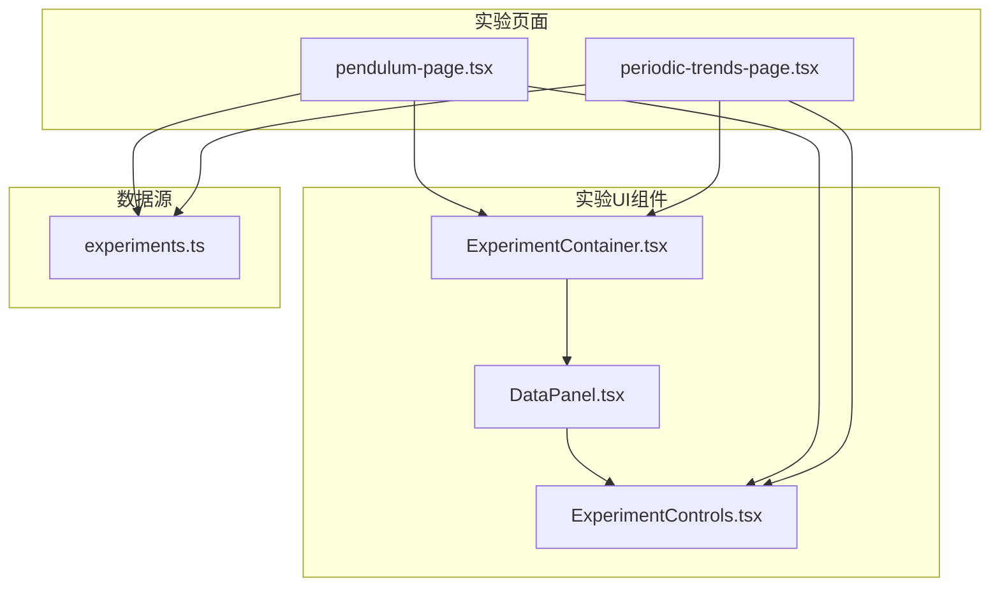
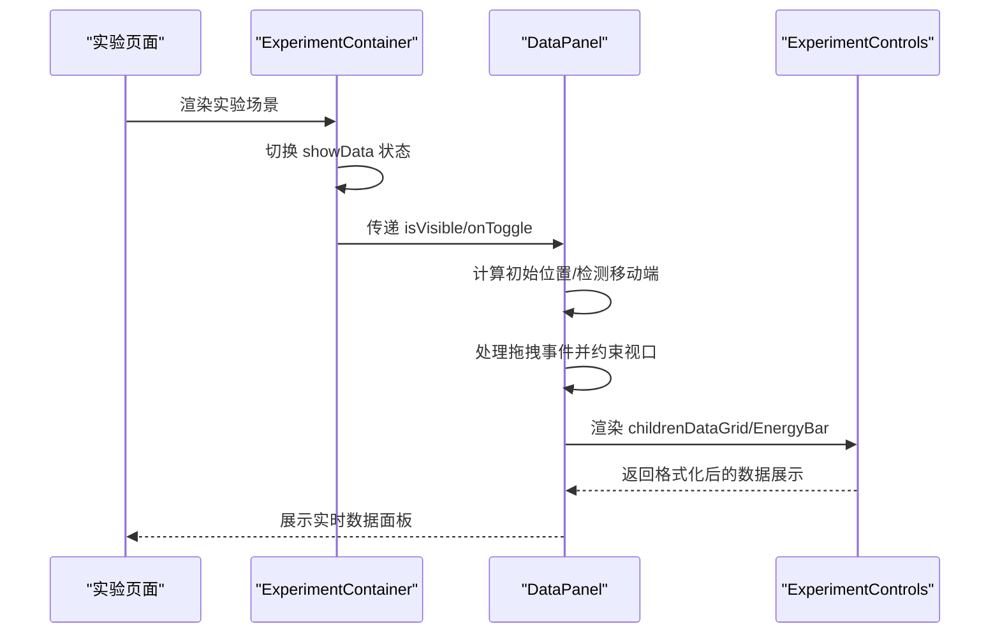
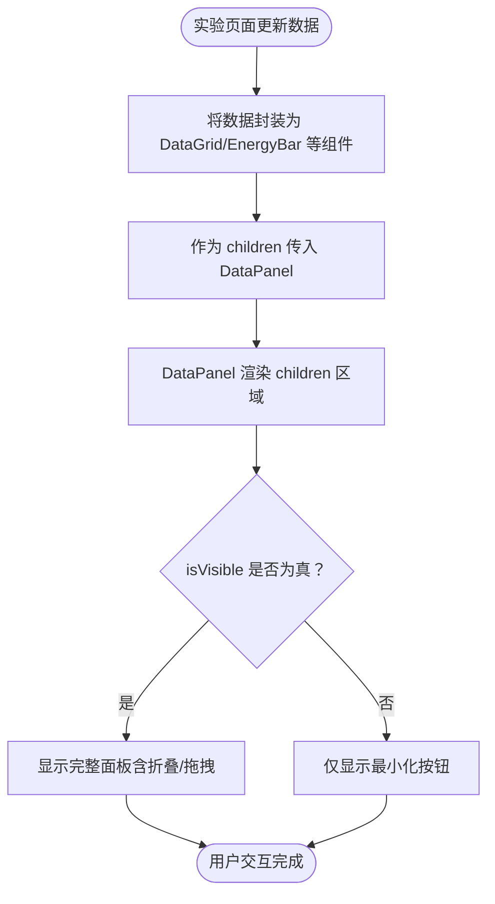
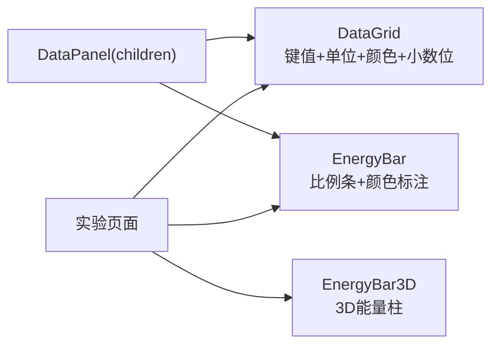
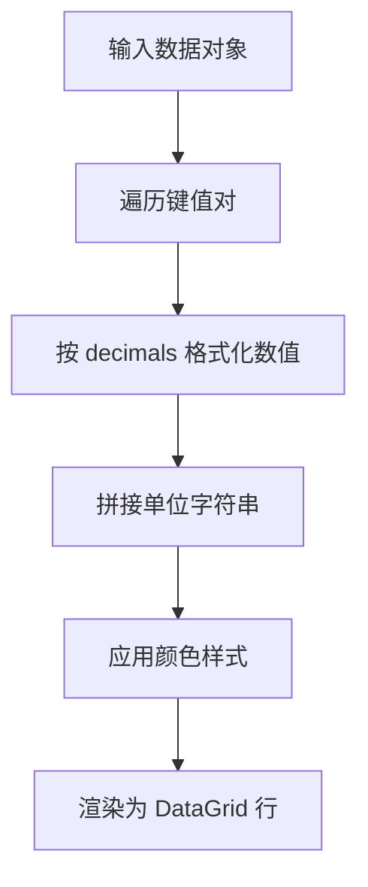
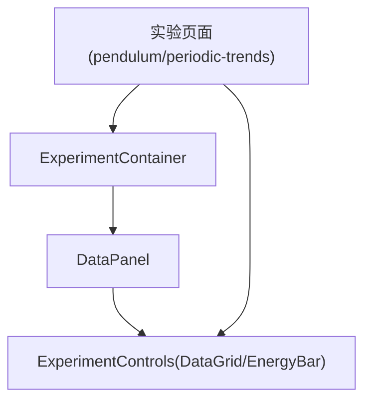

# 数据展示组件

<cite>
**本文引用的文件**
- [DataPanel.tsx](file://src/components/experiment-ui/DataPanel.tsx)
- [ExperimentContainer.tsx](file://src/components/experiment-ui/ExperimentContainer.tsx)
- [ExperimentControls.tsx](file://src/components/experiment-ui/ExperimentControls.tsx)
- [pendulum-page.tsx](file://src/experiments/pendulum-page.tsx)
- [periodic-trends-page.tsx](file://src/experiments/periodic-trends-page.tsx)
- [experiments.ts](file://src/data/experiments.ts)
</cite>

## 目录
1. [简介](#简介)
2. [项目结构](#项目结构)
3. [核心组件](#核心组件)
4. [架构总览](#架构总览)
5. [详细组件分析](#详细组件分析)
6. [依赖关系分析](#依赖关系分析)
7. [性能考量](#性能考量)
8. [故障排查指南](#故障排查指南)
9. [结论](#结论)
10. [附录](#附录)

## 简介
本文件系统性地阐述“数据展示组件”（DataPanel）的设计与实现，重点覆盖以下方面：
- 实验数据的实时显示、图表绘制与数值计算结果展示
- 数据面板的数据绑定机制与更新策略
- 不同类型数据的展示方式：文本、图表、表格
- 配置选项与可定制样式
- 数据格式化规则与单位转换
- 响应式设计与移动端优化

DataPanel 是一个可拖拽、可折叠、半透明毛玻璃风格的浮动数据面板，用于在科学实验场景中呈现实时物理量、能量分布、统计结果等信息。它通过受控/非受控可见性状态、拖拽定位、视口边界约束以及响应式布局，为用户提供沉浸式且可交互的数据观察体验。

## 项目结构
DataPanel 所在的模块位于实验 UI 组件集合中，通常与实验容器（ExperimentContainer）配合使用，后者负责控制 DataPanel 的显示/隐藏，并将其渲染到实验场景的合适位置。



**图示来源**
- [DataPanel.tsx:1-218](file://src/components/experiment-ui/DataPanel.tsx#L1-L218)
- [ExperimentContainer.tsx:259-308](file://src/components/experiment-ui/ExperimentContainer.tsx#L259-L308)
- [ExperimentControls.tsx:91-166](file://src/components/experiment-ui/ExperimentControls.tsx#L91-L166)
- [pendulum-page.tsx:130-150](file://src/experiments/pendulum-page.tsx#L130-L150)
- [periodic-trends-page.tsx:104-122](file://src/experiments/periodic-trends-page.tsx#L104-L122)
- [experiments.ts:1-492](file://src/data/experiments.ts#L1-L492)

**章节来源**
- [DataPanel.tsx:1-218](file://src/components/experiment-ui/DataPanel.tsx#L1-L218)
- [ExperimentContainer.tsx:259-308](file://src/components/experiment-ui/ExperimentContainer.tsx#L259-L308)

## 核心组件
DataPanel 提供如下能力：
- 可拖拽定位：支持鼠标与触摸事件，拖拽时改变面板位置并在释放后保持在视口内
- 可折叠内容：标题栏提供折叠/展开按钮，减少空间占用
- 可切换显示：支持受控或内部可见性状态，适配不同实验页面的控制逻辑
- 响应式布局：在移动端自动调整宽度与最大高度，保证可读性与可用性
- 毛玻璃与深色主题：半透明背景与渐变标题栏，提升视觉层次

典型用法：
- 在实验页面中，通过 ExperimentContainer 控制 DataPanel 的显示/隐藏
- 将具体数据内容（如 DataGrid、EnergyBar 等）作为 children 传入 DataPanel
- 使用受控 visible 状态与 onToggle 回调实现与实验控制流的联动

**章节来源**
- [DataPanel.tsx:5-11](file://src/components/experiment-ui/DataPanel.tsx#L5-L11)
- [DataPanel.tsx:23-29](file://src/components/experiment-ui/DataPanel.tsx#L23-L29)
- [DataPanel.tsx:169-215](file://src/components/experiment-ui/DataPanel.tsx#L169-L215)
- [ExperimentContainer.tsx:259-308](file://src/components/experiment-ui/ExperimentContainer.tsx#L259-L308)

## 架构总览
DataPanel 的工作流由“可见性控制 → 拖拽定位 → 内容渲染 → 响应式适配”构成。下图展示了从实验页面到 DataPanel 的典型调用链：



**图示来源**
- [ExperimentContainer.tsx:259-308](file://src/components/experiment-ui/ExperimentContainer.tsx#L259-L308)
- [DataPanel.tsx:44-64](file://src/components/experiment-ui/DataPanel.tsx#L44-L64)
- [DataPanel.tsx:75-144](file://src/components/experiment-ui/DataPanel.tsx#L75-L144)
- [ExperimentControls.tsx:91-166](file://src/components/experiment-ui/ExperimentControls.tsx#L91-L166)

## 详细组件分析

### DataPanel 组件
DataPanel 的职责是承载并呈现实验数据，同时提供良好的交互与视觉体验。其关键点包括：
- 可见性管理：支持受控（controlledVisible）与内部（internalVisible）两种模式；onToggle 回调允许上层控制面板开关
- 拖拽与定位：记录拖拽偏移，计算新坐标并限制在视口范围内；移动端与桌面端初始位置不同
- 折叠与展开：通过 isCollapsed 控制内容区域的显示/隐藏，配合动画过渡
- 响应式尺寸：移动端宽度自适应，最大高度随屏幕变化；桌面端固定最大宽度
- 视觉样式：深色半透明背景、渐变标题栏、圆角边框与阴影，提升可读性

```mermaid
classDiagram
class DataPanel {
+props : DataPanelProps
+state : isCollapsed, isDragging, isMobile, isVisible, position
+refs : dragOffset, panelRef
+handleToggle() : void
+handleMouseDown(e) : void
+handleTouchStart(e) : void
+render() : ReactNode
}
class DataPanelProps {
+children : ReactNode
+isVisible? : boolean
+onToggle?() : void
+initialPosition? : {x, y}
+defaultCollapsed? : boolean
}
DataPanel --> DataPanelProps : "接收"
```

**图示来源**
- [DataPanel.tsx:5-11](file://src/components/experiment-ui/DataPanel.tsx#L5-L11)
- [DataPanel.tsx:23-29](file://src/components/experiment-ui/DataPanel.tsx#L23-L29)

**章节来源**
- [DataPanel.tsx:5-11](file://src/components/experiment-ui/DataPanel.tsx#L5-L11)
- [DataPanel.tsx:23-29](file://src/components/experiment-ui/DataPanel.tsx#L23-L29)
- [DataPanel.tsx:44-64](file://src/components/experiment-ui/DataPanel.tsx#L44-L64)
- [DataPanel.tsx:75-144](file://src/components/experiment-ui/DataPanel.tsx#L75-L144)
- [DataPanel.tsx:169-215](file://src/components/experiment-ui/DataPanel.tsx#L169-L215)

### 数据绑定与更新策略
- 上层实验页面通过 props 将实时数据传递给 DataPanel 的 children（通常是 DataGrid 或 EnergyBar）
- DataPanel 本身不直接订阅数据源，而是作为“展示容器”，依赖上层组件的状态更新驱动重新渲染
- 受控可见性：当外部控制 showData 为 true 时，DataPanel 渲染；否则仅渲染最小化的“显示”按钮
- 拖拽与折叠不影响数据绑定，仅影响布局与可见性



**图示来源**
- [ExperimentContainer.tsx:259-308](file://src/components/experiment-ui/ExperimentContainer.tsx#L259-L308)
- [DataPanel.tsx:40-41](file://src/components/experiment-ui/DataPanel.tsx#L40-L41)
- [DataPanel.tsx:169-215](file://src/components/experiment-ui/DataPanel.tsx#L169-L215)

**章节来源**
- [ExperimentContainer.tsx:259-308](file://src/components/experiment-ui/ExperimentContainer.tsx#L259-L308)
- [DataPanel.tsx:40-41](file://src/components/experiment-ui/DataPanel.tsx#L40-L41)
- [DataPanel.tsx:169-215](file://src/components/experiment-ui/DataPanel.tsx#L169-L215)

### 数据展示方式
DataPanel 支持多种数据展示形态，常见组合如下：
- 文本型数值：使用 DataGrid 将键值对数据以网格形式展示，支持颜色、小数位与单位
- 能量/占比可视化：使用 EnergyBar 展示动能、势能与总能量的比例条，直观反映能量守恒
- 图表绘制：在实验页面中结合 Three.js 场景绘制 3D 能量柱状图（例如 EnergyBar3D），实现更丰富的可视化



**图示来源**
- [ExperimentControls.tsx:91-166](file://src/components/experiment-ui/ExperimentControls.tsx#L91-L166)
- [ExperimentControls.tsx:129-166](file://src/components/experiment-ui/ExperimentControls.tsx#L129-L166)
- [pendulum-page.tsx:130-150](file://src/experiments/pendulum-page.tsx#L130-L150)

**章节来源**
- [ExperimentControls.tsx:91-166](file://src/components/experiment-ui/ExperimentControls.tsx#L91-L166)
- [ExperimentControls.tsx:129-166](file://src/components/experiment-ui/ExperimentControls.tsx#L129-L166)
- [pendulum-page.tsx:130-150](file://src/experiments/pendulum-page.tsx#L130-L150)

### 配置选项与自定义样式
- 可见性控制
  - 受控：通过 isVisible 与 onToggle 实现外部控制
  - 非受控：内部维护 internalVisible，默认显示
- 初始位置：可通过 initialPosition 指定；未指定时根据设备类型自动选择
- 默认折叠：defaultCollapsed 控制首次打开是否折叠
- 样式与主题
  - 深色半透明背景与毛玻璃效果
  - 渐变标题栏与圆角边框
  - 移动端自适应宽度与最大高度
- 子元素样式：DataGrid/EnergyBar 等子组件可自行设置颜色、字体大小与间距

**章节来源**
- [DataPanel.tsx:5-11](file://src/components/experiment-ui/DataPanel.tsx#L5-L11)
- [DataPanel.tsx:23-29](file://src/components/experiment-ui/DataPanel.tsx#L23-L29)
- [DataPanel.tsx:169-215](file://src/components/experiment-ui/DataPanel.tsx#L169-L215)
- [ExperimentControls.tsx:91-166](file://src/components/experiment-ui/ExperimentControls.tsx#L91-L166)

### 数据格式化规则与单位转换
- 数值格式化：DataGrid 对每个数值进行定点格式化，支持 decimals 指定小数位
- 单位显示：每个数值项携带 unit 字段，统一在右侧展示
- 颜色标识：通过 color 字段为不同数值赋予颜色，便于区分与对比
- 能量条：EnergyBar 以百分比宽度展示各分量占比，支持 maxEnergy 自定义上限



**图示来源**
- [ExperimentControls.tsx:91-166](file://src/components/experiment-ui/ExperimentControls.tsx#L91-L166)

**章节来源**
- [ExperimentControls.tsx:91-166](file://src/components/experiment-ui/ExperimentControls.tsx#L91-L166)

### 响应式设计与移动端优化
- 设备检测：挂载时根据窗口宽度判断是否为移动端
- 初始位置：移动端默认靠底部左侧，桌面端默认靠右下角
- 宽度与最大高度：移动端宽度自适应，最大高度限制在视口范围内；桌面端固定最大宽度
- 拖拽行为：移动端与桌面端均支持拖拽，拖拽结束后自动约束在视口内
- 可折叠：折叠状态下仅保留标题栏高度，节省空间

**章节来源**
- [DataPanel.tsx:44-64](file://src/components/experiment-ui/DataPanel.tsx#L44-L64)
- [DataPanel.tsx:169-181](file://src/components/experiment-ui/DataPanel.tsx#L169-L181)
- [DataPanel.tsx:103-125](file://src/components/experiment-ui/DataPanel.tsx#L103-L125)

## 依赖关系分析
DataPanel 与其他组件的耦合关系如下：
- 与 ExperimentContainer：通过 showData 控制显示；在容器中被包裹并定位
- 与 ExperimentControls：作为 children 接收 DataGrid、EnergyBar 等展示组件
- 与实验页面：由具体实验页面构造数据并传入 DataPanel



**图示来源**
- [ExperimentContainer.tsx:259-308](file://src/components/experiment-ui/ExperimentContainer.tsx#L259-L308)
- [DataPanel.tsx:169-215](file://src/components/experiment-ui/DataPanel.tsx#L169-L215)
- [ExperimentControls.tsx:91-166](file://src/components/experiment-ui/ExperimentControls.tsx#L91-L166)
- [pendulum-page.tsx:130-150](file://src/experiments/pendulum-page.tsx#L130-L150)
- [periodic-trends-page.tsx:104-122](file://src/experiments/periodic-trends-page.tsx#L104-L122)

**章节来源**
- [ExperimentContainer.tsx:259-308](file://src/components/experiment-ui/ExperimentContainer.tsx#L259-L308)
- [DataPanel.tsx:169-215](file://src/components/experiment-ui/DataPanel.tsx#L169-L215)
- [ExperimentControls.tsx:91-166](file://src/components/experiment-ui/ExperimentControls.tsx#L91-L166)
- [pendulum-page.tsx:130-150](file://src/experiments/pendulum-page.tsx#L130-L150)
- [periodic-trends-page.tsx:104-122](file://src/experiments/periodic-trends-page.tsx#L104-L122)

## 性能考量
- 渲染开销：DataPanel 仅在 children 变化或可见性切换时重绘；折叠状态下不渲染内容区域
- 拖拽性能：拖拽事件监听仅在 isDragging 为真时注册，避免常驻监听带来的性能损耗
- 视口约束：拖拽时即时计算并限制位置，避免超出视口导致的重排抖动
- 响应式布局：通过 CSS 媒体查询与动态样式，减少不必要的 JavaScript 计算

[本节为通用指导，无需特定文件引用]

## 故障排查指南
- 面板无法显示
  - 检查 ExperimentContainer 中的 showData 状态是否为 true
  - 确认 DataPanel 的 isVisible 与 onToggle 传参是否正确
- 面板位置异常
  - 确认 initialPosition 是否合理；未设置时会根据设备类型自动选择
  - 检查拖拽偏移与视口约束逻辑是否生效
- 拖拽无效
  - 确保未在按钮或输入框上触发拖拽（内部已过滤）
  - 检查 isDragging 状态与事件监听器注册/注销流程
- 移动端显示拥挤
  - 检查折叠状态与内容区最大高度设置
  - 确认 DataGrid 列数与文本长度是否过长

**章节来源**
- [ExperimentContainer.tsx:259-308](file://src/components/experiment-ui/ExperimentContainer.tsx#L259-L308)
- [DataPanel.tsx:75-144](file://src/components/experiment-ui/DataPanel.tsx#L75-L144)
- [DataPanel.tsx:103-125](file://src/components/experiment-ui/DataPanel.tsx#L103-L125)

## 结论
DataPanel 通过简洁的 API 与完善的交互特性，为科学实验提供了高效、直观的数据展示方案。其受控/非受控可见性、拖拽定位、折叠展示与响应式布局，使其既能满足桌面端的精细观察需求，也能在移动端提供流畅的用户体验。结合 DataGrid、EnergyBar 等展示组件，DataPanel 能够灵活承载文本、数值与可视化等多种数据形态，帮助学习者深入理解实验现象与物理规律。

[本节为总结性内容，无需特定文件引用]

## 附录

### API 摘要
- DataPanelProps
  - children: ReactNode
  - isVisible?: boolean
  - onToggle?(): void
  - initialPosition?: { x: number; y: number }
  - defaultCollapsed?: boolean

**章节来源**
- [DataPanel.tsx:5-11](file://src/components/experiment-ui/DataPanel.tsx#L5-L11)
- [DataPanel.tsx:23-29](file://src/components/experiment-ui/DataPanel.tsx#L23-L29)

### 典型实验页面中的使用
- 摆实验（pendulum-page.tsx）：将 DataGrid 与 EnergyBar 组合作为 children，展示周期、角度、速度、能量等实时数据
- 周期趋势（periodic-trends-page.tsx）：通过 ExperimentContainer 控制 DataPanel 的显示/隐藏，并将数据面板内容传入

**章节来源**
- [pendulum-page.tsx:130-150](file://src/experiments/pendulum-page.tsx#L130-L150)
- [periodic-trends-page.tsx:104-122](file://src/experiments/periodic-trends-page.tsx#L104-L122)