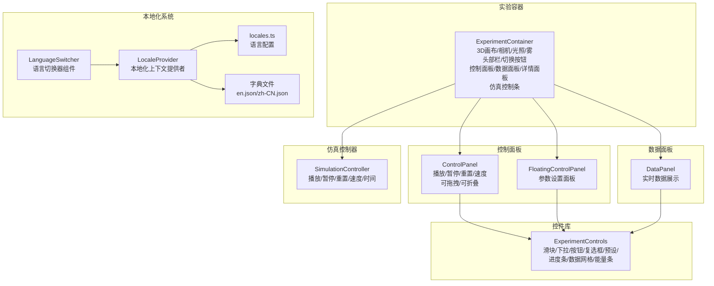
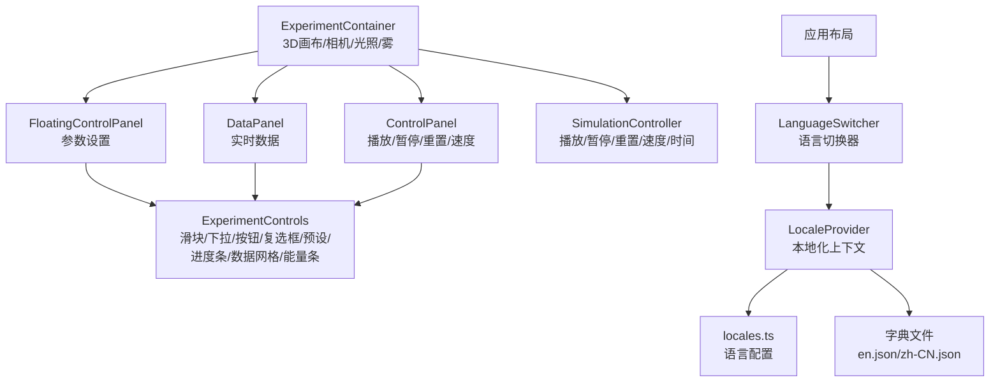
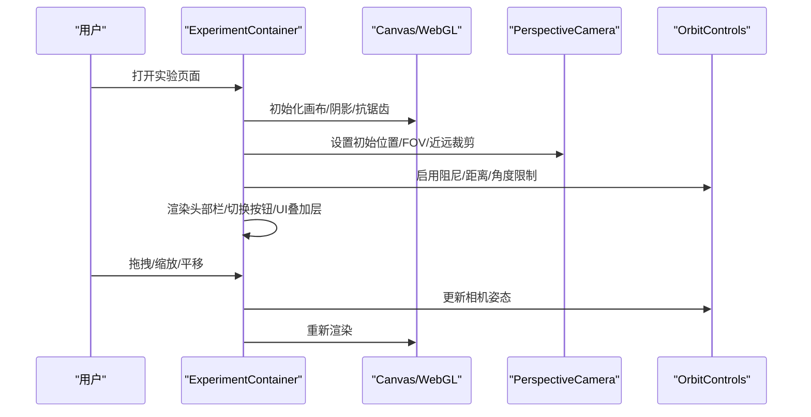
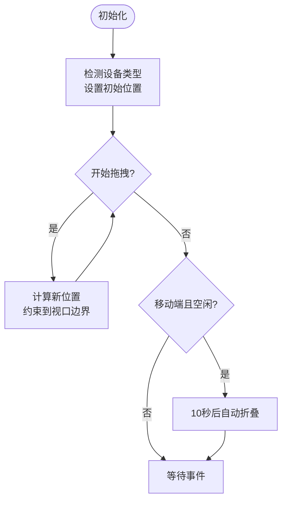
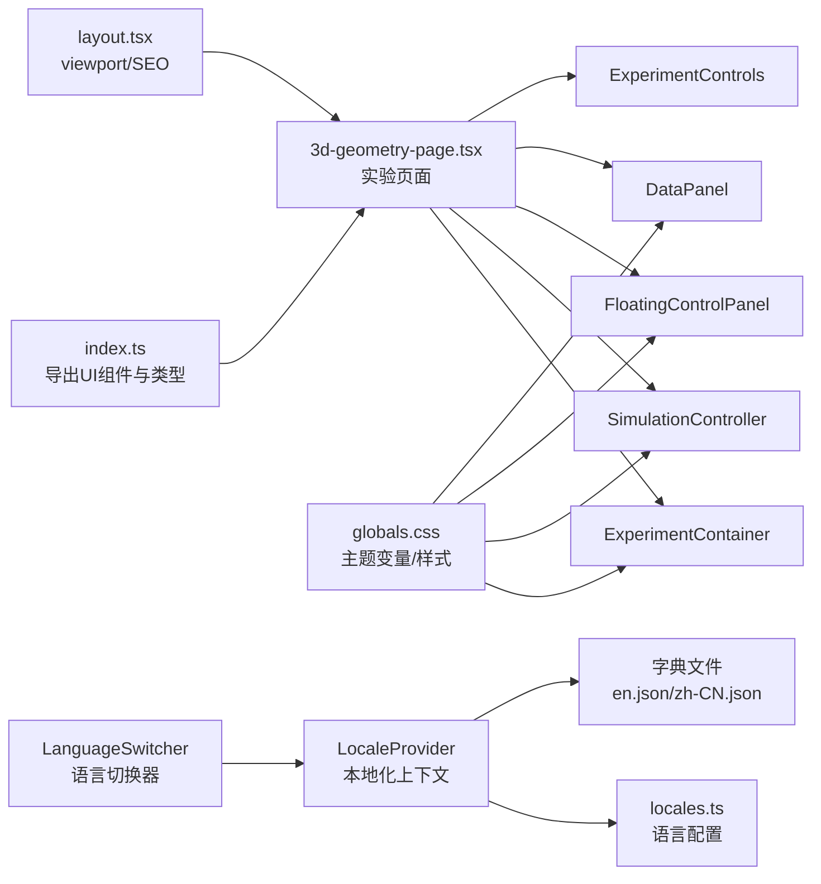

# 用户界面组件

<cite>
**本文档引用的文件**
- [ExperimentContainer.tsx](file://src/components/experiment-ui/ExperimentContainer.tsx)
- [ControlPanel.tsx](file://src/components/experiment-ui/ControlPanel.tsx)
- [DataPanel.tsx](file://src/components/experiment-ui/DataPanel.tsx)
- [FloatingControlPanel.tsx](file://src/components/experiment-ui/FloatingControlPanel.tsx)
- [SimulationController.tsx](file://src/components/experiment-ui/SimulationController.tsx)
- [ExperimentControls.tsx](file://src/components/experiment-ui/ExperimentControls.tsx)
- [index.ts](file://src/components/experiment-ui/index.ts)
- [language-switcher.tsx](file://src/components/ui/language-switcher.tsx)
- [locale-context.tsx](file://src/lib/i18n/locale-context.tsx)
- [locales.ts](file://src/lib/i18n/locales.ts)
- [3d-geometry-page.tsx](file://src/experiments/3d-geometry-page.tsx)
- [layout.tsx](file://src/app/layout.tsx)
- [page.tsx](file://src/app/page.tsx)
- [globals.css](file://src/app/globals.css)
- [package.json](file://package.json)
</cite>

## 更新摘要
**所做更改**
- 新增国际化系统架构分析，包括语言切换器组件的集成
- 更新本地化改进对主页和其他组件的影响说明
- 添加语言切换器组件的技术实现细节
- 扩展本地化上下文和字典管理系统文档

## 目录
1. [简介](#简介)
2. [项目结构](#项目结构)
3. [核心组件](#核心组件)
4. [架构总览](#架构总览)
5. [详细组件分析](#详细组件分析)
6. [本地化系统集成](#本地化系统集成)
7. [依赖关系分析](#依赖关系分析)
8. [性能考虑](#性能考虑)
9. [故障排除指南](#故障排除指南)
10. [结论](#结论)
11. [附录](#附录)

## 简介
本文件面向ScienceLab3D的用户界面组件系统，聚焦于实验容器、控制面板、数据面板等核心UI模块的设计与实现。文档从系统架构、组件职责、属性接口、事件处理、状态管理、组件间通信与数据流、响应式与移动端适配、样式定制与主题系统、本地化国际化、最佳实践与性能优化等方面进行深入解析，并提供使用示例与自定义选项，帮助开发者快速理解并扩展UI组件体系。

**更新** 新增国际化系统分析，包括语言切换器组件的集成和本地化改进对整个UI系统的影响。

## 项目结构
UI组件主要位于src/components/experiment-ui目录下，采用按功能分层的组织方式：
- 实验容器：ExperimentContainer（3D画布容器、头部栏、切换按钮、悬浮控制面板、数据面板、详情面板、仿真控制条）
- 控制面板：ControlPanel（可拖拽、可折叠的桌面端控制面板）、FloatingControlPanel（可拖拽、可折叠的浮动参数面板）
- 数据面板：DataPanel（可拖拽、可折叠、可隐藏/显示的数据展示面板）
- 仿真控制器：SimulationController（始终可见的播放/暂停、重置、速度控制、时间显示）
- 实验控件库：ExperimentControls（滑块、下拉、按钮、复选框、预设按钮、数据网格、能量条等）
- **新增** 本地化系统：LanguageSwitcher（语言切换器组件）、LocaleProvider（本地化上下文提供者）



**图表来源**
- [ExperimentContainer.tsx:137-371](file://src/components/experiment-ui/ExperimentContainer.tsx#L137-L371)
- [ControlPanel.tsx:29-297](file://src/components/experiment-ui/ControlPanel.tsx#L29-L297)
- [FloatingControlPanel.tsx:21-191](file://src/components/experiment-ui/FloatingControlPanel.tsx#L21-L191)
- [DataPanel.tsx:23-215](file://src/components/experiment-ui/DataPanel.tsx#L23-L215)
- [SimulationController.tsx:27-225](file://src/components/experiment-ui/SimulationController.tsx#L27-L225)
- [ExperimentControls.tsx:5-498](file://src/components/experiment-ui/ExperimentControls.tsx#L5-L498)
- [language-switcher.tsx:1-28](file://src/components/ui/language-switcher.tsx#L1-L28)
- [locale-context.tsx:27-54](file://src/lib/i18n/locale-context.tsx#L27-L54)
- [locales.ts:1-8](file://src/lib/i18n/locales.ts#L1-L8)

**章节来源**
- [ExperimentContainer.tsx:1-374](file://src/components/experiment-ui/ExperimentContainer.tsx#L1-L374)
- [ControlPanel.tsx:1-300](file://src/components/experiment-ui/ControlPanel.tsx#L1-L300)
- [DataPanel.tsx:1-219](file://src/components/experiment-ui/DataPanel.tsx#L1-L219)
- [FloatingControlPanel.tsx:1-195](file://src/components/experiment-ui/FloatingControlPanel.tsx#L1-L195)
- [SimulationController.tsx:1-228](file://src/components/experiment-ui/SimulationController.tsx#L1-L228)
- [ExperimentControls.tsx:1-498](file://src/components/experiment-ui/ExperimentControls.tsx#L1-L498)
- [language-switcher.tsx:1-28](file://src/components/ui/language-switcher.tsx#L1-L28)
- [locale-context.tsx:1-58](file://src/lib/i18n/locale-context.tsx#L1-L58)
- [locales.ts:1-8](file://src/lib/i18n/locales.ts#L1-L8)

## 核心组件
- 实验容器（ExperimentContainer）：负责3D场景渲染、相机与光照配置、设备检测与响应式布局、控制面板/数据面板/详情面板的开关与定位、仿真控制条集成。
- 控制面板（ControlPanel）：提供播放/暂停、重置、速度调节等通用仿真控制，支持拖拽、折叠、移动端自动折叠与防抖。
- 浮动控制面板（FloatingControlPanel）：用于参数设置的可拖拽面板，支持折叠与移动端交互优化。
- 数据面板（DataPanel）：实时数据展示面板，支持拖拽、折叠、隐藏/显示切换。
- 仿真控制器（SimulationController）：始终可见的紧凑型控制条，包含播放/暂停、重置、速度与时间显示。
- 实验控件库（ExperimentControls）：提供滑块、下拉、按钮、复选框、预设按钮、进度条、数据网格、能量条等通用控件。
- **新增** 语言切换器（LanguageSwitcher）：提供双语切换功能，支持英文和中文之间的快速切换。
- **新增** 本地化上下文（LocaleProvider）：管理应用的语言状态，提供字典数据和语言切换功能。

**章节来源**
- [ExperimentContainer.tsx:42-135](file://src/components/experiment-ui/ExperimentContainer.tsx#L42-L135)
- [ControlPanel.tsx:5-112](file://src/components/experiment-ui/ControlPanel.tsx#L5-L112)
- [FloatingControlPanel.tsx:5-36](file://src/components/experiment-ui/FloatingControlPanel.tsx#L5-L36)
- [DataPanel.tsx:5-41](file://src/components/experiment-ui/DataPanel.tsx#L5-L41)
- [SimulationController.tsx:5-43](file://src/components/experiment-ui/SimulationController.tsx#L5-L43)
- [ExperimentControls.tsx:5-498](file://src/components/experiment-ui/ExperimentControls.tsx#L5-L498)
- [language-switcher.tsx:11-28](file://src/components/ui/language-switcher.tsx#L11-L28)
- [locale-context.tsx:15-58](file://src/lib/i18n/locale-context.tsx#L15-L58)

## 架构总览
UI组件通过组合与组合模式构建实验界面，ExperimentContainer作为根容器承载3D画布与UI叠加层；ControlPanel/FloatingControlPanel/DataPanel/SimulationController作为独立的可拖拽UI层叠加在画布之上；ExperimentControls提供统一的控件库，保证一致的交互与视觉风格。**新增** 的本地化系统通过LocaleProvider提供全局语言状态管理，LanguageSwitcher作为用户界面组件集成到应用布局中。



**图表来源**
- [ExperimentContainer.tsx:137-371](file://src/components/experiment-ui/ExperimentContainer.tsx#L137-L371)
- [ControlPanel.tsx:184-296](file://src/components/experiment-ui/ControlPanel.tsx#L184-L296)
- [FloatingControlPanel.tsx:154-191](file://src/components/experiment-ui/FloatingControlPanel.tsx#L154-L191)
- [DataPanel.tsx:169-215](file://src/components/experiment-ui/DataPanel.tsx#L169-L215)
- [SimulationController.tsx:148-225](file://src/components/experiment-ui/SimulationController.tsx#L148-L225)
- [ExperimentControls.tsx:5-498](file://src/components/experiment-ui/ExperimentControls.tsx#L5-L498)
- [language-switcher.tsx:19-27](file://src/components/ui/language-switcher.tsx#L19-L27)
- [locale-context.tsx:27-54](file://src/lib/i18n/locale-context.tsx#L27-L54)
- [locales.ts:1-8](file://src/lib/i18n/locales.ts#L1-L8)

## 详细组件分析

### 实验容器（ExperimentContainer）
- 职责：封装3D场景渲染、相机与光照、设备检测、UI叠加层（控制面板、数据面板、详情面板、仿真控制条）的布局与交互。
- 关键特性：
  - 3D画布尺寸自适应与像素比限制，确保移动端性能与清晰度平衡。
  - 摄像头位置与视野随设备宽度动态调整，移动端FOV更宽以提升可视范围。
  - OrbitControls在移动端与桌面端分别优化旋转、平移、缩放速度。
  - 头部栏、切换按钮、悬浮控制条、数据面板、详情面板、仿真控制条的条件渲染与状态管理。
  - 雾效、环境贴图、多光源增强视觉层次。
- 响应式：基于ResizeObserver监听容器尺寸变化，结合window.resize事件同步画布大小；设备类型检测（移动端/平板）影响UI布局与控件行为。
- 性能：启用抗锯齿（非移动端）、限制设备像素比、合理设置阴影与色调映射参数。



**图表来源**
- [ExperimentContainer.tsx:137-209](file://src/components/experiment-ui/ExperimentContainer.tsx#L137-L209)
- [ExperimentContainer.tsx:155-180](file://src/components/experiment-ui/ExperimentContainer.tsx#L155-L180)

**章节来源**
- [ExperimentContainer.tsx:1-374](file://src/components/experiment-ui/ExperimentContainer.tsx#L1-L374)

### 控制面板（ControlPanel）
- 职责：提供播放/暂停、重置、速度调节等通用仿真控制，支持拖拽、折叠、移动端自动折叠。
- 关键特性：
  - 可拖拽：鼠标/触摸事件处理，拖拽偏移计算，视口边界约束。
  - 可折叠：移动端10秒无操作自动折叠，点击展开。
  - 响应式：根据窗口宽度决定初始位置与面板宽度。
  - 事件回调：onPlayPause/onReset/onSpeedChange，支持外部状态同步。
- 性能：事件监听仅在拖拽期间绑定，避免常驻监听带来的性能损耗。



**图表来源**
- [ControlPanel.tsx:59-94](file://src/components/experiment-ui/ControlPanel.tsx#L59-L94)
- [ControlPanel.tsx:135-182](file://src/components/experiment-ui/ControlPanel.tsx#L135-L182)

**章节来源**
- [ControlPanel.tsx:1-300](file://src/components/experiment-ui/ControlPanel.tsx#L1-L300)

### 浮动控制面板（FloatingControlPanel）
- 职责：参数设置面板，支持拖拽、折叠与移动端交互优化。
- 关键特性：
  - 初始位置安全设置（避免SSR水合不匹配），客户端挂载后再设置实际位置。
  - 移动端自动折叠与防抖逻辑。
  - 内容区域滚动与折叠动画。
- 使用场景：参数较多或需要频繁调整时，替代内嵌在容器中的控制面板。

**章节来源**
- [FloatingControlPanel.tsx:1-195](file://src/components/experiment-ui/FloatingControlPanel.tsx#L1-L195)

### 数据面板（DataPanel）
- 职责：实时数据展示面板，支持拖拽、折叠、隐藏/显示切换。
- 关键特性：
  - 可控/内部两种可见性状态，避免水合不匹配。
  - 隐藏时仅显示"显示数据"小按钮，点击恢复完整面板。
  - 视口边界约束与拖拽偏移计算。
- 适用场景：实验过程中需要持续观察数值变化但不希望遮挡主画面时。

**章节来源**
- [DataPanel.tsx:1-219](file://src/components/experiment-ui/DataPanel.tsx#L1-L219)

### 仿真控制器（SimulationController）
- 职责：始终可见的紧凑型控制条，包含播放/暂停、重置、速度与时间显示。
- 关键特性：
  - 固定位置策略：移动端底部居中，桌面端居中偏下。
  - 时间格式化显示（分:秒.百分之一秒）。
  - 拖拽移动与视口边界约束。
- 使用场景：需要随时控制仿真节奏与时间的实验。

**章节来源**
- [SimulationController.tsx:1-228](file://src/components/experiment-ui/SimulationController.tsx#L1-L228)

### 实验控件库（ExperimentControls）
- 职责：提供统一的控件集合，保证一致的交互与视觉风格。
- 主要控件：
  - ControlGroup/ControlItem：分组与单项显示。
  - ControlSlider：带单位与精度的滑块，支持禁用。
  - DataGrid：多列数据网格布局。
  - EnergyBar：动能/势能/总能量可视化。
  - ControlDropdown：下拉选择，支持图标与颜色。
  - ControlButton：多种变体（primary/secondary/danger/success/warning）。
  - ControlCheckbox：布尔切换。
  - ControlPresetButtons：预设快速选择。
  - ControlProgressBar：进度条与百分比显示。
- 设计原则：统一的颜色系统、间距与字体规范，支持禁用态与无障碍访问。

**章节来源**
- [ExperimentControls.tsx:1-498](file://src/components/experiment-ui/ExperimentControls.tsx#L1-L498)

### 语言切换器（LanguageSwitcher）**新增**
- 职责：提供双语切换功能，支持英文和中文之间的快速切换。
- 关键特性：
  - 基于LocaleProvider的状态管理，实现全局语言切换。
  - 简洁的按钮界面，显示当前语言标识（EN/中）。
  - 支持工具提示文本，提供切换操作的中文和英文说明。
  - 自动更新HTML lang属性，确保无障碍访问的正确性。
- 技术实现：使用useLocaleContext钩子获取当前语言状态和切换函数，实现无刷新的语言切换。

**章节来源**
- [language-switcher.tsx:1-28](file://src/components/ui/language-switcher.tsx#L1-L28)

## 本地化系统集成

### 本地化架构概述
ScienceLab3D采用了完整的国际化解决方案，包括语言配置、字典管理和上下文提供者三个核心部分：

```mermaid
graph TB
subgraph "本地化系统架构"
LOCALES["locales.ts<br/>语言配置<br/>['en', 'zh-CN']"]
DICTIONARY_EN["en.json<br/>英文字典"]
DICTIONARY_ZH["zh-CN.json<br/>中文字典"]
CONTEXT["locale-context.tsx<br/>LocaleProvider<br/>useLocaleContext"]
SWITCHER["language-switcher.tsx<br/>LanguageSwitcher"]
LAYOUT["layout.tsx<br/>应用布局"]
PAGE["page.tsx<br/>主页组件"]
END
LOCALES --> CONTEXT
DICTIONARY_EN --> CONTEXT
DICTIONARY_ZH --> CONTEXT
CONTEXT --> SWITCHER
CONTEXT --> PAGE
LAYOUT --> SWITCHER
```

**图表来源**
- [locales.ts:1-8](file://src/lib/i18n/locales.ts#L1-L8)
- [locale-context.tsx:10-13](file://src/lib/i18n/locale-context.tsx#L10-L13)
- [locale-context.tsx:27-54](file://src/lib/i18n/locale-context.tsx#L27-L54)
- [language-switcher.tsx:11-17](file://src/components/ui/language-switcher.tsx#L11-L17)
- [layout.tsx:202](file://src/app/layout.tsx#L202)

### 语言配置与字典管理
- 语言配置：locales.ts定义了支持的语言列表和默认语言，确保类型安全的语言枚举。
- 字典文件：每个语言对应一个JSON文件，包含完整的翻译键值对。
- 上下文提供者：LocaleProvider管理语言状态，提供setLocale函数和当前字典数据。

### 语言切换器实现
LanguageSwitcher组件通过以下机制实现语言切换：
- 使用useLocaleContext获取当前语言状态和切换函数
- 点击事件触发setLocale函数，在'en'和'zh-CN'之间切换
- 更新localStorage存储的语言偏好
- 设置HTML元素的lang属性，确保无障碍访问正确性

### 主页集成示例
主页（page.tsx）展示了如何在现有UI组件中集成本地化功能：
- 导入LanguageSwitcher组件并将其添加到应用布局中
- 使用useLocaleContext获取字典数据，实现组件内容的本地化
- 语言切换器与现有UI组件无缝集成，不影响原有功能

**章节来源**
- [locales.ts:1-8](file://src/lib/i18n/locales.ts#L1-L8)
- [locale-context.tsx:1-58](file://src/lib/i18n/locale-context.tsx#L1-L58)
- [language-switcher.tsx:1-28](file://src/components/ui/language-switcher.tsx#L1-L28)
- [layout.tsx:202](file://src/app/layout.tsx#L202)
- [page.tsx:10](file://src/app/page.tsx#L10)

## 依赖关系分析
- 组件导出入口：index.ts集中导出所有UI组件与类型，便于上层实验页面按需引入。
- 实验页面示例：3d-geometry-page.tsx展示了如何组合使用ExperimentContainer、SimulationController、FloatingControlPanel与DataPanel，并通过ExperimentControls构建参数面板。
- 全局样式：globals.css定义了深色/浅色主题变量、玻璃拟态效果、滚动条样式、画布容器与固定定位的兼容性。
- 应用布局：layout.tsx设置viewport元信息与SEO元数据，确保移动端缩放与内容适配。
- **新增** 本地化集成：LanguageSwitcher通过LocaleProvider集成到应用布局中，实现全局语言切换功能。



**图表来源**
- [index.ts:1-43](file://src/components/experiment-ui/index.ts#L1-L43)
- [3d-geometry-page.tsx:1-190](file://src/experiments/3d-geometry-page.tsx#L1-L190)
- [globals.css:1-165](file://src/app/globals.css#L1-L165)
- [layout.tsx:1-204](file://src/app/layout.tsx#L1-L204)
- [language-switcher.tsx:19-27](file://src/components/ui/language-switcher.tsx#L19-L27)
- [locale-context.tsx:27-54](file://src/lib/i18n/locale-context.tsx#L27-L54)

**章节来源**
- [index.ts:1-43](file://src/components/experiment-ui/index.ts#L1-L43)
- [3d-geometry-page.tsx:1-190](file://src/experiments/3d-geometry-page.tsx#L1-L190)
- [globals.css:1-165](file://src/app/globals.css#L1-L165)
- [layout.tsx:1-204](file://src/app/layout.tsx#L1-L204)

## 性能考虑
- 3D渲染性能
  - 移动端启用较低的抗锯齿与设备像素比限制，减少GPU压力。
  - 合理设置阴影贴图尺寸与相机远近裁剪，避免不必要的深度计算。
  - 使用色调映射与色彩空间配置提升视觉质量的同时保持性能。
- UI交互性能
  - 控制面板与数据面板的拖拽事件仅在拖拽阶段绑定，结束后解绑，降低事件监听开销。
  - ResizeObserver监听容器尺寸变化，配合节流/去抖策略减少重排重绘。
  - 固定定位元素强制使用fixed，避免在分割屏或多窗口环境下出现定位异常。
- **新增** 本地化性能优化
  - 字典数据在应用启动时加载到内存中，避免重复的网络请求。
  - 语言切换通过状态更新实现，无需重新渲染整个应用。
  - localStorage缓存语言偏好，减少初始化时的检测开销。

## 故障排除指南
- 水合不匹配（Hydration Mismatch）
  - 现象：面板初始位置在SSR与CSR之间不一致导致闪烁或布局异常。
  - 解决：在FloatingControlPanel与DataPanel中延迟设置初始位置，确保在客户端挂载后再读取窗口尺寸。
- 拖拽失效或卡顿
  - 现象：拖拽过程中元素跳动或响应迟滞。
  - 解决：检查事件监听是否正确绑定与解绑；确保拖拽偏移计算与视口边界约束逻辑正确；避免在拖拽期间触发不必要的重渲染。
- 移动端交互问题
  - 现象：触摸拖拽不灵敏或自动折叠过快。
  - 解决：调整移动端速度系数与自动折叠超时阈值；确保passive事件监听配置正确。
- 画布尺寸异常
  - 现象：全屏画布未占满屏幕或比例错误。
  - 解决：确认ResizeObserver与window.resize事件同步；检查CSS中canvas的width/height覆盖规则。
- **新增** 本地化相关问题
  - 现象：语言切换后部分内容未更新或显示乱码。
  - 解决：检查LocaleProvider是否正确包裹应用；确认字典文件路径正确；验证localStorage中语言偏好的存储格式。
  - 现象：HTML lang属性未正确更新。
  - 解决：检查setLocale函数的实现；确认document.documentElement.setAttribute调用成功。

**章节来源**
- [FloatingControlPanel.tsx:38-57](file://src/components/experiment-ui/FloatingControlPanel.tsx#L38-L57)
- [DataPanel.tsx:43-64](file://src/components/experiment-ui/DataPanel.tsx#L43-L64)
- [globals.css:112-135](file://src/app/globals.css#L112-L135)
- [locale-context.tsx:37-45](file://src/lib/i18n/locale-context.tsx#L37-L45)

## 结论
ScienceLab3D的UI组件系统以ExperimentContainer为核心，围绕3D场景构建了可拖拽、可折叠、响应式的控制与数据面板体系，并通过ExperimentControls提供统一的控件库。**更新** 的本地化系统通过LanguageSwitcher和LocaleProvider实现了完整的双语支持，包括语言切换、字典管理和无障碍访问优化。组件在性能与交互体验之间取得良好平衡，支持桌面与移动端的差异化优化。通过合理的状态管理与事件处理，组件实现了清晰的数据流与稳定的用户体验。

## 附录

### 组件属性接口速览
- ExperimentContainer
  - 属性：children、title、description、controls、dataPanel、details、cameraPosition、enableFog、backgroundColor、simulationBar
  - 用途：承载3D场景与UI叠加层
- ControlPanel
  - 属性：children、onPlayPause、onReset、onSpeedChange、defaultSpeed、defaultPlaying、showPlayPause、showReset、showSpeed、title、initialPosition
  - 用途：通用仿真控制（桌面端）
- FloatingControlPanel
  - 属性：children、title、initialPosition、defaultCollapsed
  - 用途：参数设置面板（浮动）
- DataPanel
  - 属性：children、isVisible、onToggle、initialPosition、defaultCollapsed
  - 用途：实时数据展示面板
- SimulationController
  - 属性：isPlaying、onPlayPause、onReset、speed、onSpeedChange、timeElapsed、initialPosition
  - 用途：始终可见的仿真控制条
- ExperimentControls
  - 属性：ControlGroup/ControlItem/ControlSlider/DataGrid/EnergyBar/ControlDropdown/ControlButton/ControlCheckbox/ControlPresetButtons/ControlProgressBar
  - 用途：统一控件库
- **新增** LanguageSwitcher
  - 属性：无（通过useLocaleContext钩子获取状态）
  - 用途：提供双语切换功能
- **新增** LocaleProvider
  - 属性：children
  - 用途：提供本地化上下文给子组件

**章节来源**
- [ExperimentContainer.tsx:42-53](file://src/components/experiment-ui/ExperimentContainer.tsx#L42-L53)
- [ControlPanel.tsx:5-17](file://src/components/experiment-ui/ControlPanel.tsx#L5-L17)
- [FloatingControlPanel.tsx:5-10](file://src/components/experiment-ui/FloatingControlPanel.tsx#L5-L10)
- [DataPanel.tsx:5-11](file://src/components/experiment-ui/DataPanel.tsx#L5-L11)
- [SimulationController.tsx:5-13](file://src/components/experiment-ui/SimulationController.tsx#L5-L13)
- [ExperimentControls.tsx:5-498](file://src/components/experiment-ui/ExperimentControls.tsx#L5-L498)
- [language-switcher.tsx:11-17](file://src/components/ui/language-switcher.tsx#L11-L17)
- [locale-context.tsx:27-54](file://src/lib/i18n/locale-context.tsx#L27-L54)

### 组件使用示例与自定义选项
- 在实验页面中组合使用
  - 将3D场景组件作为ExperimentContainer的子节点传入。
  - 通过SimulationController提供播放/暂停/重置/速度控制。
  - 使用FloatingControlPanel承载参数控件（如形状选择、显示设置、布尔开关等）。
  - 使用DataPanel展示实时数据（如顶点数、边数、面数、欧拉示性数等）。
- **新增** 本地化集成示例
  - 在应用布局中添加LanguageSwitcher组件，实现全局语言切换。
  - 在组件中使用useLocaleContext获取字典数据，实现内容本地化。
  - 通过LocaleProvider管理语言状态，确保组件间的一致性。
- 自定义选项
  - ExperimentContainer：可配置相机位置、背景色、是否启用雾效。
  - ControlPanel/FloatingControlPanel：可设置初始位置、默认折叠状态、标题。
  - DataPanel：可控制可见性、折叠状态与初始位置。
  - SimulationController：可设置初始位置、显示时间。
  - ExperimentControls：可设置颜色、单位、精度、禁用态、预设项等。
  - **新增** LanguageSwitcher：可通过className属性自定义样式，通过title属性自定义工具提示文本。

**章节来源**
- [3d-geometry-page.tsx:18-189](file://src/experiments/3d-geometry-page.tsx#L18-L189)
- [page.tsx:71](file://src/app/page.tsx#L71)

### 响应式设计与移动端适配
- 视口与缩放
  - 应用布局设置viewport，禁止用户缩放，确保内容适配设备宽度。
- 组件响应式策略
  - ExperimentContainer：根据窗口宽度设置相机FOV与控件位置；移动端启用较低抗锯齿与设备像素比。
  - ControlPanel/FloatingControlPanel/DataPanel/SimulationController：根据设备类型调整初始位置与面板宽度；移动端支持自动折叠与较长的防抖超时。
  - **新增** LanguageSwitcher：在移动端采用圆角按钮设计，确保触摸友好性。
- CSS：全局样式提供深色/浅色主题变量、玻璃拟态、滚动条样式与画布容器适配。

**章节来源**
- [layout.tsx:4-11](file://src/app/layout.tsx#L4-L11)
- [globals.css:1-165](file://src/app/globals.css#L1-L165)
- [ExperimentContainer.tsx:78-97](file://src/components/experiment-ui/ExperimentContainer.tsx#L78-L97)
- [ControlPanel.tsx:59-72](file://src/components/experiment-ui/ControlPanel.tsx#L59-L72)
- [FloatingControlPanel.tsx:38-57](file://src/components/experiment-ui/FloatingControlPanel.tsx#L38-L57)
- [DataPanel.tsx:43-64](file://src/components/experiment-ui/DataPanel.tsx#L43-L64)
- [SimulationController.tsx:44-65](file://src/components/experiment-ui/SimulationController.tsx#L44-L65)

### 样式定制指南与主题系统
- 主题变量
  - 定义了深色与浅色模式下的背景、文字、强调色与阴影等变量，支持通过切换类名实现主题切换。
- 玻璃拟态与模糊效果
  - 提供glass类与backdrop-blur，营造半透明与虚化背景。
- 画布与固定定位
  - 强制canvas与fixed元素在多窗口/分割屏环境下正确渲染。
- 控件颜色与一致性
  - ExperimentControls通过color属性与主题变量保持控件颜色一致性。
- **新增** 语言切换器样式
  - 使用glass类实现半透明背景效果。
  - 通过hover:scale-105实现悬停缩放动画。
  - 支持响应式字体大小和内边距调整。

**章节来源**
- [globals.css:3-36](file://src/app/globals.css#L3-L36)
- [globals.css:97-110](file://src/app/globals.css#L97-L110)
- [globals.css:112-135](file://src/app/globals.css#L112-L135)
- [ExperimentControls.tsx:269-295](file://src/components/experiment-ui/ExperimentControls.tsx#L269-L295)
- [language-switcher.tsx:20-26](file://src/components/ui/language-switcher.tsx#L20-L26)

### 最佳实践与性能优化建议
- 事件管理
  - 仅在必要时绑定事件监听器（如拖拽期间），并在组件卸载时清理。
- 响应式与尺寸监听
  - 使用ResizeObserver监听容器尺寸变化，避免频繁的window.resize事件。
- 3D渲染优化
  - 移动端降低抗锯齿与设备像素比；合理设置阴影与色调映射参数。
- 可访问性
  - 为按钮与控件提供aria-label与键盘可达性。
  - **新增** 本地化可访问性：确保HTML lang属性正确更新，支持屏幕阅读器识别语言。
- 样式组织
  - 使用主题变量与CSS类命名规范，避免内联样式的过度使用。
- **新增** 本地化最佳实践
  - 使用useLocaleContext钩子而非直接导入字典文件。
  - 在组件中使用字典数据前检查数据完整性。
  - 为语言切换提供适当的过渡动画和反馈。

**章节来源**
- [locale-context.tsx:37-45](file://src/lib/i18n/locale-context.tsx#L37-L45)