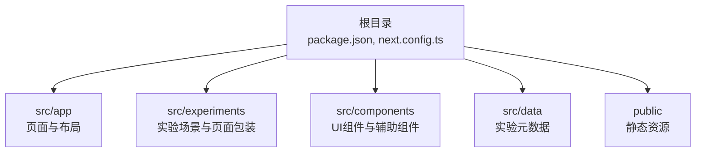
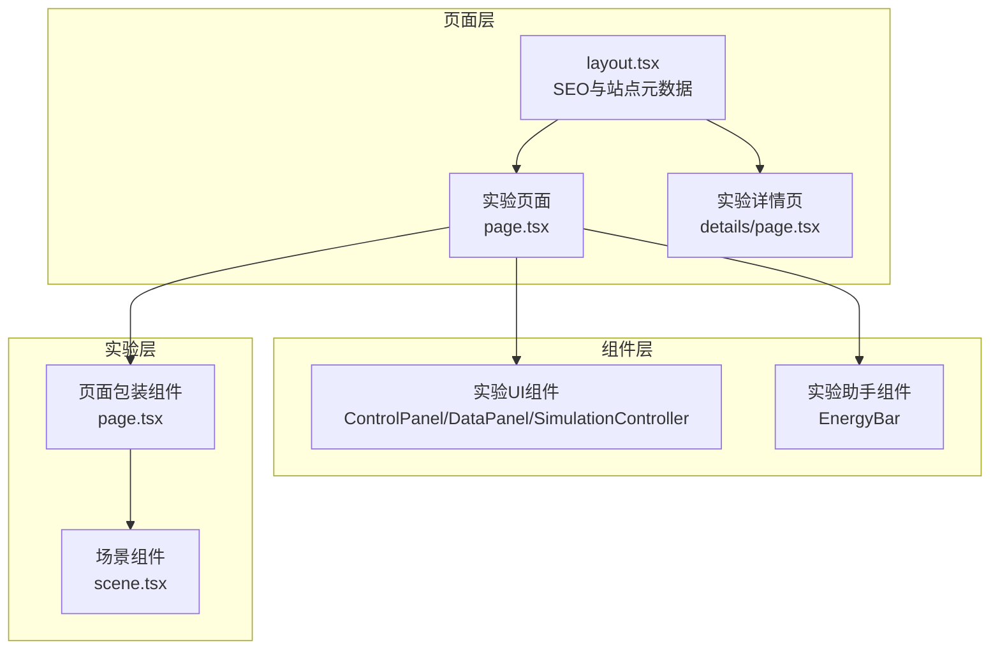
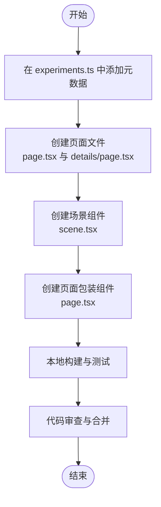
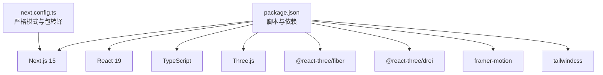

# 贡献指南

<cite>
**本文档引用的文件**
- [CONTRIBUTING.md](file://CONTRIBUTING.md)
- [CODE_OF_CONDUCT.md](file://CODE_OF_CONDUCT.md)
- [README.md](file://README.md)
- [ROADMAP.md](file://ROADMAP.md)
- [SECURITY.md](file://SECURITY.md)
- [SUPPORT.md](file://SUPPORT.md)
- [package.json](file://package.json)
- [next.config.ts](file://next.config.ts)
- [src/data/experiments.ts](file://src/data/experiments.ts)
- [src/app/layout.tsx](file://src/app/layout.tsx)
- [src/components/experiment-ui/index.ts](file://src/components/experiment-ui/index.ts)
- [src/components/experiment-helpers/index.ts](file://src/components/experiment-helpers/index.ts)
</cite>

## 目录
1. [简介](#简介)
2. [项目结构](#项目结构)
3. [核心组件](#核心组件)
4. [架构总览](#架构总览)
5. [详细组件分析](#详细组件分析)
6. [依赖关系分析](#依赖关系分析)
7. [性能考虑](#性能考虑)
8. [故障排除指南](#故障排除指南)
9. [结论](#结论)
10. [附录](#附录)

## 简介
本指南面向所有希望参与 ScienceLab 3D 项目开发的贡献者，涵盖从环境搭建、开发流程到代码规范与提交准则的完整路径。项目采用 Next.js 15 + React 19 + TypeScript 技术栈，结合 Three.js 和 React Three Fiber 提供 3D 科学模拟体验。无论你是新增实验、修复缺陷、改进 UI 还是增强性能，都欢迎加入我们，共同让科学学习更直观、更有趣。

## 项目结构
ScienceLab 3D 采用基于功能模块的组织方式，核心目录与职责如下：
- src/app：Next.js App Router 页面与布局，包含实验列表页、单个实验详情页等
- src/experiments：每个实验对应的页面包装器与 Three.js 场景组件
- src/components：可复用的实验 UI 组件与辅助组件（如能量条）
- src/data：实验元数据定义与分类信息
- public：静态资源（图标、清单文件等）
- 根目录：构建脚本、类型定义、配置文件与文档

图表来源
- [package.json:1-37](file://package.json#L1-L37)
- [next.config.ts:1-9](file://next.config.ts#L1-L9)

章节来源
- [README.md:108-158](file://README.md#L108-L158)
- [package.json:1-37](file://package.json#L1-L37)

## 核心组件
- 实验元数据管理：通过集中式数组维护实验 ID、标题、类别、难度、描述、图标、颜色与主题标签，便于统一展示与检索
- 实验页面与场景：每个实验在 app/experiments 下拥有独立页面与详情页，并在 experiments 目录下实现 Three.js 场景与页面包装组件
- 可复用 UI 组件：提供控制面板、数据面板、仿真控制器、滑块、下拉框等通用控件，支持实验参数实时调整
- 助手组件：如能量条等可视化辅助元素，提升用户体验与数据呈现效果

章节来源
- [src/data/experiments.ts:1-492](file://src/data/experiments.ts#L1-L492)
- [src/components/experiment-ui/index.ts:1-43](file://src/components/experiment-ui/index.ts#L1-L43)
- [src/components/experiment-helpers/index.ts:1-8](file://src/components/experiment-helpers/index.ts#L1-L8)

## 架构总览
ScienceLab 3D 的前端架构围绕 Next.js App Router 构建，页面层负责路由与 SEO 元数据，组件层提供交互控件，实验层封装 Three.js 场景与物理逻辑。整体数据流自上而下：用户操作触发 UI 控件事件，组件更新状态，页面根据状态渲染场景，Three.js 实时更新 3D 视觉反馈。

图表来源
- [src/app/layout.tsx:1-204](file://src/app/layout.tsx#L1-L204)
- [src/components/experiment-ui/index.ts:1-43](file://src/components/experiment-ui/index.ts#L1-L43)
- [src/components/experiment-helpers/index.ts:1-8](file://src/components/experiment-helpers/index.ts#L1-L8)

## 详细组件分析

### 新增实验流程
为保证一致性与可维护性，新增实验需遵循以下步骤：
1. 在实验元数据中注册实验信息（ID、标题、类别、难度、描述、图标、颜色、主题标签）
2. 创建实验页面与详情页（主仿真与理论说明）
3. 开发 Three.js 场景组件与页面包装组件
4. 完成本地构建与端到端测试（桌面与移动端）

图表来源
- [CONTRIBUTING.md:65-92](file://CONTRIBUTING.md#L65-L92)
- [src/data/experiments.ts:1-492](file://src/data/experiments.ts#L1-L492)

章节来源
- [CONTRIBUTING.md:65-92](file://CONTRIBUTING.md#L65-L92)

### 代码风格与提交规范
- 使用 TypeScript 并保持强类型约束，避免使用 any
- 优先使用函数式组件与 React Hooks
- 遵循命名约定：文件使用 kebab-case，组件使用 PascalCase
- 组件保持小而专注，复杂逻辑拆分模块
- 添加无障碍属性（aria-*、role、title）以提升可访问性
- 使用 Tailwind CSS 类实现响应式设计
- 提交信息采用约定式格式（例如 feat/fix/docs/chore），并在 PR 描述中清晰说明变更内容与动机

章节来源
- [CONTRIBUTING.md:95-103](file://CONTRIBUTING.md#L95-L103)

### 分支策略与代码审查
- 建议基于主分支创建特性分支或修复分支
- 提交前确保通过构建检查与本地预览验证
- 打开 Pull Request 后由维护者进行审查与合并
- 代码审查关注点：功能正确性、性能影响、可读性与可维护性、无障碍与跨设备兼容性

章节来源
- [CONTRIBUTING.md:27-62](file://CONTRIBUTING.md#L27-L62)

### 缺陷报告与功能建议
- 缺陷报告：提供清晰的问题描述、复现步骤、预期与实际行为、浏览器与设备信息
- 功能建议：描述需求背景、预期价值与可能的实现思路
- 安全漏洞：请通过安全通告渠道私下报告，避免公开披露

章节来源
- [CONTRIBUTING.md:106-122](file://CONTRIBUTING.md#L106-L122)
- [SECURITY.md:1-8](file://SECURITY.md#L1-L8)

### 治理结构与决策流程
- 项目由单一维护者主导，重大变更通常由维护者评估与决策
- 社区贡献通过 Issue 与 Pull Request 形式参与讨论与评审
- 行为准则适用于所有社区空间，维护者负责澄清与执行可接受行为标准

章节来源
- [CODE_OF_CONDUCT.md:1-26](file://CODE_OF_CONDUCT.md#L1-L26)

### 社区行为准则与沟通渠道
- 行为准则强调包容、尊重与建设性交流
- 支持渠道包括 GitHub、LinkedIn、X/Twitter 等社交平台
- 问题与支持可通过 Issue 模板与支持文档获取帮助

章节来源
- [CODE_OF_CONDUCT.md:1-26](file://CODE_OF_CONDUCT.md#L1-L26)
- [SUPPORT.md:1-16](file://SUPPORT.md#L1-L16)

### 贡献者认可与项目路线图
- 项目路线图展示了当前进展、计划与已完成里程碑
- 贡献者认可体现在仓库星标、社交分享与社区影响力传播

章节来源
- [ROADMAP.md:1-23](file://ROADMAP.md#L1-L23)

## 依赖关系分析
项目核心依赖包括 Next.js、React、TypeScript、Three.js 及其生态工具，构建脚本与严格模式配置确保开发体验与运行效率。

图表来源
- [package.json:1-37](file://package.json#L1-L37)
- [next.config.ts:1-9](file://next.config.ts#L1-L9)

章节来源
- [package.json:1-37](file://package.json#L1-L37)
- [next.config.ts:1-9](file://next.config.ts#L1-L9)

## 性能考虑
- 利用 Three.js 与 React Three Fiber 的高效渲染管线
- 通过严格模式与按需加载减少不必要的重绘
- Tailwind CSS 提供实用类样式，避免过度嵌套导致的样式抖动
- 在实验场景中合理控制几何体复杂度与材质数量，平衡视觉质量与性能

## 故障排除指南
- 环境与依赖
  - 确认 Node.js 版本满足要求，使用 npm 或 yarn 安装依赖后启动开发服务器
  - 如遇 Three.js 相关打包问题，检查严格模式与转译配置
- 构建与运行
  - 使用构建脚本进行预检，确保无编译错误后再进行本地预览
  - 若页面未正确显示，请检查 SEO 元数据与路由配置
- 安全问题
  - 发现安全漏洞请通过安全通告渠道私下报告，避免公开披露

章节来源
- [README.md:108-135](file://README.md#L108-L135)
- [SECURITY.md:1-8](file://SECURITY.md#L1-L8)

## 结论
通过遵循本指南，新贡献者可以快速理解项目结构、开发流程与规范，高效地参与实验开发与功能完善。我们鼓励大家在遵守行为准则的前提下积极贡献，共同推动 ScienceLab 3D 成为更优秀的开源科学教育平台。

## 附录
- 快速开始
  - 克隆仓库、安装依赖、启动开发服务器
  - 访问本地开发地址进行调试与验证
- 新实验模板
  - 在实验元数据中注册实验
  - 创建页面与场景组件
  - 完成本地测试与构建检查
- 沟通与支持
  - 通过 Issue 与 Pull Request 参与讨论
  - 关注路线图与里程碑，了解项目发展方向

章节来源
- [README.md:108-135](file://README.md#L108-L135)
- [CONTRIBUTING.md:65-92](file://CONTRIBUTING.md#L65-L92)
- [ROADMAP.md:1-23](file://ROADMAP.md#L1-L23)