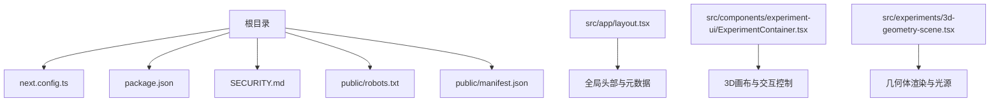
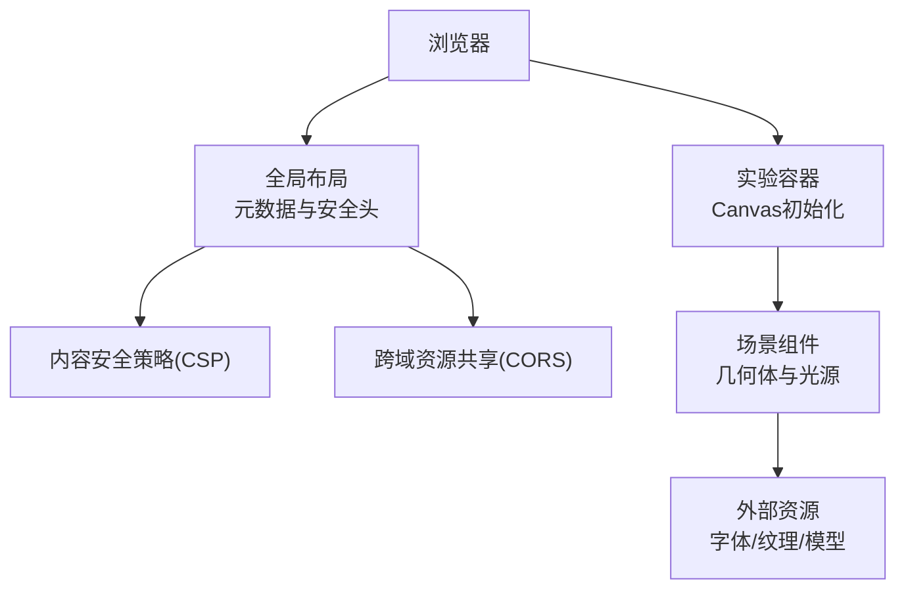
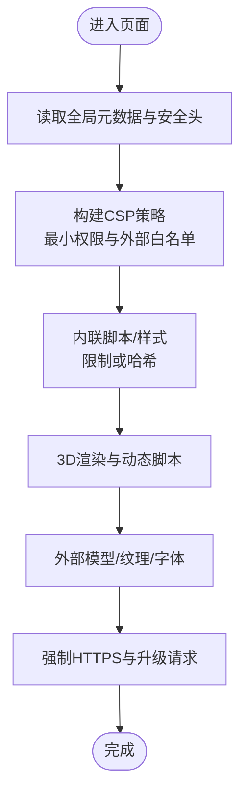
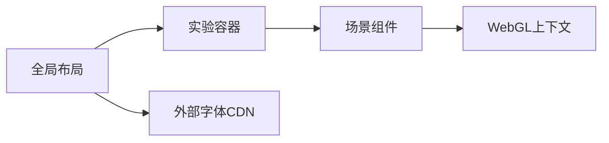

# 安全配置

<cite>
**本文引用的文件**
- [SECURITY.md](file://SECURITY.md)
- [next.config.ts](file://next.config.ts)
- [package.json](file://package.json)
- [src/app/layout.tsx](file://src/app/layout.tsx)
- [public/robots.txt](file://public/robots.txt)
- [public/manifest.json](file://public/manifest.json)
- [src/components/experiment-ui/ExperimentContainer.tsx](file://src/components/experiment-ui/ExperimentContainer.tsx)
- [src/experiments/3d-geometry-scene.tsx](file://src/experiments/3d-geometry-scene.tsx)
</cite>

## 目录
1. [简介](#简介)
2. [项目结构](#项目结构)
3. [核心组件](#核心组件)
4. [架构总览](#架构总览)
5. [详细组件分析](#详细组件分析)
6. [依赖关系分析](#依赖关系分析)
7. [性能与安全注意事项](#性能与安全注意事项)
8. [故障排查指南](#故障排查指南)
9. [结论](#结论)
10. [附录](#附录)

## 简介
本指南面向ScienceLab3D项目，提供一套系统化的安全配置与防护建议，重点覆盖以下方面：
- HTTPS与SSL证书：部署与运行时的传输层安全
- 内容安全策略（CSP）：针对3D场景与外部资源的策略设计
- 安全响应头：如X-Frame-Options、X-Content-Type-Options等
- 跨域资源共享（CORS）：在Next.js环境中的配置要点
- 安全扫描与漏洞检测：工具与流程建议
- 安全事件响应与数据保护：组织流程与技术手段
- 依赖项安全更新管理：策略与自动化

本指南以仓库现有配置为基础，结合Next.js与前端3D应用的特点，提出可落地的安全加固方案。

## 项目结构
ScienceLab3D采用Next.js App Router架构，核心安全相关文件分布如下：
- 部署与元数据：根目录下的安全政策、站点元信息与清单
- 运行时配置：Next.js配置与依赖声明
- 前端布局与资源：全局布局、robots.txt与manifest.json
- 3D实验组件：实验容器与场景渲染组件

图表来源
- [next.config.ts:1-9](file://next.config.ts#L1-L9)
- [package.json:1-37](file://package.json#L1-L37)
- [SECURITY.md:1-8](file://SECURITY.md#L1-L8)
- [public/robots.txt:1-9](file://public/robots.txt#L1-L9)
- [public/manifest.json:1-22](file://public/manifest.json#L1-L22)
- [src/app/layout.tsx:1-204](file://src/app/layout.tsx#L1-L204)
- [src/components/experiment-ui/ExperimentContainer.tsx:1-374](file://src/components/experiment-ui/ExperimentContainer.tsx#L1-L374)
- [src/experiments/3d-geometry-scene.tsx:1-243](file://src/experiments/3d-geometry-scene.tsx#L1-L243)

章节来源
- [next.config.ts:1-9](file://next.config.ts#L1-L9)
- [package.json:1-37](file://package.json#L1-L37)
- [SECURITY.md:1-8](file://SECURITY.md#L1-L8)
- [public/robots.txt:1-9](file://public/robots.txt#L1-L9)
- [public/manifest.json:1-22](file://public/manifest.json#L1-L22)
- [src/app/layout.tsx:1-204](file://src/app/layout.tsx#L1-L204)
- [src/components/experiment-ui/ExperimentContainer.tsx:1-374](file://src/components/experiment-ui/ExperimentContainer.tsx#L1-L374)
- [src/experiments/3d-geometry-scene.tsx:1-243](file://src/experiments/3d-geometry-scene.tsx#L1-L243)

## 核心组件
- 全局布局与元数据：定义站点URL、Open Graph、Twitter卡片、robots策略等，是实施CSP与安全头的基础入口
- 实验容器：负责3D画布初始化、相机与光照、交互控制，涉及外部字体与第三方资源加载
- 场景组件：具体3D几何体渲染，可能引入外部纹理或模型资源
- 部署与清单：robots.txt与manifest.json影响爬虫行为与PWA特性

章节来源
- [src/app/layout.tsx:19-118](file://src/app/layout.tsx#L19-L118)
- [src/components/experiment-ui/ExperimentContainer.tsx:137-208](file://src/components/experiment-ui/ExperimentContainer.tsx#L137-L208)
- [src/experiments/3d-geometry-scene.tsx:155-239](file://src/experiments/3d-geometry-scene.tsx#L155-L239)
- [public/robots.txt:1-9](file://public/robots.txt#L1-L9)
- [public/manifest.json:1-22](file://public/manifest.json#L1-L22)

## 架构总览
下图展示从浏览器到3D渲染管线的关键路径，以及安全策略的注入点：

图表来源
- [src/app/layout.tsx:180-203](file://src/app/layout.tsx#L180-L203)
- [src/components/experiment-ui/ExperimentContainer.tsx:137-208](file://src/components/experiment-ui/ExperimentContainer.tsx#L137-L208)
- [src/experiments/3d-geometry-scene.tsx:155-239](file://src/experiments/3d-geometry-scene.tsx#L155-L239)

## 详细组件分析

### HTTPS与SSL证书配置
- 运行时与部署
  - 项目通过Next.js构建并部署于平台（示例中指向托管域名），应确保使用HTTPS访问，避免混合内容问题
  - 全局元数据中已指定站点基础URL与规范链接，确保所有页面与资源引用基于HTTPS
- 证书与TLS
  - 在托管平台启用自动证书颁发与TLS终止；若自建反向代理，请配置强加密套件与协议版本
  - 强制重定向HTTP至HTTPS，防止中间人攻击与会话劫持
- 3D与外部资源
  - 字体与静态资源均通过HTTPS加载，避免混合内容警告
  - 若引入外部模型或纹理，确保来源可信且支持HTTPS

章节来源
- [src/app/layout.tsx:66-69](file://src/app/layout.tsx#L66-L69)
- [src/app/layout.tsx:188-194](file://src/app/layout.tsx#L188-L194)

### 内容安全策略（CSP）
- 设计原则
  - 最小权限：仅授权必要的源（内联脚本、样式、字体、图片、脚本、媒体）
  - 外部资源白名单：明确允许字体、CDN与统计服务域名
  - 3D场景特殊性：允许WebGL上下文与动态脚本执行；限制内联脚本，优先使用哈希或非ces
- 推荐策略要点
  - 对字体与预连接：fonts.googleapis.com、fonts.gstatic.com（已存在）
  - 对脚本：严格限制来源，禁用unsafe-inline与unsafe-eval
  - 对媒体与模型：仅允许必要域名，避免任意源
  - 对升级不安全请求：启用upgrade-insecure-requests
- 实施位置
  - 在全局布局的<head>中注入CSP响应头或<meta http-equiv="Content-Security-Policy">
  - 为3D场景与外部资源分别制定细粒度规则，避免过度放宽

图表来源
- [src/app/layout.tsx:188-194](file://src/app/layout.tsx#L188-L194)
- [src/components/experiment-ui/ExperimentContainer.tsx:137-208](file://src/components/experiment-ui/ExperimentContainer.tsx#L137-L208)
- [src/experiments/3d-geometry-scene.tsx:155-239](file://src/experiments/3d-geometry-scene.tsx#L155-L239)

### 安全响应头（XFO、XCTO、XSS、HPKP、Referrer等）
- X-Frame-Options
  - 建议设置为DENY或SAMEORIGIN，防止点击劫持
- X-Content-Type-Options
  - 设置为nosniff，阻止MIME类型混淆攻击
- Referrer-Policy
  - 控制引用者信息泄露，建议strict-origin-when-cross-origin
- Permissions-Policy
  - 明确关闭不必要的权限（如相机、麦克风、地理位置等）
- Strict-Transport-Security
  - 启用HTTPS强制，建议max-age≥31536000，包含子域与预加载
- Feature-Policy
  - 与Permissions-Policy协同，限制过时或高风险特性

章节来源
- [src/app/layout.tsx:180-203](file://src/app/layout.tsx#L180-L203)

### 跨域资源共享（CORS）
- Next.js环境下的CORS
  - 在API路由或边缘处理逻辑中显式设置Access-Control-Allow-Origin、Credentials、Expose-Headers等
  - 对于静态资源与外部CDN，确保CORS头正确返回
- 3D与外部资源
  - 字体与静态资源通常由CDN提供，需确认其CORS配置
  - 自定义模型或纹理服务应遵循最小暴露原则，限制来源与方法

章节来源
- [src/app/layout.tsx:188-194](file://src/app/layout.tsx#L188-L194)

### 依赖项安全更新管理
- 依赖健康检查
  - 使用包锁文件与安全扫描工具定期评估依赖漏洞
  - 关注高危与严重漏洞，及时升级到修复版本
- 自动化策略
  - 利用平台的依赖更新功能（如仓库的自动拉取请求）
  - 在CI中集成安全扫描步骤，阻断存在高危漏洞的合并
- 版本锁定与回滚
  - 锁定关键依赖版本，建立快速回滚机制
  - 对重大变更进行灰度发布与监控

章节来源
- [package.json:10-21](file://package.json#L10-L21)
- [package.json:33-35](file://package.json#L33-L35)

### 安全扫描与漏洞检测
- 工具建议
  - 依赖漏洞扫描：npm audit、Snyk、Dependabot
  - 代码安全扫描：ESLint安全规则、SonarQube
  - 运行时安全：OWASP ZAP、Burp Suite
- 流程建议
  - 开发阶段：本地扫描与提交前检查
  - CI阶段：自动化扫描与阈值拦截
  - 生产阶段：持续监控与告警联动

章节来源
- [SECURITY.md:3-8](file://SECURITY.md#L3-L8)

### 安全事件响应与数据保护
- 披露与报告
  - 按照安全政策通过私密通道提交漏洞，避免公开披露
- 应急处置
  - 快速评估影响范围与修复优先级
  - 发布补丁并通知用户与相关方
- 数据保护
  - 最小化收集原则，明确数据用途与保留期限
  - 加密存储与传输，访问日志审计与异常告警

章节来源
- [SECURITY.md:3-8](file://SECURITY.md#L3-L8)

## 依赖关系分析
- 组件耦合
  - 全局布局为安全策略注入的核心入口，实验容器与场景组件依赖其提供的资源与元数据
- 外部依赖
  - 字体与CDN资源通过预连接与HTTPS加载，降低加载风险
- 可能的脆弱点
  - 3D渲染管线涉及大量动态脚本与WebGL上下文，需配合严格的CSP与来源控制

图表来源
- [src/app/layout.tsx:188-194](file://src/app/layout.tsx#L188-L194)
- [src/components/experiment-ui/ExperimentContainer.tsx:137-208](file://src/components/experiment-ui/ExperimentContainer.tsx#L137-L208)
- [src/experiments/3d-geometry-scene.tsx:155-239](file://src/experiments/3d-geometry-scene.tsx#L155-L239)

章节来源
- [src/app/layout.tsx:188-194](file://src/app/layout.tsx#L188-L194)
- [src/components/experiment-ui/ExperimentContainer.tsx:137-208](file://src/components/experiment-ui/ExperimentContainer.tsx#L137-L208)
- [src/experiments/3d-geometry-scene.tsx:155-239](file://src/experiments/3d-geometry-scene.tsx#L155-L239)

## 性能与安全注意事项
- 渲染性能与安全平衡
  - 3D场景中合理设置抗锯齿、像素比与着色器，避免过度消耗导致长时间占用CPU/GPU
  - 将动态脚本与计算任务拆分，减少主线程阻塞
- 资源加载优化
  - 使用CDN缓存与HTTPS，结合ETag/Cache-Control提升加载效率
  - 对外部字体与模型进行缓存与降级策略，保障离线可用性

## 故障排查指南
- 混合内容与CSP冲突
  - 确认所有资源均为HTTPS；检查CSP是否允许相应来源
- 3D渲染异常
  - 检查WebGL支持与驱动；验证CSP未阻止动态脚本执行
- 字体加载失败
  - 核对预连接与CORS头；确认CDN可用性与缓存状态
- 依赖漏洞告警
  - 使用安全扫描工具定位具体依赖；按版本锁定与升级计划处理

章节来源
- [src/app/layout.tsx:188-194](file://src/app/layout.tsx#L188-L194)
- [src/components/experiment-ui/ExperimentContainer.tsx:137-208](file://src/components/experiment-ui/ExperimentContainer.tsx#L137-L208)
- [src/experiments/3d-geometry-scene.tsx:155-239](file://src/experiments/3d-geometry-scene.tsx#L155-L239)

## 结论
ScienceLab3D当前具备良好的基础：HTTPS基础、外部资源的预连接与清单配置。为进一步强化安全，建议在全局布局中引入严格的CSP与安全响应头，在Next.js环境中完善CORS策略，并建立自动化依赖安全扫描与事件响应流程。对于3D场景，应特别关注WebGL与动态脚本的来源控制，确保在提供沉浸式体验的同时满足安全要求。

## 附录
- 术语
  - CSP：内容安全策略
  - HSTS：严格传输安全
  - CORS：跨域资源共享
  - CDN：内容分发网络
- 参考实现位置
  - 全局布局与元数据：[src/app/layout.tsx:19-118](file://src/app/layout.tsx#L19-L118)
  - 实验容器与3D画布：[src/components/experiment-ui/ExperimentContainer.tsx:137-208](file://src/components/experiment-ui/ExperimentContainer.tsx#L137-L208)
  - 场景渲染与光源：[src/experiments/3d-geometry-scene.tsx:155-239](file://src/experiments/3d-geometry-scene.tsx#L155-L239)
  - 依赖与构建配置：[package.json:10-21](file://package.json#L10-L21)，[next.config.ts:3-6](file://next.config.ts#L3-L6)
  - 爬虫与清单：[public/robots.txt:1-9](file://public/robots.txt#L1-L9)，[public/manifest.json:1-22](file://public/manifest.json#L1-L22)
  - 安全政策：[SECURITY.md:3-8](file://SECURITY.md#L3-L8)