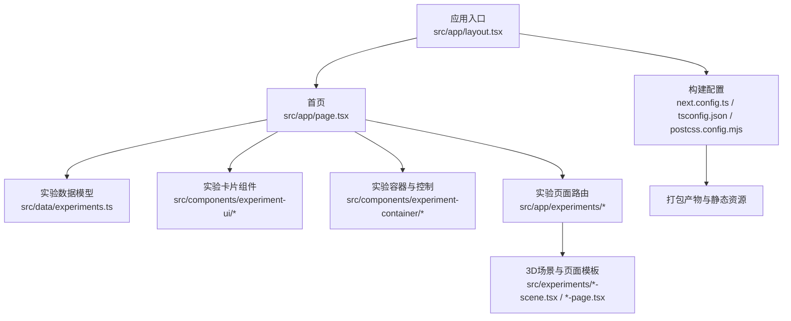
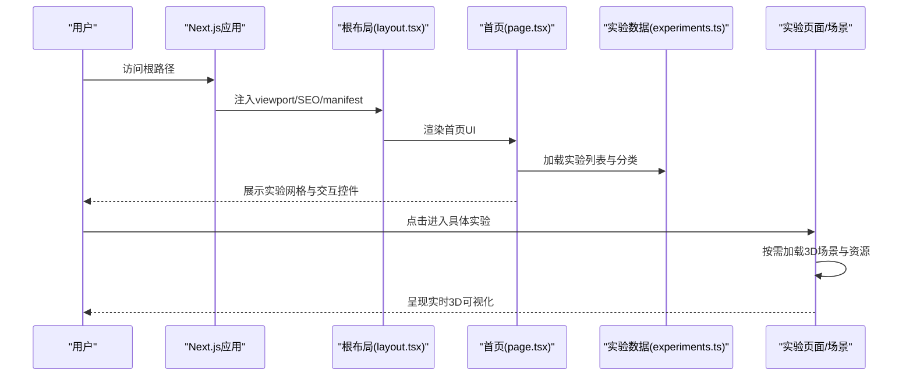
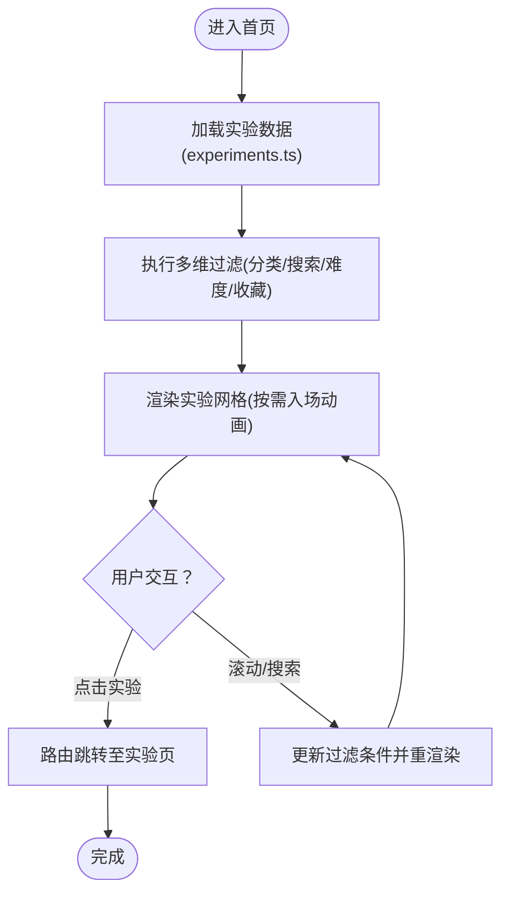
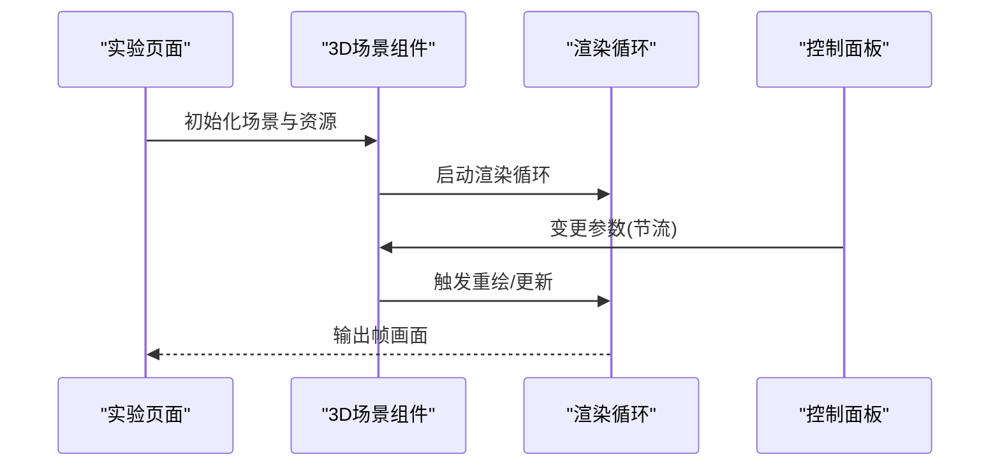
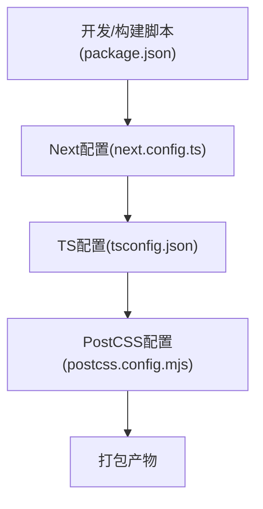
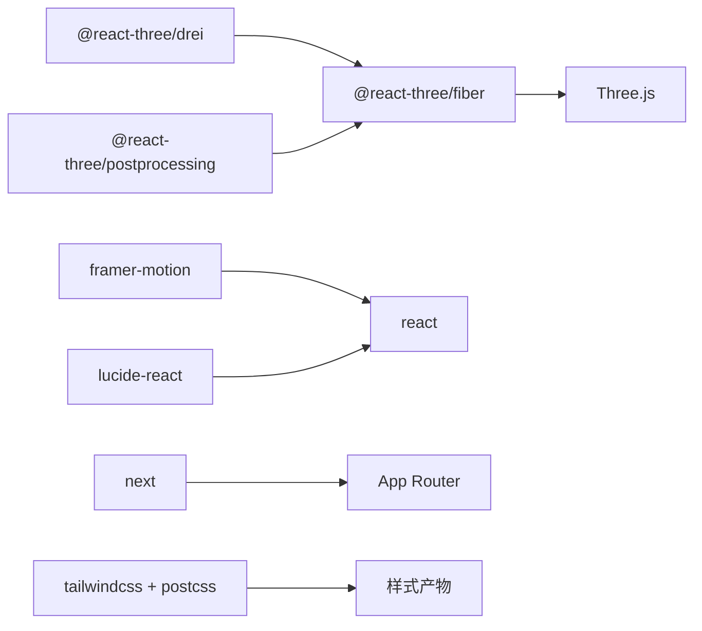

# 性能监控

<cite>
**本文引用的文件**
- [package.json](file://package.json)
- [next.config.ts](file://next.config.ts)
- [postcss.config.mjs](file://postcss.config.mjs)
- [tsconfig.json](file://tsconfig.json)
- [README.md](file://README.md)
- [src/app/layout.tsx](file://src/app/layout.tsx)
- [src/app/page.tsx](file://src/app/page.tsx)
- [src/data/experiments.ts](file://src/data/experiments.ts)
</cite>

## 目录
1. [简介](#简介)
2. [项目结构](#项目结构)
3. [核心组件](#核心组件)
4. [架构总览](#架构总览)
5. [详细组件分析](#详细组件分析)
6. [依赖关系分析](#依赖关系分析)
7. [性能考量与优化建议](#性能考量与优化建议)
8. [故障排查指南](#故障排查指南)
9. [结论](#结论)
10. [附录](#附录)

## 简介
本指南面向ScienceLab3D项目的性能监控与优化，聚焦以下目标：
- 应用加载时间、内存使用与3D渲染性能的监控方法
- Lighthouse与Web Vitals指标的采集与分析
- Chrome DevTools与React DevTools在性能分析中的使用
- 缓存策略（浏览器缓存与CDN缓存）的落地
- 代码分割、懒加载与资源压缩等优化实践
- 基准测试与持续监控的实施路径

## 项目结构
ScienceLab3D基于Next.js 15 + React 19构建，采用App Router组织页面与实验模块；3D可视化由Three.js与React Three Fiber驱动。整体结构清晰，利于按需加载与性能优化。

图表来源
- [src/app/layout.tsx:1-204](file://src/app/layout.tsx#L1-L204)
- [src/app/page.tsx:1-676](file://src/app/page.tsx#L1-L676)
- [src/data/experiments.ts:1-492](file://src/data/experiments.ts#L1-L492)
- [next.config.ts:1-9](file://next.config.ts#L1-L9)
- [tsconfig.json:1-22](file://tsconfig.json#L1-L22)
- [postcss.config.mjs:1-6](file://postcss.config.mjs#L1-L6)

章节来源
- [README.md:138-150](file://README.md#L138-L150)
- [next.config.ts:1-9](file://next.config.ts#L1-L9)
- [tsconfig.json:1-22](file://tsconfig.json#L1-L22)
- [postcss.config.mjs:1-6](file://postcss.config.mjs#L1-L6)

## 核心组件
- 入口布局与元数据：负责viewport、SEO、manifest与结构化数据注入，有助于首屏加载与可访问性表现。
- 首页与筛选系统：包含搜索、分类过滤、收藏管理与动画过渡，是用户首次交互的关键路径。
- 实验数据模型：集中定义40+实验的元信息，支撑前端筛选与导航，影响列表渲染与内存占用。
- 构建与编译配置：Next.js、TypeScript与PostCSS配置决定打包策略与产物体积。

章节来源
- [src/app/layout.tsx:1-204](file://src/app/layout.tsx#L1-L204)
- [src/app/page.tsx:1-676](file://src/app/page.tsx#L1-L676)
- [src/data/experiments.ts:1-492](file://src/data/experiments.ts#L1-L492)
- [next.config.ts:1-9](file://next.config.ts#L1-L9)
- [tsconfig.json:1-22](file://tsconfig.json#L1-L22)
- [postcss.config.mjs:1-6](file://postcss.config.mjs#L1-L6)

## 架构总览
下图展示从用户访问到3D实验加载的端到端流程，强调关键性能触点（首屏、路由切换、3D初始化、纹理与几何体加载）。

图表来源
- [src/app/layout.tsx:1-204](file://src/app/layout.tsx#L1-L204)
- [src/app/page.tsx:1-676](file://src/app/page.tsx#L1-L676)
- [src/data/experiments.ts:1-492](file://src/data/experiments.ts#L1-L492)

## 详细组件分析

### 首页与筛选系统（性能关键路径）
- 首屏渲染：包含动画背景、统计块与滚动指示器，注意避免阻塞主线程的重计算与大尺寸图片。
- 列表渲染：40+实验条目，支持多维过滤（分类、关键词、难度、收藏），应结合虚拟化或分页降低DOM节点数。
- 动画与过渡：Framer Motion用于入场动画与悬停效果，需关注帧率与合成层使用。
- 收藏与主题持久化：localStorage读写需防抖与批量更新，避免频繁回流。

图表来源
- [src/app/page.tsx:305-510](file://src/app/page.tsx#L305-L510)
- [src/data/experiments.ts:12-492](file://src/data/experiments.ts#L12-L492)

章节来源
- [src/app/page.tsx:1-676](file://src/app/page.tsx#L1-L676)
- [src/data/experiments.ts:1-492](file://src/data/experiments.ts#L1-L492)

### 3D场景与页面模板（渲染性能关键）
- 场景按需加载：每个实验页面仅在进入时加载对应场景与资源，减少初始包体。
- 资源类型：几何体、纹理、后处理与控制器，需评估LOD、压缩与缓存命中。
- 控制面板与实时更新：滑块与参数变更应节流，避免每帧高频重绘。

图表来源
- [src/app/experiments/*/page.tsx](file://src/app/experiments/3d-geometry/page.tsx)
- [src/experiments/*-scene.tsx](file://src/experiments/3d-geometry-scene.tsx)

章节来源
- [README.md:38-40](file://README.md#L38-L40)

### 构建与编译配置（打包与体积控制）
- Next.js严格模式与包转译：开启严格模式有助于早期发现异常，转译特定包（如three）确保兼容性。
- TypeScript严格模式与增量编译：提升开发体验与构建稳定性。
- PostCSS与Tailwind：按需生成样式，减少运行时开销。

图表来源
- [package.json:1-37](file://package.json#L1-L37)
- [next.config.ts:1-9](file://next.config.ts#L1-L9)
- [tsconfig.json:1-22](file://tsconfig.json#L1-L22)
- [postcss.config.mjs:1-6](file://postcss.config.mjs#L1-L6)

章节来源
- [package.json:1-37](file://package.json#L1-L37)
- [next.config.ts:1-9](file://next.config.ts#L1-L9)
- [tsconfig.json:1-22](file://tsconfig.json#L1-L22)
- [postcss.config.mjs:1-6](file://postcss.config.mjs#L1-L6)

## 依赖关系分析
- 3D渲染栈：Three.js + React Three Fiber + Drei + PostProcessing，构成高性能3D可视化基础。
- 动画与UI：Framer Motion提供流畅动画；Lucide React图标库轻量。
- 工具链：Next.js 15、TypeScript、Tailwind CSS与PostCSS。

图表来源
- [package.json:10-21](file://package.json#L10-L21)

章节来源
- [package.json:10-21](file://package.json#L10-L21)

## 性能考量与优化建议

### 一、加载时间监控与优化
- 关键指标
  - FCP/LCP/CLS/Web Vitals仪表盘
  - 首屏内容（Hero/网格）与交互元素（按钮/输入）可用性
- 监控手段
  - 使用Lighthouse（本地/CI）、WebPageTest、Pagespeed Insights
  - 在生产埋点收集FCP/LCP/INP/CLS
- 优化策略
  - 代码分割：将实验页面按需加载，减少首屏JS体积
  - 图片与字体：预连接与异步加载，优先级降级
  - 预渲染与静态导出：对不常变的内容启用静态生成

章节来源
- [src/app/layout.tsx:13-118](file://src/app/layout.tsx#L13-L118)
- [src/app/page.tsx:305-510](file://src/app/page.tsx#L305-L510)

### 二、内存使用监控与优化
- 监控手段
  - Chrome DevTools Memory面板记录堆快照与增长趋势
  - React DevTools Profiler识别高成本组件
- 优化策略
  - 避免不必要的状态提升与深层重渲染
  - 对长列表使用稳定key与分页/虚拟化
  - 释放未使用的几何体/纹理与事件监听器

章节来源
- [src/app/page.tsx:305-510](file://src/app/page.tsx#L305-L510)

### 三、3D渲染性能监控与优化
- 监控手段
  - FPS计数器与渲染时间（requestAnimationFrame测量）
  - GPU内存与绘制调用次数（Chrome DevTools Rendering面板）
- 优化策略
  - 几何体与纹理压缩（如basis/universal）
  - 后处理管线简化与分辨率下调
  - 控制面板参数变更节流与批量更新
  - 使用LOD与视锥剔除

章节来源
- [README.md:38-40](file://README.md#L38-L40)
- [src/app/experiments/*/page.tsx](file://src/app/experiments/3d-geometry/page.tsx)

### 四、Lighthouse与Web Vitals
- Lighthouse
  - 定期在本地与CI运行，关注性能、可访问性、SEO与最佳实践
- Web Vitals
  - 持续采集FCP/LCP/CLS/INP，设定阈值告警
  - 结合路由维度（首页、实验页）拆分指标

章节来源
- [src/app/layout.tsx:13-118](file://src/app/layout.tsx#L13-L118)

### 五、性能分析工具使用指南
- Chrome DevTools
  - Performance：录制交互，定位长任务与布局抖动
  - Memory：捕获堆快照，查找泄漏与大对象
  - Rendering：强制合成层、显示FPS与渲染区域
- React DevTools
  - Profiling：识别高成本组件与重渲染热点
  - Highlight Updates：观察渲染范围

章节来源
- [src/app/page.tsx:1-676](file://src/app/page.tsx#L1-L676)

### 六、缓存策略
- 浏览器缓存
  - 静态资源（JS/CSS/媒体）设置长缓存与版本化
  - HTML与动态接口设置合理Cache-Control
- CDN缓存
  - 配置边缘缓存策略与压缩（Gzip/Brotli）
  - 对3D资源（纹理/几何）启用缓存与回源校验

章节来源
- [src/app/layout.tsx:13-118](file://src/app/layout.tsx#L13-L118)

### 七、优化最佳实践
- 代码分割与懒加载
  - 实验页面使用动态导入与Suspense边界
  - 首屏仅加载必要组件与数据
- 资源压缩
  - 图片矢量化与WebP；音频视频压缩与自适应码率
  - CSS与JS压缩、Tree-shaking与Side Effects清理
- 运行时优化
  - 参数变更节流（debounce/throttle）
  - 合理的动画与过渡，避免过度合成层

章节来源
- [src/app/page.tsx:305-510](file://src/app/page.tsx#L305-L510)
- [next.config.ts:1-9](file://next.config.ts#L1-L9)

### 八、基准测试与持续监控
- 基准测试
  - 设定设备/网络模拟（4G/5G、CPU限制）
  - 固定场景（首页、典型实验页）重复测量
- 持续监控
  - CI集成Lighthouse与WebPageTest
  - 生产环境Web Vitals告警与回归检测

章节来源
- [package.json:5-8](file://package.json#L5-L8)

## 故障排查指南
- 首屏过慢
  - 检查是否启用严格模式与包转译；确认按需加载策略
  - 使用Lighthouse与Performance面板定位瓶颈
- 帧率下降
  - 检查3D场景复杂度与后处理；减少绘制调用与纹理分辨率
  - 使用Rendering面板查看强制合成层与重绘区域
- 内存泄漏
  - 使用Memory面板捕获快照对比；检查事件监听器与定时器清理
- 交互卡顿
  - 检查长任务与布局抖动；对高频回调进行节流
  - 使用Profiler识别重渲染热点

章节来源
- [next.config.ts:3-6](file://next.config.ts#L3-L6)
- [src/app/page.tsx:1-676](file://src/app/page.tsx#L1-L676)

## 结论
通过明确的监控指标、完善的分析工具与系统化的优化策略，ScienceLab3D可在保证3D交互体验的同时，持续提升加载速度、运行效率与稳定性。建议将性能纳入开发流程与发布检查清单，形成闭环。

## 附录
- 快速检查清单
  - 首页与实验页均通过Lighthouse基线测试
  - 首屏JS体积与请求数满足阈值
  - 3D场景帧率稳定，无明显掉帧
  - 内存曲线平稳，无持续增长
  - Web Vitals在生产环境持续达标