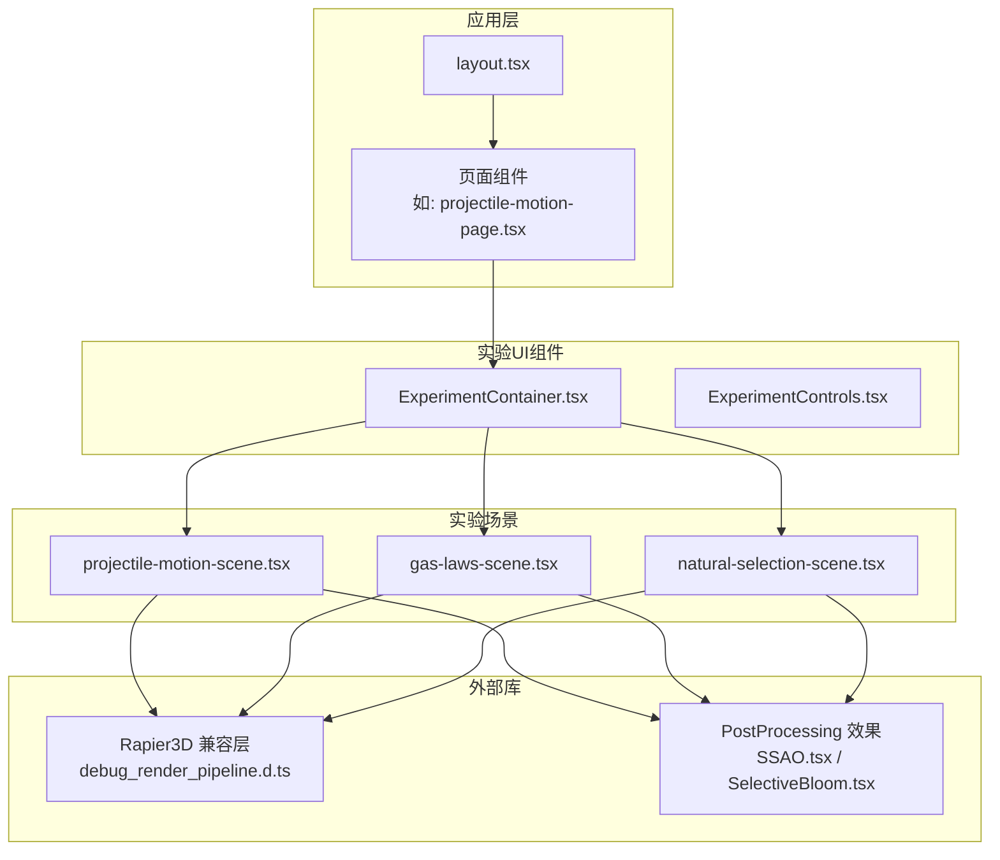
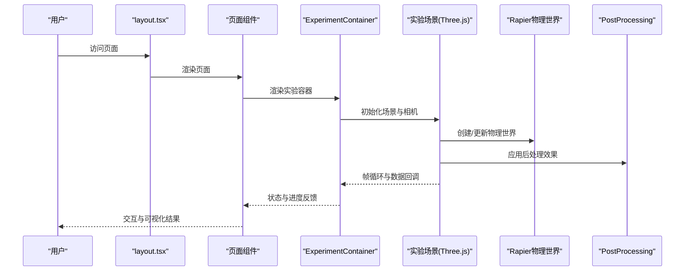
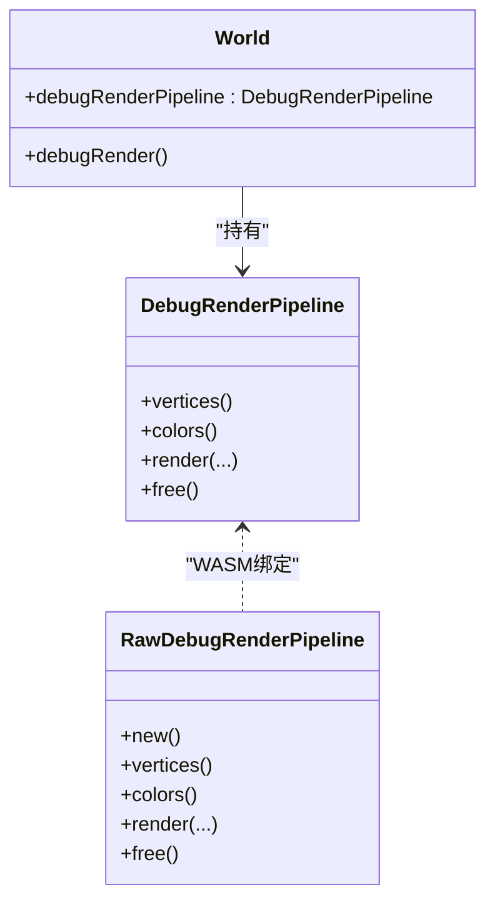
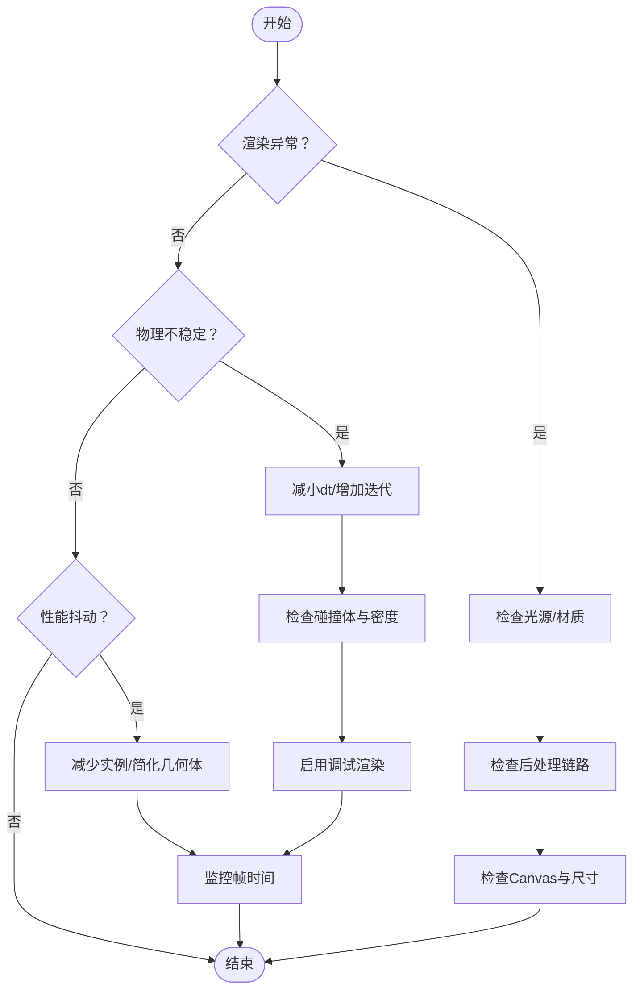
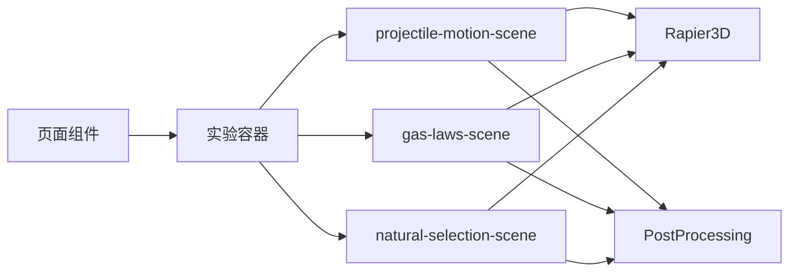

# 日志记录与调试

<cite>
**本文引用的文件**
- [package.json](file://package.json)
- [next.config.ts](file://next.config.ts)
- [src/app/layout.tsx](file://src/app/layout.tsx)
- [src/components/experiment-ui/ExperimentContainer.tsx](file://src/components/experiment-ui/ExperimentContainer.tsx)
- [src/components/experiment-ui/ExperimentControls.tsx](file://src/components/experiment-ui/ExperimentControls.tsx)
- [src/experiments/projectile-motion-scene.tsx](file://src/experiments/projectile-motion-scene.tsx)
- [src/experiments/gas-laws-scene.tsx](file://src/experiments/gas-laws-scene.tsx)
- [src/experiments/natural-selection-scene.tsx](file://src/experiments/natural-selection-scene.tsx)
- [src/utils/physics.ts](file://src/utils/physics.ts)
- [node_modules/@react-three/postprocessing/src/effects/SSAO.tsx](file://node_modules/@react-three/postprocessing/src/effects/SSAO.tsx)
- [node_modules/@react-three/postprocessing/src/effects/SelectiveBloom.tsx](file://node_modules/@react-three/postprocessing/src/effects/SelectiveBloom.tsx)
- [node_modules/@dimforge/rapier3d-compat/pipeline/world.d.ts](file://node_modules/@dimforge/rapier3d-compat/pipeline/world.d.ts)
- [node_modules/@dimforge/rapier3d-compat/pipeline/debug_render_pipeline.d.ts](file://node_modules/@dimforge/rapier3d-compat/pipeline/debug_render_pipeline.d.ts)
- [node_modules/@dimforge/rapier3d-compat/rapier_wasm3d.d.ts](file://node_modules/@dimforge/rapier3d-compat/rapier_wasm3d.d.ts)
- [node_modules/@dimforge/rapier3d-compat/rapier_wasm3d_bg.wasm.d.ts](file://node_modules/@dimforge/rapier3d-compat/rapier_wasm3d_bg.wasm.d.ts)
</cite>

## 目录
1. [简介](#简介)
2. [项目结构](#项目结构)
3. [核心组件](#核心组件)
4. [架构总览](#架构总览)
5. [详细组件分析](#详细组件分析)
6. [依赖关系分析](#依赖关系分析)
7. [性能考量](#性能考量)
8. [故障排查指南](#故障排查指南)
9. [结论](#结论)
10. [附录](#附录)

## 简介
本指南面向ScienceLab3D项目的开发者与运维人员，系统化介绍日志记录与调试策略，覆盖开发与生产环境配置、浏览器控制台与服务器端日志使用、Three.js与Rapier物理引擎调试技巧、错误追踪系统（如Sentry）集成建议、性能日志与用户行为日志采集方法，以及常见问题诊断流程与监控告警设置。

## 项目结构
ScienceLab3D采用Next.js App Router组织页面与实验场景，实验场景通过Three.js进行3D渲染，并结合Rapier物理引擎实现物理仿真。日志与调试涉及前端渲染层、物理层、控制面板与路由层等多组件协作。

图表来源
- [src/app/layout.tsx](file://src/app/layout.tsx)
- [src/components/experiment-ui/ExperimentContainer.tsx](file://src/components/experiment-ui/ExperimentContainer.tsx)
- [src/experiments/projectile-motion-scene.tsx](file://src/experiments/projectile-motion-scene.tsx)
- [src/experiments/gas-laws-scene.tsx](file://src/experiments/gas-laws-scene.tsx)
- [src/experiments/natural-selection-scene.tsx](file://src/experiments/natural-selection-scene.tsx)
- [node_modules/@react-three/postprocessing/src/effects/SSAO.tsx](file://node_modules/@react-three/postprocessing/src/effects/SSAO.tsx)
- [node_modules/@react-three/postprocessing/src/effects/SelectiveBloom.tsx](file://node_modules/@react-three/postprocessing/src/effects/SelectiveBloom.tsx)
- [node_modules/@dimforge/rapier3d-compat/pipeline/debug_render_pipeline.d.ts](file://node_modules/@dimforge/rapier3d-compat/pipeline/debug_render_pipeline.d.ts)

章节来源
- [src/app/layout.tsx](file://src/app/layout.tsx)
- [src/components/experiment-ui/ExperimentContainer.tsx](file://src/components/experiment-ui/ExperimentContainer.tsx)
- [src/experiments/projectile-motion-scene.tsx](file://src/experiments/projectile-motion-scene.tsx)
- [src/experiments/gas-laws-scene.tsx](file://src/experiments/gas-laws-scene.tsx)
- [src/experiments/natural-selection-scene.tsx](file://src/experiments/natural-selection-scene.tsx)

## 核心组件
- 应用布局与路由：负责全局样式、导航与页面入口，便于统一注入日志初始化与错误边界。
- 实验容器：封装Three.js Canvas、环境与雾效，是渲染与调试的根节点。
- 控制面板：提供参数调节、进度条与状态显示，适合埋点与性能采样。
- 物理场景：集中体现Three.js与Rapier交互，是调试渲染与物理同步的关键位置。
- 外部库：PostProcessing效果在运行时可能输出警告/错误；Rapier兼容层提供调试渲染接口。

章节来源
- [src/app/layout.tsx](file://src/app/layout.tsx)
- [src/components/experiment-ui/ExperimentContainer.tsx](file://src/components/experiment-ui/ExperimentContainer.tsx)
- [src/components/experiment-ui/ExperimentControls.tsx](file://src/components/experiment-ui/ExperimentControls.tsx)
- [src/experiments/projectile-motion-scene.tsx](file://src/experiments/projectile-motion-scene.tsx)
- [src/experiments/gas-laws-scene.tsx](file://src/experiments/gas-laws-scene.tsx)
- [src/experiments/natural-selection-scene.tsx](file://src/experiments/natural-selection-scene.tsx)
- [node_modules/@react-three/postprocessing/src/effects/SSAO.tsx](file://node_modules/@react-three/postprocessing/src/effects/SSAO.tsx)
- [node_modules/@react-three/postprocessing/src/effects/SelectiveBloom.tsx](file://node_modules/@react-three/postprocessing/src/effects/SelectiveBloom.tsx)

## 架构总览
下图展示从页面到渲染与物理的调用链路，以及日志与调试的切入位置。

图表来源
- [src/app/layout.tsx](file://src/app/layout.tsx)
- [src/components/experiment-ui/ExperimentContainer.tsx](file://src/components/experiment-ui/ExperimentContainer.tsx)
- [src/experiments/projectile-motion-scene.tsx](file://src/experiments/projectile-motion-scene.tsx)
- [src/experiments/gas-laws-scene.tsx](file://src/experiments/gas-laws-scene.tsx)
- [src/experiments/natural-selection-scene.tsx](file://src/experiments/natural-selection-scene.tsx)
- [node_modules/@react-three/postprocessing/src/effects/SSAO.tsx](file://node_modules/@react-three/postprocessing/src/effects/SSAO.tsx)

## 详细组件分析

### 开发与生产日志配置
- 开发环境
  - 使用浏览器控制台进行即时调试，开启严格模式与Source Map以便定位源码。
  - 在页面入口与实验容器中注入轻量级日志器，输出关键事件与帧率信息。
- 生产环境
  - 通过环境变量控制日志级别与上报开关，避免在高负载下产生额外开销。
  - 将错误与性能指标上报至集中式日志平台或错误追踪服务（见“错误追踪系统”）。

章节来源
- [src/app/layout.tsx](file://src/app/layout.tsx)
- [src/components/experiment-ui/ExperimentContainer.tsx](file://src/components/experiment-ui/ExperimentContainer.tsx)

### 浏览器控制台与服务器端日志
- 浏览器控制台
  - 打开开发者工具的Console标签页，观察Three.js与Rapier运行时输出。
  - 对于PostProcessing效果，留意其在特定条件下的警告/错误提示。
- 服务器端日志
  - Next.js默认输出请求与构建日志，可在部署平台查看。
  - 如需自定义日志，可在中间件或API路由中集成日志库，并按环境变量启用。

章节来源
- [node_modules/@react-three/postprocessing/src/effects/SSAO.tsx](file://node_modules/@react-three/postprocessing/src/effects/SSAO.tsx)
- [node_modules/@react-three/postprocessing/src/effects/SelectiveBloom.tsx](file://node_modules/@react-three/postprocessing/src/effects/SelectiveBloom.tsx)

### Three.js渲染调试
- 场景与相机
  - 在实验容器中检查Canvas参数、光源与环境贴图，确认渲染基础。
- 后处理效果
  - 某些效果在缺少前置Pass时会输出警告，应按要求启用必要Pass。
- 数据面板与进度条
  - 利用控制面板的进度条与数值显示，验证数据回调频率与数值范围。

章节来源
- [src/components/experiment-ui/ExperimentContainer.tsx](file://src/components/experiment-ui/ExperimentContainer.tsx)
- [src/components/experiment-ui/ExperimentControls.tsx](file://src/components/experiment-ui/ExperimentControls.tsx)
- [node_modules/@react-three/postprocessing/src/effects/SSAO.tsx](file://node_modules/@react-three/postprocessing/src/effects/SSAO.tsx)
- [node_modules/@react-three/postprocessing/src/effects/SelectiveBloom.tsx](file://node_modules/@react-three/postprocessing/src/effects/SelectiveBloom.tsx)

### Rapier物理引擎调试
- 调试渲染管线
  - 通过Rapier兼容层提供的调试渲染接口，绘制碰撞体、约束与接触点，辅助定位物理问题。
- 内存与资源释放
  - 调试渲染对象需要手动释放，避免WASM资源泄漏。
- 物理步进与帧率
  - 在场景中限制每帧最大dt，确保物理步进稳定；对大质量或复杂场景可降低步进频率。

图表来源
- [node_modules/@dimforge/rapier3d-compat/pipeline/world.d.ts](file://node_modules/@dimforge/rapier3d-compat/pipeline/world.d.ts)
- [node_modules/@dimforge/rapier3d-compat/pipeline/debug_render_pipeline.d.ts](file://node_modules/@dimforge/rapier3d-compat/pipeline/debug_render_pipeline.d.ts)
- [node_modules/@dimforge/rapier3d-compat/rapier_wasm3d.d.ts](file://node_modules/@dimforge/rapier3d-compat/rapier_wasm3d.d.ts)
- [node_modules/@dimforge/rapier3d-compat/rapier_wasm3d_bg.wasm.d.ts](file://node_modules/@dimforge/rapier3d-compat/rapier_wasm3d_bg.wasm.d.ts)

章节来源
- [node_modules/@dimforge/rapier3d-compat/pipeline/world.d.ts](file://node_modules/@dimforge/rapier3d-compat/pipeline/world.d.ts)
- [node_modules/@dimforge/rapier3d-compat/pipeline/debug_render_pipeline.d.ts](file://node_modules/@dimforge/rapier3d-compat/pipeline/debug_render_pipeline.d.ts)
- [node_modules/@dimforge/rapier3d-compat/rapier_wasm3d.d.ts](file://node_modules/@dimforge/rapier3d-compat/rapier_wasm3d.d.ts)
- [node_modules/@dimforge/rapier3d-compat/rapier_wasm3d_bg.wasm.d.ts](file://node_modules/@dimforge/rapier3d-compat/rapier_wasm3d_bg.wasm.d.ts)

### 错误追踪系统集成（Sentry等）
- 建议在应用入口初始化错误追踪SDK，捕获未处理异常与Promise拒绝。
- 对关键路径（如物理步进、场景切换、数据回调）包裹try/catch并上报上下文信息。
- 区分开发与生产环境的采样率，避免线上噪声。

章节来源
- [src/app/layout.tsx](file://src/app/layout.tsx)

### 性能日志与用户行为日志
- 性能日志
  - 记录帧时间、内存占用、几何体数量与材质数量等指标，用于识别渲染瓶颈。
  - 在场景更新中统计物理步进耗时与渲染耗时，区分CPU/GPU负载。
- 用户行为日志
  - 记录实验进入/退出、参数调整、重置与导出等关键动作，便于分析使用路径。

章节来源
- [src/experiments/projectile-motion-scene.tsx](file://src/experiments/projectile-motion-scene.tsx)
- [src/experiments/gas-laws-scene.tsx](file://src/experiments/gas-laws-scene.tsx)
- [src/experiments/natural-selection-scene.tsx](file://src/experiments/natural-selection-scene.tsx)
- [src/components/experiment-ui/ExperimentControls.tsx](file://src/components/experiment-ui/ExperimentControls.tsx)

### 常见问题诊断流程
- 渲染异常
  - 检查光源与材质是否正确加载；确认后处理链路完整；核对Canvas尺寸与设备像素比。
- 物理不稳定
  - 减小dt、增加迭代次数、检查碰撞体形状与密度；使用调试渲染观察接触与约束。
- 性能抖动
  - 分析帧时间分布，减少实例数量、简化几何体或纹理；合并材质批次。

图表来源
- [src/components/experiment-ui/ExperimentContainer.tsx](file://src/components/experiment-ui/ExperimentContainer.tsx)
- [node_modules/@react-three/postprocessing/src/effects/SSAO.tsx](file://node_modules/@react-three/postprocessing/src/effects/SSAO.tsx)
- [node_modules/@dimforge/rapier3d-compat/pipeline/debug_render_pipeline.d.ts](file://node_modules/@dimforge/rapier3d-compat/pipeline/debug_render_pipeline.d.ts)

## 依赖关系分析
- 组件耦合
  - 页面组件依赖实验容器；实验容器同时依赖Three.js场景与物理世界。
- 外部依赖
  - PostProcessing效果在缺失前置Pass时会输出警告；Rapier调试渲染需要手动释放资源。
- 可能的循环依赖
  - 当前结构以页面为入口，向下依赖UI与场景，未见明显循环。

图表来源
- [src/components/experiment-ui/ExperimentContainer.tsx](file://src/components/experiment-ui/ExperimentContainer.tsx)
- [src/experiments/projectile-motion-scene.tsx](file://src/experiments/projectile-motion-scene.tsx)
- [src/experiments/gas-laws-scene.tsx](file://src/experiments/gas-laws-scene.tsx)
- [src/experiments/natural-selection-scene.tsx](file://src/experiments/natural-selection-scene.tsx)
- [node_modules/@react-three/postprocessing/src/effects/SSAO.tsx](file://node_modules/@react-three/postprocessing/src/effects/SSAO.tsx)
- [node_modules/@dimforge/rapier3d-compat/pipeline/world.d.ts](file://node_modules/@dimforge/rapier3d-compat/pipeline/world.d.ts)

章节来源
- [src/components/experiment-ui/ExperimentContainer.tsx](file://src/components/experiment-ui/ExperimentContainer.tsx)
- [src/experiments/projectile-motion-scene.tsx](file://src/experiments/projectile-motion-scene.tsx)
- [src/experiments/gas-laws-scene.tsx](file://src/experiments/gas-laws-scene.tsx)
- [src/experiments/natural-selection-scene.tsx](file://src/experiments/natural-selection-scene.tsx)
- [node_modules/@react-three/postprocessing/src/effects/SSAO.tsx](file://node_modules/@react-three/postprocessing/src/effects/SSAO.tsx)
- [node_modules/@react-three/postprocessing/src/effects/SelectiveBloom.tsx](file://node_modules/@react-three/postprocessing/src/effects/SelectiveBloom.tsx)
- [node_modules/@dimforge/rapier3d-compat/pipeline/world.d.ts](file://node_modules/@dimforge/rapier3d-compat/pipeline/world.d.ts)

## 性能考量
- 渲染优化
  - 控制实例数量与几何复杂度；合并材质与纹理；合理使用instanced mesh。
- 物理优化
  - 限制dt、减少刚体数量与复杂碰撞体；使用层次化碰撞检测。
- 日志与监控
  - 仅在开发环境输出高频日志；生产环境采用采样与聚合上报。

## 故障排查指南
- 浏览器控制台
  - 观察Three.js与Rapier的运行时输出；关注后处理效果的警告。
- 实验容器
  - 确认Canvas参数、环境与雾效配置；检查相机与控制器初始化。
- 物理场景
  - 使用调试渲染观察碰撞体与约束；核对步进参数与边界条件。
- 用户行为
  - 通过控制面板的动作按钮与进度条，验证数据回调与状态变更。

章节来源
- [src/components/experiment-ui/ExperimentContainer.tsx](file://src/components/experiment-ui/ExperimentContainer.tsx)
- [src/components/experiment-ui/ExperimentControls.tsx](file://src/components/experiment-ui/ExperimentControls.tsx)
- [node_modules/@react-three/postprocessing/src/effects/SSAO.tsx](file://node_modules/@react-three/postprocessing/src/effects/SSAO.tsx)
- [node_modules/@react-three/postprocessing/src/effects/SelectiveBloom.tsx](file://node_modules/@react-three/postprocessing/src/effects/SelectiveBloom.tsx)
- [node_modules/@dimforge/rapier3d-compat/pipeline/debug_render_pipeline.d.ts](file://node_modules/@dimforge/rapier3d-compat/pipeline/debug_render_pipeline.d.ts)

## 结论
通过在页面入口、实验容器与场景中分层注入日志与调试能力，并结合Rapier调试渲染与PostProcessing的运行时提示，可以高效定位渲染与物理问题。配合错误追踪系统与性能/行为日志，形成完整的可观测性闭环，支撑开发与生产的持续改进。

## 附录
- 配置建议
  - 开发：启用详细日志与Source Map；关闭非必要上报。
  - 生产：限制日志级别与上报频率；对关键错误开启实时告警。
- 工具推荐
  - 浏览器开发者工具、性能面板与网络面板。
  - 3D调试：使用Rapier调试渲染与几何可视化。
  - 错误追踪：在应用入口初始化SDK并配置过滤规则。