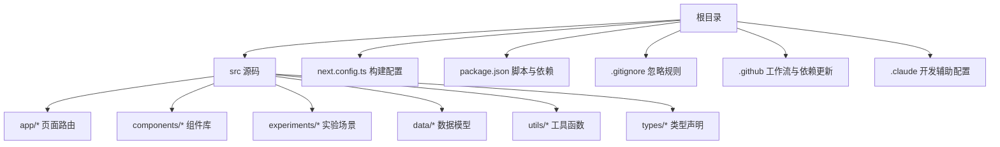
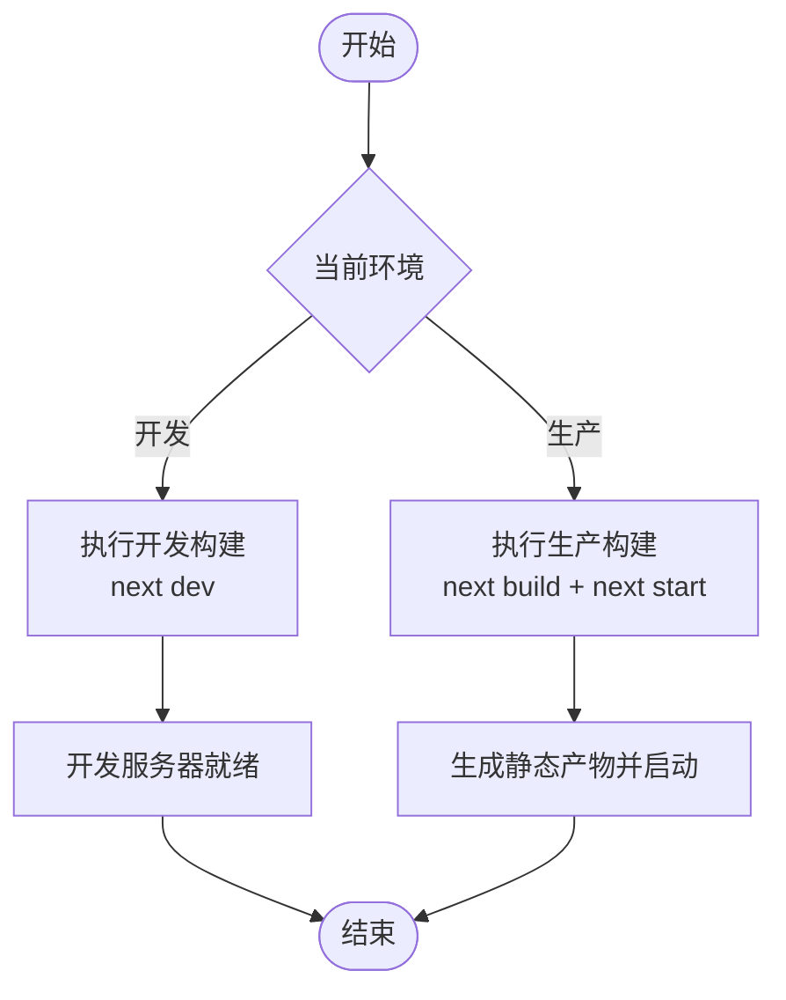
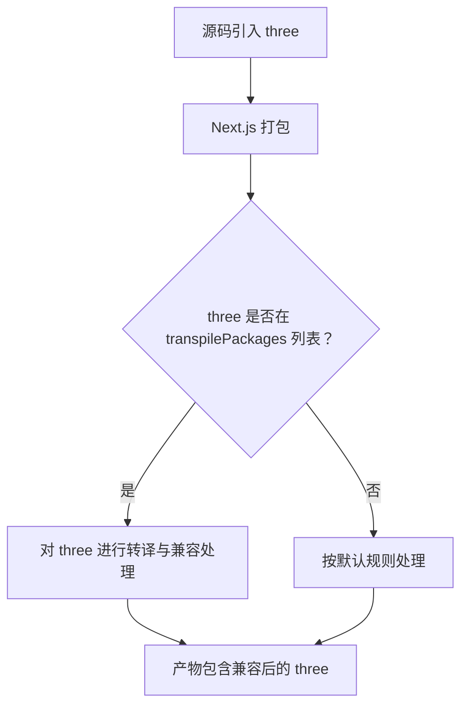
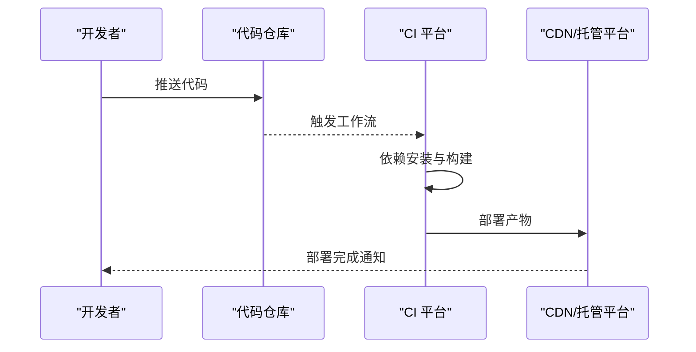
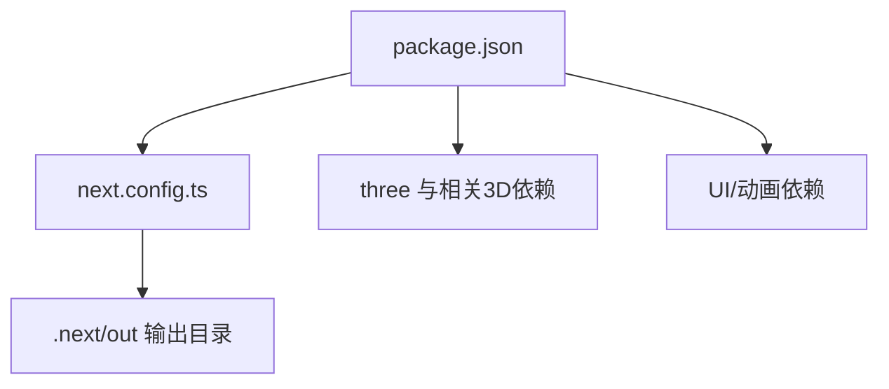

# 构建部署

<cite>
**本文引用的文件**
- [package.json](file://package.json)
- [next.config.ts](file://next.config.ts)
- [README.md](file://README.md)
- [.gitignore](file://.gitignore)
- [.github/dependabot.yml](file://.github/dependabot.yml)
- [.github/workflows/mirror.yml](file://.github/workflows/mirror.yml)
- [.claude/settings.local.json](file://.claude/settings.local.json)
</cite>

## 目录
1. [简介](#简介)
2. [项目结构](#项目结构)
3. [核心组件](#核心组件)
4. [架构总览](#架构总览)
5. [详细组件分析](#详细组件分析)
6. [依赖关系分析](#依赖关系分析)
7. [性能考量](#性能考量)
8. [故障排查指南](#故障排查指南)
9. [结论](#结论)
10. [附录](#附录)

## 简介
本指南面向ScienceLab3D项目，提供从本地开发到生产部署的完整构建与发布操作说明。内容涵盖：
- Next.js应用的开发构建与生产构建差异
- transpilePackages配置对Three.js包的处理机制
- 在Vercel、Netlify等平台的部署配置要点
- 环境变量、静态资源优化与CDN策略
- CI/CD流水线（含自动部署与版本管理）设置建议
- 部署前检查清单与常见问题解决方案

## 项目结构
该项目采用Next.js App Router目录结构，核心源码位于src目录，包含页面路由、组件、实验场景与类型声明；根目录包含构建配置、依赖定义与CI/CD配置。

图表来源
- [next.config.ts:1-9](file://next.config.ts#L1-L9)
- [package.json:1-37](file://package.json#L1-L37)
- [.gitignore:1-8](file://.gitignore#L1-L8)

章节来源
- [next.config.ts:1-9](file://next.config.ts#L1-L9)
- [package.json:1-37](file://package.json#L1-L37)
- [.gitignore:1-8](file://.gitignore#L1-L8)

## 核心组件
- 构建脚本与命令
  - 开发模式：通过脚本启动Next.js开发服务器，禁用遥测以提升本地体验。
  - 生产构建：生成静态产物并启动生产服务器。
- 构建配置
  - 启用reactStrictMode以提升开发期质量。
  - transpilePackages配置将three标记为需转译的包，确保其在Next.js打包链路中被正确处理。
- 依赖与技术栈
  - 前端框架：Next.js 15、React 19、TypeScript
  - 3D渲染：Three.js、React Three Fiber、Drei、PostProcessing
  - 动画与UI：Framer Motion、Lucide React、Tailwind CSS
  - 开发工具：cross-env、postcss、tailwindcss、@types/*

章节来源
- [package.json:5-9](file://package.json#L5-L9)
- [next.config.ts:3-6](file://next.config.ts#L3-L6)
- [README.md:138-150](file://README.md#L138-L150)

## 架构总览
下图展示从源码到最终产物的关键构建路径与关键配置点：

图表来源
- [package.json:5-9](file://package.json#L5-L9)
- [next.config.ts:3-6](file://next.config.ts#L3-L6)

## 详细组件分析

### 构建流程与差异（开发 vs 生产）
- 开发构建
  - 启动开发服务器，启用严格模式与热重载，便于调试与迭代。
  - 通过脚本禁用遥测，减少网络开销与潜在干扰。
- 生产构建
  - 生成最小化、分块拆分的静态产物，适合托管于CDN或静态站点服务。
  - 使用生产服务器启动，优化首屏与交互性能。

图表来源
- [package.json:5-9](file://package.json#L5-L9)

章节来源
- [package.json:5-9](file://package.json#L5-L9)
- [README.md:129-134](file://README.md#L129-L134)

### transpilePackages 对 Three.js 的处理
- 目的：确保第三方包（如three）在Next.js的打包过程中被正确转译与兼容处理。
- 影响：避免浏览器兼容性问题与模块解析异常，保证3D场景在各环境下稳定运行。
- 注意事项：仅对必要包启用转译，避免过度转译导致构建时间增加。

图表来源
- [next.config.ts:5](file://next.config.ts#L5)

章节来源
- [next.config.ts:5](file://next.config.ts#L5)

### 部署平台配置（Vercel、Netlify）

- Vercel
  - 推荐使用官方Next.js集成，自动识别框架与构建命令。
  - 构建命令：保留默认Next.js构建流程。
  - 输出目录：保持Next.js默认输出（.next），无需额外配置。
  - 环境变量：在Vercel仪表板中配置，支持按环境区分（预览/生产）。
  - 静态资源与CDN：Vercel自带全球CDN，自动缓存与加速。
  - 自动部署：关联GitHub仓库后，推送即触发构建与部署。
- Netlify
  - 构建命令：使用Next.js标准构建流程。
  - 发布目录：需要显式指向.out（Next.js默认输出目录）。
  - 环境变量：在Netlify设置中添加，支持分环境变量。
  - 静态资源与CDN：Netlify CDN自动生效。
  - 自动部署：连接Git仓库后，主分支推送触发构建。

章节来源
- [README.md:18-22](file://README.md#L18-L22)

### 环境变量配置
- 开发阶段：可在本地创建.env.local或使用系统环境变量。
- 生产阶段：在部署平台（Vercel/Netlify）的设置中添加环境变量。
- 建议项：日志级别、第三方SDK密钥、功能开关等。
- 安全性：避免在客户端暴露敏感信息；优先使用平台提供的安全存储或只读变量。

章节来源
- [package.json:5-9](file://package.json#L5-L9)

### 静态资源优化与CDN
- 图片与媒体：使用Next.js内置图像优化与懒加载；在CDN加持下进一步加速。
- 第三方库：通过CDN引入可减少打包体积与构建时间（需结合平台策略）。
- 缓存策略：合理设置缓存头与版本化资源，避免陈旧缓存影响体验。
- 资源分发：利用平台CDN就近分发，降低延迟。

章节来源
- [README.md:18-22](file://README.md#L18-L22)

### CI/CD 流水线（自动部署与版本管理）
- 自动部署
  - Vercel：直接关联仓库，主分支推送即构建与部署。
  - Netlify：连接仓库后自动监听主分支变更。
- 版本管理
  - 使用语义化版本标签（vX.Y.Z）进行发布。
  - 变更日志与发布说明同步更新，便于追踪。
- 依赖更新
  - 使用Dependabot定期扫描并提交更新PR，保持依赖健康。
- 备份镜像
  - 提供镜像工作流，将仓库镜像至备份组织，保障数据安全。

图表来源
- [.github/workflows/mirror.yml:1-20](file://.github/workflows/mirror.yml#L1-L20)
- [.github/dependabot.yml:1-14](file://.github/dependabot.yml#L1-L14)

章节来源
- [.github/workflows/mirror.yml:1-20](file://.github/workflows/mirror.yml#L1-L20)
- [.github/dependabot.yml:1-14](file://.github/dependabot.yml#L1-L14)

## 依赖关系分析
- 内部依赖
  - next.config.ts依赖Next.js配置类型，定义构建行为。
  - package.json定义脚本与依赖，决定构建与运行方式。
- 外部依赖
  - three与相关3D生态（@react-three/fiber、@react-three/drei、@react-three/postprocessing）构成渲染核心。
  - Tailwind CSS与Framer Motion提升开发效率与交互体验。
- 忽略规则
  - .gitignore排除node_modules、Next输出目录与IDE临时文件，避免污染仓库。

图表来源
- [package.json:10-32](file://package.json#L10-L32)
- [next.config.ts:3-6](file://next.config.ts#L3-L6)
- [.gitignore:1-8](file://.gitignore#L1-L8)

章节来源
- [package.json:10-32](file://package.json#L10-L32)
- [next.config.ts:3-6](file://next.config.ts#L3-L6)
- [.gitignore:1-8](file://.gitignore#L1-L8)

## 性能考量
- 构建性能
  - 控制转译范围：仅对必要包启用transpilePackages，减少Babel/TS转换成本。
  - 分块与懒加载：利用Next.js自动分块与动态导入，降低首屏体积。
- 运行性能
  - 3D场景优化：合理控制几何体复杂度、贴图分辨率与材质数量。
  - 动画与渲染：使用requestAnimationFrame与按需渲染，避免不必要的重绘。
- 缓存与CDN
  - 设置合适的缓存策略与版本化资源，提升二次访问速度。
  - 利用平台CDN就近分发，缩短用户访问路径。

## 故障排查指南
- 构建失败
  - 检查Node.js版本是否满足要求（参考README中的前置条件）。
  - 清理缓存与重新安装依赖，确认package-lock.json未损坏。
  - 关注transpilePackages配置是否正确，避免对非必要包转译。
- 运行时错误
  - 确认环境变量已正确注入，特别是生产环境下的只读变量。
  - 检查CDN缓存是否过期，必要时强制刷新或清理缓存。
- 3D场景异常
  - 确保three及其相关依赖版本兼容，避免API变更导致的问题。
  - 检查浏览器兼容性与WebGL支持情况。
- CI/CD问题
  - 检查工作流权限与令牌配置，确保镜像与部署步骤正常执行。
  - 关注Dependabot更新冲突，及时合并或回滚不兼容变更。

章节来源
- [README.md:110-111](file://README.md#L110-L111)
- [next.config.ts:5](file://next.config.ts#L5)
- [.github/workflows/mirror.yml:18-20](file://.github/workflows/mirror.yml#L18-L20)
- [.github/dependabot.yml:7-10](file://.github/dependabot.yml#L7-L10)

## 结论
通过明确的构建脚本、合理的transpilePackages配置与平台化的部署策略，ScienceLab3D能够在多环境中稳定交付高质量的3D科学学习体验。结合CI/CD自动化与依赖更新机制，可显著提升团队协作效率与发布质量。

## 附录

### 部署前检查清单
- 本地验证
  - 依赖安装与开发服务器启动成功
  - 生产构建无告警且产物可启动
- 平台准备
  - Vercel/Netlify项目创建并关联仓库
  - 环境变量与域名配置完成
  - CDN缓存策略与安全头设置
- CI/CD
  - 工作流文件已提交并处于启用状态
  - Dependabot更新策略已配置
  - 备份镜像工作流可用

### 常见问题速查
- 问：为什么需要transpilePackages包含three？
  - 答：确保three在打包链路中被正确转译，避免浏览器兼容性问题。
- 问：如何在Netlify上指定输出目录？
  - 答：在Netlify设置中将发布目录指向.out（Next.js默认输出目录）。
- 问：如何开启自动部署？
  - 答：在平台仪表板中连接仓库并启用自动构建，主分支推送即触发部署。
- 问：如何处理依赖更新？
  - 答：启用Dependabot每日扫描，自动提交更新PR，合并后触发CI构建。