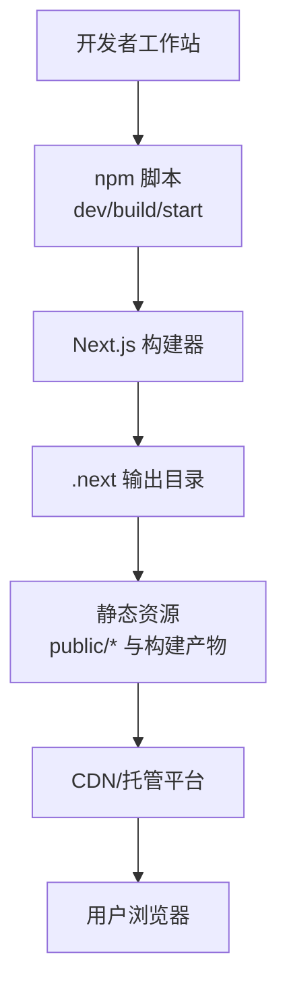
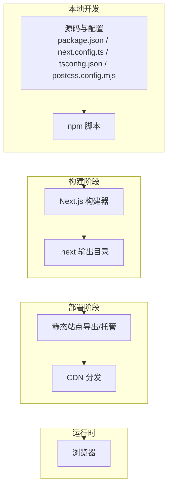
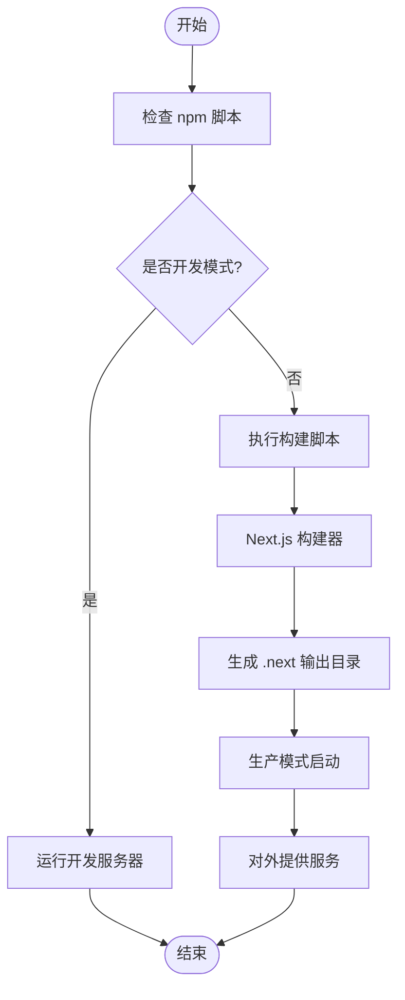
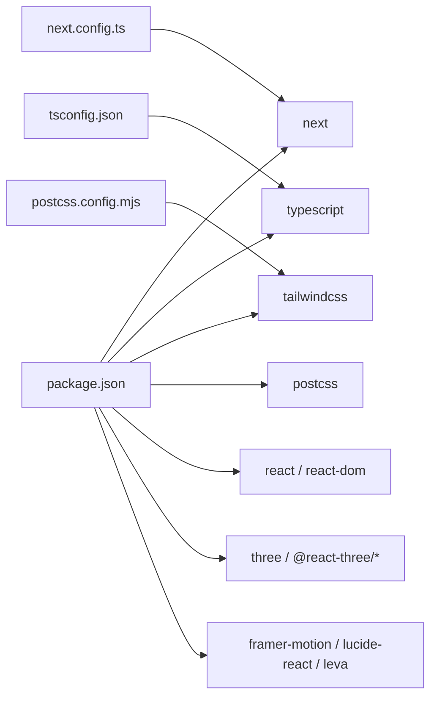

# 部署运维

<cite>
**本文引用的文件**
- [package.json](file://package.json)
- [next.config.ts](file://next.config.ts)
- [postcss.config.mjs](file://postcss.config.mjs)
- [tsconfig.json](file://tsconfig.json)
- [.editorconfig](file://.editorconfig)
- [README.md](file://README.md)
- [SECURITY.md](file://SECURITY.md)
- [.claude/settings.local.json](file://.claude/settings.local.json)
</cite>

## 目录
1. [简介](#简介)
2. [项目结构](#项目结构)
3. [核心组件](#核心组件)
4. [架构总览](#架构总览)
5. [详细组件分析](#详细组件分析)
6. [依赖关系分析](#依赖关系分析)
7. [性能考虑](#性能考虑)
8. [故障排查指南](#故障排查指南)
9. [结论](#结论)
10. [附录](#附录)

## 简介
本文件面向ScienceLab3D项目的生产部署与运维，覆盖构建与打包、静态资源优化与缓存策略、多平台部署（Vercel、Netlify等）、性能监控与错误追踪、安全配置（HTTPS、CSP、安全头）、日志与调试、备份与恢复、运维脚本与自动化、版本发布与回滚等主题。内容基于仓库现有配置与文件进行归纳总结，并提供可操作的实施建议。

## 项目结构
该项目采用Next.js 15应用路由架构，前端技术栈以React 19、TypeScript、Three.js生态为核心，配合Tailwind CSS进行样式管理。构建系统通过Next.js默认打包器完成，PostCSS与Tailwind集成用于样式处理，TypeScript编译配置确保类型安全与模块解析。

图表来源
- [package.json:5-8](file://package.json#L5-L8)
- [next.config.ts:3-6](file://next.config.ts#L3-L6)
- [postcss.config.mjs:1-5](file://postcss.config.mjs#L1-L5)
- [tsconfig.json:16-17](file://tsconfig.json#L16-L17)

章节来源
- [package.json:1-37](file://package.json#L1-L37)
- [next.config.ts:1-9](file://next.config.ts#L1-L9)
- [postcss.config.mjs:1-6](file://postcss.config.mjs#L1-L6)
- [tsconfig.json:1-22](file://tsconfig.json#L1-L22)
- [.editorconfig:1-24](file://.editorconfig#L1-L24)

## 核心组件
- 构建与运行脚本：通过npm scripts定义开发、构建与启动流程，便于CI/CD集成与本地验证。
- Next.js配置：启用严格模式与特定包转译，确保Three.js等依赖在构建阶段正确处理。
- 样式管线：PostCSS集成Tailwind插件，统一CSS生成与优化。
- 类型系统：TypeScript配置启用严格模式与模块解析，提升开发体验与稳定性。
- 编码规范：EditorConfig统一代码风格，减少团队协作差异。

章节来源
- [package.json:5-8](file://package.json#L5-L8)
- [next.config.ts:3-6](file://next.config.ts#L3-L6)
- [postcss.config.mjs:1-5](file://postcss.config.mjs#L1-L5)
- [tsconfig.json:2-17](file://tsconfig.json#L2-L17)
- [.editorconfig:1-24](file://.editorconfig#L1-L24)

## 架构总览
下图展示从源码到用户访问的关键路径，以及与外部平台（Vercel/Netlify）的集成点。

图表来源
- [package.json:5-8](file://package.json#L5-L8)
- [next.config.ts:3-6](file://next.config.ts#L3-L6)
- [postcss.config.mjs:1-5](file://postcss.config.mjs#L1-L5)
- [tsconfig.json:16-17](file://tsconfig.json#L16-L17)

## 详细组件分析

### 构建与打包流程
- 开发模式：通过脚本启动Next.js开发服务器，支持热更新与类型检查。
- 生产构建：执行构建脚本生成静态资源与服务端产物；随后以生产模式启动服务。
- 关键配置：Next.js严格模式与特定包转译，确保Three.js等依赖兼容性。

图表来源
- [package.json:5-8](file://package.json#L5-L8)
- [next.config.ts:3-6](file://next.config.ts#L3-L6)

章节来源
- [package.json:5-8](file://package.json#L5-L8)
- [next.config.ts:3-6](file://next.config.ts#L3-L6)

### 静态资源优化与缓存策略
- 资源导出：Next.js支持静态导出与混合模式，适合CDN分发与长缓存。
- 缓存策略建议：
  - HTML/CSS/JS：强缓存（较长max-age），版本化文件名或URL指纹。
  - 图片与模型：按需压缩与格式优化（WebP/AVIF），结合CDN缓存控制。
  - 动态接口：合理设置Cache-Control与ETag，避免过期或重复请求。
- 压缩：启用Gzip/Brotli传输压缩，降低带宽占用。
- 资源分发：通过CDN就近分发，缩短延迟。

[本节为通用实践说明，不直接分析具体文件，故无“章节来源”]

### 多平台部署配置

#### Vercel
- 推荐方式：使用Git仓库连接，自动检测Next.js项目并应用默认构建与预览。
- 关键点：
  - 构建命令：使用项目脚本中的构建命令。
  - 输出目录：Next.js默认输出至“.next”，无需额外配置。
  - 环境变量：在平台面板中配置，如运行时参数或第三方服务密钥。
  - 自定义域名与SSL：平台自动提供HTTPS与域名绑定。
  - 预览部署：分支保护与Pull Request预览可选开启。

[本节为通用实践说明，不直接分析具体文件，故无“章节来源”]

#### Netlify
- 推荐方式：选择Next.js作为站点类型，或手动指定构建命令与发布目录。
- 关键点：
  - 构建命令：使用构建脚本。
  - 发布目录：指向构建输出目录。
  - 净化规则：保留静态资源与重定向规则，避免误删。
  - 环境变量：在UI中配置，或通过netlify.toml声明。
  - HTTPS与CNAME：平台提供自动证书与自定义域名支持。

[本节为通用实践说明，不直接分析具体文件，故无“章节来源”]

#### 其他平台（含自建）
- 通用步骤：安装依赖 → 执行构建 → 将输出目录部署至静态托管或反向代理。
- 注意事项：确保运行时Node版本满足要求，静态资源路径与CDN缓存一致。

[本节为通用实践说明，不直接分析具体文件，故无“章节来源”]

### 性能监控与错误追踪
- 性能监控：
  - 浏览器端：利用浏览器性能API与Web Vitals指标（LCP/FID/CLS）。
  - 服务端：在托管平台启用内置监控或接入APM（如Sentry、DataDog）。
- 错误追踪：
  - 前端：集成错误上报SDK，收集未捕获异常与用户行为。
  - 后端：集中化日志与错误聚合，设置告警阈值。
- 指标建议：首屏时间、交互延迟、资源加载耗时、错误率、吞吐量。

[本节为通用实践说明，不直接分析具体文件，故无“章节来源”]

### 安全配置最佳实践
- HTTPS：使用平台提供的自动证书或自定义证书，强制HTTPS重定向。
- 内容安全策略（CSP）：限制脚本来源、内联脚本与外链资源，最小权限原则。
- 安全头：设置X-Frame-Options、X-Content-Type-Options、Referrer-Policy、Permissions-Policy等。
- 输入校验与输出编码：对动态内容进行严格的输入过滤与输出编码。
- 依赖审计：定期扫描与升级依赖，关注安全公告。

[本节为通用实践说明，不直接分析具体文件，故无“章节来源”]

### 日志记录与调试
- 日志：
  - 前端：仅在开发环境打印详细日志，生产环境使用结构化日志与采样上报。
  - 后端：统一格式化日志，区分级别，包含请求ID与上下文信息。
- 调试：
  - 开发模式：启用严格模式与类型检查，定位问题。
  - 生产模式：通过远程调试工具与断点，结合日志与指标定位根因。

[本节为通用实践说明，不直接分析具体文件，故无“章节来源”]

### 备份与恢复策略
- 数据备份：
  - 用户数据与实验状态：若存在后端存储，制定周期性备份与异地容灾。
  - 配置与密钥：以加密形式存储于安全位置，最小权限访问。
- 应用备份：
  - 构建产物与静态资源：版本化存储，支持快速回滚。
  - 配置文件：纳入版本控制或受控的配置库。
- 恢复演练：定期进行恢复测试，验证备份完整性与时效性。

[本节为通用实践说明，不直接分析具体文件，故无“章节来源”]

### 运维脚本与自动化
- 本地脚本：
  - 开发：启动开发服务器，监听变更。
  - 构建：清理旧产物、执行构建、生成报告。
  - 验证：类型检查、单元测试、端到端测试。
- CI/CD：
  - 触发条件：分支保护、PR合并、标签推送。
  - 步骤：安装依赖 → 构建 → 测试 → 打包 → 部署 → 健康检查。
  - 环境：区分开发、预发布、生产环境，隔离变量与资源。
- 工具链：使用lint、format、type-check等工具保证质量门禁。

[本节为通用实践说明，不直接分析具体文件，故无“章节来源”]

### 版本发布与回滚流程
- 发布流程：
  - 版本号：遵循语义化版本，打标签并推送。
  - 构建与部署：自动化流水线执行构建与部署。
  - 健康检查：监控关键指标与可用性，确认无异常。
- 回滚流程：
  - 快速回滚：切换到上一个稳定版本的构建产物。
  - 渐进式回滚：灰度释放，逐步扩大流量。
  - 降级策略：回退到前一版本，修复后再尝试发布。

[本节为通用实践说明，不直接分析具体文件，故无“章节来源”]

## 依赖关系分析
- 构建依赖：Next.js、TypeScript、PostCSS、Tailwind等。
- 运行时依赖：React 19、Three.js生态、动画与UI库等。
- 开发依赖：类型定义、样式工具、构建辅助等。

图表来源
- [package.json:10-32](file://package.json#L10-L32)
- [tsconfig.json:2-17](file://tsconfig.json#L2-L17)
- [postcss.config.mjs:1-5](file://postcss.config.mjs#L1-L5)
- [next.config.ts:3-6](file://next.config.ts#L3-L6)

章节来源
- [package.json:10-32](file://package.json#L10-L32)
- [tsconfig.json:2-17](file://tsconfig.json#L2-L17)
- [postcss.config.mjs:1-5](file://postcss.config.mjs#L1-L5)
- [next.config.ts:3-6](file://next.config.ts#L3-L6)

## 性能考虑
- 构建性能：启用增量编译、并行任务与缓存，减少重复工作。
- 运行性能：优先使用静态导出与CDN缓存，减少首屏渲染时间；对大体量3D资源进行懒加载与分块。
- 网络优化：启用HTTP/2或更高版本，开启压缩与持久连接。
- 监控与调优：持续采集性能指标，识别瓶颈并迭代优化。

[本节为通用实践说明，不直接分析具体文件，故无“章节来源”]

## 故障排查指南
- 常见问题：
  - 构建失败：检查依赖版本与配置项，确保Node版本符合要求。
  - 运行时错误：查看日志与堆栈，定位异常发生点。
  - 资源加载失败：核对CDN缓存与路径映射，确认静态资源完整。
- 安全事件：
  - 参考安全策略，优先内部修复与披露，避免公开漏洞细节。
- 支持渠道：参考项目支持文档，按模板提交问题与PR。

章节来源
- [SECURITY.md:1-8](file://SECURITY.md#L1-L8)
- [README.md:186-190](file://README.md#L186-L190)

## 结论
本运维文档基于仓库现有配置，给出了生产部署与运维的系统化方案。建议在实际落地时结合平台特性与业务需求，细化监控、安全与自动化策略，并建立完善的发布与回滚机制，确保系统的稳定性与可维护性。

## 附录

### A. 关键配置要点清单
- 构建与运行
  - 使用npm脚本进行开发、构建与启动。
  - Next.js严格模式与特定包转译已启用。
- 样式与类型
  - PostCSS集成Tailwind插件；TypeScript启用严格模式与模块解析。
- 编码规范
  - EditorConfig统一代码风格，提升协作效率。

章节来源
- [package.json:5-8](file://package.json#L5-L8)
- [next.config.ts:3-6](file://next.config.ts#L3-L6)
- [postcss.config.mjs:1-5](file://postcss.config.mjs#L1-L5)
- [tsconfig.json:2-17](file://tsconfig.json#L2-L17)
- [.editorconfig:1-24](file://.editorconfig#L1-L24)

### B. 平台部署要点速查
- Vercel：自动检测Next.js项目，推荐使用默认构建与预览。
- Netlify：选择Next.js类型或手动配置构建命令与发布目录。
- 自建/其他：安装依赖 → 构建 → 部署输出目录 → CDN分发。

[本节为通用实践说明，不直接分析具体文件，故无“章节来源”]

### C. 安全与合规
- 报告漏洞：通过安全通告渠道私下提交，避免公开披露。
- 范围说明：开源项目遵循既定的安全策略与范围。

章节来源
- [SECURITY.md:1-8](file://SECURITY.md#L1-L8)