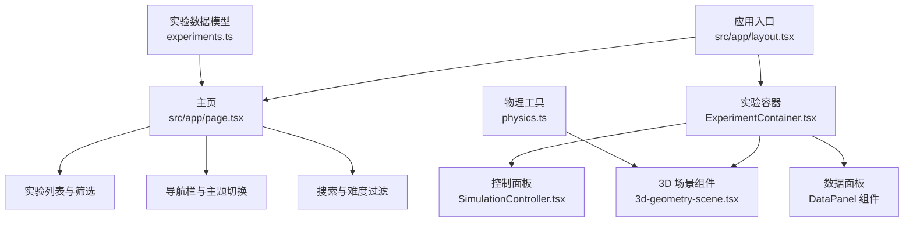
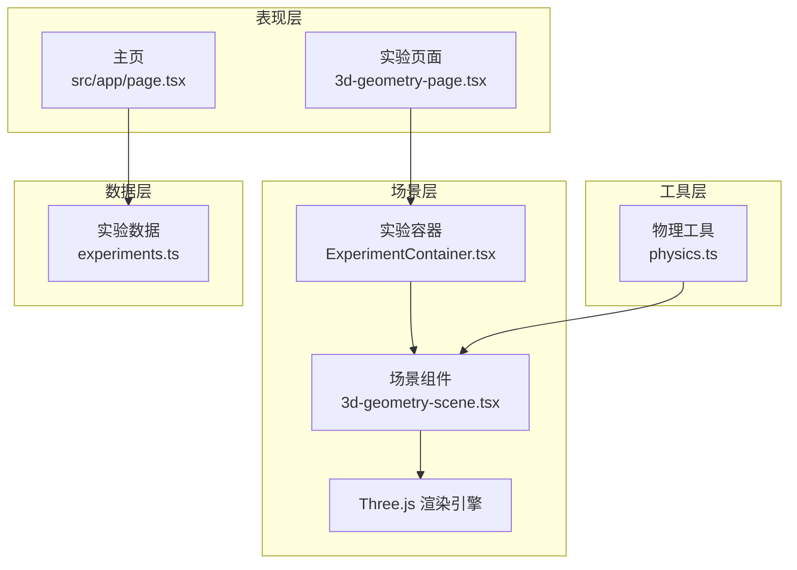
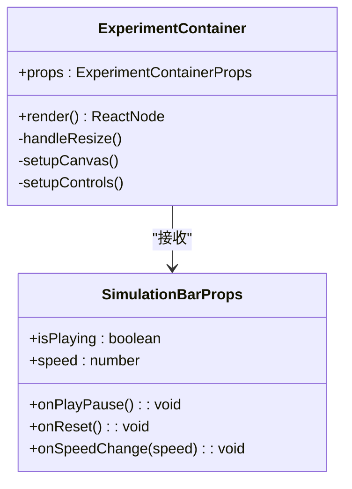
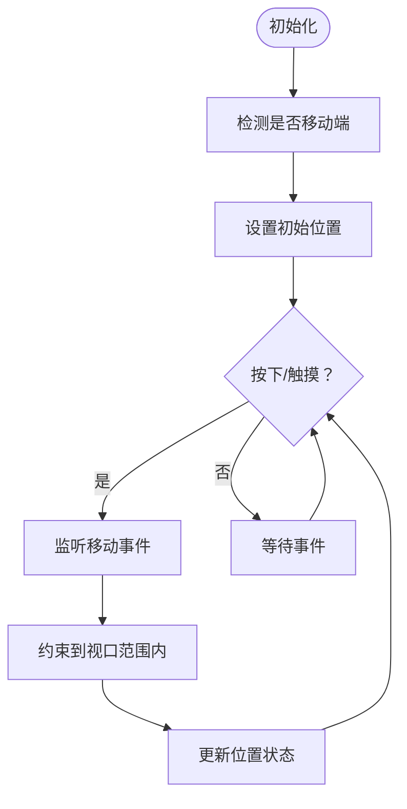
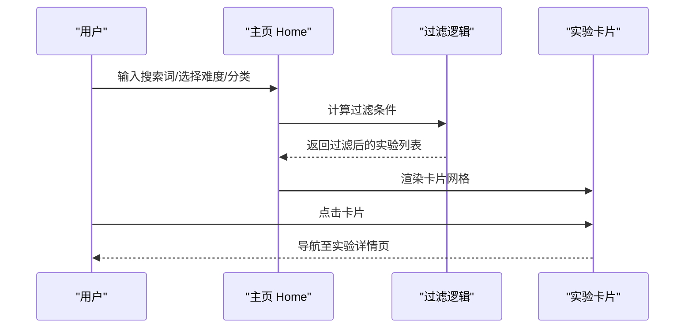
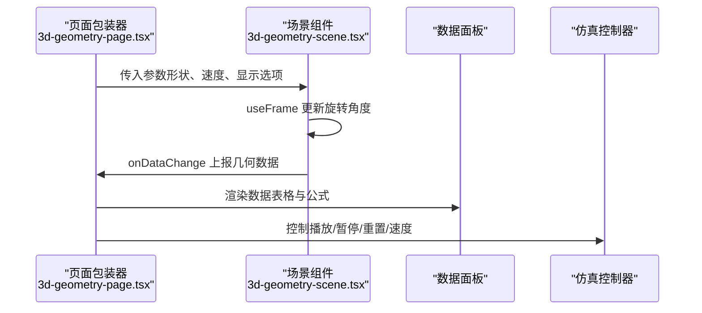
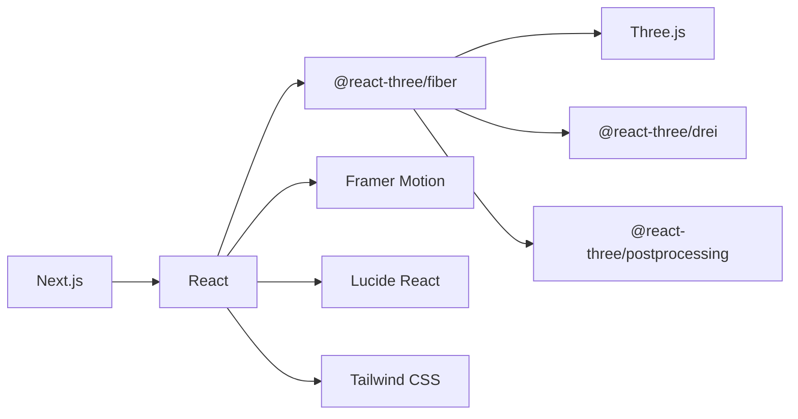

# 项目概述

<cite>
**本文档引用的文件**
- [README.md](file://README.md)
- [package.json](file://package.json)
- [next.config.ts](file://next.config.ts)
- [src/app/layout.tsx](file://src/app/layout.tsx)
- [src/app/page.tsx](file://src/app/page.tsx)
- [src/data/experiments.ts](file://src/data/experiments.ts)
- [src/components/experiment-ui/ExperimentContainer.tsx](file://src/components/experiment-ui/ExperimentContainer.tsx)
- [src/components/experiment-ui/SimulationController.tsx](file://src/components/experiment-ui/SimulationController.tsx)
- [src/utils/physics.ts](file://src/utils/physics.ts)
- [src/experiments/3d-geometry-page.tsx](file://src/experiments/3d-geometry-page.tsx)
- [src/experiments/3d-geometry-scene.tsx](file://src/experiments/3d-geometry-scene.tsx)
- [ROADMAP.md](file://ROADMAP.md)
- [CONTRIBUTING.md](file://CONTRIBUTING.md)
</cite>

## 目录
1. [引言](#引言)
2. [项目结构](#项目结构)
3. [核心组件](#核心组件)
4. [架构总览](#架构总览)
5. [详细组件分析](#详细组件分析)
6. [依赖关系分析](#依赖关系分析)
7. [性能考量](#性能考量)
8. [故障排查指南](#故障排查指南)
9. [结论](#结论)
10. [附录](#附录)

## 引言
ScienceLab 3D 是一个开源的浏览器端 3D 科学实验学习平台，旨在通过交互式 3D 可视化将抽象的科学概念变得直观易懂。该项目覆盖物理、化学、生物与数学四大领域，提供 40+ 个可实时控制的虚拟实验，采用 Next.js + React + Three.js 技术栈构建，强调跨设备响应式体验与高性能渲染。项目不仅面向学生与教师，也欢迎社区贡献者参与扩展实验库与优化用户体验。

## 项目结构
项目采用 Next.js App Router 的目录组织方式，核心模块包括：
- 应用入口与布局：根布局、元数据配置、主题切换与 SEO 优化
- 实验主页：实验分类筛选、搜索、收藏、难度过滤与卡片展示
- 实验容器与控制面板：统一的 3D 场景容器、控制面板、数据面板与仿真控制器
- 物理计算工具：集中管理物理常量与公式，供各实验复用
- 具体实验实现：以“几何 3D”为例，展示页面包装器、场景组件与交互控制

图表来源
- [src/app/layout.tsx:1-204](file://src/app/layout.tsx#L1-L204)
- [src/app/page.tsx:1-676](file://src/app/page.tsx#L1-L676)
- [src/components/experiment-ui/ExperimentContainer.tsx:1-374](file://src/components/experiment-ui/ExperimentContainer.tsx#L1-L374)
- [src/experiments/3d-geometry-scene.tsx:1-243](file://src/experiments/3d-geometry-scene.tsx#L1-L243)
- [src/utils/physics.ts:1-687](file://src/utils/physics.ts#L1-L687)
- [src/data/experiments.ts:1-492](file://src/data/experiments.ts#L1-L492)

章节来源
- [README.md:1-227](file://README.md#L1-L227)
- [package.json:1-37](file://package.json#L1-L37)
- [next.config.ts:1-9](file://next.config.ts#L1-L9)

## 核心组件
- 实验容器 ExperimentContainer：封装 Three.js Canvas、相机、光照、环境与交互控件，提供控制面板、数据面板与仿真条的挂载点，适配桌面与移动端的尺寸与交互差异。
- 仿真控制器 SimulationController：悬浮式拖拽控件，包含播放/暂停、重置、速度调节与时间显示，支持触摸拖拽与边界约束。
- 主页 Home：提供实验分类、搜索、难度过滤、收藏管理与卡片网格展示，结合动画与主题切换增强用户体验。
- 物理工具 physics.ts：集中定义物理常量与常用公式，便于在不同实验中复用，保证数值一致性与可维护性。
- 实验页面与场景：以“几何 3D”为例，页面负责参数控制与数据面板，场景负责 Three.js 渲染与帧循环更新。

章节来源
- [src/components/experiment-ui/ExperimentContainer.tsx:1-374](file://src/components/experiment-ui/ExperimentContainer.tsx#L1-L374)
- [src/components/experiment-ui/SimulationController.tsx:1-228](file://src/components/experiment-ui/SimulationController.tsx#L1-L228)
- [src/app/page.tsx:1-676](file://src/app/page.tsx#L1-L676)
- [src/utils/physics.ts:1-687](file://src/utils/physics.ts#L1-L687)
- [src/experiments/3d-geometry-page.tsx:1-190](file://src/experiments/3d-geometry-page.tsx#L1-L190)
- [src/experiments/3d-geometry-scene.tsx:1-243](file://src/experiments/3d-geometry-scene.tsx#L1-L243)

## 架构总览
项目采用分层架构：
- 表现层：Next.js App Router 路由与 React 组件，负责页面与交互逻辑
- 场景层：基于 @react-three/fiber 与 Three.js 的 3D 渲染管线，提供相机、光照、材质与几何体
- 工具层：共享物理计算与通用工具函数，降低重复实现
- 数据层：实验元数据与分类信息，驱动主页筛选与导航

图表来源
- [src/app/page.tsx:1-676](file://src/app/page.tsx#L1-L676)
- [src/experiments/3d-geometry-page.tsx:1-190](file://src/experiments/3d-geometry-page.tsx#L1-L190)
- [src/components/experiment-ui/ExperimentContainer.tsx:1-374](file://src/components/experiment-ui/ExperimentContainer.tsx#L1-L374)
- [src/experiments/3d-geometry-scene.tsx:1-243](file://src/experiments/3d-geometry-scene.tsx#L1-L243)
- [src/utils/physics.ts:1-687](file://src/utils/physics.ts#L1-L687)
- [src/data/experiments.ts:1-492](file://src/data/experiments.ts#L1-L492)

## 详细组件分析

### 实验容器 ExperimentContainer 分析
- 功能职责
  - 管理 Canvas 尺寸与像素比，响应窗口变化
  - 提供相机、轨道控制器、光源与环境设置
  - 挂载控制面板、数据面板与仿真条，支持移动端自适应
  - 头部返回按钮与标题展示，细节面板弹出
- 关键特性
  - 响应式布局：根据屏幕宽度调整 FOV、缩放速度与面板位置
  - 性能优化：移动端禁用抗锯齿、限制 DPR；启用阴影与色调映射
  - 交互友好：拖拽旋转、平移、缩放；右键平移；指令提示
- 设计模式
  - 组合模式：通过 children 注入场景组件
  - 配置对象：通过 props 传入标题、描述、背景色等

图表来源
- [src/components/experiment-ui/ExperimentContainer.tsx:55-374](file://src/components/experiment-ui/ExperimentContainer.tsx#L55-L374)

章节来源
- [src/components/experiment-ui/ExperimentContainer.tsx:1-374](file://src/components/experiment-ui/ExperimentContainer.tsx#L1-L374)

### 仿真控制器 SimulationController 分析
- 功能职责
  - 悬浮式拖拽控件，始终可见
  - 控制播放/暂停、重置、速度调节与时间显示
  - 支持鼠标与触摸事件，自动约束在视口内
- 关键特性
  - 拖拽状态管理：按下、移动、抬起
  - 视口边界约束：防止控件移出屏幕
  - 移动端适配：默认位置与宽度自适应
- 设计模式
  - 自身渲染：独立组件，不依赖外部容器
  - 回调接口：通过 props 接收外部状态与回调

图表来源
- [src/components/experiment-ui/SimulationController.tsx:27-228](file://src/components/experiment-ui/SimulationController.tsx#L27-L228)

章节来源
- [src/components/experiment-ui/SimulationController.tsx:1-228](file://src/components/experiment-ui/SimulationController.tsx#L1-L228)

### 主页 Home 流程分析
- 功能职责
  - 展示实验分类与难度标签
  - 支持关键词搜索与收藏过滤
  - 卡片网格展示实验，点击进入详情页
  - 主题切换与滚动导航
- 关键流程
  - 用户输入搜索词或选择难度/分类
  - 过滤实验数组并渲染卡片
  - 收藏状态本地持久化，支持一键切换

图表来源
- [src/app/page.tsx:330-350](file://src/app/page.tsx#L330-L350)
- [src/app/page.tsx:491-498](file://src/app/page.tsx#L491-L498)

章节来源
- [src/app/page.tsx:1-676](file://src/app/page.tsx#L1-L676)

### “几何 3D”实验实现分析
- 页面包装器：负责参数控制（形状类型、旋转速度、线框/顶点/边显示）、数据面板与仿真控制器集成
- 场景组件：使用 Three.js 几何体生成多面体，计算顶点、边与面，实时渲染并高亮顶点
- 数据上报：通过 onDataChange 回调向父级传递几何统计信息（顶点数、边数、面数、欧拉示性数）

图表来源
- [src/experiments/3d-geometry-page.tsx:18-190](file://src/experiments/3d-geometry-page.tsx#L18-L190)
- [src/experiments/3d-geometry-scene.tsx:30-243](file://src/experiments/3d-geometry-scene.tsx#L30-L243)

章节来源
- [src/experiments/3d-geometry-page.tsx:1-190](file://src/experiments/3d-geometry-page.tsx#L1-L190)
- [src/experiments/3d-geometry-scene.tsx:1-243](file://src/experiments/3d-geometry-scene.tsx#L1-L243)

## 依赖关系分析
- 技术栈
  - Next.js 15：App Router、严格模式与包转译
  - React 19：函数组件与 Hooks
  - Three.js + @react-three/fiber：3D 渲染与 React 集成
  - Framer Motion：页面与组件动画
  - Tailwind CSS：原子化样式与响应式设计
  - Lucide React：图标库
- 关键依赖
  - @react-three/drei：高级 Three.js 组件（相机、灯光、环境）
  - @react-three/postprocessing：后处理效果
  - leva：可视化调试面板（开发期）
  - @types/three：Three.js 类型声明

图表来源
- [package.json:10-32](file://package.json#L10-L32)
- [next.config.ts:3-6](file://next.config.ts#L3-L6)

章节来源
- [package.json:1-37](file://package.json#L1-L37)
- [next.config.ts:1-9](file://next.config.ts#L1-L9)

## 性能考量
- 渲染性能
  - 移动端禁用抗锯齿、限制 DPR，减少 GPU 压力
  - 启用阴影与 ACES Filmic 色调映射提升视觉质量
  - 使用 ResizeObserver 与事件节流，避免频繁重排
- 交互性能
  - useFrame 中按帧率节流更新状态，降低 React 重渲染频率
  - 控制面板与数据面板按需显示，减少 DOM 节点数量
- 资源加载
  - App Router 路由懒加载，按需加载实验页面与场景组件
  - 本地收藏与主题持久化，减少服务器请求

## 故障排查指南
- 页面空白或渲染异常
  - 检查 Canvas 尺寸初始化与窗口大小监听
  - 确认 Three.js 与 @react-three/fiber 版本兼容
- 3D 场景卡顿
  - 降低渲染复杂度（几何体细分、光源数量）
  - 在移动端启用更低的 DPR 与关闭抗锯齿
- 控制面板无法拖拽
  - 检查事件绑定与触摸事件处理
  - 确保控件未被其他元素遮挡
- 收藏与主题切换失效
  - 检查 localStorage 权限与序列化/反序列化逻辑
  - 确认主题类名切换与 CSS 变量生效

章节来源
- [src/components/experiment-ui/ExperimentContainer.tsx:123-135](file://src/components/experiment-ui/ExperimentContainer.tsx#L123-L135)
- [src/components/experiment-ui/SimulationController.tsx:75-144](file://src/components/experiment-ui/SimulationController.tsx#L75-L144)
- [src/app/page.tsx:11-23](file://src/app/page.tsx#L11-L23)

## 结论
ScienceLab 3D 通过 Next.js + React + Three.js 的现代前端技术栈，构建了一个可扩展、高性能且易于使用的 3D 科学实验平台。其核心价值在于将复杂的科学概念以交互式 3D 可视化呈现，帮助学习者在探索中加深理解。项目具备清晰的模块划分、完善的实验扩展机制与良好的可维护性，适合初学者快速上手，也为有经验的开发者提供了深入定制的空间。未来计划包括量子力学实验、VR/AR 支持、AI 助教与进度追踪等功能，将持续推动科学教育的数字化转型。

## 附录
- 发展历程与路线图
  - 已完成：40+ 实验、Three.js 引擎、实时数据图、深浅主题、响应式设计、CI 与 PWA
  - 进行中：更多量子力学实验、多人协作模式
  - 计划中：VR/AR、AI 助教、进度跟踪、LMS 集成、多语言与无障碍审计
- 社区支持
  - 开放贡献：遵循贡献指南，提供实验添加模板与代码风格规范
  - 问题反馈：通过 Issues 提交 Bug 与功能建议
  - 联系作者：通过 README 中提供的渠道进行沟通

章节来源
- [ROADMAP.md:1-23](file://ROADMAP.md#L1-L23)
- [CONTRIBUTING.md:1-141](file://CONTRIBUTING.md#L1-L141)
- [README.md:1-227](file://README.md#L1-L227)